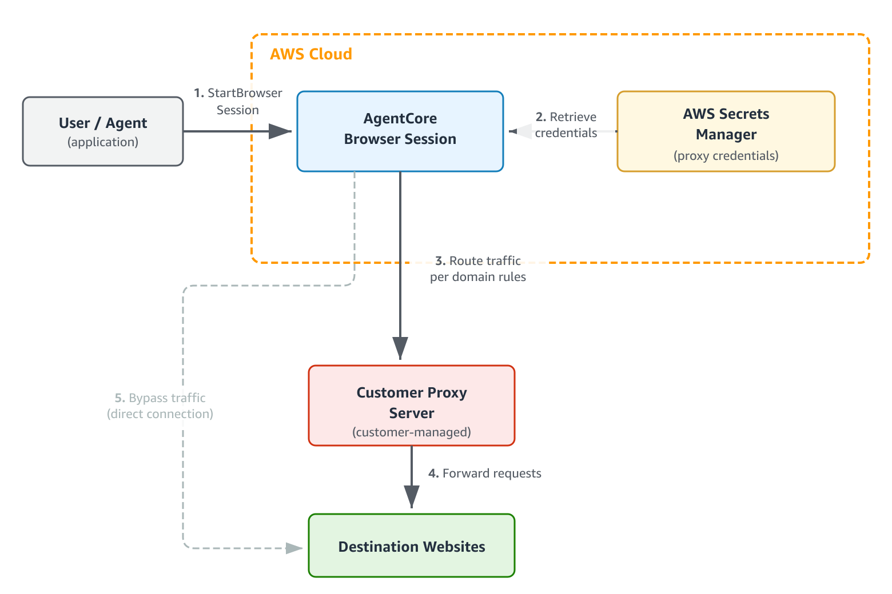

# Using browser proxies

Amazon Bedrock AgentCore Browser supports routing browser traffic through your own external proxy servers.
This enables organizations to:

- **Achieve IP stability** by routing traffic through
  proxies with known egress IPs, eliminating re-authentication cycles caused by rotating
  AWS IP addresses
- **Support IP allowlisting** by providing stable,
  controllable egress addresses for services that require IP-based access controls
- **Integrate with corporate infrastructure** by routing
  through your existing proxy servers for access to internal webpages and resources

## Overview

When you create a browser session with proxy configuration, AgentCore Browser configures the
browser to route HTTP and HTTPS traffic through your specified proxy servers.



Request flow:

1. You call `StartBrowserSession` with a
   `proxyConfiguration` specifying your proxy server.
2. If using authentication, AgentCore retrieves proxy credentials from AWS
   Secrets Manager.
3. The browser session starts with your proxy configuration applied.
4. Browser traffic routes through your proxy server based on your domain routing
   rules.
5. Your proxy server forwards requests to destination websites.

The proxy server is infrastructure you own and manage. AgentCore Browser connects to it as a
client.

Proxy configuration applies the Chromium `--proxy-server` flag to the
browser instance at startup, directing traffic through the specified proxy at the browser
level. For scenarios that require network-layer enforcement—for example, when browser-level
settings could be modified during runtime—deploy browser sessions within your own VPC. See
[Configure Amazon Bedrock AgentCore Runtime and tools for VPC](agentcore-vpc.md "agentcore-vpc.md").

## Prerequisites

Before configuring browser proxies, ensure you have:

- **General browser prerequisites** – Complete the
  standard browser tool setup. See [Get started with AgentCore Browser](browser-onboarding.md "browser-onboarding.md").
- **Proxy server** – An HTTP/HTTPS proxy server
  that is accessible from the public internet (or reachable within your VPC if using
  VPC configuration) and supports the HTTP CONNECT method for HTTPS traffic
  tunneling.
- **AWS Secrets Manager secret** (if using
  authentication) – A secret containing proxy credentials in JSON format with
  `username` and `password` keys.
- **IAM permissions** (if using authentication) –
  The IAM identity calling `StartBrowserSession` must have
  `secretsmanager:GetSecretValue` permission for the credential
  secret.

## Getting started

This section shows the simplest configuration to route browser traffic through a
proxy.

### Step 1: Create a credentials secret (if using

authentication)

If your proxy requires authentication, create a secret in AWS Secrets
Manager:

```
aws secretsmanager create-secret \
  --name "my-proxy-credentials" \
  --secret-string '{"username":"<your-username>","password":"<your-password>"}'
```

Credential format requirements:

| Proxy credential format requirements | Field                                          | Allowed characters |
| ------------------------------------ | ---------------------------------------------- | ------------------ |
| `username`                           | Alphanumeric plus `@ . _ + = -`                |
| `password`                           | Alphanumeric plus `@ . _ + =<br>• ! # $ % & *` |

Characters not allowed: colon (`:`), newlines, spaces, quotes.

### Step 2: Add IAM permissions

Add this policy to the IAM identity that will create browser sessions:

```
{
    "Version": "2012-10-17",
    "Statement": [
        {
            "Effect": "Allow",
            "Action": "secretsmanager:GetSecretValue",
            "Resource": "arn:aws:secretsmanager:<AWS Region>:<AWS account>:secret:<secret-name>*"
        }
    ]
}
```

### Step 3: Create a browser session with

proxy

You can create a browser session with proxy configuration using the AWS CLI, SDK, or
API.

AWS CLI
To start a browser session with a proxy using the AWS CLI:

```
aws bedrock-agentcore start-browser-session \
  --browser-identifier "aws.browser.v1" \
  --name "my-proxy-session" \
  --proxy-configuration '{
    "proxies": [{
      "externalProxy": {
        "server": "<your-proxy-hostname>",
        "port": 8080,
        "credentials": {
          "basicAuth": {
            "secretArn": "arn:aws:secretsmanager:<region>:<account-id>:secret:<secret-name>"
          }
        }
      }
    }]
  }'
```

For proxies using IP allowlisting instead of credentials, omit the
`credentials` field:

```
aws bedrock-agentcore start-browser-session \
  --browser-identifier "aws.browser.v1" \
  --name "my-proxy-session" \
  --proxy-configuration '{
    "proxies": [{
      "externalProxy": {
        "server": "<your-proxy-hostname>",
        "port": 8080
      }
    }]
  }'
```

Boto3
To start a browser session with a proxy using the AWS SDK for Python
(Boto3):

```
import boto3

client = boto3.client('bedrock-agentcore', region_name='<region>')

response = client.start_browser_session(
    browserIdentifier="aws.browser.v1",
    name="my-proxy-session",
    proxyConfiguration={
        "proxies": [{
            "externalProxy": {
                "server": "<your-proxy-hostname>",
                "port": 8080,
                "credentials": {
                    "basicAuth": {
                        "secretArn": "arn:aws:secretsmanager:<region>:<account-id>:secret:<secret-name>"
                    }
                }
            }
        }]
    }
)
print(f"Session ID: {response['sessionId']}")
```

For proxies using IP allowlisting instead of credentials, omit the
`credentials` field:

```
proxyConfiguration={
    "proxies": [{
        "externalProxy": {
            "server": "<your-proxy-hostname>",
            "port": 8080
        }
    }]
}
```

API
To start a browser session with a proxy using the API:

```
PUT /browsers/aws.browser.v1/sessions/start HTTP/1.1
Host: bedrock-agentcore.<region>.amazonaws.com
Content-Type: application/json
Authorization: AWS4-HMAC-SHA256 ...

{
  "name": "my-proxy-session",
  "proxyConfiguration": {
    "proxies": [{
      "externalProxy": {
        "server": "<your-proxy-hostname>",
        "port": 8080,
        "credentials": {
          "basicAuth": {
            "secretArn": "arn:aws:secretsmanager:<region>:<account-id>:secret:<secret-name>"
          }
        }
      }
    }]
  }
}
```

## Configuration options

### Domain-based routing

Use `domainPatterns` to route specific domains through designated
proxies:

AWS CLI

```
aws bedrock-agentcore start-browser-session \
  --browser-identifier "aws.browser.v1" \
  --name "domain-routing-session" \
  --proxy-configuration '{
    "proxies": [
      {
        "externalProxy": {
          "server": "corp-proxy.example.com",
          "port": 8080,
          "domainPatterns": [".company.com", ".internal.corp"]
        }
      },
      {
        "externalProxy": {
          "server": "general-proxy.example.com",
          "port": 8080
        }
      }
    ]
  }'
```

Boto3

```
proxyConfiguration={
    "proxies": [
        {
            "externalProxy": {
                "server": "corp-proxy.example.com",
                "port": 8080,
                "domainPatterns": [".company.com", ".internal.corp"]
            }
        },
        {
            "externalProxy": {
                "server": "general-proxy.example.com",
                "port": 8080
            }
        }
    ]
}
```

API

```
{
  "proxyConfiguration": {
    "proxies": [
      {
        "externalProxy": {
          "server": "corp-proxy.example.com",
          "port": 8080,
          "domainPatterns": [".company.com", ".internal.corp"]
        }
      },
      {
        "externalProxy": {
          "server": "general-proxy.example.com",
          "port": 8080
        }
      }
    ]
  }
}
```

With this configuration:

- Requests to `*.company.com` and `*.internal.corp` route
  through `corp-proxy.example.com`
- All other requests route through `general-proxy.example.com`
  (default)

Domain pattern format:

| Domain pattern matching rules | Pattern                                             | Matches           | Does not match |
| ----------------------------- | --------------------------------------------------- | ----------------- | -------------- |
| `.example.com`                | `example.com`, `www.example.com`, `api.example.com` | `notexample.com`  |
| `example.com`                 | `example.com` (exact match only)                    | `www.example.com` |

Use `.example.com` (leading dot) for subdomains. Do not use
`*.example.com`.

### Bypass domains

Use `bypass.domainPatterns` for domains that should connect directly
without any proxy:

AWS CLI

```
aws bedrock-agentcore start-browser-session \
  --browser-identifier "aws.browser.v1" \
  --name "bypass-session" \
  --proxy-configuration '{
    "proxies": [{
      "externalProxy": {
        "server": "proxy.example.com",
        "port": 8080
      }
    }],
    "bypass": {
      "domainPatterns": [".amazonaws.com"]
    }
  }'
```

Boto3

```
proxyConfiguration={
    "proxies": [{
        "externalProxy": {
            "server": "proxy.example.com",
            "port": 8080
        }
    }],
    "bypass": {
        "domainPatterns": [".amazonaws.com"]
    }
}
```

API

```
{
  "proxyConfiguration": {
    "proxies": [{
      "externalProxy": {
        "server": "proxy.example.com",
        "port": 8080
      }
    }],
    "bypass": {
      "domainPatterns": [".amazonaws.com"]
    }
  }
}
```

###### Note

Proxy configuration is a browser-level routing setting and does not provide
network-level traffic control. For network-layer enforcement, deploy browser sessions in
your VPC. See [Configure Amazon Bedrock AgentCore Runtime and tools for VPC](agentcore-vpc.md "agentcore-vpc.md").

### Routing precedence

Traffic routes according to this precedence (highest to lowest):

1. **Bypass domains** – Domains matching
   `bypass.domainPatterns` connect directly.
2. **Proxy domain patterns** – Domains matching a
   proxy's `domainPatterns` route through that proxy (first match wins
   based on array order).
3. **Default proxy** – Unmatched domains route
   through the proxy without `domainPatterns`.

## Complete examples

The following examples show a full proxy configuration with domain patterns, bypass
domains, and authentication credentials.

AWS CLI

```
aws bedrock-agentcore start-browser-session \
  --browser-identifier "aws.browser.v1" \
  --name "proxy-session" \
  --proxy-configuration '{
    "proxies": [{
      "externalProxy": {
        "server": "<proxy-hostname>",
        "port": 8080,
        "domainPatterns": [".company.com"],
        "credentials": {
          "basicAuth": {
            "secretArn": "arn:aws:secretsmanager:<region>:<account-id>:secret:<secret-name>"
          }
        }
      }
    }],
    "bypass": {
      "domainPatterns": [".amazonaws.com"]
    }
  }'
```

Boto3

```
import boto3

client = boto3.client('bedrock-agentcore', region_name='<region>')

response = client.start_browser_session(
    browserIdentifier="aws.browser.v1",
    name="proxy-session",
    proxyConfiguration={
        "proxies": [{
            "externalProxy": {
                "server": "<proxy-hostname>",
                "port": 8080,
                "domainPatterns": [".company.com"],
                "credentials": {
                    "basicAuth": {
                        "secretArn": "arn:aws:secretsmanager:<region>:<account-id>:secret:<secret-name>"
                    }
                }
            }
        }],
        "bypass": {
            "domainPatterns": [".amazonaws.com"]
        }
    }
)
print(f"Session ID: {response['sessionId']}")
```

API

```
PUT /browsers/aws.browser.v1/sessions/start HTTP/1.1
Host: bedrock-agentcore.<region>.amazonaws.com
Content-Type: application/json
Authorization: AWS4-HMAC-SHA256 ...

{
  "name": "proxy-session",
  "proxyConfiguration": {
    "proxies": [{
      "externalProxy": {
        "server": "<proxy-hostname>",
        "port": 8080,
        "domainPatterns": [".company.com"],
        "credentials": {
          "basicAuth": {
            "secretArn": "arn:aws:secretsmanager:<region>:<account-id>:secret:<secret-name>"
          }
        }
      }
    }],
    "bypass": {
      "domainPatterns": [".amazonaws.com"]
    }
  }
}
```

## Use cases

### IP stability for session-based

portals

Healthcare and financial portals often validate sessions based on source IP address.
Rotating AWS IP addresses cause frequent re-authentication. Route traffic through a
proxy with stable egress IPs to maintain session continuity.

### Corporate infrastructure

integration

Organizations that route traffic through corporate proxies can extend this practice
to AgentCore Browser sessions, enabling access to internal webpages and resources that require
proxy-based connectivity.

### Geographic content access

Access region-specific content or test regional website variations by routing traffic
through proxies in specific geographic locations.

### Partner network access

Route partner-specific traffic through dedicated proxy infrastructure while using
general proxies for other traffic.

## Session behavior

### Configuration lifecycle

- **Set at creation** – Proxy configuration is set
  once at session creation. Configuration changes at runtime are not supported.
  Create a new session to use different settings.
- **Session-scoped** – Each browser session has
  independent proxy configuration.
- **Timeout** – Standard session timeouts apply.
  Proxy configuration is discarded when the session ends.

### Connectivity behavior

- **Fail-open** – Proxy connectivity is not
  validated at session creation. Sessions configured with unavailable proxies will
  show errors when loading pages.
- **Runtime errors** – Connection failures appear
  as browser error pages, visible in Live View for troubleshooting.
- **No automatic retry** – Failed requests are not
  automatically retried.

## Cross-account secret access

If the credentials secret is in a different AWS account, configure the
following:

**Secret resource policy** (in the account owning the
secret):

```
{
    "Version": "2012-10-17",
    "Statement": [{
        "Effect": "Allow",
        "Principal": {"AWS": "arn:aws:iam::<caller-account-id>:root"},
        "Action": "secretsmanager:GetSecretValue",
        "Resource": "*"
    }]
}
```

**KMS key policy** (if using a customer-managed KMS
key):

```
{
    "Effect": "Allow",
    "Principal": {"AWS": "arn:aws:iam::<caller-account-id>:root"},
    "Action": "kms:Decrypt",
    "Resource": "*"
}
```

## Security considerations

### Credential protection

- Credentials are stored in AWS Secrets Manager and fetched using your IAM
  credentials.
- Credentials are never returned in API responses.
  `GetBrowserSession` returns only `secretArn`.
- Credentials are not written to logs.

### Access control

- IAM permissions control which identities can use which credential
  secrets.
- Cross-account access requires explicit resource policies.

## Performance considerations

- **Capacity** – Ensure your proxy can handle
  expected request volume.
- **Bypass** – Add AWS endpoints to
  `bypass.domainPatterns` for latency-sensitive calls.
- **Proximity** – Use proxies geographically close
  to your AWS Region.

## Constraints

| Browser proxy constraints         | Constraint     | Limit | Adjustable |
| --------------------------------- | -------------- | ----- | ---------- |
| Maximum proxies per session       | 5              | Yes   |
| Maximum domain patterns per proxy | 100            | Yes   |
| Maximum bypass domain patterns    | 100            | Yes   |
| Server hostname length            | 253 characters | No    |
| Domain pattern length             | 253 characters | No    |
| Port range                        | 1–65535        | No    |

To request an increase for adjustable constraints, contact AWS support.

## Limitations

Before configuring browser proxies, review these limitations to ensure the feature
meets your requirements:

| Browser proxy limitations | Limitation                                                                                                                                                                                                                                                                                                                    | Details |
| ------------------------- | ----------------------------------------------------------------------------------------------------------------------------------------------------------------------------------------------------------------------------------------------------------------------------------------------------------------------------- | ------- |
| Traffic routing           | Proxy configuration is a browser-level setting applied at session startup. It<br>is not a network-level control and does not guarantee that all traffic will transit<br>the proxy. For network-layer enforcement, use<br>[Configure Amazon Bedrock AgentCore Runtime and tools for VPC](agentcore-vpc.md "agentcore-vpc.md"). |
| Supported protocols       | HTTP and HTTPS proxies only. SOCKS4 and SOCKS5 proxies are not<br>supported.                                                                                                                                                                                                                                                  |
| Authentication            | HTTP Basic authentication or no authentication (IP allowlisting). NTLM,<br>Kerberos, and certificate-based authentication are not supported.                                                                                                                                                                                  |
| Proxy changes             | Proxy configuration is set once at session creation. Configuration changes<br>at runtime are not supported. Create a new session to change proxy settings.                                                                                                                                                                    |
| Proxy rotation            | Automatic proxy rotation for IP cycling or load distribution is not<br>supported. Create new sessions to rotate proxies.                                                                                                                                                                                                      |
| Connection validation     | Proxy connectivity is not validated at session creation. Connection errors<br>appear at runtime.                                                                                                                                                                                                                              |

## Troubleshooting browser proxies

### Errors when starting a session with proxy

**Symptom:** `StartBrowserSession` returns an HTTP 400 error with a message beginning with `Failed to set up browser proxy:`.

**Cause:** The proxy configuration or credentials secret is invalid.

**Solution:**

- `Proxy credentials secret not found in Secrets Manager` – The secret ARN does not match any secret in the target account and Region. Verify the ARN is correct and that the secret has not been deleted or scheduled for deletion.
- `Invalid proxy credentials secret configuration (check encryption key for cross-account access)` – The secret exists but cannot be accessed. Ensure the calling identity has `secretsmanager:GetSecretValue` permission. For cross-account secrets, see [Cross-account secret access](#browser-proxies-cross-account "#browser-proxies-cross-account").
- `Proxy credentials secret must be a JSON object with username and password fields` – Update the secret value to a valid JSON object: `{"username": "...", "password": "..."}`.
- `Failed to parse proxy credentials from secret` – The secret value could not be read as proxy credentials. Verify the secret contains a plain JSON string (not binary) with `username` and `password` fields.
- `Field 'username' is missing or empty in secret` or `Field 'password' is missing or empty in secret` – Ensure both `username` and `password` are present and non-empty in the secret.
- `Field 'username' contains invalid characters` or `Field 'password' contains invalid characters` – Use only the characters listed in the error message. See [Step 1: Create a credentials secret (if using
  authentication)](#browser-proxies-step1 "#browser-proxies-step1") for allowed characters.
- `Field 'username' exceeds maximum length of 256 characters` or `Field 'password' exceeds maximum length of 256 characters` – Shorten the credential to 256 characters or fewer.

### Proxy connection errors in browser

**Symptom:** A browser session starts successfully, but page navigation fails for proxied domains with HTTP 502 errors or `net::ERR_INVALID_AUTH_CREDENTIALS`.

**Cause:** The browser cannot connect to the proxy server, or the proxy server rejects the provided credentials. These are Chromium network errors, not AWS API errors.

**Solution:**

- **HTTP 502 on proxied pages** – Verify the proxy hostname, port, and that the server is running and reachable from the public internet (or from your VPC if using VPC configuration).
- `net::ERR_INVALID_AUTH_CREDENTIALS` – Update the secret in Secrets Manager with valid credentials for the proxy server.
- Use `GetBrowserSession` to confirm the active proxy settings. Credentials are never returned in the response.

###### Note

These errors are visible in Live View and through the automation API.
