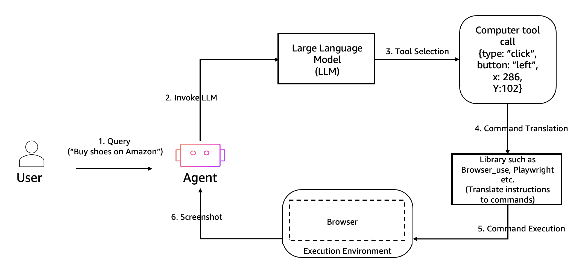

# Interact with web applications using Amazon Bedrock AgentCore Browser

The Amazon Bedrock AgentCore Browser provides a secure, cloud-based browser that enables AI agents to
interact with websites. It includes security features such as session isolation, built-in
observability through live viewing, CloudTrail logging, and session replay capabilities.

## Overview

The Amazon Bedrock AgentCore Browser provides a secure, isolated browser environment that allows you to
interact with web applications while minimizing potential risks to your system. It runs in a
containerized environment within AgentCore, and isolates web activity from your local
system.

## Why use remote browsers for agent development?

A remote browser runs in a separate environment rather than on the local machine. For
agent development, remote browsers allow AI agents to interact with the web as humans
do.

Remote browsers provide the following capabilities for agent development:

- Web interaction capabilities for navigating websites, filling forms, clicking buttons,
  and parsing dynamic content
- Serverless browser infrastructure that automatically scales without infrastructure
  overhead
- Visual understanding through screenshots that allow agents to interpret websites as
  humans do
- Human intervention with live interactive view capabilities
- Isolation and security by running web interactions for each session in a separate
  environment
- Complex web application navigation for interfaces that require browser
  capabilities
- Security through session isolation and audit capabilities
- Observability with real-time visibility and recorded history of browser
  interactions

Remote browsers bridge the gap between AI agents and the human web, allowing agents to
interact with websites designed for human users rather than being limited to APIs or static
content.

## Security Features

The Browser Tool includes several security features to help protect your environment:

- Isolation: The browser runs in a containerized environment, isolated from your local
  system
- Ephemeral sessions: Browser sessions are temporary and reset after each use
- Session timeouts: Sessions are terminated either by client or when the time to live
  (ttl) expires

## How it works

The Amazon Bedrock AgentCore Browser provides a session-based model for secure web browsing with comprehensive observability features. Here's how the complete workflow operates:

1. ###### Create a Browser Tool

Create a Browser Tool to enable web browsing capabilities. You can choose between the AWS managed Browser (aws.browser.v1) for quick setup, or create a custom browser with advanced features like session recording, custom network settings, and specific IAM execution roles. The Browser Tool allows you to augment your agent runtime to securely interact with web applications, fill forms, navigate websites, and extract information in a fully managed environment. 2. ###### Start a browser session

The Browser Tool uses a session-based model where each session runs in an isolated environment. After creating a Browser Tool, you start a session with a configurable timeout period (default is 15 minutes, extendable up to 8 hours). Sessions automatically terminate after the timeout period, and multiple sessions can be active simultaneously for a single Browser Tool. 3. ###### Interact with the browser

Once a session is started, you can interact with the browser using WebSocket-based streaming APIs. The Automation endpoint enables your agent to perform browser actions such as navigating to websites, clicking elements, filling out forms, taking screenshots, and more. Libraries like Strands, Nova Act, or Playwright can be used to simplify these interactions. Meanwhile, the Live View endpoint allows an end user to watch the browser session in real time and interact with it directly through the live stream. 4. ###### Monitor and record sessions

All browser sessions provide built-in observability through live viewing capabilities and optional session recording. Live view allows real-time monitoring of browser activity, while session recording (available for custom browsers) captures comprehensive interaction data including DOM changes, user actions, console logs, and network events. Recorded sessions are stored in your Amazon S3 bucket and can be replayed through the AWS Console or accessed programmatically for debugging and analysis. 5. ###### Assess performance using observability

Monitor key metrics for each tool in CloudWatch to get real-time performance insights. Session recordings provide detailed analysis capabilities including video playback, timeline navigation, user action tracking, and comprehensive logs for troubleshooting and optimization.

## Use cases

The AgentCore Browser can be used for a wide range of use cases, enabling AI agents to interact
with web applications just as humans do. This section describes common use cases.

With the AgentCore Browser, you can:

- Test web applications in a secure environment
- Access online resources and services
- Perform web-based tasks and workflows
- Interact with web interfaces
- Capture screenshots and record browser sessions
- Build AI agents that can navigate the web
- Automate form submissions and data entry
- Extract information from websites
- Perform e-commerce transactions
- Monitor website changes and updates
