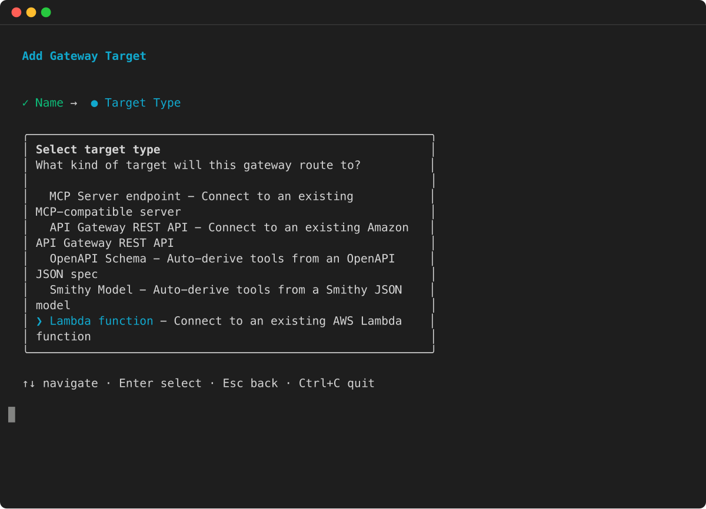
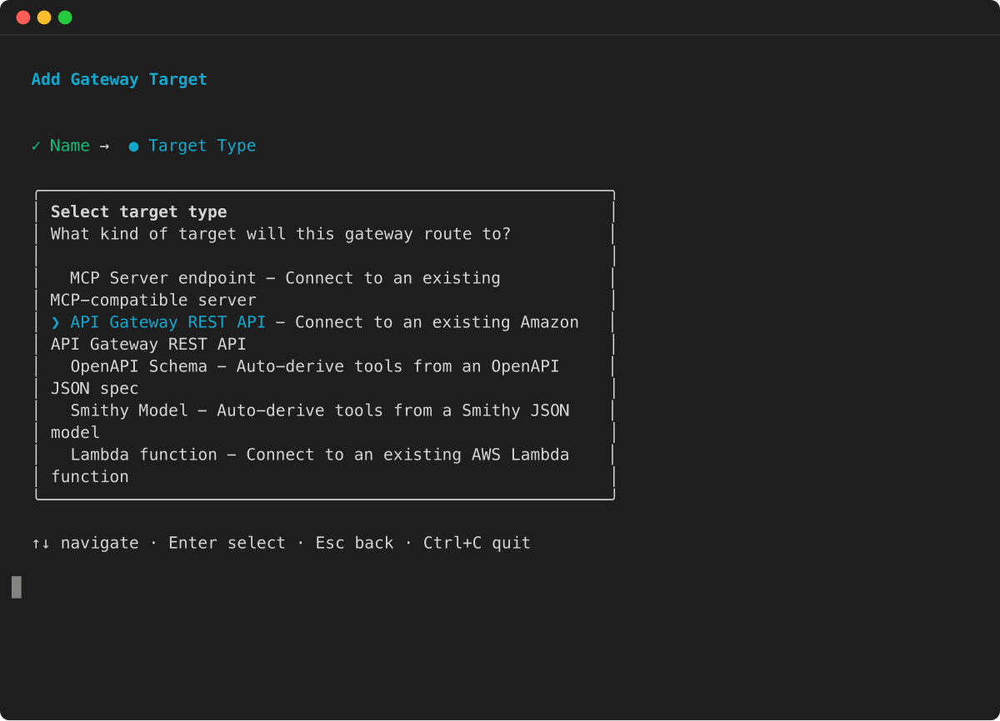
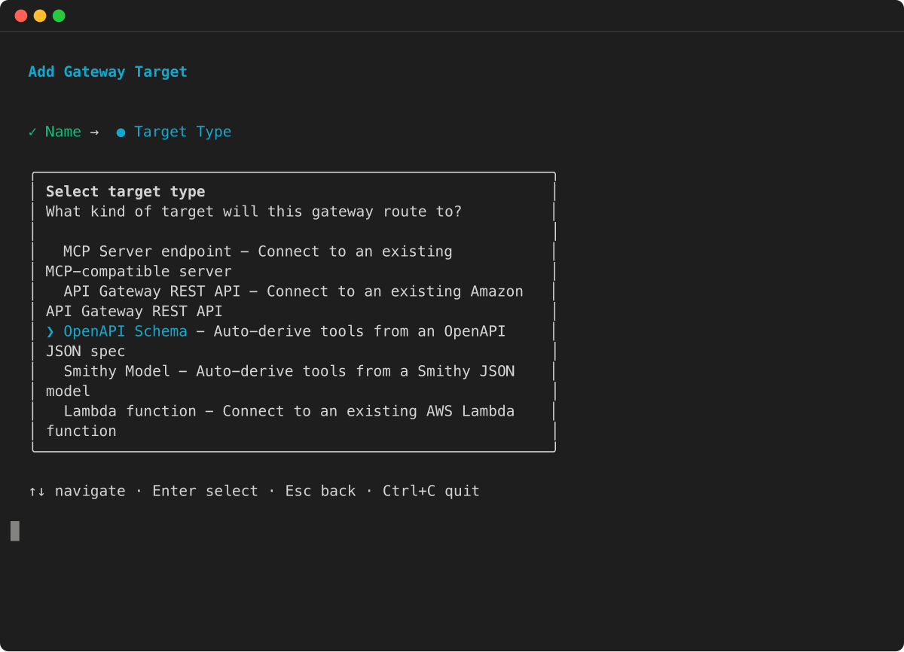
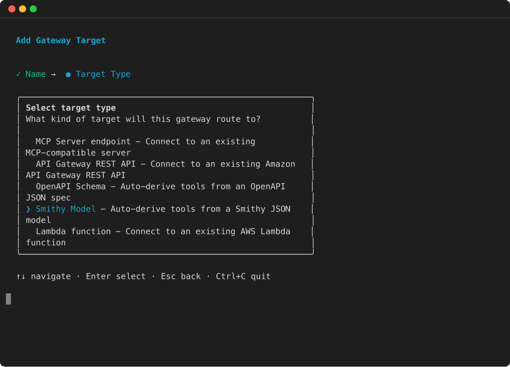
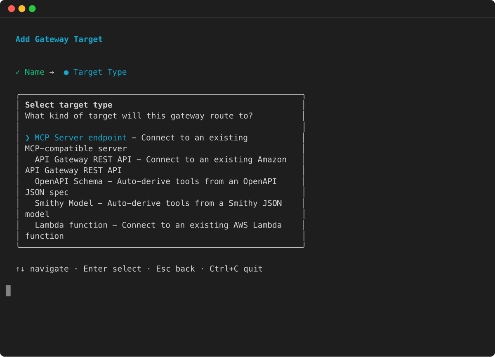

# Define the gateway target configuration

The target configuration depends on the target type that you’re adding to the gateway. For more information about supported gateway target types, see [Supported targets for Amazon Bedrock AgentCore gateways](gateway-supported-targets.md "gateway-supported-targets.md").

Select a topic to see examples of adding a target type:

###### Topics

- [Add a Lambda target](#gateway-add-target-api-lambda "#gateway-add-target-api-lambda")
- [Add an API Gateway stage target](#gateway-add-target-api-gateway "#gateway-add-target-api-gateway")
- [Add an OpenAPI target](#gateway-add-target-api-openapi "#gateway-add-target-api-openapi")
- [Add a Smithy target](#gateway-add-target-api-smithy "#gateway-add-target-api-smithy")
- [Add an MCP server target](#gateway-add-target-api-MCPserver "#gateway-add-target-api-MCPserver")

## Add a Lambda target

You can add a Lambda target to your gateway using the AgentCore CLI by specifying the `--type` as `lambda-function-arn` and providing the Lambda ARN and a tool schema file.

**Target configuration**

The target configuration (or payload) for a Lambda function contains the following fields:

- **lambdaArn** – The ARN of the Lambda function to use as your target.
- **toolSchema** – The tool schema for the gateway target.

For more information about Lambda targets, see [AWS Lambda function targets](gateway-add-target-lambda.md "gateway-add-target-lambda.md").

Select one of the following methods:

###### Example

AgentCore CLI

1. To add a Lambda function as a target, run `agentcore add gateway-target` with the `--type lambda-function-arn` option. Provide the Lambda ARN and a JSON file containing the tool schema:

```
agentcore add gateway-target \
  --name MyLambdaTarget \
  --type lambda-function-arn \
  --lambda-arn arn:aws:lambda:us-east-1:123456789012:function:MyFunction \
  --tool-schema-file tools.json \
  --gateway MyGateway
agentcore deploy
```

AgentCore Python SDK

1. With the AgentCore CLI, you can easily create a Lambda target with default configurations.

```
# Import dependencies
from bedrock_agentcore_starter_toolkit.operations.gateway.client import GatewayClient

# Initialize the client
client = GatewayClient(region_name="us-east-1")

# Create a lambda target.
lambda_target = client.create_mcp_gateway_target(
    gateway=gateway,
    name=None, # If you don't set one, one will be generated.
    target_type="lambda",
    target_payload=None, # Define your own lambda if you pre-created one. Otherwise leave this as None and one will be created for you.
    credentials=None, # If you leave this as None, one will be created for you
)
```

The following is an example argument you can provide for the `target_payload` . If you omit the `target_payload` argument, this payload is used:

```
{
    "lambdaArn": "<insert your lambda arn>",
    "toolSchema": {
        "inlinePayload": [
            {
                "name": "get_weather",
                "description": "Get weather for a location",
                "inputSchema": {
                    "type": "object",
                    "properties": {
                        "location": {
                            "type": "string",
                            "description": "the location e.g. seattle, wa"
                        }
                    },
                    "required": [
                        "location"
                    ]
                }
            },
            {
                "name": "get_time",
                "description": "Get time for a timezone",
                "inputSchema": {
                    "type": "object",
                    "properties": {
                        "timezone": {
                            "type": "string"
                        }
                    },
                    "required": [
                        "timezone"
                    ]
                }
            }
        ]
    }
}
```

Boto3

1. The following Python code shows how to add a Lambda target using the AWS Python SDK (Boto3):

```
import boto3

# Create the agentcore client
agentcore_client = boto3.client('bedrock-agentcore-control')

# Create a Lambda target
target = agentcore_client.create_gateway_target(
    gatewayIdentifier="your-gateway-id",
    name="LambdaTarget",
    targetConfiguration={
        "mcp": {
            "lambda": {
                "lambdaArn": "arn:aws:lambda:us-west-2:123456789012:function:YourLambdaFunction",
                "toolSchema": {
                    "inlinePayload": [
                        {
                            "name": "get_weather",
                            "description": "Get weather for a location",
                            "inputSchema": {
                                "type": "object",
                                "properties": {"location": {"type": "string"}},
                                "required": ["location"],
                            },
                        },
                        {
                            "name": "get_time",
                            "description": "Get time for a timezone",
                            "inputSchema": {
                                "type": "object",
                                "properties": {"timezone": {"type": "string"}},
                                "required": ["timezone"],
                            },
                        },
                    ]
                }
            }
        }
    },
    credentialProviderConfigurations=[
        {
            "credentialProviderType": "GATEWAY_IAM_ROLE"
        }
    ]
)
```

Interactive

1. In the AgentCore CLI interactive terminal UI, run `agentcore` , select **add** , choose **Gateway Target** , and then select **Lambda function** :



The wizard then prompts you for the target name, Lambda function ARN, tool schema file, and outbound authorization configuration.

## Add an API Gateway stage target

To add a stage of an API Gateway REST API as a target, specify the ARN of the API and stage and define settings to filter tools in the API gateway or to override names and descriptions of tools in the gateway:

The following examples show how to add an API Gateway target. The following configurations are also applied:

- The tools filtered for are the GET and POST methods for the `/products` path.
- GET /products is renamed as `get_items`.

Select one of the following methods:

###### Example

AgentCore CLI

1. To add an API Gateway REST API stage as a target, run `agentcore add gateway-target` with the `--type api-gateway` option:

```
agentcore add gateway-target \
  --name MyAPIGatewayTarget \
  --type api-gateway \
  --rest-api-id your-rest-api-id \
  --stage your-stage \
  --gateway MyGateway
agentcore deploy
```

AWS CLI

1. The following command uses the AWS CLI:

```
aws bedrock-agentcore-control create-gateway-target \
    --gateway-identifier "your-gateway-id" \
    --name "SearchAPITarget" \
    --target-configuration '{
        "mcp": {
            "apiGateway": {
                "restApiId": rest-api-id,
                "stage": stage,
                "apiGatewayToolConfiguration": {
                    "toolFilters": [
                        {
                            "filterPath": "/products",
                            "methods": [
                                "GET",
                                "POST"
                            ]
                        }
                    ],
                    "toolOverrides": [
                        {
                            "path": "/products",
                            "method": "GET",
                            "name": "get_items",
                            "description": "Gets information for items in the list of products."
                        }
                    ]
                }
            }
        }
    }'
    --credential-provider-configurations '[
        {
            "credentialProviderType": "GATEWAY_IAM_ROLE"
        }
    ]'
```

Boto3

1. The following code shows uses the AWS Python SDK (Boto3):

```
import boto3

# Create the client
agentcore_client = boto3.client('bedrock-agentcore-control')

# Create an API gateway REST API target with gateway service role authentication
target = agentcore_client.create_gateway_target(
    gatewayIdentifier="your-gateway-id",
    name="SearchAPITarget",
    targetConfiguration={
        "mcp": {
            "apiGateway": {
                "restApiId": rest-api-id,
                "stage": stage,
                "apiGatewayToolConfiguration": {
                    "toolFilters": [
                        {
                            "filterPath": "/products",
                            "methods": [
                                "GET",
                                "POST"
                            ]
                        }
                    ],
                    "toolOverrides": [
                        {
                            "path": "/products",
                            "method": "GET",
                            "name": "get_item",
                            "description": "Gets information for a specific item in the product list."
                        }
                    ]
                }
            }
        }
    },
    credentialProviderConfigurations=[
        {
            "credentialProviderType": "GATEWAY_IAM_ROLE"
        }
    ]
)
```

Interactive

1. In the AgentCore CLI interactive terminal UI, run `agentcore` , select **add** , choose **Gateway Target** , and then select **API Gateway REST API** :



The wizard then prompts you for the target name, REST API ID, stage, and outbound authorization configuration.

## Add an OpenAPI target

Select one of the following methods:

###### Example

AgentCore CLI

1. To add an OpenAPI schema target, run `agentcore add gateway-target` with the `--type open-api-schema` option and provide the path to your OpenAPI specification file:

```
agentcore add gateway-target \
  --name MyOpenAPITarget \
  --type open-api-schema \
  --schema path/to/openapi-spec.json \
  --outbound-auth none|api-key|oauth \
  --gateway MyGateway
agentcore deploy
```

Boto3

1. The following Python code shows how to add an OpenAPI target using the AWS Python SDK (Boto3). The schema has been uploaded to an S3 location whose URI is referenced in the `target_payload` . Outbound authorization for the target is through an API key.

```
import boto3

# Create the client
agentcore_client = boto3.client('bedrock-agentcore-control')

# Create an OpenAPI target with API Key authentication
target = agentcore_client.create_gateway_target(
    gatewayIdentifier="your-gateway-id",
    name="SearchAPITarget",
    targetConfiguration={
        "mcp": {
            "openApiSchema": {
                "s3": {
                    "uri": "s3://your-bucket/path/to/open-api-spec.json",
                    "bucketOwnerAccountId": "123456789012"
                }
            }
        }
    },
    credentialProviderConfigurations=[
        {
            "credentialProviderType": "API_KEY",
            "credentialProvider": {
                "apiKeyCredentialProvider": {
                    "providerArn": "arn:aws:agent-credential-provider:us-east-1:123456789012:token-vault/default/apikeycredentialprovider/abcdefghijk",
                    "credentialLocation": "HEADER",
                    "credentialParameterName": "X-API-Key"
                }
            }
        }
    ]
)
```

Interactive

1. In the AgentCore CLI interactive terminal UI, run `agentcore` , select **add** , choose **Gateway Target** , and then select **OpenAPI Schema** :



The wizard then prompts you for the target name, path to the OpenAPI specification file, and outbound authorization configuration.

## Add a Smithy target

Select one of the following methods:

###### Example

AgentCore CLI

1. To add a Smithy model target, run `agentcore add gateway-target` with the `--type smithy-model` option and provide the path to your Smithy model file:

```
agentcore add gateway-target \
  --name MySmithyTarget \
  --type smithy-model \
  --schema path/to/smithy-model.json \
  --gateway MyGateway
agentcore deploy
```

Boto3

1. The following Python code shows how to add a Smithy model target using the AWS Python SDK (Boto3):

```
import boto3

# Create the agentcore client
agentcore_client = boto3.client('bedrock-agentcore-control')

# Create a Smithy model target
target = agentcore_client.create_gateway_target(
    gatewayIdentifier="your-gateway-id",
    name="DynamoDBTarget",
    targetConfiguration={
        "mcp": {
            "smithyModel": {
                "s3": {
                    "uri": "s3://your-bucket/path/to/smithy-model.json",
                    "bucketOwnerAccountId": "123456789012"
                }
            }
        }
    },
    credentialProviderConfigurations=[
        {
            "credentialProviderType": "GATEWAY_IAM_ROLE"
        }
    ]
)
```

Interactive

1. In the AgentCore CLI interactive terminal UI, run `agentcore` , select **add** , choose **Gateway Target** , and then select **Smithy Model** :



The wizard then prompts you for the target name, path to the Smithy model file, and outbound authorization configuration.

## Add an MCP server target

You can add an MCP server target using the AgentCore CLI or AWS Python SDK (Boto3). The following examples show how to create an MCP server target with different outbound authorization types.

**MCP server with IAM (SigV4) authorization**

The following example creates an MCP server target with IAM authorization. The gateway signs requests to the MCP server using SigV4 with the gateway service role’s credentials. You must specify the `service` name for signing. The `region` is optional and defaults to the gateway’s Region.

The value of `service` depends on where your MCP server is hosted. The following are common values:

- `bedrock-agentcore` – For MCP servers hosted on Amazon Bedrock AgentCore, such as the runtime (see [Deploy MCP servers in AgentCore Runtime](runtime-mcp.md "runtime-mcp.md") ) or another gateway.
- `execute-api` – For MCP servers behind Amazon API Gateway.
- `lambda` – For MCP servers behind Lambda Function URLs.

Select one of the following methods:

###### Example

AWS CLI

1. ```
   aws bedrock-agentcore-control create-gateway-target \
       --gateway-identifier "your-gateway-id" \
       --name "MyMCPTarget" \
       --target-configuration '{
           "mcp": {
               "mcpServer": {
                   "endpoint": "https://my-server.bedrock-agentcore.us-west-2.api.aws"
               }
           }
       }' \
       --credential-provider-configurations '[{
           "credentialProviderType": "GATEWAY_IAM_ROLE",
           "credentialProvider": {
               "iamCredentialProvider": {
                   "service": "bedrock-agentcore",
                   "region": "us-west-2"
               }
           }
       }]'
   ```

````


Interactive

1. In the AgentCore CLI interactive terminal UI, run `agentcore` , select **add** , choose **Gateway Target** , and then select **MCP Server endpoint** :




The wizard then prompts you for the target name, MCP server endpoint URL, and outbound authorization configuration.


Boto3

1. ```
import boto3

agentcore_client = boto3.client('bedrock-agentcore-control')

target = agentcore_client.create_gateway_target(
    gatewayIdentifier="your-gateway-id",
    name="MyMCPTarget",
    targetConfiguration={
        "mcp": {
            "mcpServer": {
                "endpoint": "https://my-server.bedrock-agentcore.us-west-2.api.aws"
            }
        }
    },
    credentialProviderConfigurations=[
        {
            "credentialProviderType": "GATEWAY_IAM_ROLE",
            "credentialProvider": {
                "iamCredentialProvider": {
                    "service": "bedrock-agentcore",
                    "region": "us-west-2"
                }
            }
        }
    ]
)
````

**MCP server with OAuth authorization**

The following example creates an MCP server target with OAuth (client credentials) authorization.

Select one of the following methods:

###### Example

AWS CLI

1. ```
   aws bedrock-agentcore-control create-gateway-target \
       --gateway-identifier "your-gateway-id" \
       --name "MyMCPTarget" \
       --target-configuration '{
           "mcp": {
               "mcpServer": {
                   "endpoint": "https://my-mcp-server.example.com"
               }
           }
       }' \
       --credential-provider-configurations '[{
           "credentialProviderType": "OAUTH",
           "credentialProvider": {
               "oauthCredentialProvider": {
                   "providerArn": "arn:aws:bedrock-agentcore:us-west-2:123456789012:token-vault/default/oauth2credentialprovider/my-oauth-provider",
                   "scopes": []
               }
           }
       }]'
   ```

```


AgentCore CLI

1. To add an MCP server target with OAuth authorization, run `agentcore add gateway-target` with the `--type mcp-server` option and specify the OAuth credentials:


```

agentcore add gateway-target \
 --type mcp-server \
 --name MyMCPTarget \
 --endpoint https://my-mcp-server.example.com \
 --gateway MyGateway \
 --outbound-auth oauth \
 --oauth-client-id my-client \
 --oauth-client-secret my-secret \
 --oauth-discovery-url https://auth.example.com/.well-known/openid-configuration
agentcore deploy

````


Boto3

1. ```
import boto3

agentcore_client = boto3.client('bedrock-agentcore-control')

target = agentcore_client.create_gateway_target(
    gatewayIdentifier="your-gateway-id",
    name="MyMCPTarget",
    targetConfiguration={
        "mcp": {
            "mcpServer": {
                "endpoint": "https://my-mcp-server.example.com"
            }
        }
    },
    credentialProviderConfigurations=[
        {
            "credentialProviderType": "OAUTH",
            "credentialProvider": {
                "oauthCredentialProvider": {
                    "providerArn": "arn:aws:bedrock-agentcore:us-west-2:123456789012:token-vault/default/oauth2credentialprovider/my-oauth-provider",
                    "scopes": []
                }
            }
        }
    ]
)
````
