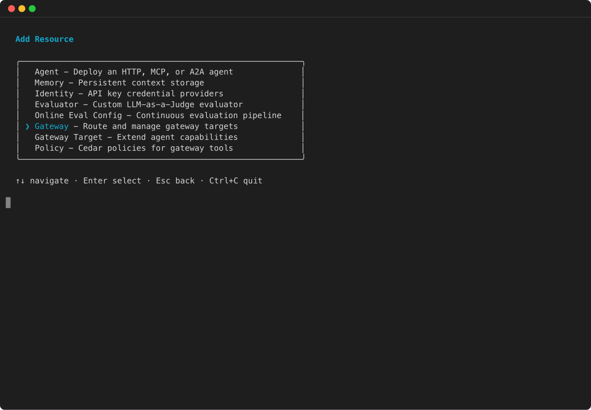

# Add a target using the CLI

You can use the AgentCore CLI to add targets to an existing gateway with simplified commands.

AgentCore CLI
Add an MCP server target:

```
agentcore add gateway-target \
  --name MyMCPTarget \
  --type mcp-server \
  --endpoint `https://your-mcp-server.example.com/mcp` \
  --gateway MyGateway
agentcore deploy
```

Add a Lambda function target:

```
agentcore add gateway-target \
  --name MyLambdaTarget \
  --type lambda-function-arn \
  --lambda-arn `arn:aws:lambda:us-east-1:123456789012:function:MyFunction` \
  --tool-schema-file tools.json \
  --gateway MyGateway
agentcore deploy
```

Add an OpenAPI schema target:

```
agentcore add gateway-target \
  --name MyOpenAPITarget \
  --type open-api-schema \
  --schema `path/to/openapi-spec.json` \
  --outbound-auth `none|api-key|oauth` \
  --gateway MyGateway
agentcore deploy
```

Interactive
You can also use the AgentCore CLI interactive terminal UI. Run
`agentcore` to open the TUI, then select
**add** and choose
**Gateway Target**:

1. In the **Add Resource** menu, select
   **Gateway Target** and press **Enter**.

 2. Select the target type for your gateway. The wizard shows the available
target types, including MCP Server endpoint, API Gateway REST API, OpenAPI Schema,
Smithy Model, and Lambda function.

 3. Follow the remaining wizard prompts to provide the target name, endpoint
or schema details, and outbound authorization configuration. The specific
fields depend on the target type you selected.

For more CLI examples, see the [Get started with AgentCore Gateway](gateway-quick-start.md "gateway-quick-start.md").
