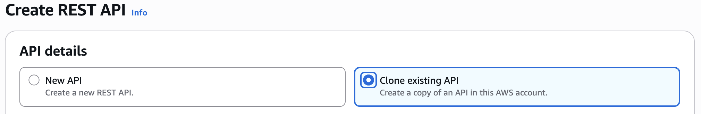
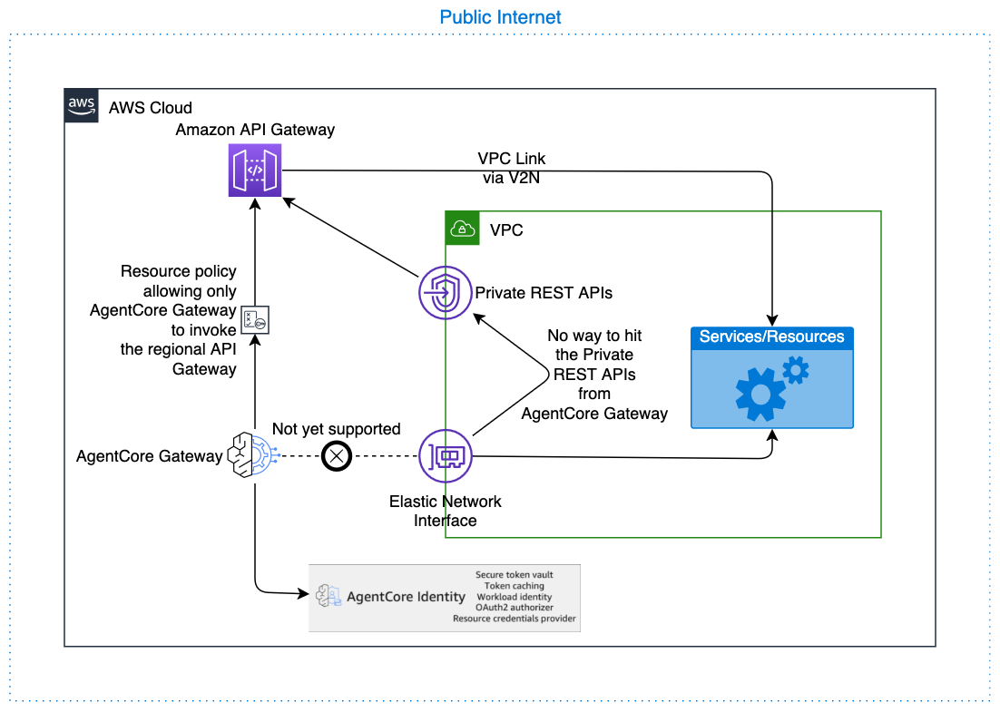
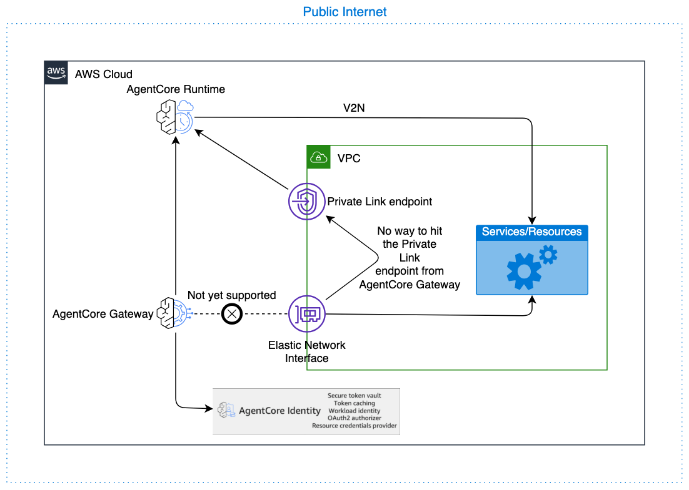

# Configure Amazon Bedrock AgentCore Gateway VPC Egress for Gateway Targets

The AgentCore Gateway service provides secure and controlled egress traffic management for your applications, enabling seamless communication with resources within your Virtual Private Cloud (VPC). This document outlines how egress traffic flows through the AgentCore Gateway to reach VPC resources. You'll learn about the supported gateway target types (Lambda, API Gateway, and MCP servers via AgentCore Runtime), their configuration requirements, and the authentication methods supported for each target type. This guide covers the security considerations, routing mechanisms, and best practices needed to enable proper egress traffic flow while maintaining network isolation and following the principle of least privilege throughout your architecture.

## Lambda

AgentCore Gateway supports Lambda targets as one of it target types, allowing seamless invocation of Lambda functions that can communicate with resources within your VPC. This functionality is available out-of-the-box and requires no additional configuration from customers - the gateway can immediately invoke Lambda functions that have been configured with VPC access to reach your internal resources such as databases, APIs, or other services. To maintain security best practices, it's strongly recommended to configure the AgentCore Gateway execution role with minimal permissions, specifically limiting it to invoke only the intended Lambda function rather than granting broad Lambda execution permissions. This principle of least privilege ensures that the gateway, or any other caller using the same role, cannot inadvertently invoke unintended Lambda functions, thereby reducing your security attack surface and maintaining strict access controls within your AWS environment.

## API Gateway

AgentCore Gateway supports API Gateway as a target type, which can serve as an intermediary layer for accessing VPC resources. AgentCore Gateway specifically supports REST API Gateways configured with regional endpoints only. While direct VPC communication from the Gateway is not currently available (this feature is planned for future release), the gateway communicates with API Gateway over the AWS backbone, ensuring that traffic never traverses the public internet (except for cross-region calls to China datacenters). The API Gateway can then communicate with resources using VPC Link, creating a secure pathway for the AgentCore Gateway to reach internal services while maintaining network isolation.

To implement security best practices, configure your API Gateway to restrict inbound traffic exclusively to the AgentCore Gateway service principal or the configured API key, preventing unauthorized access from other sources. For outbound authorization from AgentCore Gateway to API Gateway, only two authentication methods are supported: IAM-based authentication (using the gateway service role to authenticate with AWS Signature Version 4) and API key authentication (managed by AgentCore Gateway); OAuth-based authorization and Cross Account API Gateways are not supported for API Gateway targets, please use API Gateway endpoint via Open API Target for those. Limit the AgentCore Gateway execution role permissions to invoke only the specific API Gateway endpoint required, rather than granting broad API Gateway access, ensuring that the gateway cannot interact with unintended API resources and maintaining the principle of least privilege throughout your architecture.

[Amazon API Gateway REST API stages as targets](gateway-target-api-gateway.md "gateway-target-api-gateway.md")

### Permissions for API Gateway integration using IAM Auth

###### API Gateway Resource Policy Locked Down to AgentCore Gateway

The following resource policy restricts API Gateway access to AgentCore Gateway:

```
{
    "Version": "2012-10-17",
    "Statement": [
      {
        "Effect": "Allow",
        "Principal": {
          "Service": "bedrock-agentcore.amazonaws.com"
        },
        "Action": "execute-api:Invoke",
        "Resource": [
          "arn:aws:execute-api:us-west-2:111122223333:rest-api-id/api-stage/*/*"
        ],
        "Condition": {
          "ArnEquals": {
            "aws:SourceArn": "arn:aws:bedrock-agentcore:us-west-2:111122223333:gateway/my-gateway-d4jrgkaske"
          }
        }
      }
    ]
}
```

###### AgentCore Gateway Execution Role policy

The following policy grants the gateway permission to invoke the API Gateway:

```
{
    "Version": "2012-10-17",
    "Statement": [
      {
        "Effect": "Allow",
        "Action": [
          "execute-api:Invoke"
        ],
        "Resource": [
          "arn:aws:execute-api:us-west-2:111122223333:abcd123/prod/*/*"
        ]
      }
    ]
}
```

###### AgentCore Gateway Execution Role trust policy

The following trust policy allows AgentCore Gateway to assume the execution role:

```
{
    "Version": "2012-10-17",
    "Statement": [
      {
        "Effect": "Allow",
        "Principal": {
          "Service": "bedrock-agentcore.amazonaws.com"
        },
        "Action": "sts:AssumeRole",
        "Condition": {
          "StringEquals": {
            "aws:SourceAccount": "111122223333"
          },
          "ArnLike": {
            "aws:SourceArn": "arn:aws:bedrock-agentcore:us-west-2:111122223333:gateway/*"
          }
        }
      }
    ]
}
```

#### I already have Private REST APIs in API Gateway

In this case you can clone it (or migrate it if AgentCore Gateway is the only customer) to a regional endpoint and then setup the API Gateway Resource Policy Locked Down to AgentCore Gateway as discussed above.



This is equivalent from a security posture to the AgentCore Gateway getting into the VPC and then hitting the API Gateway VPC endpoint and reduces any unnecessary network hops.



## MCP

AgentCore Gateway supports Model Context Protocol (MCP) servers as target endpoints, providing flexible deployment options to meet various customer requirements. MCP servers can be configured in multiple ways depending on your infrastructure needs and security requirements.

Your MCP targets could be of two types, hosted on AgentCore Runtime in the VPC, or self-hosted. We discuss both below.

### AgentCore Runtime

AgentCore Runtime provides native support for communicating with resources within your VPC through a managed infrastructure approach. All communication between AgentCore Gateway and AgentCore Runtime will happen over the AWS backbone, as guaranteed by the EC2 team, ensuring your data never traverses the public internet (except for cross-region calls to China datacenters). For detailed setup instructions on connecting AgentCore Runtime to your VPC, refer to the [Configure Amazon Bedrock AgentCore Runtime and tools for VPC](agentcore-vpc.md "agentcore-vpc.md")

For outbound authorization from AgentCore Gateway to AgentCore Runtime, two authentication methods are supported: no authorization (not recommended for production use) and OAuth with client credentials grant (for machine-to-machine authentication). When no authorization is configured, the request from AgentCore Gateway to AgentCore Runtime has no auth tokens. This architecture provides a seamless connection pathway while maintaining security isolation. As a security best practice, configure restrictive authentication and authorization permissions for both AgentCore Runtime and AgentCore Gateway, limiting access to only the necessary resources and operations required for your specific use case. To configure an OAuth Identity to be used by AgentCore Gateway for egress and ingress for AgentCore Runtime use the following documents:

- [Configure an OAuth client](identity-oauth-client.md "identity-oauth-client.md")
- [Specify the authorization type and credentials to access the gateway target](gateway-building-adding-targets-authorization.md "gateway-building-adding-targets-authorization.md")
- [Authenticate and authorize with Inbound Auth and Outbound Auth](runtime-oauth.md "runtime-oauth.md")



###### Example CreateGatewayTarget with AgentCore Runtime as a the target

The following example shows how to create a gateway target with AgentCore Runtime:

```
POST /gateways/gatewayIdentifier/targets/ HTTP/1.1
Content-type: application/json

    {
    "clientToken": "string",
    "credentialProviderConfigurations": [
      {
         "credentialProvider": {
            "oauthCredentialProvider": {
               "providerArn": "string",
               "scopes": [ "string" ],
               ...
            }
         },
         "credentialProviderType": "OAUTH"
      }
    ],
    "description": "string",
    "metadataConfiguration": {
      "allowedQueryParameters": [ "string" ],
      "allowedRequestHeaders": [ "string" ],
      "allowedResponseHeaders": [ "string" ]
    },
    "name": "string",
    "targetConfiguration": {
      "mcp": {
         "mcpServer": {
            "endpoint": "https://..."
         }
      }
    }
}
```

### Self Hosted MCP

AgentCore Gateway is working on a native VPC egress solution for MCP targets. In the meantime consider using AgentCore Runtime as a hosting solution for MCP.

## Open API target

### API Gateway endpoint via Open API Target

If your API Gateway can't be directly added as a target, you can always export the resource as an OpenAPI spec and import the spec into AgentCore Gateway as a OpenAPI target.

- [Export a REST API from API Gateway](../../../apigateway/latest/developerguide/api-gateway-export-api.md "../../../apigateway/latest/developerguide/api-gateway-export-api.md")
- [OpenAPI schema targets](gateway-schema-openapi.md "gateway-schema-openapi.md")

If you have Private REST APIs in API Gateway, follow the instructions here: [I already have Private REST APIs in API Gateway](#private-api-gateway "#private-api-gateway"), to enable it to be added as a target.

### Other endpoints

AgentCore Gateway is working on a native VPC egress solution for other types of targets/configurations.

## Other targets/configurations

AgentCore Gateway is working on a native VPC egress solution for other types of targets/configurations.
