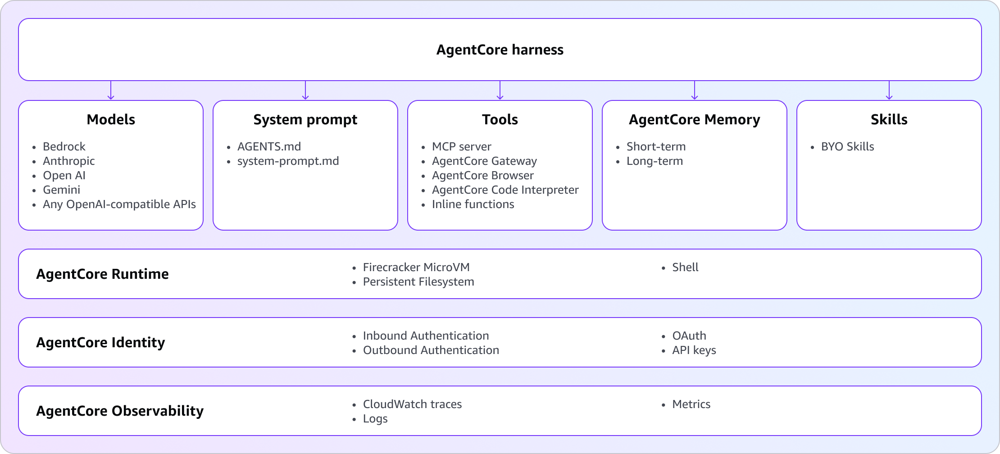

# AgentCore harness [Preview]

Every agent has an orchestration layer: the loop that calls the model, decides which tool to invoke, passes results back, manages the context window, and handles failures. Running that loop requires infrastructure underneath: compute to host the agent, a sandbox to safely execute code, secure connections to tools, persistent storage, memory, identity, and observability. Together, this infrastructure forms the **agent harness**, the system that lets an agent actually run.

Until now, every team had to build that harness from scratch. Choose a framework, write the orchestration code, wire up tools and memory, set up authentication, provision the environment. Days of plumbing before the agent could handle its first real task.

The **managed agent harness** in AgentCore replaces that upfront build with a simple configuration. You declare what your agent does: which model it uses, which tools it can call, and what instructions it follows. AgentCore handles the rest: **the environment, compute, tooling, memory, identity, VPC networking, and observability** that turn your config into a running agent. Trying a different model or adding a new tool is a **config change, not a code rewrite**.

Every harness session is **stateful by default** and runs in a **secure, isolated microVM** per session. The agent has its own **filesystem and shell**, can write and execute code, and can maintain **persistent short-term and long-term memory and files** across sessions. Agents can use **any model** provided by Amazon Bedrock, OpenAI, Google Gemini - and **switch providers mid-session** without losing context. Connect tools through **[AgentCore Gateway](gateway.md "gateway.md")**, **[MCP servers](https://modelcontextprotocol.io "https://modelcontextprotocol.io")**, or the built-in **[browser](browser-tool.md "browser-tool.md")** and **[code interpreter](code-interpreter-tool.md "code-interpreter-tool.md")**. Bring your own **custom environment** with your source code, dependencies, and tools. Run **shell commands directly on the session** - no model reasoning, no token cost - to set up environments, run deterministic scripts, extract artifacts, or debug. Every action is traced automatically through [AgentCore Observability](observability.md "observability.md"). Everything you need to build, run, and operate production agents - without managing infrastructure.

The harness is powered by [Strands Agents](https://strandsagents.com "https://strandsagents.com"), the open-source agent framework from AWS.

**AgentCore harness is in public preview** in US West (Oregon), US East (N. Virginia), Asia Pacific (Sydney), and Europe (Frankfurt). There is no separate harness charge. You pay only for the underlying AgentCore capabilities you use. For details, see the [AgentCore pricing page](https://aws.amazon.com/bedrock/agentcore/pricing/ "https://aws.amazon.com/bedrock/agentcore/pricing/").

###### Topics

- [Get started](harness-get-started.md "harness-get-started.md")
- [Configure agents and models](harness-config-and-models.md "harness-config-and-models.md")
- [Connect to tools](harness-tools.md "harness-tools.md")
- [Persist memory and filesystem](harness-memory.md "harness-memory.md")
- [Environment and Skills](harness-environment.md "harness-environment.md")
- [Observability and cost controls](harness-operations.md "harness-operations.md")
- [Security and access controls](harness-security.md "harness-security.md")
