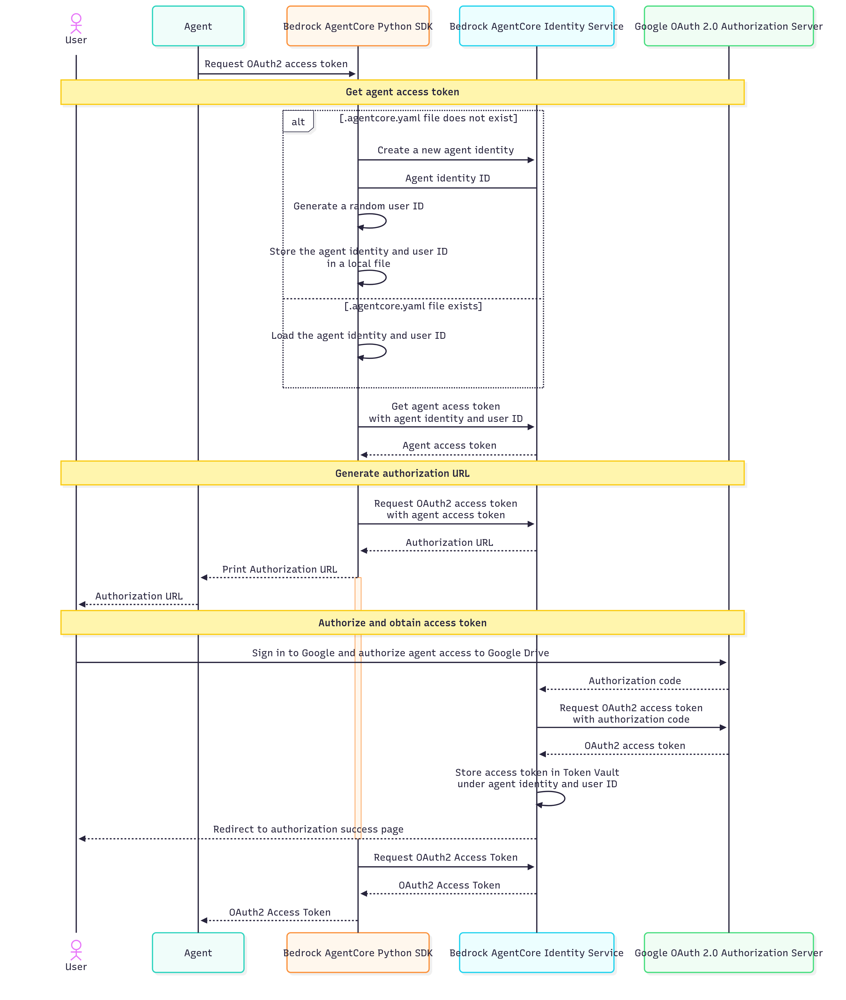

# Integrate with Google Drive using

OAuth2

This getting started tutorial walks you through the essential steps to start using
Amazon Bedrock AgentCore Identity for your AI agents. You'll learn how to set up your development environment,
install the necessary SDKs, create your first agent identity, and allow your agent to access
external resources securely.

By the end of this tutorial, you'll have a working agent that can retrieve access tokens
from Google with AgentCore Identity OAuth2 Credential Provider, and read files from Google Drive
using access tokens. For detailed information about OAuth2 flows, see [Manage credential providers with
AgentCore Identity](identity-outbound-credential-provider.md "identity-outbound-credential-provider.md").

###### Topics

- [Prerequisites](#identity-getting-started-prerequisites "#identity-getting-started-prerequisites")
- [Step 1: Import Identity and Auth
  modules](#identity-getting-started-step1 "#identity-getting-started-step1")
- [Step 2: Set up an OAuth 2.0 Credential
  Provider](#identity-getting-started-step2 "#identity-getting-started-step2")
- [Step 3: Obtain an OAuth 2.0 access
  token](#identity-getting-started-step3 "#identity-getting-started-step3")
- [Step 4: Use OAuth2 Access Token to
  Invoke External Resource](#identity-getting-started-step4 "#identity-getting-started-step4")
- [What's Next?](#identity-getting-started-whats-next "#identity-getting-started-whats-next")

## Prerequisites

Before you start, you need:

- An AWS account with appropriate permissions (for example,
  `BedrockAgentCoreFullAccess`)
- Python 3.10 or higher
- Basic understanding of Python programming

### Install the SDK

To get started, install the `bedrock-agentcore` package:

```
pip install bedrock-agentcore
```

### Obtain Google Client

ID and Client Secret

To allow your agent to access Google Drive, you need to obtain a Google client ID
and client secret for your agent. Go to the [Google Developer
Console](https://console.developers.google.com/project "https://console.developers.google.com/project") and follow these steps:

1. Enable Google Drive API
2. Create OAuth consent screen
3. Create a new web application for the agent, for example, "My Agent
   1"
4. Add the following OAuth 2.0 scope to your agent application:
   `https://www.googleapis.com/auth/drive.metadata.readonly`
5. Create OAuth 2.0 Credentials for the new web application, and note the
   generated Google client ID and client secret

###### Note

You must add the following URI to your application's redirect URI list:
`https://bedrock-agentcore.us-east-1.amazonaws.com/identities/oauth2/callback`

## Step 1: Import Identity and Auth

modules

Add this import statement to your Python file:

```
from bedrock_agentcore.services.identity import IdentityClient
from bedrock_agentcore.identity.auth import requires_access_token, requires_api_key
```

## Step 2: Set up an OAuth 2.0 Credential

Provider

Create a new OAuth 2.0 Credential Provider with the Google client ID and client secret
obtained earlier using the following AWS CLI command:

```
aws bedrock-agentcore-control create-oauth2-credential-provider \
  --region us-east-1 \
  --name "google-provider" \
  --credential-provider-vendor "GoogleOauth2" \
  --oauth2-provider-config-input '{
      "googleOauth2ProviderConfig": {
        "clientId": "<your-google-client-id>",
        "clientSecret": "<your-google-client-secret>"
      }
    }'
```

Behind the scenes, the SDK makes a call to the
`CreateOauth2CredentialProvider` API.

## Step 3: Obtain an OAuth 2.0 access

token

Once you have the Google Credential Provider created in the previous step, add the
`@requires_access_token` decorator to your agent code that requires a
Google access token. Copy the authorization URL from your console output, then paste it
in your browser and complete the consent flow with Google Drive.

The following code sample is intended to be integrated into your agent code to invoke
an authorization workflow. This is not standalone code that can be copied and run
independently.

```
import asyncio

# Injects Google Access Token
@requires_access_token(
    # Uses the same credential provider name created above
    provider_name="google-provider",
    # Requires Google OAuth2 scope to access Google Drive
    scopes=["https://www.googleapis.com/auth/drive.metadata.readonly"],
    # Sets to OAuth 2.0 Authorization Code flow
    auth_flow="USER_FEDERATION",
    # Prints authorization URL to console
    on_auth_url=lambda x: print("\nPlease copy and paste this URL in your browser:\n" + x),
    # If false, caches obtained access token
    force_authentication=False,
)
async def write_to_google_drive(*, access_token: str):
    # Prints the access token obtained from Google
    print(access_token)

asyncio.run(write_to_google_drive(access_token=""))
```

Behind the scenes, the `@requires_access_token` decorator runs through the
following sequence:



1. The SDK makes API calls to `CreateWorkloadIdentity`,
   `GetWorkloadAccessToken`, and
   `GetResourceOauth2Token`.
2. When running the agent code locally, the SDK automatically generates an agent
   identity ID and a random user ID for local testing, and stores them in a local
   file called `.agentcore.yaml`.
3. When running the agent code with AgentCore Runtime, the SDK does not
   generate an agent identity ID or random user ID. Instead, it uses the agent
   identity ID assigned, and the user ID or JWT token passed in by the agent
   caller.
4. Agent access token is an encrypted (opaque) token that contains the agent
   identity ID and user ID.
5. AgentCore Identity service stores the Google access token in the Token Vault under the
   agent identity ID and user ID. This creates a binding among the agent identity,
   user identity, and the Google access token.

## Step 4: Use OAuth2 Access Token to

Invoke External Resource

Once the agent obtains a Google access token with the steps above, it can use the
access token to access Google Drive. Here is a full example that lists the names and IDs
of the first 10 files that the user has access to.

First, install the Google client library for Python:

```
pip install --upgrade google-api-python-client google-auth-httplib2 google-auth-oauthlib
```

Then, copy the following code:

```
import asyncio
from bedrock_agentcore.identity.auth import requires_access_token, requires_api_key
from google.auth.transport.requests import Request
from google.oauth2.credentials import Credentials
from google_auth_oauthlib.flow import InstalledAppFlow
from googleapiclient.discovery import build
from googleapiclient.errors import HttpError

SCOPES = ["https://www.googleapis.com/auth/drive.metadata.readonly"]

def main(access_token):
    """Shows basic usage of the Drive v3 API.

    Prints the names and ids of the first 10 files the user has access to.
    """
    creds = Credentials(token=access_token, scopes=SCOPES)

    try:
        service = build("drive", "v3", credentials=creds)

        # Call the Drive v3 API
        results = (
            service.files()
            .list(pageSize=10, fields="nextPageToken, files(id, name)")
            .execute()
        )
        items = results.get("files", [])

        if not items:
            print("No files found.")
            return

        print("Files:")
        for item in items:
            print(f"{item['name']} ({item['id']})")

    except HttpError as error:
        # TODO(developer) - Handle errors from drive API.
        print(f"An error occurred: {error}")

if __name__ == "__main__":
    # This annotation helps agent developer to obtain access tokens from external applications
    @requires_access_token(
        provider_name="google-provider",
        # Google OAuth2 scopes
        scopes=["https://www.googleapis.com/auth/drive.metadata.readonly"],
        # 3LO flow
        auth_flow="USER_FEDERATION",
        # prints authorization URL to console
        on_auth_url=lambda x: print("Copy and paste this authorization url to your browser", x),
        force_authentication=True,
    )
    async def read_from_google_drive(*, access_token: str):
        print(access_token)  # You can see the access_token
        # Make API calls...
        main(access_token)

    asyncio.run(read_from_google_drive(access_token=""))
```

## What's Next?

The example in this section focuses on practical implementation patterns that you can
adapt for your specific use cases. You can embed the code as part of an agent, or a
Model Context Protocol (MCP) tool. If you want to host your Agent code or MCP Tool with
AgentCore Runtime, follow [Host agent or tools with Amazon Bedrock AgentCore Runtime](agents-tools-runtime.md "agents-tools-runtime.md") to copy the code above to AgentCore
Runtime.
