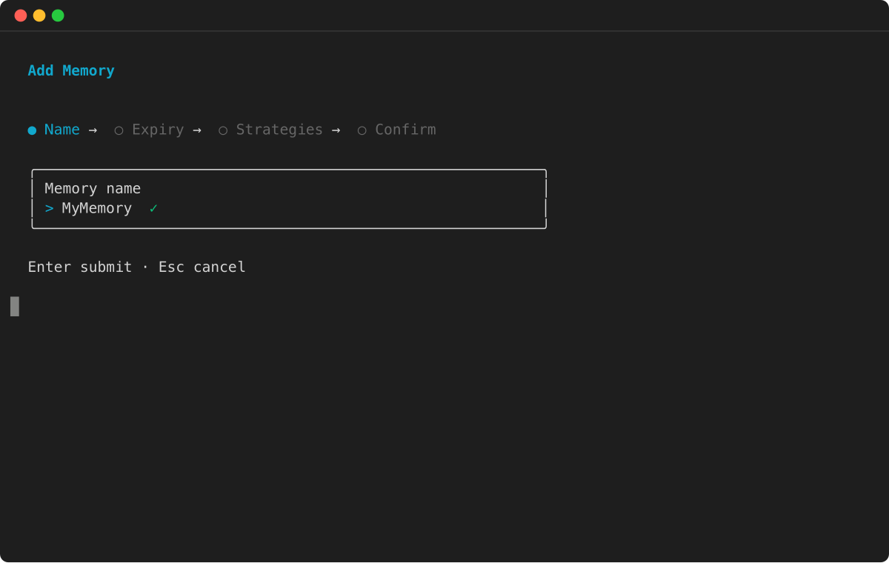
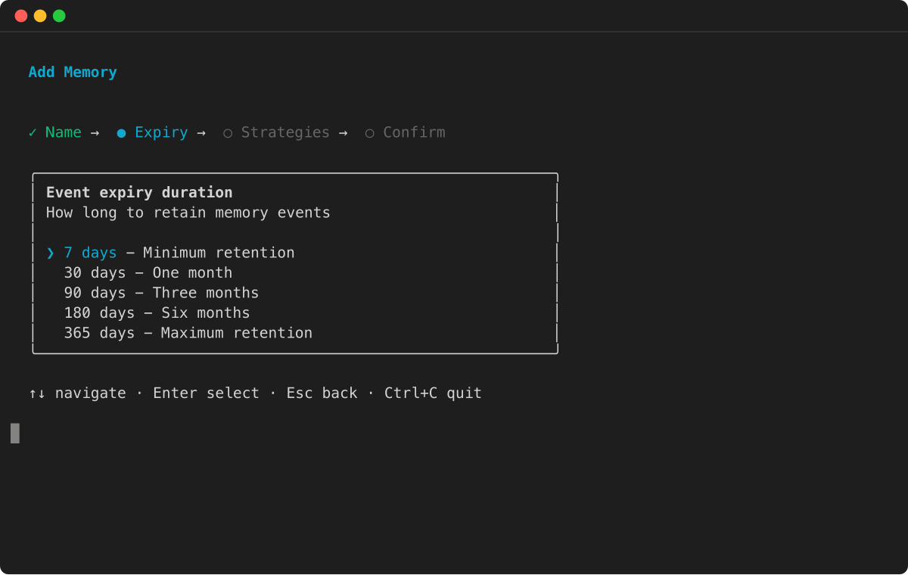
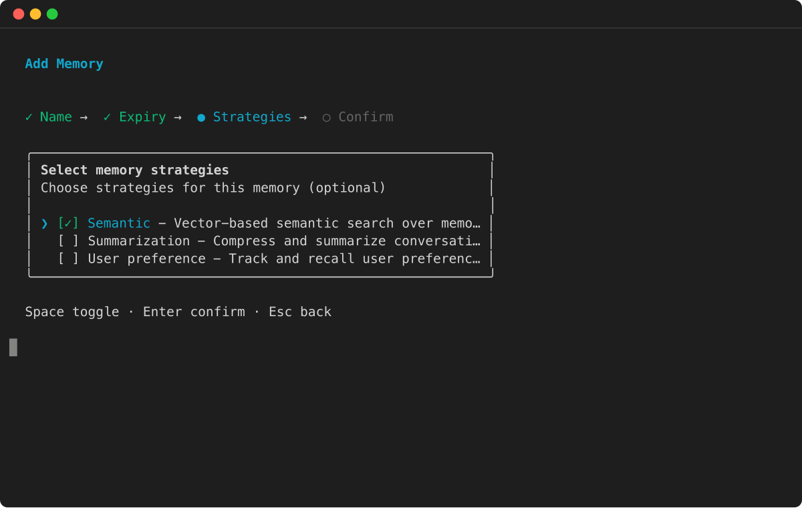
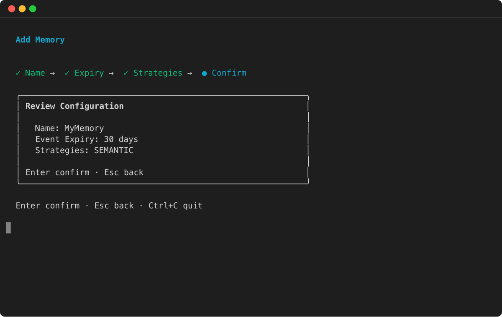

# Create an AgentCore Memory

You can create an AgentCore Memory with the AgentCore CLI, the AWS console, or with the [CreateMemory](../../../bedrock-agentcore-control/latest/APIReference/API_CreateMemory.md "../../../bedrock-agentcore-control/latest/APIReference/API_CreateMemory.md")
AWS SDK operation. When creating a memory, you can configure settings such as name, description, encryption settings, expiration timestamp for raw events, and memory strategies if you want to extract long-term memory.

When creating an AgentCore Memory, consider the following factors to maintain it meets your application’s needs:

**Event retention** – Choose how long raw events are retained (up to 365 days) for short-term memory.

###### Note

`eventExpiryDuration` is applied per event at write time. Updating it affects only events created after the change. Previously stored events keep their original expiration and cannot be extended, and expired events cannot be recovered.

**Security requirements** – If your application handles sensitive information, consider using a [customer managed AWS KMS key](../../../kms/latest/developerguide/concepts.md "../../../kms/latest/developerguide/concepts.md") for encryption. The service still encrypts data using a service managed key, even if you don’t provide a customer-managed AWS KMS key.

**Memory strategies** – Define how events are processed into meaningful long-term memories using built-in or built-in with overrides strategies. If you do not define any strategy, only short-term memory containing raw events are stored. For more information, see [Use long-term memory](long-term-memory-long-term.md "long-term-memory-long-term.md").

**Naming conventions** – Use clear, descriptive names that help identify the purpose of each AgentCore Memory, especially if your application uses multiple stores.

###### Example

AgentCore CLI

1. The AgentCore CLI memory commands must be run inside an existing agentcore project. If you don’t have one yet, create a project first:

```
agentcore create --project-name MemoryProject --no-agent
cd MemoryProject
```

**Create** a basic memory (short-term only):

```
agentcore add memory --name my_agent_memory
agentcore deploy
```

**Create** memory with long-term strategies:

```
agentcore add memory --name ShoppingSupportAgentMemory \
  --strategies SUMMARIZATION,USER_PREFERENCE
agentcore deploy
```

**Check** memory status:

```
agentcore status
```

Interactive

1. Run `agentcore` to open the TUI, then select **add** and choose **Memory** :
2. Enter the memory name:

 3. Select the event expiry duration:

 4. Choose memory strategies for long-term memory extraction:

 5. Review the configuration and press Enter to confirm:



AWS SDK

1. For more information, see [AWS SDK](aws-sdk-memory.md "aws-sdk-memory.md").

```
import boto3
import time

# Initialize the Boto3 clients for control plane and data plane operations
control_client = boto3.client('bedrock-agentcore-control')
data_client = boto3.client('bedrock-agentcore')

print("Creating a new memory resource...")

# Create the memory resource with defined strategies
response = control_client.create_memory(
    name="ShoppingSupportAgentMemory",
    description="Memory for a customer support agent.",
    memoryStrategies=[
        {
            'summaryMemoryStrategy': {
                'name': 'SessionSummarizer',
                'namespaceTemplates': ['/summaries/{actorId}/{sessionId}/']
            }
        },
        {
            'userPreferenceMemoryStrategy': {
                'name': 'UserPreferenceExtractor',
                'namespaceTemplates': ['/users/{actorId}/preferences/']
            }
        }
    ]
)

memory_id = response['memory']['id']
print(f"Memory resource created with ID: {memory_id}")

# Poll the memory status until it becomes ACTIVE
while True:
    mem_status_response = control_client.get_memory(memoryId=memory_id)
    status = mem_status_response.get('memory', {}).get('status')
    if status == 'ACTIVE':
        print("Memory resource is now ACTIVE.")
        break
    elif status == 'FAILED':
        raise Exception("Memory resource creation FAILED.")
    print("Waiting for memory to become active...")
    time.sleep(10)
```

Console

1. ====== To create an AgentCore memory
2. Open the [Amazon Bedrock AgentCore](https://console.aws.amazon.com/bedrock-agentcore/ "https://console.aws.amazon.com/bedrock-agentcore/") console.
3. In the left navigation pane, choose **Memory**.
4. Choose **Create memory**.
5. For **Memory name** enter a name for the AgentCore Memory.
6. (Optional) For **Short-term memory (raw event) expiration** set the duration (days), for which the AgentCore Memory will store events.
7. (Optional) In **Additional configurations** set the following:

   1. For **Memory description** , enter a description for the AgentCore Memory.
   2. If you want to use your own AWS KMS key to encrypt your data, do the following:

      1. In **KMS key** , choose **Customize encryption settings (advanced)**.
      2. In **Choose an AWS KMS key** choose or enter the ARN of an existing AWS KMS key. Alternatively, choose **Create an AWS KMS** to create a new AWS KMS key.

8. (Optional) For **Long-term memory extraction strategies** choose one or more [memory strategies](memory-strategies.md "memory-strategies.md") . For more information:

   - [Built-in strategies](built-in-strategies.md "built-in-strategies.md")
   - [Customize a built-in strategy or create your own strategy](memory-custom-strategy.md "memory-custom-strategy.md")
   - [Self-managed strategy](memory-self-managed-strategies.md "memory-self-managed-strategies.md")

9. Choose **Create memory** to create the AgentCore Memory.

###### Topics

- [Encrypt your Amazon Bedrock AgentCore Memory](storage-encryption.md "storage-encryption.md")
