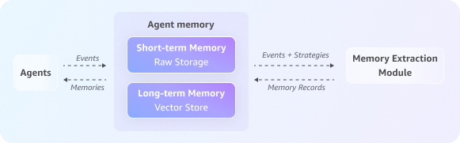

# Scenario: A customer support AI agent using

AgentCore Memory

In this section you learn how to build a customer support AI agent that uses
AgentCore Memory to provide personalized assistance by maintaining conversation history
and extracting long-term insights about user preferences. The topic includes code
examples for the Amazon Bedrock AgentCore toolkit and the AWS SDK.

Consider a customer, Sarah, who engages with your shopping website's support AI agent
to inquire about a delayed order. The interaction flow through the AgentCore Memory APIs
would look like this:



###### Topics

- [Step 1: Create an AgentCore Memory](#create-memory-resource "#create-memory-resource")
- [Step 2: Start the session](#start-session "#start-session")
- [Step 3: Capture the conversation
  history](#capture-conversation "#capture-conversation")
- [Step 4: Generate long-term memory](#generate-longterm-memory "#generate-longterm-memory")
- [Step 5: Retrieve past interactions from
  short-term memory](#retrieve-shortterm-memory "#retrieve-shortterm-memory")
- [Step 6: Use long-term memories for
  personalized assistance](#use-longterm-memory "#use-longterm-memory")

## Step 1: Create an AgentCore Memory

First, you create a memory resource with both short-term and long-term memory
capabilities, configuring the strategies for what long-term information to
extract.

Starter toolkit CLI
Create memory with summary and user preference strategies:

```
agentcore memory create ShoppingSupportAgentMemory \
  --region us-west-2 \
  --description "Memory for a customer support agent." \
  --strategies '[{"summaryMemoryStrategy": {"name": "SessionSummarizer", "namespaces": ["/summaries/{actorId}/{sessionId}"]}}, {"userPreferenceMemoryStrategy": {"name": "PreferenceLearner", "namespaces": ["/users/{actorId}/preferences"]}}]' \
  --wait
```

Get memory details:

```
agentcore memory get <memory-id> --region us-west-2
```

###### Note

The starter toolkit CLI provides memory resource management. For event operations (creating events, listing events, etc.), use the starter toolkit Python API or AWS SDK.

Starter toolkit

```

from bedrock_agentcore_starter_toolkit.operations.memory.manager import MemoryManager
from bedrock_agentcore.memory.session import MemorySessionManager
from bedrock_agentcore.memory.constants import ConversationalMessage, MessageRole
from bedrock_agentcore_starter_toolkit.operations.memory.models.strategies import SummaryStrategy, UserPreferenceStrategy
import time

# Create memory manager
memory_manager = MemoryManager(region_name="us-west-2")

print("Creating a new memory resource and waiting for it to become active...")

# Create memory resource with summary and user preference strategy
memory = memory_manager.get_or_create_memory(
    name="ShoppingSupportAgentMemory",
    description="Memory for a customer support agent.",
    strategies=[
        SummaryStrategy(
            name="SessionSummarizer",
            namespaces=["/summaries/{actorId}/{sessionId}"]
        ),
        UserPreferenceStrategy(
            name="PreferenceLearner",
            namespaces=["/users/{actorId}/preferences"]
        )
    ]
)

memory_id = memory.get('id')
print(f"Memory resource is now ACTIVE with ID: {memory_id}")
```

AWS SDK

```
import boto3
import time

# Initialize the Boto3 clients for control plane and data plane operations
control_client = boto3.client('bedrock-agentcore-control')
data_client = boto3.client('bedrock-agentcore')

print("Creating a new memory resource...")

# Create the memory resource with defined strategies
response = control_client.create_memory(
    name="ShoppingSupportAgentMemory",
    description="Memory for a customer support agent.",
    memoryStrategies=[
        {
            'summaryMemoryStrategy': {
                'name': 'SessionSummarizer',
                'namespaces': ['/summaries/{actorId}/{sessionId}']
            }
        },
        {
            'userPreferenceMemoryStrategy': {
                'name': 'UserPreferenceExtractor',
                'namespaces': ['/users/{actorId}/preferences']
            }
        }
    ]
)

memory_id = response['memory']['id']
print(f"Memory resource created with ID: {memory_id}")

# Poll the memory status until it becomes ACTIVE
while True:
    mem_status_response = control_client.get_memory(memoryId=memory_id)
    status = mem_status_response.get('memory', {}).get('status')
    if status == 'ACTIVE':
        print("Memory resource is now ACTIVE.")
        break
    elif status == 'FAILED':
        raise Exception("Memory resource creation FAILED.")
    print("Waiting for memory to become active...")
    time.sleep(10)
```

## Step 2: Start the session

When Sarah initiates the conversation, the agent creates a new, and unique,
session ID to track this interaction separately.

Starter toolkit

```
# Unique identifier for the customer, Sarah
sarah_actor_id = "user-sarah-123"

# Unique identifier for this specific support session
support_session_id = "customer-support-session-1"

# Create session manager
session_manager = MemorySessionManager(
    memory_id=memory.get("id"),
    region_name="us-west-2"
)

# Create a session
session = session_manager.create_memory_session(
    actor_id=sarah_actor_id,
    session_id=support_session_id
)

print(f"Session started for Actor ID: {sarah_actor_id}, Session ID: {support_session_id}")
```

AWS SDK

```
# Unique identifier for the customer, Sarah
sarah_actor_id = "user-sarah-123"

# Unique identifier for this specific support session
support_session_id = "customer-support-session-1"

print(f"Session started for Actor ID: {sarah_actor_id}, Session ID: {support_session_id}")

```

## Step 3: Capture the conversation

history

As Sarah explains her issue, the agent captures each turn of the conversation
(both her questions and the agent's responses). This populates the full
conversation in short-term memory and provides the raw data for the long-term memory
strategies to process.

Starter toolkit

```
print("Capturing conversational events...")

# Add all conversation turns
session.add_turns(
    messages=[
        ConversationalMessage("Hi, my order #ABC-456 is delayed.", MessageRole.USER),
        ConversationalMessage("I am sorry to hear that, Sarah. Let me check the status for you.", MessageRole.ASSISTANT),
        ConversationalMessage("By the way, for future orders, please always use FedEx. I've had issues with other carriers.", MessageRole.USER),
        ConversationalMessage("Thank you for that information. I have made a note to use FedEx for your future shipments.", MessageRole.ASSISTANT),
    ]
)

print("Conversation turns added successfully!")
```

AWS SDK

```
print("Capturing conversational events...")

full_conversation_payload = [
    {
        'conversational': {
            'role': 'USER',
            'content': {'text': "Hi, my order #ABC-456 is delayed."}
        }
    },
    {
        'conversational': {
            'role': 'ASSISTANT',
            'content': {'text': "I'm sorry to hear that, Sarah. Let me check the status for you."}
        }
    },
    {
        'conversational': {
            'role': 'USER',
            'content': {'text': "By the way, for future orders, please always use FedEx. I've had issues with other carriers."}
        }
    },
    {
        'conversational': {
            'role': 'ASSISTANT',
            'content': {'text': "Thank you for that information. I have made a note to use FedEx for your future shipments."}
        }
    }
]

data_client.create_event(
    memoryId=memory_id,
    actorId=sarah_actor_id,
    sessionId=support_session_id,
    eventTimestamp=time.strftime("%Y-%m-%dT%H:%M:%SZ", time.gmtime()),
    payload=full_conversation_payload
)

print("Conversation history has been captured in short-term memory.")
```

## Step 4: Generate long-term memory

In the background, the asynchronous extraction process runs. This process analyzes
the recent raw events using your configured memory strategies to extract long-term
memories such as summaries, semantic facts, or user preferences, which are then
stored for future use.

## Step 5: Retrieve past interactions from

short-term memory

To provide context-aware assistance, the agent loads the current conversation
history. This helps the agent understand what issues Sarah has raised in the ongoing
chat.

Starter toolkit

```
print("\nRetrieving current conversation history from short-term memory...")

# Get the last k turns in the session
turns = session.get_last_k_turns(k=7)
for turn in turns:
    print(f"Turn: {turn}")
```

AWS SDK

```
print("\nRetrieving current conversation history from short-term memory...")

response = data_client.list_events(
    memoryId=memory_id,
    actorId=sarah_actor_id,
    sessionId=support_session_id,
    maxResults=10
)

# Reverse the list of events to display them in chronological order
event_list = reversed(response.get('events', []))

for event in event_list: print(event)
```

## Step 6: Use long-term memories for

personalized assistance

The agent performs a semantic search across extracted long-term memories to find
relevant insights about Sarah's preferences, order history, or past concerns. This
lets the agent provide highly personalized assistance without needing to ask Sarah
to repeat information she has already shared in previous chats.

Starter toolkit

```
# Wait for meaningful memories to be extracted from the conversation
print("Waiting 60 seconds for memory extraction...")
time.sleep(60)

# --- Example 1: Retrieve the user’s shipping preference ---
memories = session.search_long_term_memories(
    namespace_prefix=f"/users/{sarah_actor_id}/preferences",
    query="Does the user have a preferred shipping carrier?",
    top_k=5
)

print(f"Found {len(memories)} memories:")
for memory_record in memories:
    print(f"Memory: {memory_record}")
    print("--------------------------------------------------------------------")

# --- Example 2: Broad query about the user’s issue ---
memories = session.search_long_term_memories(
    namespace_prefix=f"/summaries/{sarah_actor_id}/{support_session_id}",
    query="What problem did the user report with their order?",
    top_k=5
)

print(f"Found {len(memories)} memories:")
for memory_record in memories:
    print(f"Memory: {memory_record}")
    print("--------------------------------------------------------------------")
```

SDK

```
# Wait for the asynchronous extraction to finish
print("\nWaiting 60 seconds for long-term memory processing...")
time.sleep(60)

# --- Example 1: Retrieve the user's shipping preference ---
print("\nRetrieving user preferences from long-term memory...")
preference_response = data_client.retrieve_memory_records(
    memoryId=memory_id,
    namespace=f"/users/{sarah_actor_id}/preferences",
    searchCriteria={"searchQuery": "Does the user have a preferred shipping carrier?"}
)
for record in preference_response.get('memoryRecordSummaries', []):
    print(f"- Retrieved Record: {record}")

# --- Example 2: Broad query about the user's issue ---
print("\nPerforming a broad search for user's reported issues...")
issue_response = data_client.retrieve_memory_records(
    memoryId=memory_id,
    namespace=f"/summaries/{sarah_actor_id}/{support_session_id}",
    searchCriteria={"searchQuery": "What problem did the user report with their order?"}
)
for record in issue_response.get('memoryRecordSummaries', []):
    print(f"- Retrieved Record: {record}")
```

This integrated approach lets the agent maintain rich context across sessions,
recognize returning customers, recall important details, and deliver personalized
experiences seamlessly, resulting in faster, more natural, and effective customer
support.
