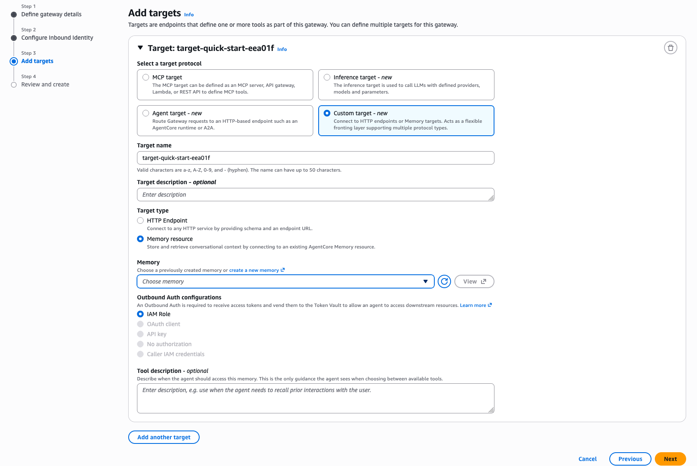

# Create a Memory connector using the console

You can create a gateway and its `agentcore-memory` connector target in the AWS Management Console. Use the console when you prefer a guided setup that does not require the AWS CLI or SDK. The console configures the same components described in [Set up a gateway with a Memory connector target](memory-gateway-setup.md "memory-gateway-setup.md"). These are an inbound authorizer for the gateway and a Memory connector target that fronts your Memory resource.

**Prerequisites**

- An AgentCore Memory resource. For more information, see [Create an AgentCore Memory](memory-create-a-memory-store.md "memory-create-a-memory-store.md").
- Permissions to create and configure an AgentCore Gateway. For more information, see [Prerequisites for using the Amazon Bedrock AgentCore gateway service](gateway-prerequisites.md "gateway-prerequisites.md").
- For the `GATEWAY_IAM_ROLE` outbound credential mode, a gateway execution role scoped to only the Memory actions the gateway needs. For more information, see [Outbound credential mode](memory-gateway-connector.md#memory-gateway-connector-outbound "memory-gateway-connector.md#memory-gateway-connector-outbound").
  The **Create gateway** wizard creates both the gateway and its target in the same flow. OAuth (JWT) inbound is the primary fine-grained access control path. For it, provide your OpenID Connect provider’s discovery URL and allowed client IDs. For all available inbound types, see [Inbound and outbound authentication modes](memory-gateway-connector.md#memory-gateway-connector-auth-modes "memory-gateway-connector.md#memory-gateway-connector-auth-modes"). When you use OAuth inbound authentication, `GATEWAY_IAM_ROLE` is the only supported outbound credential mode. In the console, this option is labeled **IAM Role**. For other combinations, see [the compatibility matrix](memory-gateway-connector.md#memory-gateway-connector-compatibility "memory-gateway-connector.md#memory-gateway-connector-compatibility").

**To create the gateway (console)**

1. Open the [Amazon Bedrock AgentCore](https://console.aws.amazon.com/bedrock-agentcore/ "https://console.aws.amazon.com/bedrock-agentcore/") console.
2. In the left navigation pane, choose **Gateways**.
3. Choose **Create gateway**.
4. In the **Gateway details** section, enter a **Name** for the gateway.
5. Under **Permissions**, for **IAM permissions**, choose **Create default role**, or select an existing gateway execution role.
6. Choose **Next**.
7. Under **Configure Inbound Identity**, choose the **Inbound Auth** type, then choose **Next**.

**To add a Memory connector target (console)**

1. Under **Add targets**, for **Select a target protocol**, choose **Custom target**.
2. For **Target name**, enter a name for the target. This name becomes the prefix of every Cedar action ID for the target, so choose a name you are comfortable referencing in access-control policies.
3. For **Target type**, choose **Memory resource**.
4. For **Memory**, choose the Memory resource that this target fronts.
5. For **Outbound Auth configurations**, choose **IAM Role**.
6. Choose **Next**.
7. On the **Review and create** page, review your configuration, then choose **Create gateway**.
   Gateway and target creation is asynchronous. Wait until the gateway and its target reach the **Ready** status before you send traffic. To enforce per-caller isolation, attach a policy engine and add fine-grained access control policies. For the full procedure and Memory-specific policy examples, see [Fine-grained access control for Memory](memory-gateway-fgac.md "memory-gateway-fgac.md").
