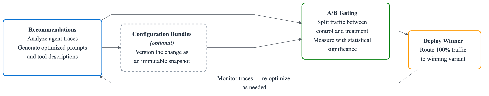

# AgentCore optimization: improve agent quality loop with recommendations and A/B tests

###### Note

AgentCore optimization is in public preview. Features and APIs may change before general availability. There is no separate charge for AgentCore optimization. You pay only for the underlying AgentCore capabilities you use. For details, see the [AgentCore pricing page](https://aws.amazon.com/bedrock/agentcore/pricing/ "https://aws.amazon.com/bedrock/agentcore/pricing/").

###### Important

Amazon Bedrock AgentCore optimization is in preview release and does not support AWS CloudTrail. API calls to these features do not appear in your CloudTrail event history or configured trails; support will be added shortly. Other AWS service events in your account are not affected. Do not use these features for workloads that require a CloudTrail audit trail until support is added.

Amazon Bedrock AgentCore optimization provides tools to continuously improve your agent’s performance through data-driven configuration changes. Instead of manually rewriting prompts and testing by hand, you use agent traces to generate improvements and validate them with controlled experiments.

AgentCore optimization builds on [AgentCore Evaluations](evaluations.md "evaluations.md") and introduces three capabilities:

- **Recommendations:** AI-generated improvements to system prompts and tool descriptions based on real agent traces and a target evaluator. The service analyzes failure patterns based on the target evaluator and produces an optimized variant of the system prompt or tool descriptions.
- **Configuration bundles:** Versioned, immutable snapshots of agent configuration (system prompts, model IDs, tool descriptions) that decouple agent behavior from code, enabling behavioral changes without requiring redeployment. Configuration bundles are optional; you can also validate changes by deploying to a separate runtime endpoint.
- **A/B testing:** Controlled traffic splitting between two variants through AgentCore Gateway, with online evaluation scoring for each session and reporting statistical significance. Variants can be different configuration bundle versions on the same runtime, or different gateway targets pointing to different runtime endpoints.
  Together, these capabilities form a continuous improvement loop:

###### Topics

- [How it works](optimization-how-it-works.md "optimization-how-it-works.md")
- [Prerequisites](optimization-prereqs.md "optimization-prereqs.md")
- [Configuration bundles](configuration-bundles.md "configuration-bundles.md")
- [Recommendations](optimization-recommendations.md "optimization-recommendations.md")
- [A/B testing](ab-testing.md "ab-testing.md")
