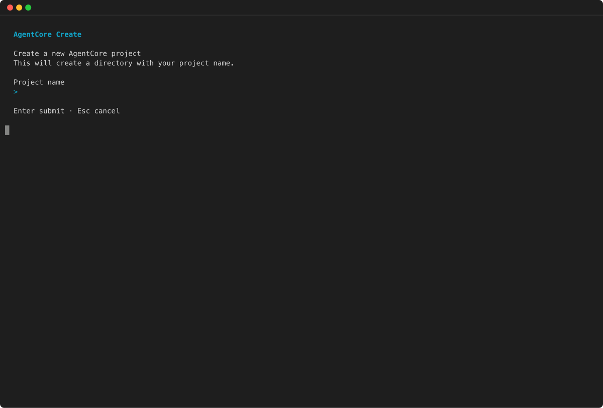
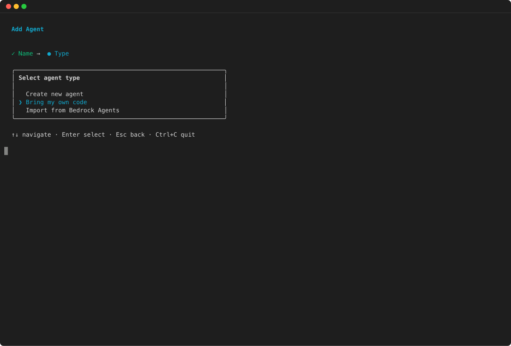
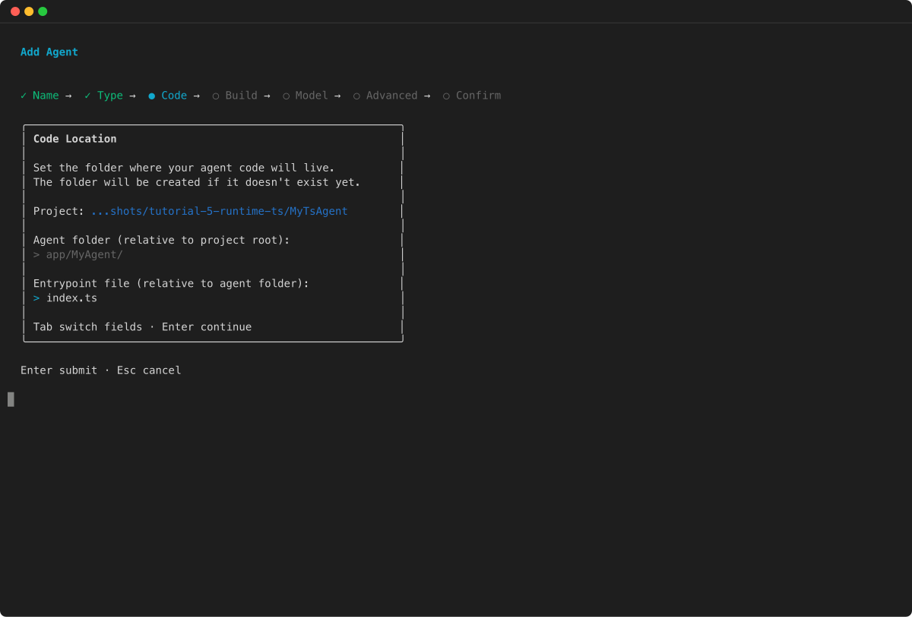
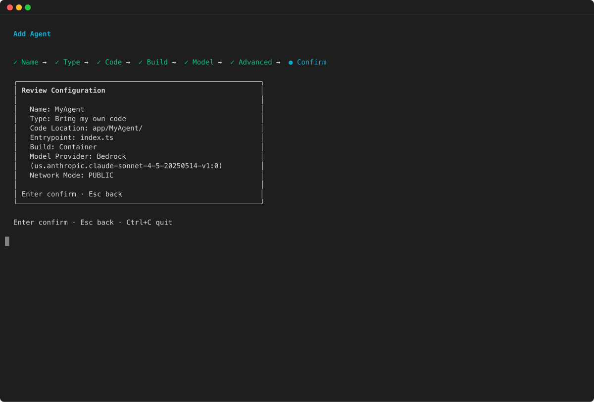
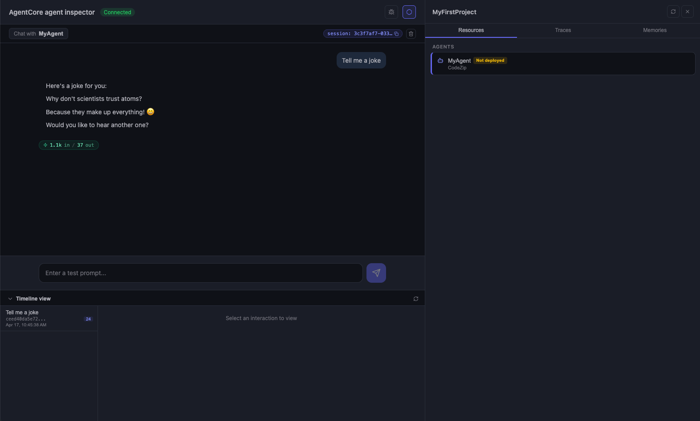
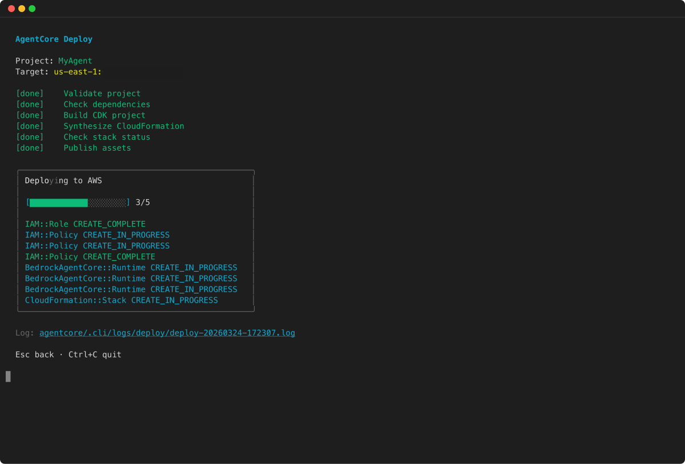
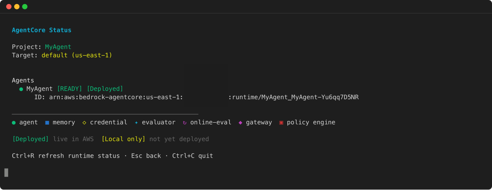
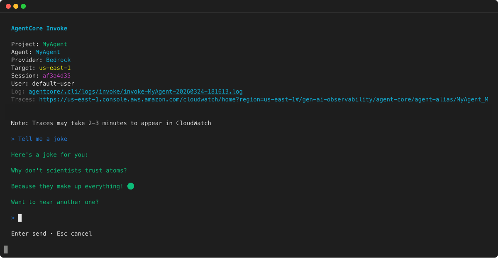
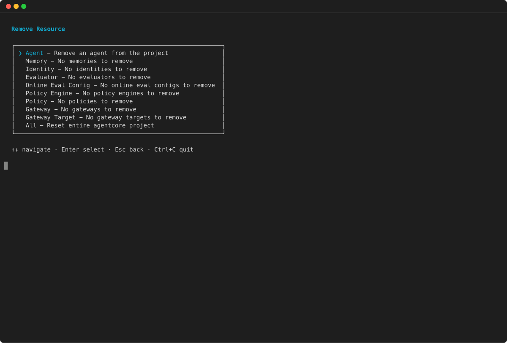

# Get started with the AgentCore CLI in TypeScript

This tutorial shows you how to use the AgentCore CLI ( [agentcore-cli](https://github.com/aws/agentcore-cli "https://github.com/aws/agentcore-cli") ) to deploy a TypeScript agent to an Amazon Bedrock AgentCore Runtime.

The AgentCore CLI is a command-line tool that you can use to create, develop, and deploy AI agents to an Amazon Bedrock AgentCore Runtime. This tutorial shows you how to create and deploy a TypeScript agent using the [bedrock-agentcore](https://www.npmjs.com/package/bedrock-agentcore "https://www.npmjs.com/package/bedrock-agentcore") SDK.

For information about the HTTP protocol that the agent uses, see [HTTP protocol contract](runtime-http-protocol-contract.md "runtime-http-protocol-contract.md").

###### Topics

- [Prerequisites](#ts-prerequisites "#ts-prerequisites")
- [Step 1: Install the AgentCore CLI and create a project](#ts-setup-project "#ts-setup-project")
- [Step 2: Create your TypeScript agent](#ts-create-agent "#ts-create-agent")
- [Step 3: Review your project configuration](#ts-configure-agent "#ts-configure-agent")
- [Step 4: Test your agent locally](#ts-test-locally "#ts-test-locally")
- [Step 5: Enable observability for your agent](#ts-enable-observability "#ts-enable-observability")
- [Step 6: Deploy to Amazon Bedrock AgentCore Runtime](#ts-deploy-runtime "#ts-deploy-runtime")
- [Step 7: Test your deployed agent](#ts-test-deployed-agent "#ts-test-deployed-agent")
- [Step 8: Invoke your agent programmatically](#ts-invoke-programmatically "#ts-invoke-programmatically")
- [Step 9: Stop session or clean up](#ts-stop-session-or-clean-up "#ts-stop-session-or-clean-up")
- [Find your resources](#ts-find-resources "#ts-find-resources")
- [Common issues and solutions](#ts-common-issues "#ts-common-issues")
- [Advanced: Streaming responses](#ts-streaming-responses "#ts-streaming-responses")

## Prerequisites

Before you start, make sure you have:

- **AWS Account** with credentials configured. To configure your AWS credentials, see [Configuration and credential file settings in the AWS CLI.](../../../cli/latest/userguide/cli-configure-files.md "../../../cli/latest/userguide/cli-configure-files.md")
- **Node.js 20+** installed
- **Docker** (or [Podman](https://podman.io "https://podman.io") or [Finch](https://runfinch.com "https://runfinch.com") ) installed. A container runtime is required for building and testing your TypeScript agent locally. A local container runtime is not required for `agentcore deploy` because AWS CodeBuild builds the image remotely.
- **AWS Permissions** : To create and deploy an agent with the AgentCore CLI, you must have appropriate permissions. For information, see [Use the AgentCore CLI](runtime-permissions.md#runtime-permissions-cli "runtime-permissions.md#runtime-permissions-cli").
- **Model access** : If your agent uses Amazon Bedrock models, ensure the required models are [enabled](../../../bedrock/latest/userguide/model-access-modify.md "../../../bedrock/latest/userguide/model-access-modify.md") in the Amazon Bedrock console.

## Step 1: Install the AgentCore CLI and create a project

Install the AgentCore CLI globally:

```
npm install -g @aws/agentcore
```

Verify installation:

```
agentcore --help
```

To deploy a TypeScript agent, use container-based deployment. Create a project without a default agent. You will add a TypeScript container agent in the next step.

###### Example

AgentCore CLI

1. ```
   agentcore create --name MyTsAgent --no-agent
   ```

```


Interactive

1. Run `agentcore create` without flags to launch the interactive wizard. Select "No" when asked to add an agent — you will add a TypeScript container agent in the next step:


```

agentcore create

```





This command creates a project directory with the following structure:


```

MyTsAgent/
agentcore/
agentcore.json
aws-targets.json

```

Change into the project directory:


```

cd MyTsAgent

````

## Step 2: Create your TypeScript agent


This tutorial uses the [Strands Agents](https://strandsagents.com/latest/ "https://strandsagents.com/latest/") framework, which is currently the supported framework for TypeScript agents deployed to AgentCore Runtime.


Add a TypeScript agent to your project using the bring-your-own-code (BYO) workflow with container-based deployment:


###### Example


AgentCore CLI

1. ```
agentcore add agent --name TsAgent --type byo --build Container --language TypeScript --framework Strands --model-provider Bedrock --code-location app/TsAgent
````

Interactive

1. Run `agentcore add agent` to launch the interactive wizard. Select **Bring my own code** as the agent type:

```
agentcore add agent
```

2. Select **Bring my own code** as the agent type:

 3. Set the code location for your agent:

 4. Review the configuration and confirm:



This command registers a TypeScript agent in `agentcore/agentcore.json` and creates a code directory for your agent at `app/TsAgent/`.

Initialize the TypeScript project inside the agent code directory:

```
cd app/TsAgent
npm init -y
```

Install the required packages:

- **bedrock-agentcore** - The Amazon Bedrock AgentCore SDK for building AI agents in TypeScript
- **@strands-agents/sdk** - The [Strands Agents](https://strandsagents.com/latest/ "https://strandsagents.com/latest/") SDK
- **@opentelemetry/auto-instrumentations-node** - OpenTelemetry instrumentation for observability
- **typescript** - TypeScript compiler

```
npm install bedrock-agentcore @strands-agents/sdk @opentelemetry/auto-instrumentations-node --legacy-peer-deps
npm install --save-dev typescript @types/node tsx
```

###### Note

The `--legacy-peer-deps` flag resolves peer dependency conflicts between `@strands-agents/sdk` and `@opentelemetry/auto-instrumentations-node` . This is safe and does not affect runtime behavior.

Create a `tsconfig.json` file with the following content:

```
{
  "compilerOptions": {
    "target": "ES2022",
    "module": "NodeNext",
    "moduleResolution": "NodeNext",
    "outDir": "./dist",
    "rootDir": ".",
    "strict": true,
    "esModuleInterop": true,
    "skipLibCheck": true,
    "declaration": true
  },
  "include": ["*.ts"],
  "exclude": ["node_modules", "dist"]
}
```

Update your `package.json` to add the required configuration:

```
{
  "name": "ts-agent",
  "version": "1.0.0",
  "type": "module",
  "main": "dist/agent.js",
  "scripts": {
    "build": "tsc",
    "start": "node dist/agent.js",
    "dev": "npx tsx --watch agent.ts"
  },
  "engines": {
    "node": ">=20.0.0"
  },
  "dependencies": {
    "bedrock-agentcore": "^0.2.0",
    "@strands-agents/sdk": "^0.1.5",
    "@opentelemetry/auto-instrumentations-node": "^0.56.0"
  },
  "devDependencies": {
    "@types/node": "^22.0.0",
    "typescript": "^5.5.0",
    "tsx": "^4.0.0"
  }
}
```

Create an `agent.ts` file with your agent code:

```
import { BedrockAgentCoreApp } from 'bedrock-agentcore/runtime';
import { Agent } from '@strands-agents/sdk';

// Create a Strands agent
const agent = new Agent();

// Create and start the server
const app = new BedrockAgentCoreApp({
  invocationHandler: {
    process: async (payload, context) => {
      const prompt = (payload as { prompt?: string }).prompt ?? 'Hello!';
      console.log(`Session ${context.sessionId} - Received prompt:`, prompt);

      const result = await agent.invoke(prompt);
      return result;
    }
  }
});

app.run();
```

Create a `Dockerfile` in the `app/TsAgent/` directory. Container-based deployment uses a multi-stage Docker build: the builder stage compiles TypeScript to JavaScript, and the production stage runs only the compiled output. The image runs as a non-root user for security, and exposes port 8080 (HTTP), port 8000 (MCP), and port 9000 (A2A). OpenTelemetry instrumentation is included automatically at startup.

```
FROM node:20-slim AS builder

WORKDIR /app
COPY package*.json ./
RUN npm ci
COPY ..
RUN npm run build

FROM node:20-slim
WORKDIR /app
COPY --from=builder /app/dist ./dist
COPY --from=builder /app/node_modules ./node_modules
COPY --from=builder /app/package*.json ./

RUN useradd -m -u 1000 bedrock_agentcore
USER bedrock_agentcore

EXPOSE 8080 8000 9000
CMD ["node", "--require", "@opentelemetry/auto-instrumentations-node/register", "dist/agent.js"]
```

Create a `.dockerignore` file to exclude unnecessary files from the Docker build context:

```
node_modules
dist
.git
*.log
```

Build locally to verify that your TypeScript code compiles. The container build will also run this step during deployment.

```
npm run build
```

Return to the project root directory:

```
cd ../..
```

## Step 3: Review your project configuration

The `agentcore create` and `agentcore add agent` commands generated the configuration files for your project. Open `agentcore/agentcore.json` to review the configuration:

```
{
  "name": "MyTsAgent",
  "version": 1,
  "agents": [
    {
      "type": "AgentCoreRuntime",
      "name": "TsAgent",
      "build": "Container",
      "entrypoint": "main.py",
      "codeLocation": "app/TsAgent/",
      "runtimeVersion": "PYTHON_3_12",
      "protocol": "HTTP",
      "networkMode": "PUBLIC"
    }
  ]
}
```

###### Note

For container-based deployments, the `runtimeVersion` and `entrypoint` fields are present in the configuration but are not used at deployment time. The container image (via its `Dockerfile CMD` ) defines the actual runtime and entrypoint. The CLI sets these to Python defaults regardless of language.

You can also review your deployment target in `agentcore/aws-targets.json` :

```
[]
```

Before deploying, you must configure at least one deployment target. Open `agentcore/aws-targets.json` and add your AWS account and Region:

```
[
  {
    "name": "default",
    "account": "123456789012",
    "region": "us-west-2"
  }
]
```

Replace `123456789012` with your AWS account ID and update the Region as needed.

To validate that your configuration is correct, run:

```
agentcore validate
```

## Step 4: Test your agent locally

Before deploying to AWS, test your agent locally using the development server:

###### Example

AgentCore CLI

1. ```
   agentcore dev
   ```

```

If your project has multiple runtimes, use `--runtime` to start a specific runtime directly:


```

agentcore dev --runtime TsAgent

```

In a separate terminal, invoke your agent against the local dev server:


```

agentcore dev "Hello, tell me a joke"

```


Interactive

1. Run `agentcore` to open the TUI home screen, then select **dev** to start the local development server:


```

agentcore

```





* Opens agent inspector in your web browser
* For container agents, this command builds the Docker image and runs the container locally with your source directory mounted for hot reload. Your AWS credentials are forwarded automatically to the container.
* The server runs on `http://localhost:8080` by default. Use the `--port` flag to specify a different port.

To view server logs in real time (non-interactive mode), use the `--logs` flag:


```

agentcore dev --logs

```

###### Note

If your project has multiple runtimes, `agentcore dev` opens an interactive selection menu. Use `agentcore dev --runtime TsAgent` to skip the menu and start a specific runtime directly.


## Step 5: Enable observability for your agent


[Amazon Bedrock AgentCore Observability](observability.md "observability.md") helps you trace, debug, and monitor agents that you host in Amazon Bedrock AgentCore Runtime. First enable CloudWatch Transaction Search by following the instructions at [Enabling Amazon Bedrock AgentCore runtime observability](observability-configure.md#observability-configure-builtin "observability-configure.md#observability-configure-builtin") . To observe your agent, see [View observability data for your Amazon Bedrock AgentCore agents](observability-view.md "observability-view.md").


After deploying your agent, you can stream logs and view traces using the AgentCore CLI:


```

agentcore logs --runtime TsAgent --since 1h

```


```

agentcore traces list --runtime TsAgent

````

## Step 6: Deploy to Amazon Bedrock AgentCore Runtime


Deploy your agent to AgentCore Runtime:


###### Example


AgentCore CLI

1. ```
agentcore deploy
````

Interactive

1. Run `agentcore deploy` to start deployment. The CLI shows the deployment progress as it builds and deploys your project:

```
agentcore deploy
```



You can preview the deployment before confirming by using the `--plan` flag:

```
agentcore deploy --plan
```

The `agentcore deploy` command:

- Builds your container image using AWS CodeBuild and pushes it to Amazon ECR
- Creates necessary AWS resources (IAM roles, ECR repository, etc.) using AWS CDK
- Deploys your agent to Amazon Bedrock AgentCore Runtime
- Configures CloudWatch logging

In the output from `agentcore deploy` note the following:

- The Amazon Resource Name (ARN) of the agent. You need it to invoke the agent with the [InvokeAgentRuntime](../APIReference/API_InvokeAgentRuntime.md "../APIReference/API_InvokeAgentRuntime.md") operation.
- The location of the logs in Amazon CloudWatch Logs

To check the status of your deployed resources, run:

###### Example

AgentCore CLI

1. ```
   agentcore status
   ```

```


Interactive

1. Run `agentcore` to open the TUI home screen, then select the status option to view your deployed resources dashboard:


```

agentcore

````





If the deployment fails check for [common issues](#ts-common-issues "#ts-common-issues").


## Step 7: Test your deployed agent


Test your deployed agent:


###### Example


AgentCore CLI

1. ```
agentcore invoke "tell me a joke"
````

To stream the response in real time, use the `--stream` flag:

```
agentcore invoke --stream "tell me a joke"
```

Interactive

1. Run `agentcore` to open the TUI home screen, then select the invoke option to chat with your deployed agent:

```
agentcore
```



If you see a response, your agent is now running in an Amazon Bedrock AgentCore Runtime and can be invoked. If not, check for [common issues](#ts-common-issues "#ts-common-issues").

## Step 8: Invoke your agent programmatically

You can invoke the agent using the AWS SDK [InvokeAgentRuntime](../APIReference/API_InvokeAgentRuntime.md "../APIReference/API_InvokeAgentRuntime.md") operation. To call `InvokeAgentRuntime` , you need the ARN of the agent that you noted in Step 6. You can also find the ARN by running `agentcore status`.

Create a file named `invoke-agent.ts` and add the following code:

```
import {
  BedrockAgentCoreClient,
  InvokeAgentRuntimeCommand
} from '@aws-sdk/client-bedrock-agentcore';
import { randomUUID } from 'crypto';

const agentArn = 'Agent ARN';
const prompt = 'Tell me a joke';

// Initialize the Amazon Bedrock AgentCore client
const client = new BedrockAgentCoreClient({ region: 'us-west-2' });

// Invoke the agent
const command = new InvokeAgentRuntimeCommand({
  agentRuntimeArn: agentArn,
  runtimeSessionId: randomUUID(),
  payload: JSON.stringify({ prompt }),
  contentType: 'application/json',
  qualifier: 'DEFAULT',
});

const response = await client.send(command);
const textResponse = await response.response?.transformToString();

console.log('Response:', textResponse);
```

Run the code with the following command:

```
npx tsx invoke-agent.ts
```

If successful, you should see a response from your agent. If the call fails, check the logs that you noted in [Step 6: Deploy to Amazon Bedrock AgentCore Runtime](#ts-deploy-runtime "#ts-deploy-runtime").

###### Note

If you plan on integrating your agent with OAuth, you can’t use the AWS SDK to call `InvokeAgentRuntime` . Instead, make a HTTPS request to `InvokeAgentRuntime` . For more information, see [Authenticate and authorize with Inbound Auth and Outbound Auth](runtime-oauth.md "runtime-oauth.md").

## Step 9: Stop session or clean up

To stop the running session before the configurable `IdleRuntimeSessionTimeout` (defaulted at 15 minutes) and save on any potential runaway costs, execute: `StopRuntimeSession`

Create a file named `stop-runtime-session.ts` with the following content:

**Example**

```
import {
  BedrockAgentCoreClient,
  StopRuntimeSessionCommand
} from '@aws-sdk/client-bedrock-agentcore';
import { randomUUID } from 'crypto';

const client = new BedrockAgentCoreClient({ region: 'us-west-2' });
const agentArn = 'Agent ARN';
const command = new StopRuntimeSessionCommand({
  agentRuntimeArn: agentArn,
  runtimeSessionId: randomUUID(),
  qualifier: 'DEFAULT',
});

const response = await client.send(command);
console.log('Session stopped:', response);
```

Run the code with the following command:

```
npx tsx stop-runtime-session.ts
```

If you no longer want to host the agent in the AgentCore Runtime, remove all resources from your project configuration and then deploy to tear down the AWS resources:

###### Example

AgentCore CLI

1. ```
   agentcore remove all --yes
   agentcore deploy
   ```

```


Interactive

1. Run `agentcore` to open the TUI home screen, then select the remove option to choose which resources to remove:


```

agentcore

```





## Find your resources


After deployment, view your resources in the AWS Console:


| Resource | Location |
| --- | --- |
| **Agent Logs** | CloudWatch → Log groups → `/aws/bedrock-agentcore/runtimes/{agent-id}-DEFAULT` |
| **Container Image** | Amazon ECR → Repositories → Search for your agent name |
| **Deployed Status** | Run `agentcore status` to see all deployed resources |
| **IAM Role** | IAM → Roles → Search for "BedrockAgentCore" |


## Common issues and solutions


Common issues and solutions when getting started with the AgentCore CLI for TypeScript. For more troubleshooting information, see [Troubleshoot Amazon Bedrock AgentCore Runtime](runtime-troubleshooting.md "runtime-troubleshooting.md").


**Container runtime not found**


Install Docker, Podman, or Finch. For Docker, ensure Docker Desktop is running. Verify your container runtime is available by running `docker info` (or the equivalent command for your container runtime).


**Dockerfile not found**


Ensure a `Dockerfile` exists in your agent’s code directory (for example, `app/TsAgent/Dockerfile` ). The container build requires a Dockerfile in the directory specified by `codeLocation` in `agentcore/agentcore.json`.


**Container image exceeds size limit**


Use multi-stage builds to reduce the final image size, minimize installed packages, and review your `.dockerignore` file to exclude unnecessary files from the build context.


**Permission denied errors**


Verify your AWS credentials and permissions:


* Verify AWS credentials: `aws sts get-caller-identity`
* Check you have the required policies attached
* Review caller permissions policy for detailed requirements


**TypeScript compilation errors**


Ensure your TypeScript configuration is correct:


* Verify `tsconfig.json` exists and has correct settings
* Run `npm run build` locally to check for errors
* Ensure `"type": "module"` is set in `package.json`


**Configuration validation errors**


Check your project configuration:


* Run `agentcore validate` to check for configuration errors
* Verify `agentcore/agentcore.json` has the correct agent entry
* Ensure `codeLocation` points to the correct directory


**Port 8080 in use (local only)**


Find and stop processes that are using port 8080:


Use `lsof -ti:8080` to get a list of process using port 8080.


Use `kill -9 PID` to stop the process. Replace `PID` with the process ID.


Alternatively, start the dev server on a different port: `agentcore dev --port 3000`


**Region mismatch**


Verify the AWS Region with `aws configure get region` and make sure the region in `agentcore/aws-targets.json` matches


**Module not found errors**


Ensure your imports use the correct paths:


* Use `bedrock-agentcore/runtime` for the runtime module
* Run `npm install` to ensure all dependencies are installed


## Advanced: Streaming responses


Your TypeScript agent can return streaming responses using async generators. This is useful for long-running operations or when you want to provide incremental updates to the client:


```

import { BedrockAgentCoreApp } from 'bedrock-agentcore/runtime';

// Streaming handler using async generator
const streamingHandler = async function\* (request: unknown, context: { sessionId: string }) {
yield { event: 'start', sessionId: context.sessionId };

// Simulate processing steps
for (let i = 0; i < 5; i++) {
yield {
event: 'progress',
step: i + 1,
data: `Processing step ${i + 1}`,
};
}

yield { event: 'complete', result: 'done' };
};

const app = new BedrockAgentCoreApp({
invocationHandler: { process: streamingHandler },
});

app.run();

```

The server automatically handles streaming responses using Server-Sent Events (SSE).
```
