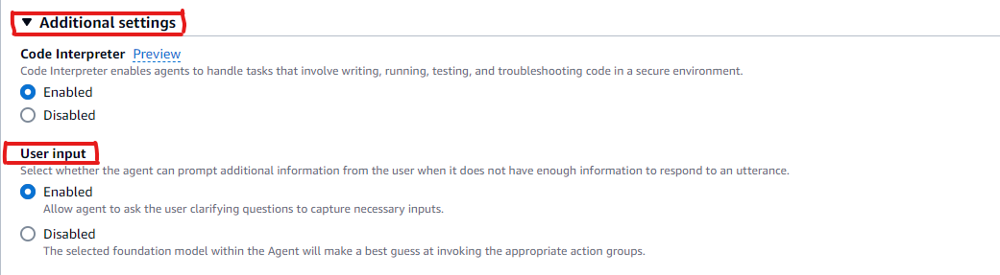

# Enable user input in Amazon Bedrock

If user input is enabled, agent reprompts the user for information about the missing parameters.

You can enable user input in the Amazon Bedrock console when you [create](agents-create.md "agents-create.md")
or [modify](agents-manage.md#agents-edit "agents-manage.md#agents-edit") your agent.
If you are using API or SDKs, you can enable user input when you [create](../APIReference/API_agent_CreateAgentActionGroup.md "../APIReference/API_agent_CreateAgentActionGroup.md")
or [update](../APIReference/API_agent_UpdateAgentActionGroup.md "../APIReference/API_agent_UpdateAgentActionGroup.md") action group.

To learn how to enable user input in Amazon Bedrock, choose the tab for your preferred method, and then follow the steps:

Console

###### To enable user input for your agent

1. If you're not already in the agent builder, do the following:
   1. Sign in to the AWS Management Console with an IAM identity that has permissions to use the Amazon Bedrock console. Then, open the Amazon Bedrock console at
      [https://console.aws.amazon.com/bedrock](https://console.aws.amazon.com/bedrock "https://console.aws.amazon.com/bedrock").
   2. Select **Agents** from the left navigation pane. Then, choose an agent in the **Agents** section.
   3. Choose **Edit in Agent Builder**

2. Go to **Additional settings** and expand the section.
3. For **User input**, select **Enabled**.

 4. Make sure to first **Save** and then **Prepare** to apply the changes you have made to the agent before testing it.

API
To enable user input for your agent, send an [CreateActionGroup](../APIReference/API_agent_CreateAgentActionGroup.md "../APIReference/API_agent_CreateAgentActionGroup.md")
request (see link for request and response formats and field details) with an [Agents for Amazon Bedrock build-time endpoint](../../../general/latest/gr/bedrock.md#bra-bt "../../../general/latest/gr/bedrock.md#bra-bt") and specify the following fields:

| Field                      | Short description                                                                  |
| -------------------------- | ---------------------------------------------------------------------------------- | --------------------------------------------------------------------------------------------------------------------------------------------------------------------------------------------------------------------------------------------------------------------------------------------------------------------------------------------------------------------------------------- |
| actionGroupName            | Name of the action group                                                           |
| parentActionGroupSignature | Specify `AMAZON.UserInput` to allow the agent to request information from the user |
| actionGroupState           | Specify `ENABLED` to allow the agent to request information from user              | The following shows the general format of the required fields for enabling user input with an [CreateActionGroup](../APIReference/API_agent_CreateAgentActionGroup.md "../APIReference/API_agent_CreateAgentActionGroup.md") request. `CreateAgentActionGroup: { "actionGroupName": "AskUserAction", "parentActionGroupSignature": "AMAZON.UserInput", "actionGroupState": "ENABLED" }` |
