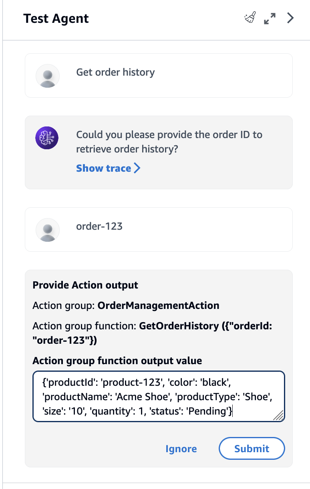

# Test and troubleshoot agent behavior

After you create an agent, you will have a _working
draft_. The working draft is a version of the agent that you can use to
iteratively build the agent. Each time you make changes to your agent, the working draft is
updated. When you're satisfied with your agent's configurations, you can create a _version_, which is a snapshot of your agent, and an _alias_, which points to the version. You can then deploy your
agent to your applications by calling the alias. For more information, see [Deploy and use an Amazon Bedrock agent in your application](agents-deploy.md "agents-deploy.md").

The following list describes how you test your agent:

- In the Amazon Bedrock console, you open up the test window on the side and send input for
  your agent to respond to. You can select the working draft or a version that you've
  created.
- In the API, the working draft is the `DRAFT` version. You send input to
  your agent by using [InvokeAgent](../APIReference/API_agent-runtime_InvokeAgent.md "../APIReference/API_agent-runtime_InvokeAgent.md") with the test alias, `TSTALIASID`, or a
  different alias pointing to a static version. Before you can test your agent, you
  must prepare your agent by calling [PrepareAgent](../APIReference/API_agent_PrepareAgent.md "../APIReference/API_agent_PrepareAgent.md").

## Tracing agent behavior

To help troubleshoot your agent's behavior, Amazon Bedrock Agents provides the ability to view the _trace_ during a session with your agent. The trace shows the agent's step-by-step reasoning process. For more information about the trace, see [Track agent's step-by-step reasoning process using trace](trace-events.md "trace-events.md").

## Test your agent

Following are steps for testing your agent. Choose the tab for your preferred method, and then follow the steps:

Console

###### To test an agent

1. Sign in to the AWS Management Console with an IAM identity that has permissions to use the Amazon Bedrock console. Then, open the Amazon Bedrock console at
   [https://console.aws.amazon.com/bedrock](https://console.aws.amazon.com/bedrock "https://console.aws.amazon.com/bedrock").
2. Select **Agents** from the left navigation pane. Then, choose an agent in the **Agents** section.
3. In the **Agents** section, select the link for
   the agent that you want to test from the list of agents.
4. The **Test** window appears in a pane on the
   right.

###### Note

If the **Test window** is closed, you can
reopen it by selecting **Test** at the top of
the agent details page or any page within it. 5. After you create an agent, you must package it with the working
draft changes by preparing it in one of the following ways:

    * In the **Test** window, select
     **Prepare**.
    * In the **Working draft** page, select
     **Prepare** at the top of the
     page.###### Note

Every time you update the working draft, you must prepare the
agent to package the agent with your latest changes. As a best
practice, we recommend that you always check your agent's
**Last prepared** time in the
**Agent overview** section of the
**Working draft** page to verify that
you're testing your agent with the latest configurations. 6. To choose an alias and associated version to test, use the
dropdown menu at the top of the **Test window**. By
default, the **TestAlias: Working draft**
combination is selected. 7. (Optional) To select Provisioned Throughput for your alias, the text below the test
alias you selected will indicate **Using ODT** or
**Using PT**. To create a Provisioned
Throughput model, select **Change**. For more
information, see [Increase model invocation capacity with Provisioned Throughput in Amazon Bedrock](prov-throughput.md "prov-throughput.md"). 8. (Optional) To use a prompt from Prompt management, select the options icon
(


) in the message box and choose **Import
prompt**. Select the prompt and version. Enter values
for the prompt variables in the **Test variable
values** section. For more information about prompts in
Prompt management, see [Construct and store reusable prompts with Prompt management in Amazon Bedrock](prompt-management.md "prompt-management.md"). 9. To test the agent, enter a message and choose
**Run**. While you wait for the response to
generate or after it is generated, you have the following
options:

    * To view details for each step of the agent's orchestration
     process, including the prompt, inference configurations, and
     agent's reasoning process for each step and usage of its
     action groups and knowledge bases, select **Show
     trace**. The trace is updated in real-time so
     you can view it before the response is returned. To expand
     or collapse the trace for a step, select an arrow next to a
     step. For more information about the
     **Trace** window and details that
     appear, see [Track agent's step-by-step reasoning process using trace](trace-events.md "trace-events.md").
    * If the agent invokes a knowledge base, the response
     contains footnotes. To view the link to the S3 object
     containing the cited information for a specific part of the
     response, select the relevant footnote.
    * If you set your agent to return control rather than using
     a Lambda function to handle the action group, the response
     contains the predicted action and its parameters. Provide an
     example output value from the API or function for the action
     and then choose **Submit** to generate an
     agent response. See the following image for an
     example:


    

You can perform the following actions in the
**Test** window:

    * To start a new conversation with the agent, select the
     refresh icon.
    * To view the **Trace** window, select the
     expand icon. To close the **Trace** window,
     select the shrink icon.
    * To close the **Test** window, select the
     right arrow icon.

You can enable or disable action groups and knowledge bases. Use this
feature to troubleshoot your agent by isolating which action groups or
knowledge bases need to be updated by assessing its behavior with different
settings.

###### To enable an action group or knowledge base

1. Sign in to the AWS Management Console with an IAM identity that has permissions to use the Amazon Bedrock console. Then, open the Amazon Bedrock console at
   [https://console.aws.amazon.com/bedrock](https://console.aws.amazon.com/bedrock "https://console.aws.amazon.com/bedrock").
2. Select **Agents** from the left navigation pane. Then, choose an agent in the **Agents** section.
3. In the **Agents** section. select the link for
   the agent that you want to test from the list of agents.
4. On the agent's details page, in the **Working
   draft** section, select the link for the
   **Working draft**.
5. In the **Action groups** or **Knowledge
   bases** section, hover over the
   **State** of the action group or knowledge base
   whose state you want to change.
6. An edit button appears. Select the edit icon and then choose from
   the dropdown menu whether the action group or knowledge base is
   **Enabled** or
   **Disabled**.
7. If an action group is **Disabled**, the agent
   doesn't use the action group. If a knowledge base is
   **Disabled**, the agent doesn't use the
   knowledge base. Enable or disable action groups or knowledge bases
   and then use the **Test** window to troubleshoot
   your agent.
8. Choose **Prepare** to apply the changes that you
   have made to the agent before testing it.

API
For agents that are created `after` March 31, 2025:

- If you've created your agent in the console, streaming is enabled
  by default. You can disable streaming anytime.
- Ensure the Agent execution role includes the
  `bedrock:InvokeModelWithResponseStream` permission
  for the configured agent model.

Before you test your agent for the first time, you must package it with
the working draft changes by sending a [PrepareAgent](../APIReference/API_agent_PrepareAgent.md "../APIReference/API_agent_PrepareAgent.md") request with an [Agents for Amazon Bedrock build-time endpoint](../../../general/latest/gr/bedrock.md#bra-bt "../../../general/latest/gr/bedrock.md#bra-bt").
Include the `agentId` in the request. The changes apply to the
`DRAFT` version, which the `TSTALIASID` alias
points to.

```
    def prepare_agent(self, agent_id):
        """
        Creates a DRAFT version of the agent that can be used for internal testing.

        :param agent_id: The unique identifier of the agent to prepare.
        :return: The response from Amazon Bedrock Agents if successful, otherwise raises an exception.
        """
        try:
            prepared_agent_details = self.client.prepare_agent(agentId=agent_id)
        except ClientError as e:
            logger.error(f"Couldn't prepare agent. {e}")
            raise
        else:
            return prepared_agent_details


```

For more information, see [Hello Amazon Bedrock Agents](bedrock-agent_example_bedrock-agent_Hello_section.md "bedrock-agent_example_bedrock-agent_Hello_section.md").

###### Note

Every time you update the working draft, you must prepare the agent to
package the agent with your latest changes. As a best practice, we
recommend that you send a [GetAgent](../APIReference/API_agent_GetAgent.md "../APIReference/API_agent_GetAgent.md") request (see link for request and response formats and field details) with a
[Agents for Amazon Bedrock build-time endpoint](../../../general/latest/gr/bedrock.md#bra-bt "../../../general/latest/gr/bedrock.md#bra-bt") and check the `preparedAt` time for your agent
to verify that you're testing your agent with the latest
configurations.

To test your agent, send an [InvokeAgent](../APIReference/API_agent-runtime_InvokeAgent.md "../APIReference/API_agent-runtime_InvokeAgent.md") request to the agent. For example code, see [Invoke an agent from your application](agents-invoke-agent.md "agents-invoke-agent.md").

###### Note

The AWS CLI doesn't support [InvokeAgent](../APIReference/API_agent-runtime_InvokeAgent.md "../APIReference/API_agent-runtime_InvokeAgent.md").

The following fields exist in the request:

- Minimally, provide the following required fields:

| Field        | Short description                                                  |
| ------------ | ------------------------------------------------------------------ |
| agentId      | ID of the agent                                                    |
| agentAliasId | ID of the alias. Use `TSTALIASID` to<br>invoke the `DRAFT` version |
| sessionId    | Alphanumeric ID for the session (2–100<br>characters)              |
| inputText    | The user prompt to send to the agent                               |

- The following fields are optional:

| Field                   | Short description                                                                                                                                                                                                                   |
| ----------------------- | ----------------------------------------------------------------------------------------------------------------------------------------------------------------------------------------------------------------------------------- |
| enableTrace             | Specify `TRUE` to view the [trace](trace-events.md "trace-events.md").                                                                                                                                                              |
| endSession              | Specify `TRUE` to end the session with<br>the agent after this request.                                                                                                                                                             |
| sessionState            | Includes context that influences the agent's<br>behavior or the behavior of knowledge bases attached<br>to the agent. For more information, see [Control agent session context](agents-session-state.md "agents-session-state.md"). |
| streamingConfigurations | Includes configurations for streaming response.<br>To enable streaming, set<br>`streamFinalResponse` to<br>`TRUE`.                                                                                                                  |

The response is returned in an event stream. Each event contains a
`chunk`, which contains part of the response in the
`bytes` field, which must be decoded. The following objects
may also be returned:

- If the agent queried a knowledge base, the `chunk` also
  includes `citations`.
- If streaming is enabled and guardrail is configured for the agent,
  the response is generated in the character intervals specified for
  the guardrail interval. By default, the interval is set to 50
  characters.
- If you enabled a trace, a `trace` object is also
  returned. If an error occurs, a field is returned with the error
  message. For more information about how to read the trace, see [Track agent's step-by-step reasoning process using trace](trace-events.md "trace-events.md").
- If you set up your action group to skip using a Lambda function, a
  [ReturnControlPayload](../APIReference/API_agent-runtime_ReturnControlPayload.md "../APIReference/API_agent-runtime_ReturnControlPayload.md") object is returned in the `returnControl`
  field. The general structure of the [ReturnControlPayload](../APIReference/API_agent-runtime_ReturnControlPayload.md "../APIReference/API_agent-runtime_ReturnControlPayload.md") object is as
  follows:

```
{
    "invocationId": "string",
    "invocationInputs": [
        ApiInvocationInput or FunctionInvocationInput,
        ...
    ]
}
```

Each member of the `invocationInputs` list is one of
the following:

    + An [ApiInvocationInput](../APIReference/API_agent-runtime_ApiInvocationInput.md "../APIReference/API_agent-runtime_ApiInvocationInput.md") object containing the API operation that the
     agent predicts should be called based on the user input, in
     addition to the parameters and other information that it
     gets from the user to fulfill the API. The structure of the
     [ApiInvocationInput](../APIReference/API_agent-runtime_ApiInvocationInput.md "../APIReference/API_agent-runtime_ApiInvocationInput.md") object is as follows:


    ```
    {
        "actionGroup": "string",
        "apiPath": "string",
        "httpMethod": "string",
        "parameters": [
            {
                "name": "string",
                "type": "string",
                "value": "string"
            },
            ...
        ],
        "requestBody": {
            `<content-type>`: {
                "properties": [
                    {
                        "name": "string",
                        "type": "string",
                        "value": "string"
                    }
                ]
            }
        }
    }
    ```
    + A [FunctionInvocationInput](../APIReference/API_agent-runtime_FunctionInvocationInput.md "../APIReference/API_agent-runtime_FunctionInvocationInput.md") object containing the function that the
     agent predicts should be called based on the user input, in
     addition to the parameters for that function that it gets
     from the user. The structure of the [FunctionInvocationInput](../APIReference/API_agent-runtime_FunctionInvocationInput.md "../APIReference/API_agent-runtime_FunctionInvocationInput.md") is as
     follows:


    ```
    {
        "actionGroup": "string",
        "function": "string",
        "parameters": [
            {
                "name": "string",
                "type": "string",
                "value": "string"
            }
        ]
    }
    ```
