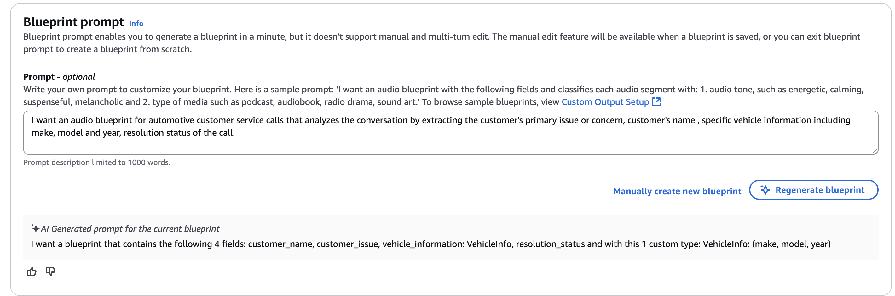
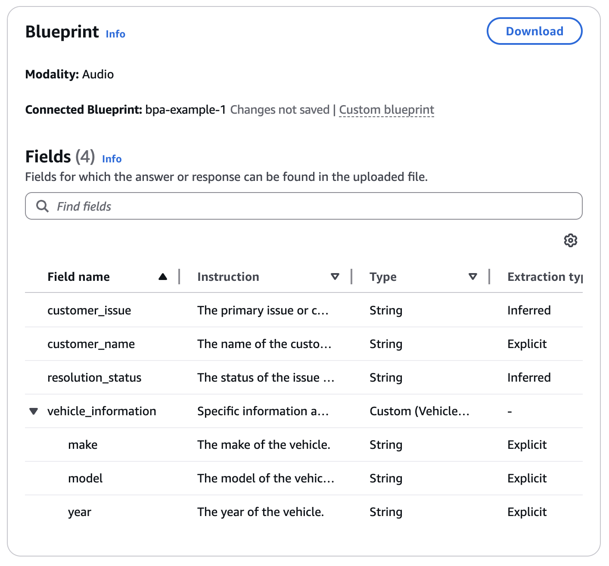
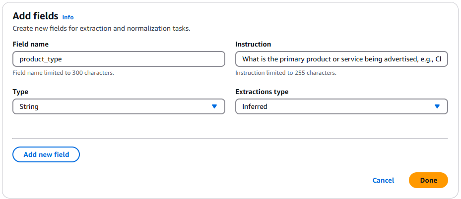

# Creating blueprints

## How to create blueprints for custom outputs

Amazon Bedrock Data Automation (BDA) allows you to create custom blueprints for
any file type BDA can extract. You can use blueprints to define the desired output format and
extraction logic for your input files. By creating custom blueprints, you can tailor BDA's
output to meet your specific requirements.

Within one project, you can apply:

- Multiple document blueprints, up to 40. This allows you to process different types of
  documents within the same project, each with its own custom extraction logic.
- One image blueprint. This ensures consistency in image processing within a
  project.
- One audio blueprint.
- One video blueprint.

### Creating blueprints

There are two methods for creating Blueprints in BDA:

- Using the Blueprint Prompt
- Manual blueprint creation

####

Using the Blueprint Prompt

The Blueprint Prompt provides a guided, natural language-based interface for creating Blueprints.
To create a blueprint using the Prompt:

1. Navigate to the **Blueprints** section in the BDA
   console.
2. Click on **Create Blueprint** and select **Use Blueprint
   Prompt**.
3. Choose the data type (document, image, audio, or video) for your Blueprint.
4. Describe the fields and data you want to extract in natural language.
   For example: "Extract invoice number, total amount, and vendor name from
   invoices."
5. The Prompt will generate a Blueprint based on your
   description.
6. Review the generated Blueprint and make any necessary
   adjustments. Blueprint prompts are single turn based, meaning you will
   have to re-enter all information for altering your prompt, not just new information.
7. Save and name your Blueprint.

##### Blueprint Prompt Example

The following section goes over an example of a blueprint prompt for an audio blueprint. For this use case, we want to create
a blueprint to extract information from a conversation between a customer and a customer service representative. The screenshot
below shows the prompt window on the console.



At the bottom of the screenshot you can see the AI generated prompt based on the input in the box. We can see how the fields we
mention get processed. Next, we can look at the blueprint created from the prompt.



Here we can look at the information we'll expect to process from the conversation. If you're satisfied with the fields, you can
begin processing an audio file immediately. If you want to edit your blueprint, you'll need to create a duplicate as opposed to
editing directly. You can also adjust your prompt for other outcomes.

####

Creating blueprints manually

For more advanced users or those requiring fine-grained control, you can create Blueprints manually:

1. Navigate to the **Blueprints** section in the BDA console.
2. Click on **Create Blueprint** and select **Create Manually.**
3. Choose the data type (document, image, audio, or video) for your Blueprint.
4. Define the fields you want to extract, specifying data types, formats,
   and any validation rules.
5. Configure additional settings such as document splitting or layout
   handling.
6. Save and name your Blueprint.

You can also use the Blueprint JSON editor to create or modify a Blueprint. This allows you to adjust the
JSON of the Blueprint directly via text editor.

### Adding blueprints to projects

Projects serve as containers for your multi-modal content processing workflows, while
Blueprints define the extraction logic for those workflows. You add blueprints to projects
to apply the blueprint to files you process with that project.

To add a Blueprint to a Project:

1. Navigate to the **Projects** section in the BDA console.
2. Select the Project you want to add the Blueprint to.
3. Click on **Add Blueprint** or **Manage Blueprints**.
4. Choose the Blueprint you want to add from the list of available
   Blueprints.
5. Configure any project-specific settings for the Blueprint.
6. Save the changes to your Project.

### Defining Fields

To get started, you can create a field to identify the information you want to extract or
generate, such as product_type. For each field, you need to provide a description, data type,
and inference type.

To define a field, you need to specify the following parameters:

- _Description:_ Provides a natural language explanation of what the
  field represents. This description helps in understanding the context and purpose of the
  field, aiding in the accurate extraction of data.
- _Type:_ Specifies the data type of the field's value. BDA supports
  the following types:
  - string: For text-based values
  - number: For numerical values
  - boolean: For true or false values
  - array: For fields that can have multiple values of the same type (e.g., an array of strings or an array of numbers)

- _Inference Type:_ Instructs BDA on how to handle the response generation of the field's value. For images, BDA only support inferred inference type. This means that BDA infers the field value based on the information present in the image.

For video, fields also contain granularity as an option. For more information on this trait, see Creating blueprints for videos.

The following image shows "Add fields" module in the Amazon Bedrock console with
the following example fields and values:

- Field name: product_type
- Type: String
- Instruction:
  What is the primary product or service being advertised, e.g., Clothing, Electronics,
  Food & Beverage, etc.?
- Extractions type: Inferred.



Here is an example of what that same field definition looks like in a JSON schema, for the
API:

```
"product_type":{
"type": "string",
"inferenceType": "inferred",
"description": "What is the primary product or service being advertised, e.g., Clothing, Electronics, Food & Beverage, etc.?"
}
```

In this example:

- The type is set to string, indicating that the value of the product_type field
  should be text-based.
- The inferenceType is set to inferred, instructing BDA to infer the value based on the information present in the image.
- The description provides additional context, clarifying that the field should identify the
  product type in the image. Example values for product_type field are: clothing, electronics,
  and food or beverage.

By specifying these parameters for each field, you provide BDA with the necessary
information to accurately extract and generate insights from your images.

### Creating project versions

When working with projects, you can create a version
of a blueprint. A version is an immutable snapshot of a blueprint, preserving its
current configurations and extraction logic. This blueprint version can be passed in a
request to start processing data, ensuring that BDA processes documents according to the
logic specified in the blueprint at the time the version was created.

You can create a version using the `CreateBlueprintVersion`
operation.

The Amazon Bedrock console also lets you create and save blueprints. When you save a
blueprint, it an ID is assigned to that blueprint. You can then publish the blueprint,
which creates a snapshot version of that blueprint that can’t be edited. For example, if
the blueprint associated to your project is “DocBlueprint”, the created project version
will be “DocBlueprint_1”. You will not be able to make any more changes to
“DocBlueprint_1”, but you can still edit the base blueprint. If you make changes to the
blueprint and publish again a new version will be created, like “DocBlueprint_2”.
Blueprint versions can be duplicated and used as a base for a new blueprint.
