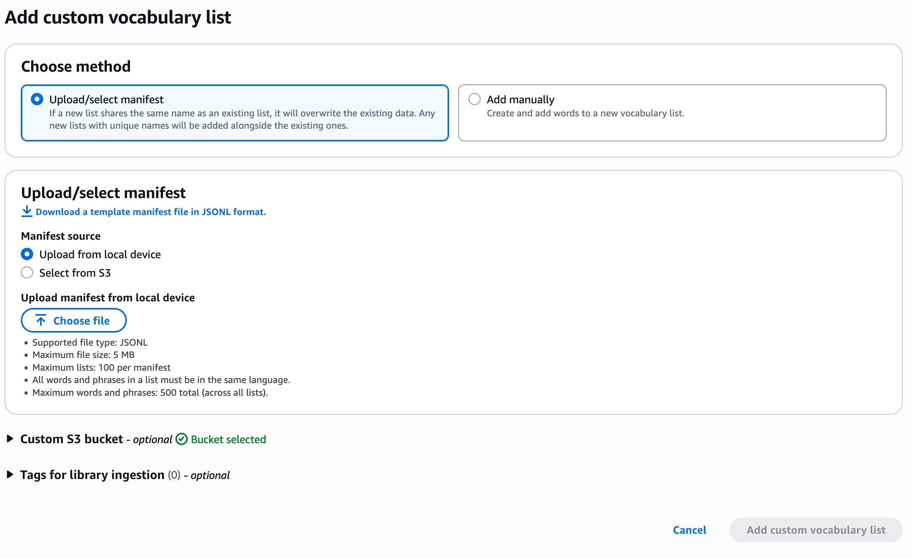
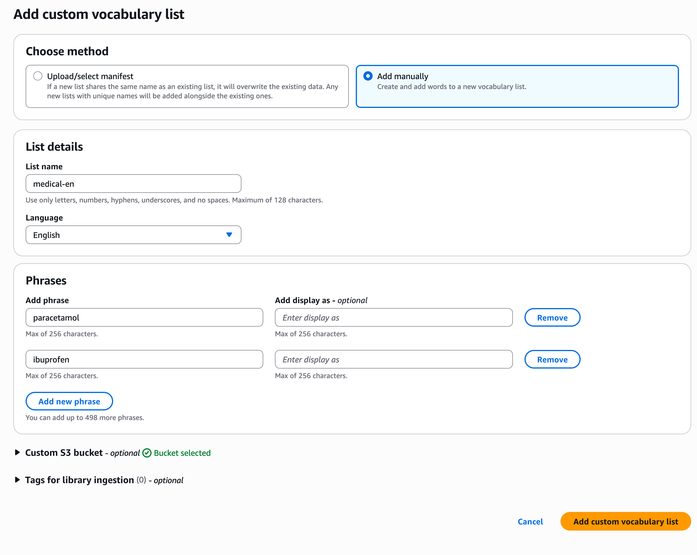

# Adding New Vocabulary Entities

You can add vocabulary to your library using the [InvokeDataAutomationLibraryIngestionJob](bedrock/latest/APIReference/API_data-automation_InvokeDataAutomationLibraryIngestionJob.md "bedrock/latest/APIReference/API_data-automation_InvokeDataAutomationLibraryIngestionJob.md") API. You can provide vocabulary through an S3 manifest file or inline payload.

###### Important

UPSERT operations use a clobber-style replacement at the entity level, meaning the entire entity is replaced rather than merged with existing content.

## Option 1: Using S3 Manifest File

### Step 1: Create a JSONL manifest file

Example: `vocabulary-manifest.json`

```
{"entityId":"medical-en","description":"Medication terms in English language","phrases":[{"text":"paracetamol"},{"text":"ibuprofen"},{"text":"acetaminophen","displayAsText":"acetaminophen"}],"language":"EN"}
{"entityId":"medical-es","description":"Medication terms in Spanish language","phrases":[{"text":"paracetamol"},{"text":"ibuprofen"},{"text":"acetaminophen","displayAsText":"acetaminophen"}],"language":"ES"}
```

**Manifest File Requirements:**

- **File Format:** JSONL (JSON Lines)
- **Entity JSON:**

  - **entityId** (required): Unique identifier (max 128 characters)
  - **description** (optional): Description of the entityId
  - **language** (required): ISO language code ([Supported languages](bda-library-character-sets.md "bda-library-character-sets.md"))
  - **phrases** (required): Array of text objects. Each object contains:

    - **text** (required): Individual word or phrase
    - **displayAsText** (optional): Use this to replace actual word in transcript (NOTE: Case sensitive)

### Step 2: Upload the manifest to S3

```
aws s3 cp vocabulary-manifest.json s3://my-bucket/manifests/
```

### Step 3: Start the ingestion job

Use the [InvokeDataAutomationLibraryIngestionJob](bedrock/latest/APIReference/API_data-automation_InvokeDataAutomationLibraryIngestionJob.md "bedrock/latest/APIReference/API_data-automation_InvokeDataAutomationLibraryIngestionJob.md") to start a vocabulary ingestion job.

**AWS CLI Example:**

**Request**

```
aws bedrock-data-automation-data-automation invoke-data-automation-library-ingestion-job \
    --library-arn "arn:aws:bedrock:us-east-1:123456789012:data-automation-library/healthcare-vocabulary" \
    --entity-type "VOCABULARY" \
    --operation-type "UPSERT" \
    --input-configuration '{"s3Object":{"s3Uri":"s3://my-bucket/manifests/vocabulary-manifest.json"}}' \
    --output-configuration '{"s3Uri":"s3://my-bucket/outputs/"}'
```

**Response:**

```
{
  "jobArn": "arn:aws:bedrock:us-east-1:123456789012:data-automation-library-ingestion-job/job-12345"
}
```

**AWS Console Example:**

1. Navigate to "Library details" page
2. Choose "Add custom vocabulary list"
3. Choose "Upload/select manifest"
4. Choose whether to upload the manifest file directly or from a S3 location



## Option 2: Using Inline Payload

This option can be used for quick updates with up to 100 phrases.

Use the [InvokeDataAutomationLibraryIngestionJob](bedrock/latest/APIReference/API_data-automation_InvokeDataAutomationLibraryIngestionJob.md "bedrock/latest/APIReference/API_data-automation_InvokeDataAutomationLibraryIngestionJob.md") to start a vocabulary ingestion job.

**AWS CLI Example:**

**Request**

```
aws bedrock-data-automation-data-automation invoke-data-automation-library-ingestion-job \
    --library-arn "arn:aws:bedrock:us-east-1:123456789012:data-automation-library/healthcare-vocabulary" \
    --entity-type "VOCABULARY" \
    --operation-type "UPSERT" \
    --input-configuration '{"inlinePayload":{"upsertEntitiesInfo":[{"vocabulary":{"entityId":"medical-en","language":"EN","phrases":[{"text":"paracetamol"},{"text":"ibuprofen"}]}}]}}' \
    --output-configuration '{"s3Uri":"s3://bda-data-bucket/output/"}'
```

**Response:**

```
{
  "jobArn": "arn:aws:bedrock:us-east-1:123456789012:data-automation-library-ingestion-job/job-12345"
}
```

**AWS Console Example:**

1. Navigate to "Library details" page
2. Choose "Add custom vocabulary list"
3. Choose "Add manually"


