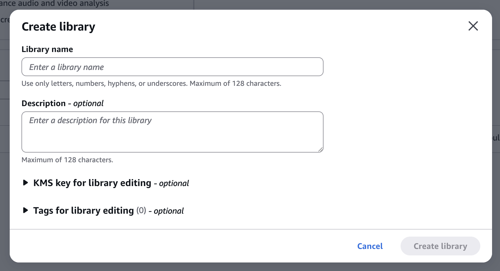
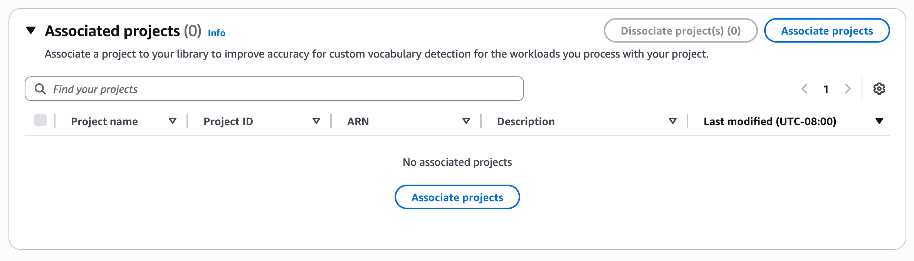

# Associating Library with a Project

To use custom vocabulary, associate your library with a BDA project. This can be done in two ways:

## Option 1: Create Project with Library:

**AWS CLI Example:**

```
aws bedrock-data-automation create-data-automation-project \
    --project-name "audio-transcription-project" \
    --standard-output-configuration '{
        "audio": {
            "extraction": {
                "category": {
                    "state": "ENABLED",
                    "types": ["TRANSCRIPTION"]
                }
            }
        }
    }' \
    --data-automation-libraries '[{
        "libraryArn": "arn:aws:bedrock:us-east-1:123456789012:data-automation-library/healthcare-vocabulary"
    }]'
```

**AWS Console Example:**

1. Navigate to the Bedrock "Data Automation" page
2. Create a project
3. Navigate to the project detail page
4. Click "Associated library" tab
5. Click "Associate a library" button
6. Choose a library by clicking the radio button next to it and click the "Associate library" button



## Option 2: Update Existing Project with library:

```
aws bedrock-data-automation update-data-automation-project \
    --project-arn "arn:aws:bedrock:us-east-1:123456789012:data-automation-project/audio-transcription-project" \
    --data-automation-libraries '[{
        "libraryArn": "arn:aws:bedrock:us-east-1:123456789012:data-automation-library/healthcare-vocabulary"
    }]'
```

**AWS Console Example:**

1. Navigate to the "Library details" page for your library
2. Expand "Associated projects"
3. Click "Associate projects"
4. Choose the projects to associate and click "Associate project"


