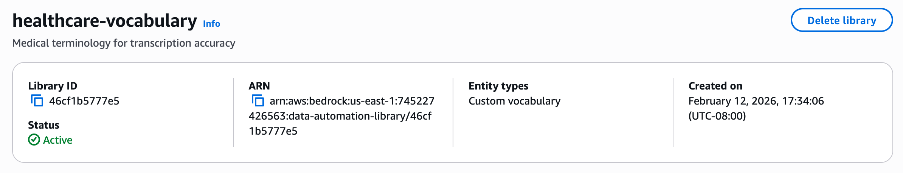

# Deleting a Library

Use the [DeleteDataAutomationLibrary](../APIReference/API_data-automation_DeleteDataAutomationLibrary.md "../APIReference/API_data-automation_DeleteDataAutomationLibrary.md") api to delete library with its entities.

## AWS CLI Example:

**Request**

```
aws bedrock-data-automation delete-data-automation-library \
    --library-arn "arn:aws:bedrock:us-east-1:123456789012:data-automation-library/healthcare-vocabulary"
```

**Response:**

```
{
  "libraryArn": "arn:aws:bedrock:us-east-1:123456789012:data-automation-library/healthcare-vocabulary",
  "status": "DELETING"
}
```

## AWS Console Example:

1. Navigate to "Manage libraries" page in BDA Console
2. Click the desired library from the list of libraries
3. Click "Delete library"



## Important:

1. To delete the library, first dissociate the library from the project and then delete the library.
2. You cannot delete a library with an active ingestion job
3. Deletion removes all entities and search indices
4. The operation may take several minutes for large libraries
