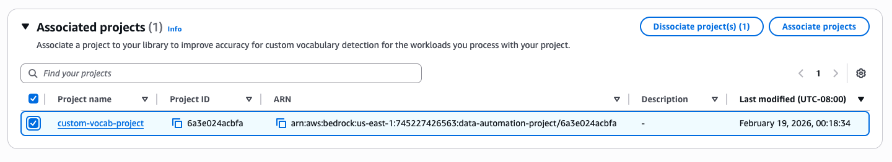

# Dissociation of Library from a Project

You can dissociate a library from a project using the [UpdateDataAutomationProject](bedrock/latest/APIReference/API_data-automation_UpdateDataAutomationProject.md "bedrock/latest/APIReference/API_data-automation_UpdateDataAutomationProject.md") API.

## AWS CLI Example:

```
aws bedrock-data-automation update-data-automation-project \
    --project-arn "arn:aws:bedrock:us-east-1:123456789012:data-automation-project/audio-transcription-project" \
    --data-automation-libraries '[]'
```

## AWS Console Example:

1. Navigate to the "Library details" page for your library
2. Expand "Associated projects"
3. Choose the desired project
4. Choose "Dissociate project"


