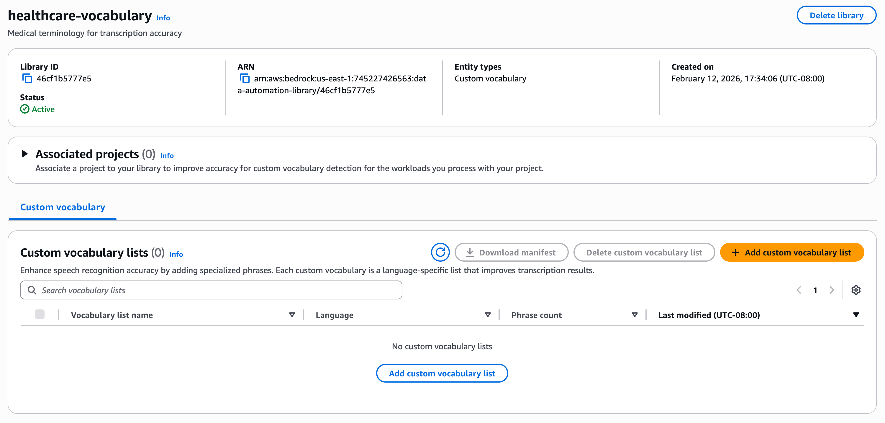

# Getting Library Details

Use the [GetDataAutomationLibrary](bedrock/latest/APIReference/API_data-automation_GetDataAutomationLibrary.md "bedrock/latest/APIReference/API_data-automation_GetDataAutomationLibrary.md") API to retrieve information about an existing library.

## AWS CLI Example:

**Request**

```
aws bedrock-data-automation get-data-automation-library \
    --library-arn "arn:aws:bedrock:us-east-1:123456789012:data-automation-library/healthcare-vocabulary"
```

**Response:**

```
{
  "library": {
    "libraryArn": "arn:aws:bedrock:us-east-1:123456789012:data-automation-library/healthcare-vocabulary",
    "libraryName": "healthcare-vocabulary",
    "libraryDescription": "Medical terminology for transcription accuracy",
    "status": "ACTIVE",
    "creationTime": "2026-01-01T00:00:00Z",
    "entityTypes": [
      {
        "entityType": "VOCABULARY",
        "entityMetadata": "{\"entityCount\": 150}"
      }
    ]
  }
}
```

## AWS Console Example:

1. Navigate to "Manage libraries" page in BDA Console
2. Select the desired library from the list of libraries


