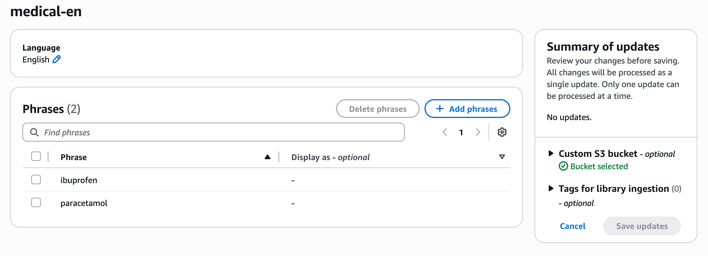

# Getting Library Entity Details

Use the [GetDataAutomationLibraryEntity](bedrock/latest/APIReference/API_data-automation_GetDataAutomationLibraryEntity.md "bedrock/latest/APIReference/API_data-automation_GetDataAutomationLibraryEntity.md") API to retrieve the list of vocabulary for an entity.

## AWS CLI Example:

**Request**

```
aws bedrock-data-automation get-data-automation-library-entity \
    --library-arn "arn:aws:bedrock:us-east-1:123456789012:data-automation-library/healthcare-vocabulary" \
    --entity-type "VOCABULARY" \
    --entity-id "medical-en"
```

**Response**

```
{
    "entity": {
        "vocabulary": {
            "entityId": "medical-en",
            "language": "EN",
            "phrases": [
                {
                    "text": "paracetamol"
                },
                {
                    "text": "ibuprofen"
                }
            ],
            "lastModifiedTime": "2026-03-06T07:06:00.413000+00:00"
        }
    }
}
```

## AWS Console Example:

1. Navigate to the "Library details" page for your library
2. Choose the desired entity from the list


