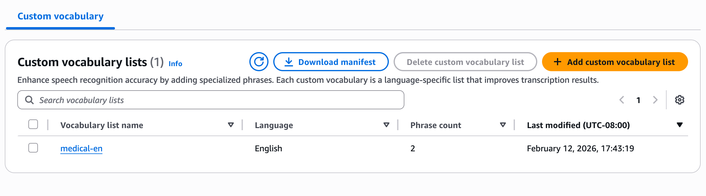

# Listing Library Entities

Use the [ListDataAutomationLibraryEntities](bedrock/latest/APIReference/API_data-automation_ListDataAutomationLibraryEntities.md "bedrock/latest/APIReference/API_data-automation_ListDataAutomationLibraryEntities.md") API to retrieve the list of entities.

## AWS CLI Example:

**Request**

```
aws bedrock-data-automation list-data-automation-library-entities \
    --library-arn "arn:aws:bedrock:us-east-1:123456789012:data-automation-library/healthcare-vocabulary" \
    --entity-type "VOCABULARY" \
    --max-results 50
```

**Response**

```
{
    "entities": [
        {
            "vocabulary": {
                "entityId": "medical-en",
                "language": "EN",
                "numOfPhrases": 2,
                "lastModifiedTime": "2026-03-06T07:06:00.413000+00:00"
            }
        }
    ]
}
```

## AWS Console Example:

1. Navigate to the "Library details" page for your library


