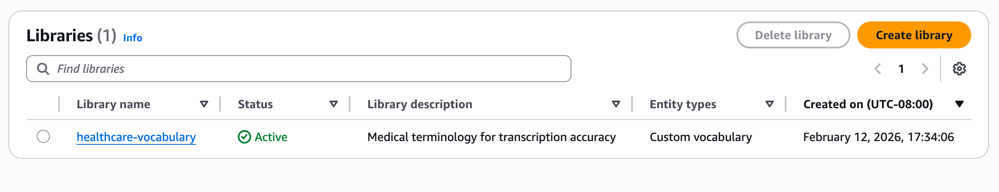

# Listing Libraries

Use the [ListDataAutomationLibraries](bedrock/latest/APIReference/API_data-automation_ListDataAutomationLibraries.md "bedrock/latest/APIReference/API_data-automation_ListDataAutomationLibraries.md") API to retrieve the list of libraries.

## AWS CLI Example:

**Request**

```
aws bedrock-data-automation list-data-automation-libraries \
    --max-results 50
```

**Response:**

```
{
  "libraries": [
    {
      "libraryArn": "arn:aws:bedrock:us-east-1:123456789012:data-automation-library/healthcare-vocabulary",
      "creationTime": "2026-01-01T00:00:00Z",
      "libraryName": "healthcare-vocabulary"
    }
  ],
  "next_token": "<pagination-token>"
}
```

## AWS Console Example:

1. Navigate to "Manage libraries" page in BDA Console. This page will list libraries associated in this account.


