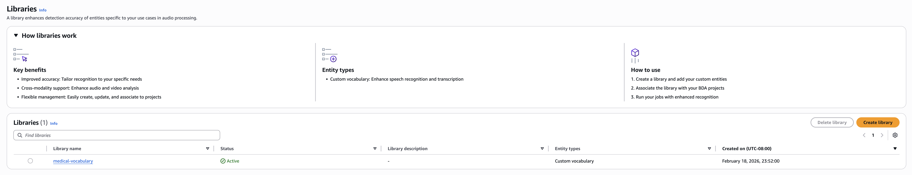

# Data Automation Library

Amazon Bedrock Data Automation Library enables you to enhance BDA's understanding of your content and generate more accurate insights from your data. A Data Automation Library serves as a container that stores entities and can be associated with BDA projects to improve extraction accuracy across multiple entity types and modalities for your specific use cases. Currently, Data Automation Library supports [Custom Vocabulary](bda-library-custom-vocabulary.md "bda-library-custom-vocabulary.md") to enhance extraction accuracy for audio and video content. Limits related to this feature are in the [Quotas and Limits](bedrock/latest/userguide/bda-limits.md "bedrock/latest/userguide/bda-limits.md") page.

## Key Benefits

1. **Improved Accuracy:** Tailor recognition to your specific needs.
2. **Cross modality support:** Enhance audio and video analysis.
3. **Flexible Management:** Easily create, update and associate to projects.
4. **Reusable Resources:** Create libraries once and use them across multiple projects.
5. **Easy Integration:** Simple API-driven workflow for library management.

## How Data Automation Library Works

You can create a Data Automation Library and populate it with domain-specific entities, which enables BDA to apply your custom knowledge during content processing and improve extraction accuracy across your use cases. You can associate a library with a BDA project, which enables all jobs processed through that project to automatically use the library's entities without additional configuration per job.

When ingestion is completed, a folder with the name of the job ID is created in the S3 URI provided in the ingestion API request. Both the input manifest and final ingestion results are uploaded in that folder. For example if the output bucket provided in the request is `s3://my-bucket/outputs/` and the jobId is `328c43e7-d226-41c9-9acb-e71a37022b99` then the input manifest and the final ingestion results are uploaded in `s3://my-bucket/outputs/328c43e7-d226-41c9-9acb-e71a37022b99`

**Basic workflow:**

1. **Create a library** — Use [CreateDataAutomationLibrary](bedrock/latest/APIReference/API_data-automation_CreateDataAutomationLibrary.md "bedrock/latest/APIReference/API_data-automation_CreateDataAutomationLibrary.md") to initialize an empty library container.
2. **Add entities to your library** — Use [InvokeDataAutomationLibraryIngestionJob](bedrock/latest/APIReference/API_data-automation_InvokeDataAutomationLibraryIngestionJob.md "bedrock/latest/APIReference/API_data-automation_InvokeDataAutomationLibraryIngestionJob.md") to add your domain-specific entities.
3. **Associate the library with a project** — Link the library during project creation with [CreateDataAutomationProject](bedrock/latest/APIReference/API_data-automation_CreateDataAutomationProject.md "bedrock/latest/APIReference/API_data-automation_CreateDataAutomationProject.md"), or update an existing project with [UpdateDataAutomationProject](bedrock/latest/APIReference/API_data-automation_UpdateDataAutomationProject.md "bedrock/latest/APIReference/API_data-automation_UpdateDataAutomationProject.md").
4. **Process your content** — Run jobs using [InvokeDataAutomationAsync](bedrock/latest/APIReference/API_data-automation-runtime_InvokeDataAutomationAsync.md "bedrock/latest/APIReference/API_data-automation-runtime_InvokeDataAutomationAsync.md") through the associated project to apply enhanced extraction accuracy across your content.

## Key Concepts

### Data Automation Library

A container that stores entities of one or more types. Libraries can be attached to multiple Data Automation projects and reused across different workloads.

### Data Automation Library Entity Type

The type of content stored in the library. Currently, only [VOCABULARY](bda-library-custom-vocabulary.md "bda-library-custom-vocabulary.md") entity type is supported.

### Data Automation Library Entity

A specific instance within an entity type. For Custom Vocabulary, an entity represents a collection of words and phrases for a specific language.

### Data Automation Library Ingestion Job

An asynchronous operation that adds, updates, or deletes entities in a library. Jobs are processed sequentially to maintain data consistency.

### Project Association

The link between a library and a BDA project. When you associate a library with a project, all jobs processed through that project apply the library's entities to improve extraction accuracy for your content. Note, that a project can only be associated with one library, but one library can be associated with multiple projects.

## Navigating to Data Automation Library page in the BDA Console

1. Navigate to the Amazon Bedrock service.
2. On the sidebar menu, select "Data Automation".
3. Select "Manage libraries"

## Regional Availability

Data Automation Library is available in the following AWS Regions:

| Region Name           | Region Code    |
| --------------------- | -------------- |
| US East (N. Virginia) | us-east-1      |
| US West (Oregon)      | us-west-2      |
| Europe (Ireland)      | eu-west-1      |
| Europe (London)       | eu-west-2      |
| Europe (Frankfurt)    | eu-central-1   |
| Asia Pacific (Mumbai) | ap-south-1     |
| Asia Pacific (Sydney) | ap-southeast-2 |
