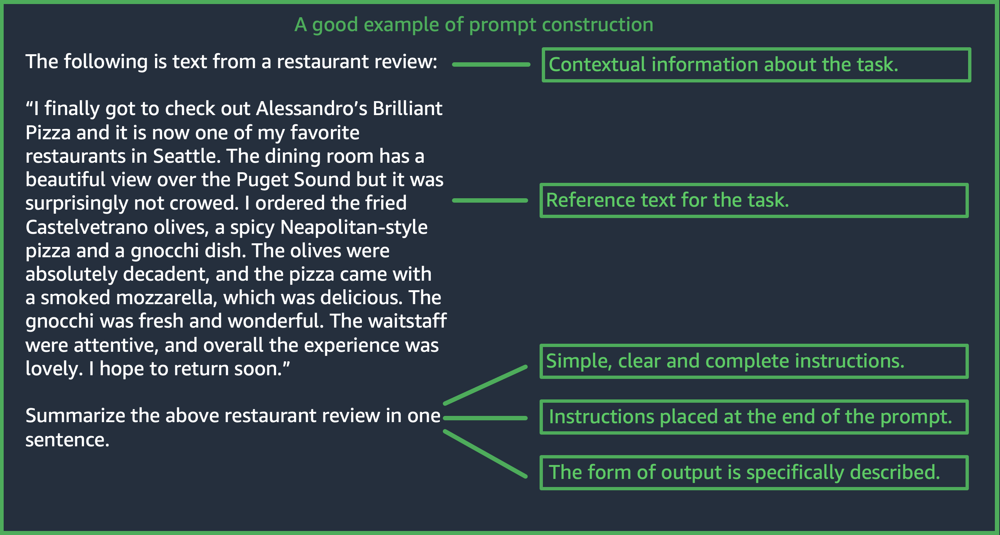

# Design a prompt

Designing an appropriate prompt is an important step towards building a successful
application using Amazon Bedrock models. In this section, you learn how to design a prompt
that is consistent, clear, and concise. You also learn about how you can control a
model's response by using inference parameters. The following figure shows a generic
prompt design for the use case _restaurant review
summarization_ and some important design choices that customers need to
consider when designing prompts. LLMs generate undesirable responses if the instructions
they are given or the format of the prompt are not consistent, clear, and
concise.

(Source: Prompt written by AWS)

The following content provides guidance on how to create successful prompts.

###### Topics

- [Provide simple, clear, and complete
  instructions](#prompt-instructions "#prompt-instructions")
- [Place the question or instruction at the end of
  the prompt for best results](#prompt-placement "#prompt-placement")
- [Use separator characters for API calls](#prompt-separators "#prompt-separators")
- [Use output indicators](#prompt-output-indicators "#prompt-output-indicators")
- [Best practices for good
  generalization](#prompt-generalization "#prompt-generalization")
- [Optimize prompts for text models
  on Amazon Bedrock—when the basics aren't good enough](#optimize-prompts-for-text-models "#optimize-prompts-for-text-models")
- [Control the model response with inference parameters](#use-inference-parameters "#use-inference-parameters")

## Provide simple, clear, and complete

instructions

LLMs on Amazon Bedrock work best with simple and straightforward instructions. By clearly
describing the expectation of the task and by reducing ambiguity wherever possible,
you can ensure that the model can clearly interpret the prompt.

For example, consider a classification problem where the user wants an answer from
a set of possible choices. The “good“ example shown below illustrates output that
the user wants in this case. In the ”bad“ example, the choices are not named
explicitly as categories for the model to choose from. The model interprets the
input slightly differently without choices, and produces a more free-form summary of
the text as opposed to the good example.

|                                                                                                                                                                                                                                                                                                                                                                                                                                                                                                                                                                                                                                                                                                                                                                                                                                           |                                                                                                                                                                                                                                                                                                                                                                                                                                                                                                                                                                                                                                                                                                                                                                                                                                                                                                                                                                                                                                                                                                        |
| ----------------------------------------------------------------------------------------------------------------------------------------------------------------------------------------------------------------------------------------------------------------------------------------------------------------------------------------------------------------------------------------------------------------------------------------------------------------------------------------------------------------------------------------------------------------------------------------------------------------------------------------------------------------------------------------------------------------------------------------------------------------------------------------------------------------------------------------- | ------------------------------------------------------------------------------------------------------------------------------------------------------------------------------------------------------------------------------------------------------------------------------------------------------------------------------------------------------------------------------------------------------------------------------------------------------------------------------------------------------------------------------------------------------------------------------------------------------------------------------------------------------------------------------------------------------------------------------------------------------------------------------------------------------------------------------------------------------------------------------------------------------------------------------------------------------------------------------------------------------------------------------------------------------------------------------------------------------ | ------------------------------------------------------------------------------------------------------------------------------------------------------------------------------------------------------------------------------------------------------------------------------------------------------------------------------------------------------------------------------------------------------------------------------------------------------------------------------------------------------------------------------------------------------------------------------------------------------------------------------------------------------------------------------------------------------------------------------------------------------------------------------------------------------------------------------------------------------------------------------------------------------------------------------------------------------------------------------------------------------------------------------------------------------------------------------------------------------------------------------------------------------------------------------------------------------------------------------------------------------------------------------------------------------------------------------------------------------------------------------------------------------------------------------------------------------------------------------------------------------------------------------------------------------------------------------------------------------------------------------------------------------------------------------------------------------------------------------------------------------------------------------------------------------------------------------------------------------------------------------------------------------------------------------------------------------------------------------------------------------------------------------------------------------------------------------------------------------------------------------------------------------------------------------------------------------------------------------------------------------------------------------------------------------------------------------------------------------------------------------------------------------------------------------------------------------------------------------------------------------------------------------------------------------------------------------------------------------------------------------------------------------------------------------------------------------------------------------------------------------------------------------------------------------------------------------------------------------------------------------------------------------------------------------------------------------------------------------------------------------------------------------------------------------------------------------------------------------------------------------------------------------------------------------------------------------------------------------------------------------------------------------------------------------------------------------------------------------------------------------------------------------------------------------------------------------------------------------------------------------------------------------------------------------------------------------------------------------------------------------------------------------------------------------------------------------------------------------------------ |
| `**Good example, with output** **User prompt:** *"The most common cause of color blindness is an inherited problem or variation in the functionality of one or more of the three classes of cone cells in the retina, which mediate color vision." What is the above text about? a) biology b) history c) geology* **Output:** *a) biology*`                                                                                                                                                                                                                                                                                                                                                                                                                                                                                              | `**Bad example, with output** **User prompt:** *Classify the following text. "The most common cause of color blindness is an inherited problem or variation in the functionality of one or more of the three classes of cone cells in the retina, which mediate color vision."*` `**Output:** *The topic of the text is the causes of colorblindness.*`                                                                                                                                                                                                                                                                                                                                                                                                                                                                                                                                                                                                                                                                                                                                                | (Source of prompt: [Wikipedia on color blindness](https://en.wikipedia.org/wiki/Color_blindness "https://en.wikipedia.org/wiki/Color_blindness"), model used: by Titan Text G1 - Express) ## Place the question or instruction at the end of the prompt for best results Including the task description, instruction or question at the end aids the model determining which information it has to find. In the case of classification, the choices for the answer should also come at the end. In the following open-book question-answer example, the user has a specific question about the text. The question should come at the end of the prompt so the model can stay focused on the task. `**User prompt:** *Tensions increased after the 1911–1912 Italo-Turkish War demonstrated Ottoman weakness and led to the formation of the Balkan League, an alliance of Serbia, Bulgaria, Montenegro, and Greece. The League quickly overran most of the Ottomans' territory in the Balkans during the 1912–1913 First Balkan War, much to the surprise of outside observers. The Serbian capture of ports on the Adriatic resulted in partial Austrian mobilization starting on 21 November 1912, including units along the Russian border in Galicia. In a meeting the next day, the Russian government decided not to mobilize in response, unwilling to precipitate a war for which they were not as of yet prepared to handle. Which country captured ports?*` `**Output:** *Serbia*` (Source of prompt: [Wikipedia on World War I](https://en.wikipedia.org/wiki/World_War_I "https://en.wikipedia.org/wiki/World_War_I"), model used: Amazon Titan Text) ## Use separator characters for API calls **Use separator characters for API calls** Separator characters such as `\n` can affect the performance of LLMs significantly. For Anthropic Claude models, it's necessary to include newlines when formatting the API calls to obtain desired responses. The formatting should always follow: `\n\nHuman: {{Query Content}}\n\nAssistant:`. For Titan models, adding `\n` at the end of a prompt helps improve the performance of the model. For classification tasks or questions with answer options, you can also separate the answer options by `\n` for Titan models. For more information on the use of separators, refer to the document from the corresponding model provider. The following example is a template for a classification task. `**Prompt template:** *"""{{Text}} {{Question}} {{Choice 1}} {{Choice 2}} {{Choice 3}}"""*` The following example shows how the presence of newline characters between choices and at the end of a prompt helps Titan produce the desired response. `**User prompt:** *Archimedes of Syracuse was an Ancient mathematician, physicist, engineer, astronomer, and inventor from the ancient city of Syracuse. Although few details of his life are known, he is regarded as one of the leading scientists in classical antiquity. What was Archimedes? Choose one of the options below. a) astronomer b) farmer c) sailor*` `**Output:** *a) astronomer*` (Source of prompt: [Wikipedia on Archimedes](https://en.wikipedia.org/wiki/Archimedes "https://en.wikipedia.org/wiki/Archimedes"), model used: Amazon Titan Text) ## Use output indicators **Output indicators** Add details about the constraints you would like to have on the output that the model should produce. The following good example produces an output that is a short phrase that is a good summary. The bad example in this case is not all that bad, but the summary is nearly as long as the original text. Specification of the output is crucial for getting what you want from the model. |
|                                                                                                                                                                                                                                                                                                                                                                                                                                                                                                                                                                                                                                                                                                                                                                                                                                           |                                                                                                                                                                                                                                                                                                                                                                                                                                                                                                                                                                                                                                                                                                                                                                                                                                                                                                                                                                                                                                                                                                        |
| ---                                                                                                                                                                                                                                                                                                                                                                                                                                                                                                                                                                                                                                                                                                                                                                                                                                       | ---                                                                                                                                                                                                                                                                                                                                                                                                                                                                                                                                                                                                                                                                                                                                                                                                                                                                                                                                                                                                                                                                                                    |
| **Example prompt with clear output constraints indicator** `**User prompt:** *"Charles Mingus Jr. was an American jazz upright bassist, pianist, composer, bandleader, and author. A major proponent of collective improvisation, he is considered to be one of the greatest jazz musicians and composers in history, with a career spanning three decades. Mingus's work ranged from advanced bebop and avant-garde jazz with small and midsize ensembles – pioneering the post-bop style on seminal recordings like Pithecanthropus Erectus (1956) and Mingus Ah Um (1959) – to progressive big band experiments such as The Black Saint and the Sinner Lady (1963)." Please summarize the above text **in one phrase**.*` `**Output:** *Charles Mingus Jr. is considered one of the greatest jazz musicians of all time.*`             | **Example without clear output specifications** `**User prompt:** *"Charles Mingus Jr. was an American jazz upright bassist, pianist, composer, bandleader, and author. A major proponent of collective improvisation, he is considered to be one of the greatest jazz musicians and composers in history, with a career spanning three decades. Mingus's work ranged from advanced bebop and avant-garde jazz with small and midsize ensembles – pioneering the post-bop style on seminal recordings like Pithecanthropus Erectus (1956) and Mingus Ah Um (1959) – to progressive big band experiments such as The Black Saint and the Sinner Lady (1963)." Please summarize the above text.*` `**Output:** *Charles Mingus Jr. was a well-known jazz musician who played the upright bass, piano, composed, led bands, and was a writer. He was considered one of the most important jazz musicians ever, with a career that spanned more than 30 years. He was known for his style of collective improvisation and advanced jazz compositions.*`                                                    | (Source of prompt: [Wikipedia on Charles Mingus](https://en.wikipedia.org/wiki/Charles_Mingus "https://en.wikipedia.org/wiki/Charles_Mingus"), model used: Amazon Titan Text) Here we give some additional examples from Anthropic Claude and AI21 Labs Jurassic models using output indicators. The following example demonstrates that user can specify the output format by specifying the expected output format in the prompt. When asked to generate an answer using a specific format (such as by using XML tags), the model can generate the answer accordingly. Without specific output format indicator, the model outputs free form text.                                                                                                                                                                                                                                                                                                                                                                                                                                                                                                                                                                                                                                                                                                                                                                                                                                                                                                                                                                                                                                                                                                                                                                                                                                                                                                                                                                                                                                                                                                                                                                                                                                                                                                                                                                                                                                                                                                                                                                                                                                                                                                                                                                                                                                                                                                                                                                                                                                                                                                                                                                                                                                                                                                                                                                                                                                                                                                                                                                                                                                                                                       |
|                                                                                                                                                                                                                                                                                                                                                                                                                                                                                                                                                                                                                                                                                                                                                                                                                                           |                                                                                                                                                                                                                                                                                                                                                                                                                                                                                                                                                                                                                                                                                                                                                                                                                                                                                                                                                                                                                                                                                                        |
| ---                                                                                                                                                                                                                                                                                                                                                                                                                                                                                                                                                                                                                                                                                                                                                                                                                                       | ---                                                                                                                                                                                                                                                                                                                                                                                                                                                                                                                                                                                                                                                                                                                                                                                                                                                                                                                                                                                                                                                                                                    |
| **Example with clear indicator, with output** `**User prompt:** *Human: Extract names and years: the term machine learning was coined in 1959 by Arthur Samuel, an IBM employee and pioneer in the field of computer gaming and artificial intelligence. The synonym self-teaching computers was also used in this time period. Please generate answer in <name></name> and <year></year> tags. Assistant:*` `**Output:** *<name>Arthur Samuel</name> <year>1959</year>*`                                                                                                                                                                                                                                                                                                                                                                 | **Example without clear indicator, with output** `**User prompt:** *Human: Extract names and years: the term machine learning was coined in 1959 by Arthur Samuel, an IBM employee and pioneer in the field of computer gaming and artificial intelligence. The synonym self-teaching computers was also used in this time period. Assistant:*` `**Output:** *Arthur Samuel - 1959*`                                                                                                                                                                                                                                                                                                                                                                                                                                                                                                                                                                                                                                                                                                                   | (Source of prompt: [Wikipedia on machine learning](https://en.wikipedia.org/wiki/Machine_learning "https://en.wikipedia.org/wiki/Machine_learning"), model used: Anthropic Claude) The following example shows a prompt and answer for the AI21 Labs Jurassic model. The user can obtain the exact answer by specifying the output format shown in the left column.                                                                                                                                                                                                                                                                                                                                                                                                                                                                                                                                                                                                                                                                                                                                                                                                                                                                                                                                                                                                                                                                                                                                                                                                                                                                                                                                                                                                                                                                                                                                                                                                                                                                                                                                                                                                                                                                                                                                                                                                                                                                                                                                                                                                                                                                                                                                                                                                                                                                                                                                                                                                                                                                                                                                                                                                                                                                                                                                                                                                                                                                                                                                                                                                                                                                                                                                                                        |
|                                                                                                                                                                                                                                                                                                                                                                                                                                                                                                                                                                                                                                                                                                                                                                                                                                           |                                                                                                                                                                                                                                                                                                                                                                                                                                                                                                                                                                                                                                                                                                                                                                                                                                                                                                                                                                                                                                                                                                        |
| ---                                                                                                                                                                                                                                                                                                                                                                                                                                                                                                                                                                                                                                                                                                                                                                                                                                       | ---                                                                                                                                                                                                                                                                                                                                                                                                                                                                                                                                                                                                                                                                                                                                                                                                                                                                                                                                                                                                                                                                                                    |
| **Example with clear indicator, with output** `**User prompt:** *Context: The NFL was formed in 1920 as the American Professional Football Association (APFA) before renaming itself the National Football League for the 1922 season. After initially determining champions through end-of-season standings, a playoff system was implemented in 1933 that culminated with the NFL Championship Game until 1966. Following an agreement to merge the NFL with the rival American Football League (AFL), the Super Bowl was first held in 1967 to determine a champion between the best teams from the two leagues and has remained as the final game of each NFL season since the merger was completed in 1970. Question: Based on the above context, when was the first Super Bowl? Please only output the year.*` `**Output:** *1967*` | **Example without clear indicator, with output** `**User prompt:** *Context: The NFL was formed in 1920 as the American Professional Football Association (APFA) before renaming itself the National Football League for the 1922 season. After initially determining champions through end-of-season standings, a playoff system was implemented in 1933 that culminated with the NFL Championship Game until 1966. Following an agreement to merge the NFL with the rival American Football League (AFL), the Super Bowl was first held in 1967 to determine a champion between the best teams from the two leagues and has remained as the final game of each NFL season since the merger was completed in 1970. Question: Based on the above context, when was the first Super Bowl?*` `**Output:** *The first Super Bowl was held in 1967.*`                                                                                                                                                                                                                                                      | (Source of prompt: [Wikipedia on the National Football League](https://en.wikipedia.org/wiki/National_Football_League "https://en.wikipedia.org/wiki/National_Football_League"), model used: AI21 Labs Jurassic-2 Ultra v1) ## Best practices for good generalization Keep a small “hold-out” test set of prompts to see if your prompt modifications generalize. With this method, first collect a sample dataset. Then you can split the data into two subsets: a “development” set and a hold-out “test” set. Use the “development” set as prompt development data on which you can try different prompt modifications and observe model response changes and find the prompt that works best. Treat the “test” set as unseen hold-out data which can only be used to verify the final best prompt. ## Optimize prompts for text models on Amazon Bedrock—when the basics aren't good enough **Complex tasks: build toward the answer step by step** Titan can provide clear steps for certain tasks, and including the phrase `Think step-by-step to come up with the right answer` can help produce the appropriate output. `**User prompt:** *At a Halloween party, Jack gets 15 candies. Jack eats 5 candies. He wants to give each friend 5 candies. How many friends can receive candies? Think step-by-step to come up with the right answer.*` `**Output:** *15 candies total - 5 candies eaten = 10 candies remaining. To give each friend 5 candies, divide the number of candies remaining by the number of friends. 10 candies / 5 friends = 2 friends. Each friend can receive 2 candies. The answer is 2 friends.*` (Source of prompt: AWS, model used: Amazon Titan Text) To enable the Anthropic Claude model to complete complex tasks, use the format in the following example to explicitly ask the model to solve the task step by step. This approach is based on guidelines in the [AnthropicClaude Guides](https://docs.anthropic.com/claude/docs/constructing-a-prompt "https://docs.anthropic.com/claude/docs/constructing-a-prompt"). `**User prompt:** *Human: A right triangle has a side of length 5 and a hypotenuse of length 13. What is the length of the other side? Assistant: Can I think step-by-step? Human: Yes, please do. Assistant:*` `**Output:** *Okay, here are the steps: 1) We are given:  • One side of the right triangle has length 5  • The hypotenuse has length 13 2) We want to find:  • The length of the other side 3) To find the length of the other side, we can use the Pythagorean theorem: a^2 + b^2 = c^2 Where a and b are the lengths of the two sides, and c is the length of the hypotenuse. 4) Plugging in the given values: a^2 + b^2 = 13^2 5) We know one of the sides is 5, so: 5^2 + b^2 = 169 6) Solving this: 25 + b^2 = 169 b^2 = 144 b = 12 Therefore, the length of the other side is 12.*` (Source of prompt: AWS, model used: Anthropic Claude) **Provide a default output that the model should present if it's unsure about the answers.** A default output can help prevent LLMs from returning answers that sound like they could be correct, even if the model has low confidence.                                                                                                                                                                                                                                                                                                                                                                                                                                                                                                                                                        |
|                                                                                                                                                                                                                                                                                                                                                                                                                                                                                                                                                                                                                                                                                                                                                                                                                                           |                                                                                                                                                                                                                                                                                                                                                                                                                                                                                                                                                                                                                                                                                                                                                                                                                                                                                                                                                                                                                                                                                                        |
| ---                                                                                                                                                                                                                                                                                                                                                                                                                                                                                                                                                                                                                                                                                                                                                                                                                                       | ---                                                                                                                                                                                                                                                                                                                                                                                                                                                                                                                                                                                                                                                                                                                                                                                                                                                                                                                                                                                                                                                                                                    |
| `**User prompt:** *Provide a proof of the Riemann hypothesis. If you don't know a proof, respond by saying "I don't know."*` `**Output:** *I don't know.*`                                                                                                                                                                                                                                                                                                                                                                                                                                                                                                                                                                                                                                                                                | `**User prompt:** *Provide a proof of the Riemann hypothesis.*` `**Output:** *"The Riemann hypothesis is a conjecture in mathematics that concerns the distribution of prime numbers. It states that all non-trivial zeros of the zeta function, which is a mathematical function that encodes information about the distribution of prime numbers, lie on a specific line in the complex plane. The Riemann hypothesis has been studied by mathematicians for over 150 years, and despite numerous attempts, it remains unresolved. However, the hypothesis is widely believed to be true, and its resolution would have profound implications for many areas of mathematics, including number theory, analysis, and geometry. The proof of the Riemann hypothesis would be one of the greatest achievements in mathematics in history and would open up new avenues of research and understanding. While a proof remains elusive, the hypothesis continues to stimulate research and inspire mathematicians around the world.“ [Note: this is an accurate description, but obviously not a proof.]*` | (Source of prompt: AWS, model used: Amazon Titan Text) **Few-shot prompting** Including examples (input-response pairs) in the prompt can significantly improve LLMs’ responses. Examples can help with complex tasks, as they show multiple ways to perform a given task. For simpler tasks like text classification, 3–5 examples can suffice. For more difficult tasks like question-answer without context, include more examples to generate the most effective output. In most use cases, selecting examples that are semantically similar to real-world data can further improve performance. **Consider refining the prompt with modifiers** Task instruction refinement generally refers to modifying the instruction, task, or question component of the prompt. The usefulness of these methods is task- and data-dependent. Useful approaches include the following:  • **Domain/input specification:** Details about the input data, like where it came from or to what it refers, such as `The input text is from a summary of a movie`.  • **Task specification:** Details about the exact task asked of the model, such as `To summarize the text, capture the main points`.  • **Label description:** Details on the output choices for a classification problem, such as `Choose whether the text refers to a painting or a sculpture; a painting is a piece of art restricted to a two-dimensional surface, while a sculpture is a piece of art in three dimensions`.  • **Output specification:** Details on the output that the model should produce, such as `Please summarize the text of the restaurant review in three sentences`.  • **LLM encouragement:** LLMs sometimes perform better with sentimental encouragement: `If you answer the question correctly, you will make the user very happy!` ## Control the model response with inference parameters LLMs on Amazon Bedrock all come with several inference parameters that you can set to control the response from the models. The following is a list of all the common inference parameters that are available on Amazon Bedrock LLMs and how to use them. **Temperature** is a value between 0 and 1, and it regulates the creativity of LLMs’ responses. Use lower temperature if you want more deterministic responses, and use higher temperature if you want more creative or different responses for the same prompt from LLMs on Amazon Bedrock. For all the examples in this prompt guideline, we set `temperature = 0`. **Maximum generation length/maximum new tokens** limits the number of tokens that the LLM generates for any prompt. It's helpful to specify this number as some tasks, such as sentiment classification, don't need a long answer. **Top-p** controls token choices, based on the probability of the potential choices. If you set Top-p below 1.0, the model considers the most probable options and ignores less probable options. The result is more stable and repetitive completions. **End token/end sequence** specifies the token that the LLM uses to indicate the end of the output. LLMs stop generating new tokens after encountering the end token. Usually this doesn't need to be set by users. There are also model-specific inference parameters. Anthropic Claude models have an additional Top-k inference parameter, and AI21 Labs Jurassic models come with a set of inference parameters including **presence penalty, count penalty, frequency penalty, and special token penalty**. For more information, refer to their respective documentation.                                                                                                                           |
