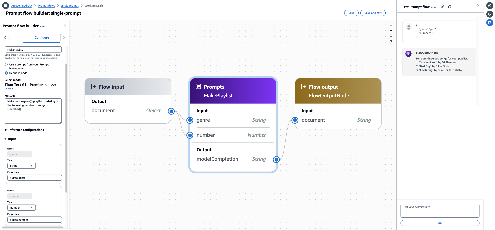

# Create a flow with a single prompt

The following image shows a flow consisting of a single prompt, defined inline in the
node. The prompt generates a playlist of songs from a JSON object input that includes the genre and
the number of songs to include in the playlist.

###### To build and test this flow in the console

1. Create a flow by following the instructions at [Create your first flow in Amazon Bedrock](flows-get-started.md "flows-get-started.md").
2. Set up the prompt node by doing the following:
   1. Select the **Prompt** node in the center pane.
   2. Select the **Configure** tab in the **Flow builder** pane.
   3. Enter `MakePlaylist` as the **Node name**.
   4. Choose **Define in node**.
   5. Set up the following configurations for the prompt:
      1. Under **Select model**, select a model to
         run inference on the prompt.
      2. In the **Message** text box, enter
         `Make me a {{genre}} playlist consisting of
the following number of songs: {{number}}.`.
         This creates two variables that will appear as inputs into
         the node.
      3. (Optional) Modify the **Inference
         configurations**.
      4. (Optional) If supported by the model,
         you can configure prompt **Caching** for the
         prompt message. For more
         information, see [Create and design a flow in Amazon Bedrock](flows-create.md "flows-create.md").

   6. Expand the **Inputs** section. The names for the inputs are prefilled by the variables in the prompt message. Configure the inputs as follows:

| Name   | Type   | Expression    |
| ------ | ------ | ------------- | --------------------------------------------------------------------------------------------------------------------------------------------------------------------------------------------------------------------------------------------------------------------------------------------------------------------------------------------------------------------------------------------------------------------------------------------------------------------------------------------------------------------------------------------------------------------------------------------------------------------------------------------------------------------------------------------------------------------------------------------------------------------------------------------------------------------------------------------------------------------------------------------------------------------------------------------------------------------------------------------------------------------------------------------------------------------------------------------------------------------------------------------------------------------------------------------------------------------------------------------------------------------------------------------------- |
| genre  | String | $.data.genre  |
| number | Number | $.data.number | This configuration means that the prompt node expects a JSON object containing a field called `genre` that will be mapped to the `genre` input and a field called `number` that will be mapped to the `number` input. 7. You can't modify the **Output**. It will be the response from the model, returned as a string. 3. Choose the **Flow input** node and select the **Configure** tab. Select **Object** as the **Type**. This means that flow invocation will expect to receive a JSON object. 4. Connect your nodes to complete the flow by doing the following: 1. Drag a connection from the output node of the **Flow input** node to the **genre** input in the **MakePlaylist** prompt node. 2. Drag a connection from the output node of the **Flow input** node to the **number** input in the **MakePlaylist** prompt node. 3. Drag a connection from the output node of the **modelCompletion** output in the **MakePlaylist** prompt node to the **document** input in the **Flow output** node. 5. Choose **Save** to save your flow. Your flow should now be prepared for testing. 6. Test your flow by entering the following JSON object is the **Test flow** pane on the right. Choose **Run** and the flow should return a model response. `{ "genre": "pop", "number": 3 }` |
