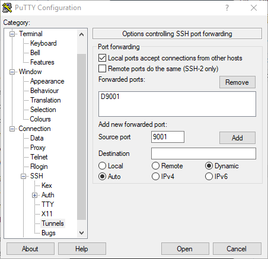

AWS Blockchain Templates was discontinued on April 30, 2019. No further updates to this
service or this supporting documentation will be made. For the best Managed Blockchain experience on AWS,
we recommend that you use [Amazon Managed Blockchain
(AMB)](https://aws.amazon.com/managed-blockchain/ "https://aws.amazon.com/managed-blockchain/"). To learn more about getting started with Amazon Managed Blockchain, see our
[workshop on Hyperledger Fabric](https://catalog.us-east-1.prod.workshops.aws/workshops/008da2cb-8454-42d0-877b-bc290bff7fcf/en-US "https://catalog.us-east-1.prod.workshops.aws/workshops/008da2cb-8454-42d0-877b-bc290bff7fcf/en-US"), or our [blog on deploying an Ethereum node](https://aws.amazon.com/blogs/database/deploy-an-ethereum-node-on-amazon-managed-blockchain/ "https://aws.amazon.com/blogs/database/deploy-an-ethereum-node-on-amazon-managed-blockchain/").
If you have questions about AMB or require further support, [contact Support](https://console.aws.amazon.com/support/home#/case/create?issueType=technical "https://console.aws.amazon.com/support/home#/case/create?issueType=technical") or your AWS account team.

# Connect to EthStats and EthExplorer Using the Bastion Host

To connect to Ethereum resources in this tutorial, you set up SSH port forwarding (SSH tunneling) through the bastion host. The following instructions demonstrate how to do this so that you can connect to EthStats and EthExplorer URLs using a browser. In the instructions below, you first set up a SOCKS proxy on a local port. You then use a browser extension, [FoxyProxy](https://getfoxyproxy.org/ "https://getfoxyproxy.org/"), to use this forwarded port for your Ethereum network URLs.

If you use Mac OS or Linux, use an SSH client to set up the SOCKS proxy connection to the bastion host. If you are a Windows user, use PuTTY. Before you connect, confirm that the client computer you are using is specified as an allowed source for inbound SSH traffic in the security group for the Application Load Balancer that you set up earlier.

###### To connect to the bastion host with SSH port forwarding using SSH

- Follow the procedures in [Connecting to Your Linux Instance Using SSH](../../../AWSEC2/latest/UserGuide/AccessingInstancesLinux.md "../../../AWSEC2/latest/UserGuide/AccessingInstancesLinux.md") in the _Amazon EC2 User Guide_. For step 4 of the [Connecting to Your Linux Instance](../../../AWSEC2/latest/UserGuide/AccessingInstancesLinux.md#AccessingInstancesLinuxSSHClient "../../../AWSEC2/latest/UserGuide/AccessingInstancesLinux.md#AccessingInstancesLinuxSSHClient") procedure, add `-D 9001` to the SSH command, specify the same key pair that you specified in the AWS Blockchain Template for Ethereum configuration, and specify the DNS name of the bastion host.

```
ssh -i `/path/my-template-key-pair.pem` ec2-user@`bastion-host-dns` -D 9001
```

###### To connect to the bastion host with SSH port forwarding using PuTTY (Windows)

1. Follow the procedures in [Connecting to Your Linux Instance from Windows Using PuTTY](../../../AWSEC2/latest/UserGuide/putty.md "../../../AWSEC2/latest/UserGuide/putty.md") in the _Amazon EC2 User Guide_ through step 7 of the [Starting a PuTTY Session](../../../AWSEC2/latest/UserGuide/putty.md#putty-ssh "../../../AWSEC2/latest/UserGuide/putty.md#putty-ssh") procedure, using the same key pair that you specified in the AWS Blockchain Template for Ethereum configuration.
2. In PuTTY, under **Category**, choose **Connection**, **SSH**, **Tunnels**.
3. For **Port forwarding**, choose **Local ports accept connections from other hosts**.
4. Under **Add new forwarded port**:
   1. For **Source port**, enter **9001**. This is an arbitrary unused port that we chose, and you can choose a different one if necessary.
   2. Leave **Destination** blank.
   3. Select **Dynamic**.
   4. Choose **Add**.For **Forwarded ports**, **D9001** should appear as shown below.

 5. Choose **Open** and then authenticate to the bastion host as required by your key configuration. Leave the connection open.
With the PuTTY connection open, you now configure your system or a browser extension to use the forwarded port for your Ethereum network URLs. The following instructions are based on using FoxyProxy Standard to forward connections based on the URL pattern of EthStats and EthExplorer and port 9001, which you established earlier as the forwarded port, but you can use any method that you prefer.

###### To configure FoxyProxy to use the SSH tunnel for Ethereum network URLs

This procedure was written based on Chrome. If you use another browser, translate the settings and sequence to the version of FoxyProxy for that browser.

1. Download and install the FoxyProxy Standard browser extension, and then open **Options** according to the instructions for your browser.
2. Choose **Add New Proxy**.
3. On the **General** tab, make sure that the proxy is **Enabled** and enter a **Proxy Name** and **Proxy Notes** that help you identify this proxy configuration.
4. On the **Proxy Details** tab, choose **Manual Proxy Configuration**. For **Host or IP Address** (or **Server or IP Address** in some versions), enter _localhost_. For **Port**, enter _9001_. Select **SOCKS Proxy?**.
5. On the **URL Pattern** tab, choose **Add New Pattern**.
6. For **Pattern name**, enter a name that's easy to identify, and for **URL Pattern**, enter a pattern that matches all Ethereum resource URLs you created with the template, for example **http://internal-MyUser-LoadB-\***. For information on viewing URLs, see [Ethereum URLs](blockchain-templates-create-stack.md#ethereum-urls "blockchain-templates-create-stack.md#ethereum-urls").
7. Leave the default selections for other settings and choose **Save**.
   You are now able to connect to the Ethereum URLs, which are available on CloudFormation console using the **Outputs** tab of the root stack that you created with the template.
