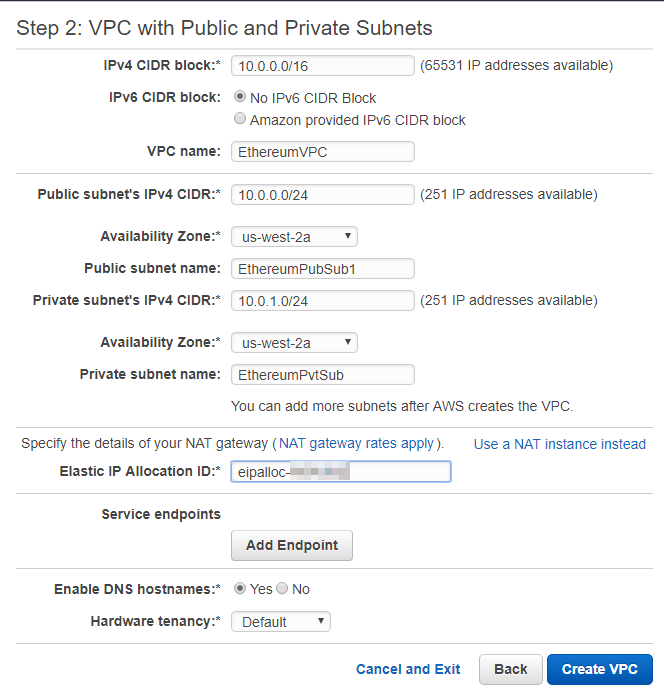
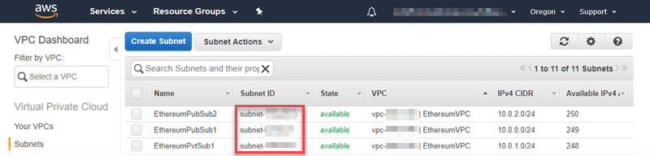
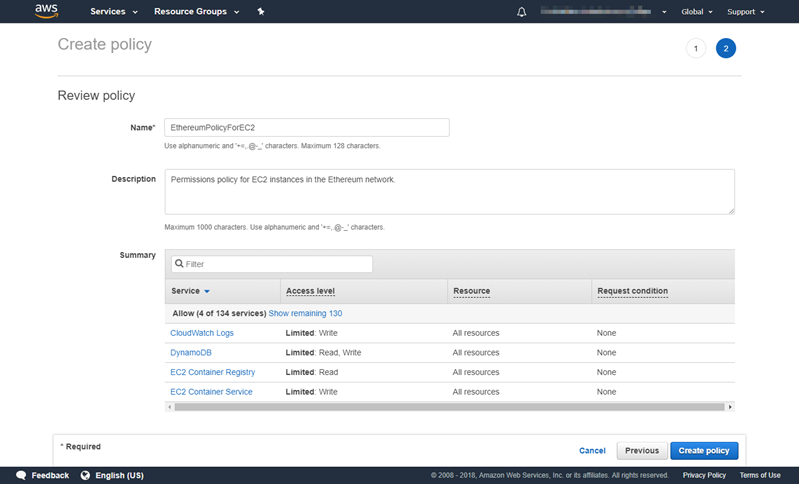
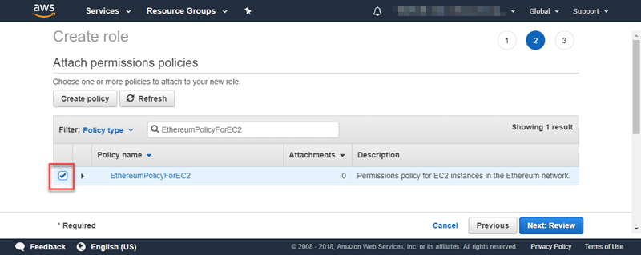
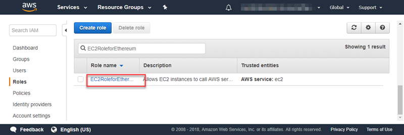
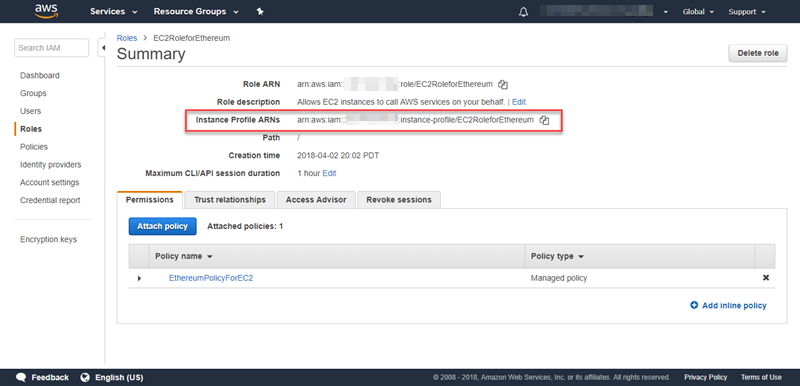
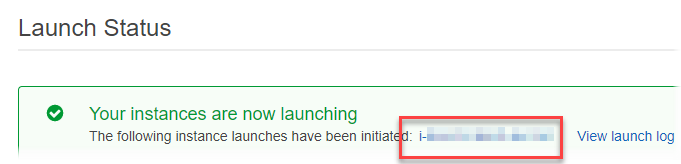

AWS Blockchain Templates was discontinued on April 30, 2019. No further updates to this
service or this supporting documentation will be made. For the best Managed Blockchain experience on AWS,
we recommend that you use [Amazon Managed Blockchain
(AMB)](https://aws.amazon.com/managed-blockchain/ "https://aws.amazon.com/managed-blockchain/"). To learn more about getting started with Amazon Managed Blockchain, see our
[workshop on Hyperledger Fabric](https://catalog.us-east-1.prod.workshops.aws/workshops/008da2cb-8454-42d0-877b-bc290bff7fcf/en-US "https://catalog.us-east-1.prod.workshops.aws/workshops/008da2cb-8454-42d0-877b-bc290bff7fcf/en-US"), or our [blog on deploying an Ethereum node](https://aws.amazon.com/blogs/database/deploy-an-ethereum-node-on-amazon-managed-blockchain/ "https://aws.amazon.com/blogs/database/deploy-an-ethereum-node-on-amazon-managed-blockchain/").
If you have questions about AMB or require further support, [contact Support](https://console.aws.amazon.com/support/home#/case/create?issueType=technical "https://console.aws.amazon.com/support/home#/case/create?issueType=technical") or your AWS account team.

# Set Up Prerequisites

The AWS Blockchain Template for Ethereum configuration that you specify in this tutorial requires that you do the following:

- [Create a VPC and Subnets](#blockchain-templates-create-a-vpc "#blockchain-templates-create-a-vpc")
- [Create Security Groups](#blockchain-templates-create-security-group "#blockchain-templates-create-security-group")
- [Create an IAM Role for Amazon ECS and an EC2 Instance Profile](#blockchain-templates-iam-roles "#blockchain-templates-iam-roles")
- [Create a Bastion Host](#blockchain-templates-bastion-host "#blockchain-templates-bastion-host")

## Create a VPC and Subnets

The AWS Blockchain Template for Ethereum launches resources into a virtual network that you define using Amazon Virtual Private Cloud
(Amazon VPC). The configuration you specify in this tutorial creates an Application Load Balancer, which requires two public subnets in different Availability Zones. In addition, a private subnet is required for the container instances, and the subnet must be in the same Availability Zone as the Application Load Balancer. You first use the VPC Wizard to create one public subnet and a private subnet in the same Availability Zone. You then create a second public subnet within this VPC in a different Availability Zone.

For more information, see [What is Amazon VPC?](../../../vpc/latest/userguide.md "../../../vpc/latest/userguide.md") in the
_Amazon VPC User Guide_.

Use the Amazon VPC console ([https://console.aws.amazon.com/vpc/](https://console.aws.amazon.com/vpc/ "https://console.aws.amazon.com/vpc/")) to create the Elastic IP address, the VPC, and the subnet as described below.

###### To create an Elastic IP address

1. Open the Amazon VPC console at
   [https://console.aws.amazon.com/vpc/](https://console.aws.amazon.com/vpc/ "https://console.aws.amazon.com/vpc/").
2. Choose **Elastic IPs**, **Allocate new address**,
   **Allocate**.
3. Make a note of the Elastic IP address that you create and choose
   **Close**.
4. In the list of Elastic IP addresses, find the **Allocation ID** for
   the Elastic IP address created earlier. You use this when you create the VPC.

###### To create the VPC

1. From the navigation bar, select a Region for the VPC. VPCs are specific to a Region, so
   select the same Region in which you created your key pair in and where you are launching the
   Ethereum stack. For more information, see [Create a Key Pair](blockchain-templates-setting-up.md#blockchain-templates-create-a-key-pair "blockchain-templates-setting-up.md#blockchain-templates-create-a-key-pair").
2. On the VPC dashboard, choose **Start VPC Wizard**.
3. On the **Step 1: Select a VPC Configuration** page, choose
   **VPC with Public and Private Subnets**,
   **Select**.
4. On the **Step 2: VPC with Public and Private Subnets** page, leave
   **IPv4 CIDR block** and **IPv6 CIDR block** to their
   default values. For **VPC name**, enter a friendly name.
5. For **Public subnet's IPv4 CIDR**, leave the default value. For
   **Availability Zone**, choose a zone. For **Public subnet
   name**, enter a friendly name.

You specify this subnet as one of the first of two subnets for the Application Load
Balancer when you use the template.

Note the Availability Zone of this subnet because you select the same Availability Zone for the private subnet, and a different
one for the other public subnet. 6. For **Private subnet's IPv4 CIDR**, leave the default value. For
**Availability Zone**, select the same Availability Zone as in the previous step. For **Private subnet name**, enter a friendly name. 7. For **Elastic IP Allocation ID**, select the Elastic IP address that you created earlier. 8. Leave the default values for other settings. 9. Choose **Create VPC**.

The example below shows a VPC **EthereumNetworkVPC** with a public
subnet **EthereumPubSub1** and a private subnet
**EthereumPvtSub1**. The public subnet uses Availability Zone
**us-west-2a**.



###### To create the second public subnet in a different Availability Zone

1. Choose **Subnets** and then select the public subnet that you created earlier from the list. Select the **Route Table** tab and note the **Route table** ID. You specify this same route table for the second public subnet below.
2. Choose **Create
   Subnet**.
3. For **Name tag**, enter a name for the subnet. You use this name later when you create the bastion host in this network.
4. For **VPC**, select the VPC that you created earlier.
5. For **Availability Zone**, select a different zone from the zone that
   you selected for the first public subnet.
6. For **IPv4 CIDR block**, enter
   **10.0.2.0/24**.
7. Choose **Yes, Create**. The subnet is added to the list of subnets.
8. With the subnet selected from the list, choose **Subnet Actions**, **Modify auto-assign IP settings**. Select **Auto-assign IPs**, **Save**, **Close**. This allows the bastion host to obtain a public IP address when you create it in this subnet.
9. On the **Route Table** tab, choose **Edit**. For **Change to**, select the route table ID that you noted earlier and choose **Save**.

You should now see three subnets for the VPC that you created earlier. Make a note of the subnet names and IDs so that you can specify them using the template.



## Create Security Groups

Security groups act as firewalls, controlling inbound and outbound
traffic to resources. When you use the template to create an Ethererum network on an Amazon ECS cluster, you specify two security groups:

- A security group for EC2 instances that controls traffic to and from EC2 instances in the cluster
- A security group for the Application Load Balancer that controls traffic between the
  Application Load Balancer, EC2 instances, and the bastion host. You associate this security
  group with the bastion host as well.

Each security group has rules that allow communication between the Application Load
Balancer and the EC2 instances, as well as other minimum rules. This requires that the
security groups reference one another. For this reason, you first create the security groups
and then update them with appropriate rules.

###### To create two security groups

1. Open the Amazon EC2 console at
   [https://console.aws.amazon.com/ec2/](https://console.aws.amazon.com/ec2/ "https://console.aws.amazon.com/ec2/").
2. In the navigation pane, choose **Security Groups**, **Create
   Security Group**.
3. For **Security group name**, enter a name for the security group that's easy to identify and will differentiate it from the other, such
   as _EthereumEC2-SG_ or _EthereumALB-SG_. You use these names later. For **Description**, enter a brief
   summary.
4. For **VPC**, select the VPC that you created earlier.
5. Choose **Create**.
6. Repeat the steps above to create the other security group.

###### Add inbound rules to the security group for EC2 instances

1. Select the security group for EC2 instances that you created earlier
2. On the **Inbound** tab, choose **Edit**.
3. For **Type**, choose **All traffic**. For **Source**, leave **Custom** selected, and then choose the security group you are currently editing from the list, for example, _EthereumEC2-SG_. This allows the EC2 instances in the security group to communicate with one another.
4. Choose **Add Rule**.
5. For **Type**, choose **All traffic**. For **Source**, leave **Custom** selected, and then choose the security group for the Application Load Balancer from the list, for example, _EthereumALB-SG_. This allows the EC2 instances in the security group to communicate with the Application Load Balancer.
6. Choose **Save**.

###### Add inbound and edit outbound rules for the security group for the Application Load Balancer

1. Select the security group for Application Load Balancers that you created earlier
2. On the **Inbound** tab, choose **Edit** and then add the following inbound rules:
   1. For **Type**, choose **All traffic**. For **Source**, leave **Custom** selected, and then choose the security group you are currently editing from the list, for example, _EthereumALB-SG_. This allows the Application Load Balancer to communicate with itself and with the bastion host.
   2. Choose **Add Rule**.
   3. For **Type**, choose **All traffic**. For **Source**, leave **Custom** selected, and then choose the security group for EC2 instances from the list, for example, _EthereumEC2-SG_. This allows the EC2 instances in the security group to communicate with the Application Load Balancer and the bastion host.
   4. Choose **Add Rule**.
   5. For **Type**, choose **SSH**. For **Source**, select **My IP**, which detects your computer's IP CIDR and enters it.

   ###### Important

   This rule allows the bastion host to accept SSH traffic from your computer, enabling
   your computer to use the bastion host to view web interfaces and connect to EC2 instances
   on the Ethereum network. To allow others to connect to the Ethereum network, add them as
   sources to this rule. Only allow inbound traffic to trusted sources. 6. Choose **Save**.

3. On the **Outbound** tab, choose **Edit** and delete the rule that was automatically created to allow outbound traffic to all IP addresses.
4. Choose **Add Rule**.
5. For **Type**, choose **All traffic**. For **Destination**, leave **Custom** selected, and then choose the security group for EC2 instances from the list. This allows outbound connections from the Application Load Balancer and the bastion host to EC2 instances in the Ethereum network.
6. Choose **Add Rule**.
7. For **Type**, choose **All traffic**. For **Destination**, leave **Custom** selected, and then choose the security group you are currently editing from the list, for example, _EthereumALB-SG_. This allows the Application Load Balancer to communicate with itself and with the bastion host.
8. Choose **Save**.

## Create an IAM Role for Amazon ECS and an EC2 Instance Profile

When you use this template, you specify an IAM role for Amazon ECS and an EC2 instance
profile. The permissions policies attached to these roles allow the AWS resources and instances in
your cluster interact with other AWS resources. For more information, see [IAM Roles](../../../IAM/latest/UserGuide/id_roles.md "../../../IAM/latest/UserGuide/id_roles.md") in the
_IAM User Guide_. You set up the IAM role for Amazon ECS and the EC2 instance profile using the IAM console ([https://console.aws.amazon.com/iam/](https://console.aws.amazon.com/iam/ "https://console.aws.amazon.com/iam/")).

###### To create the IAM role for Amazon ECS

1. Open the IAM console at
   [https://console.aws.amazon.com/iam/](https://console.aws.amazon.com/iam/ "https://console.aws.amazon.com/iam/").
2. In the navigation pane, choose **Roles**, **Create
   Role**.
3. Under **Select type of trusted entity**, choose **AWS
   service**.
4. For **Choose the service that will use this role**, choose
   **Elastic Container Service**.
5. Under **Select your use case**, choose **Elastic Container
   Service**, **Next:Permissions**.

 6. For **Permissions policy**, leave the default policy
(**AmazonEC2ContainerServiceRole**) selected, and choose
**Next:Review**. 7. For **Role name**, enter a value that helps you identify the role,
such as _ECSRoleForEthereum_. For **Role Description**,
enter a brief summary. Note the role name for later. 8. Choose **Create role**. 9. Select the role that you just created from the list. If your account has many roles,
you can search for the role name.

 10. Copy the **Role ARN** value and save it so that you can copy it again.
You need this ARN when you create the Ethereum network.


The EC2 instance profile that you specify in the template is assumed by EC2 instances in the Ethereum network to interact with other AWS services. You create a permissions policy for the role, create the role (which automatically creates an instance profile of the same name), and then attach the permissions policy to the role.

###### To create an EC2 instance profile

1. In the navigation pane, choose **Policies**, **Create
   policy**.
2. Choose **JSON** and replace the default policy statement with the
   following JSON policy:

```

{
    "Version": "2012-10-17",
    "Statement": [
        {
            "Effect": "Allow",
            "Action": [
                "ecs:CreateCluster",
                "ecs:DeregisterContainerInstance",
                "ecs:DiscoverPollEndpoint",
                "ecs:Poll",
                "ecs:RegisterContainerInstance",
                "ecs:StartTelemetrySession",
                "ecs:Submit*",
                "ecr:GetAuthorizationToken",
                "ecr:BatchCheckLayerAvailability",
                "ecr:GetDownloadUrlForLayer",
                "ecr:BatchGetImage",
                "logs:CreateLogStream",
                "logs:PutLogEvents",
                "dynamodb:BatchGetItem",
                "dynamodb:BatchWriteItem",
                "dynamodb:PutItem",
                "dynamodb:DeleteItem",
                "dynamodb:GetItem",
                "dynamodb:Scan",
                "dynamodb:Query",
                "dynamodb:UpdateItem"
            ],
            "Resource": "*"
        }
    ]
}

```

3. Choose **Review policy**.
4. For **Name**, enter a value that helps you identify this permissions
   policy, for example _EthereumPolicyForEC2_. For
   **Description**, enter a brief summary. Choose **Create
   policy**.

 5. Choose **Roles**, **Create role**. 6. Choose **EC2**, **Next: Permissions**. 7. In the **Search** field, enter the name of the permissions policy that
you created earlier, for example _EthereumPolicyForEC2_. 8. Select the check mark for the policy that you created earlier, and choose
**Next: Review**.

 9. For **Role name**, enter a value that helps you identify the role, for
example _EC2RoleForEthereum_. For **Role description**,
enter a brief summary.Choose **Create role**. 10. Select the role that you just created from the list. If your account has many roles,
you can enter the role name in the **Search** field.

 11. Copy the **Instance Profile ARN** value and save it so you can copy it
again. You need this ARN when you create the Ethereum network.



## Create a Bastion Host

In this tutorial, you create a _bastion host_. This is an EC2 instance
that you use to connect to the web interfaces and instances in your Ethereum network. Its
sole purpose is to forward SSH traffic from trusted clients outside the VPC so that they can access Ethereum network resources.

You set up the bastion host because the Application Load Balancer that the template creates is internal, meaning it only routes internal IP addresses. The bastion host:

- Has an internal IP address that the Application Load Balancer recognizes because you launch it in the second public subnet that you created earlier.
- Has a public IP address that the subnet assigns, which can be accessed by trusted sources outside the VPC.
- Is associated with the security group for the Application Load Balancer you created earlier, which has an inbound rule that allows SSH traffic (port 22) from trusted clients.

To be able to access the Ethereum network, trusted clients need to be set up to connect through the bastion host. For more information, see [Connect to EthStats and EthExplorer Using the Bastion Host](blockchain-bastion-host-connect.md "blockchain-bastion-host-connect.md"). A bastion host is one approach. You can use any approach that provides access from trusted clients to private resources within a VPC.

###### To create a bastion host

1. Follow the first five steps to [Launch an Instance](../../../AWSEC2/latest/UserGuide/EC2_GetStarted.md#ec2-launch-instance "../../../AWSEC2/latest/UserGuide/EC2_GetStarted.md#ec2-launch-instance") in the _Amazon EC2 User Guide_.
2. Choose **Edit Instance Details**. For **Network**, choose the VPC you created earlier, for **Subnet** select the second public subnet that you created earlier. Leave all other settings to their defaults.
3. Confirm the change when prompted, and then choose **Review and Launch**.
4. Choose **Edit Security Groups**. For **Assign a security group**, choose **Select an existing security group**.
5. From the list of security groups, select the security group for the Application Load Balancer that you created earlier, and then choose **Review and Launch**.
6. Choose **Launch**.
7. Note the instance ID. You need it later when you [Connect to EthStats and EthExplorer Using the Bastion Host](blockchain-bastion-host-connect.md "blockchain-bastion-host-connect.md").


