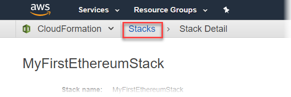
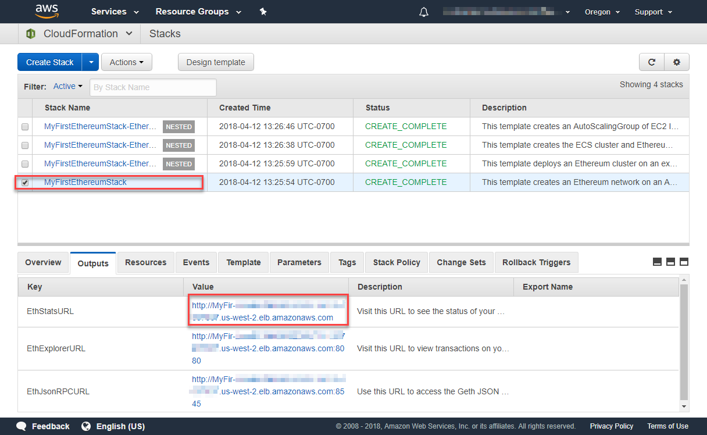

AWS Blockchain Templates was discontinued on April 30, 2019. No further updates to this
service or this supporting documentation will be made. For the best Managed Blockchain experience on AWS,
we recommend that you use [Amazon Managed Blockchain
(AMB)](https://aws.amazon.com/managed-blockchain/ "https://aws.amazon.com/managed-blockchain/"). To learn more about getting started with Amazon Managed Blockchain, see our
[workshop on Hyperledger Fabric](https://catalog.us-east-1.prod.workshops.aws/workshops/008da2cb-8454-42d0-877b-bc290bff7fcf/en-US "https://catalog.us-east-1.prod.workshops.aws/workshops/008da2cb-8454-42d0-877b-bc290bff7fcf/en-US"), or our [blog on deploying an Ethereum node](https://aws.amazon.com/blogs/database/deploy-an-ethereum-node-on-amazon-managed-blockchain/ "https://aws.amazon.com/blogs/database/deploy-an-ethereum-node-on-amazon-managed-blockchain/").
If you have questions about AMB or require further support, [contact Support](https://console.aws.amazon.com/support/home#/case/create?issueType=technical "https://console.aws.amazon.com/support/home#/case/create?issueType=technical") or your AWS account team.

# Create the Ethereum Network

The Ethereum network that you specify using the template in this topic launches an AWS CloudFormation stack that creates an Amazon ECS cluster of EC2 instances for the Ethereum network. The template relies on the resources that you created earlier in [Set Up Prerequisites](blockchain-template-getting-started-prerequisites.md "blockchain-template-getting-started-prerequisites.md").

When you launch the AWS CloudFormation stack using the template, it creates nested stacks for some tasks. After they are complete, you can connect to resources served by the network's Application Load Balancer through the bastion host to verify that your Ethereum network is running and accessible.

###### To create the Ethereum network using the AWS Blockchain Template for Ethereum

1. See [Getting Started with AWS Blockchain Templates](https://aws.amazon.com/blockchain/templates/getting-started/ "https://aws.amazon.com/blockchain/templates/getting-started/"), and open the latest AWS Blockchain Template for Ethereum in the AWS CloudFormation console using the quick-links for your AWS Region.
2. Enter values according to the following guidelines:
   - For **Stack name**, enter a name that is easy for you to identify. This name is used within the names of resources that the stack creates.
   - Under **Ethereum Network Parameters** and **Private Ethereum
     Network Parameters**, leave the default settings.

   ###### Warning

   Use the default accounts and associated mnemonic phrase for testing purposes only. Do not send real Ether using the default set of accounts because anyone with access to the mnemonic phrase can access or steal Ether from the accounts. Instead, specify custom accounts for production purposes. The mnemonic phrase associated with the default account is `outdoor father modify clever trophy abandon vital feel portion grit evolve twist`.
   - Under **Platform configuration**, leave the default settings, which
     creates an Amazon ECS cluster of EC2 instances. The alternative, **docker-local**
     creates an Ethereum network using a single EC2 instance.
   - Under **EC2 configuration**, select options according to the following guidelines:
     - For **EC2 Key Pair**, select a key pair. For information about creating a key pair, see [Create a Key Pair](blockchain-templates-setting-up.md#blockchain-templates-create-a-key-pair "blockchain-templates-setting-up.md#blockchain-templates-create-a-key-pair").
     - For **EC2 Security Group**, select the security group you created earlier in [Create Security Groups](blockchain-template-getting-started-prerequisites.md#blockchain-templates-create-security-group "blockchain-template-getting-started-prerequisites.md#blockchain-templates-create-security-group").
     - For **EC2 Instance Profile ARN**, enter the ARN of the instance profile that you created earlier in [Create an IAM Role for Amazon ECS and an EC2 Instance Profile](blockchain-template-getting-started-prerequisites.md#blockchain-templates-iam-roles "blockchain-template-getting-started-prerequisites.md#blockchain-templates-iam-roles").

   - Under **VPC network configuration, select options according to the following guidelines:**
     - For **VPC ID**, select the VPC that you created earlier in [Create a VPC and Subnets](blockchain-template-getting-started-prerequisites.md#blockchain-templates-create-a-vpc "blockchain-template-getting-started-prerequisites.md#blockchain-templates-create-a-vpc").
     - For **Ethereum Network Subnet IDs**, select the single private
       subnet that you created earlier in the procedure [To create the VPC](blockchain-template-getting-started-prerequisites.md#create-vpc-procedure "blockchain-template-getting-started-prerequisites.md#create-vpc-procedure").

   - Under **ECS cluster configuration**, leave the defaults. This creates an ECS cluster of three EC2 instances.
   - Under **Application Load Balancer configuration (ECS only)**, select options according to the following guidelines:
     - For **Application Load Balancer Subnet IDs**, select two public subnets from the [list of subnets](blockchain-template-getting-started-prerequisites.md#list-of-subnets "blockchain-template-getting-started-prerequisites.md#list-of-subnets") that you noted earlier.
     - For **Application Load Balancer Security Group**, select the security group for the Application Load Balancer that you created earlier in [Create Security Groups](blockchain-template-getting-started-prerequisites.md#blockchain-templates-create-security-group "blockchain-template-getting-started-prerequisites.md#blockchain-templates-create-security-group").
     - For **IAM Role**, enter the ARN of the ECS role that you created earlier in [Create an IAM Role for Amazon ECS and an EC2 Instance Profile](blockchain-template-getting-started-prerequisites.md#blockchain-templates-iam-roles "blockchain-template-getting-started-prerequisites.md#blockchain-templates-iam-roles").

   - Under **EthStats**, select options according to the following guidelines:
     - For **Deploy EthStats**, leave the default setting, which is
       _true_.
     - For **EthStats Connection Secret**, type an arbitrary value that is at least six characters.

   - Under **EthExplorer**, leave the default setting for **Deploy EthExplorer**, which is
     _true_.
   - Under **Other parameters**, leave the default value for **Nested Template S3 URL Prefix** and make a note of it. This is where you can find nested templates.

3. Leave all other settings to their defaults, select the acknowledgement check box, and choose **Create**.

The **Stack Detail** page for the root stack that AWS CloudFormation launches appears. 4. To monitor the progress of the root stack and nested stacks, choose **Stacks**.

 5. When all stacks show **CREATE_COMPLETE** for **Status**, you can connect to Ethereum user interfaces to verify that the network is running and accessible. When you use the ECS container platform, URLs for connecting to EthStats, EthExplorer, and EthJsonRPC through the Application Load Balancer are available on the **Outputs** tab of the root stack.

###### Important

You won't be able to connect directly to these URLs or SSH directly until you set up a proxy connection through the bastion host on your client computer. For more information, see [Connect to EthStats and EthExplorer Using the Bastion Host](blockchain-bastion-host-connect.md "blockchain-bastion-host-connect.md").

