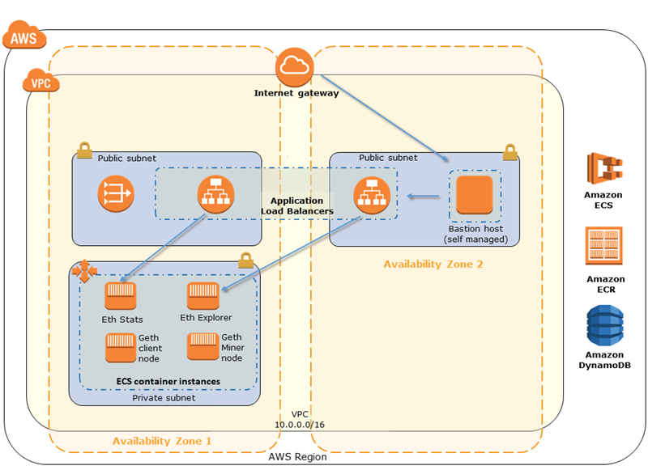
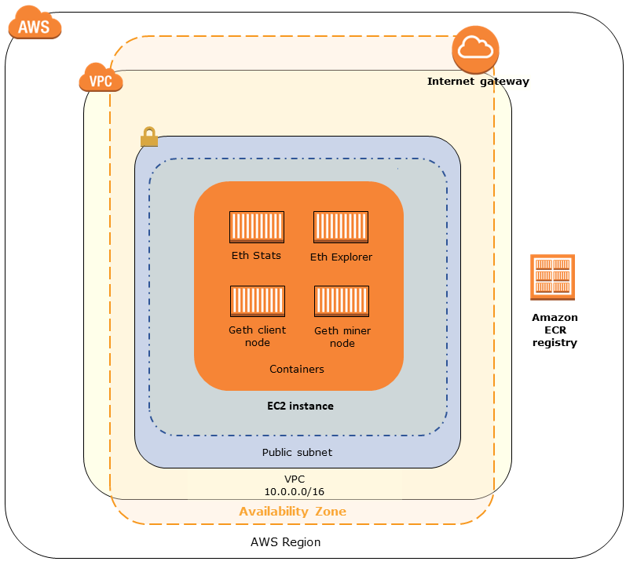
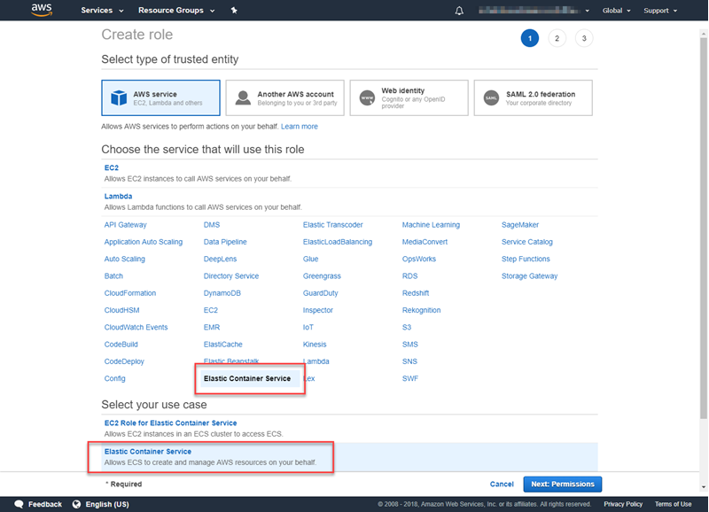
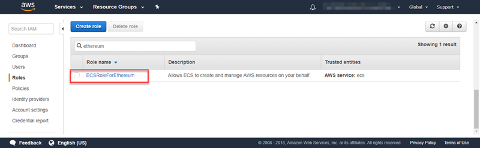
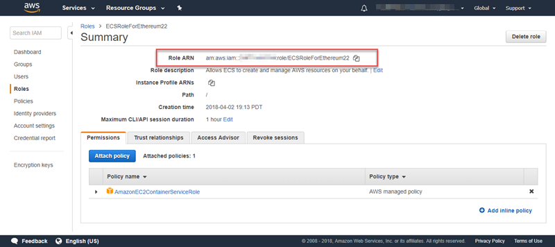

AWS Blockchain Templates was discontinued on April 30, 2019. No further updates to this
service or this supporting documentation will be made. For the best Managed Blockchain experience on AWS,
we recommend that you use [Amazon Managed Blockchain
(AMB)](https://aws.amazon.com/managed-blockchain/ "https://aws.amazon.com/managed-blockchain/"). To learn more about getting started with Amazon Managed Blockchain, see our
[workshop on Hyperledger Fabric](https://catalog.us-east-1.prod.workshops.aws/workshops/008da2cb-8454-42d0-877b-bc290bff7fcf/en-US "https://catalog.us-east-1.prod.workshops.aws/workshops/008da2cb-8454-42d0-877b-bc290bff7fcf/en-US"), or our [blog on deploying an Ethereum node](https://aws.amazon.com/blogs/database/deploy-an-ethereum-node-on-amazon-managed-blockchain/ "https://aws.amazon.com/blogs/database/deploy-an-ethereum-node-on-amazon-managed-blockchain/").
If you have questions about AMB or require further support, [contact Support](https://console.aws.amazon.com/support/home#/case/create?issueType=technical "https://console.aws.amazon.com/support/home#/case/create?issueType=technical") or your AWS account team.

# Using the AWS Blockchain Template for Ethereum

Ethereum is a blockchain framework that runs smart contracts using Solidity, an
Ethereum-specific language. Homestead is the most recent release of Ethereum. For more
information, see the [Ethereum Homestead Documentation](http://www.ethdocs.org/en/latest/ "http://www.ethdocs.org/en/latest/") and the [Solidity](https://solidity.readthedocs.io/en/v0.4.21/# "https://solidity.readthedocs.io/en/v0.4.21/#") documentation.

## Links to Launch

See [Getting Started with AWS Blockchain Templates](https://aws.amazon.com/blockchain/templates/getting-started/ "https://aws.amazon.com/blockchain/templates/getting-started/") for links to launch AWS CloudFormation in specific Regions using the Ethereum templates.

## Ethereum Options

When you configure the Ethereum network using the template, you make choices that determine
the subsequent requirements:

- [Choosing the Container Platform](#blockchain-ethereum-platform "#blockchain-ethereum-platform")
- [Choosing a Private or Public Ethereum Network](#blockchain-private-public "#blockchain-private-public")
- [Changing the Default Accounts and Mnemonic Phrase](#blockchain-ethereum-mnemonic "#blockchain-ethereum-mnemonic")

### Choosing the Container Platform

AWS Blockchain Templates use Docker containers stored in Amazon ECR to deploy blockchain software. The AWS Blockchain Template for Ethereum offers two choices for the **Container Platform** :

- **ecs**—Specifies that Ethereum runs on an Amazon ECS cluster of Amazon EC2
  instances.
- **docker-local**—Specifies that Ethereum runs on a single EC2
  instance.

#### Using the Amazon ECS Container Platform

With Amazon ECS, you create your Ethereum network on an ECS cluster composed of multiple EC2
instances, with an Application Load Balancer and related resources. For more information about
using the Amazon ECS configuration, see the [Getting Started with AWS Blockchain Templates](blockchain-templates-getting-started.md "blockchain-templates-getting-started.md") tutorial.

The following diagram depicts an Ethereum network created using the template with the ECS container platform option:

#### Using the Docker-Local Platform

Alternatively, you can launch Ethereum containers within a single Amazon EC2 instance. All
containers run on a single EC2 instance. This is a simplified setup.

The following diagram depicts an Ethereum network created using the template with the docker-local container platform option:

### Choosing a Private or Public Ethereum Network

Choosing an **Ethereum Network ID** value other than 1–4 creates
private Ethereum nodes that run within a network that you define, using the private network
parameters that you specify.

When you choose an **Ethereum Network ID** from 1–4, the Ethereum
nodes that you create are joined to the public Ethereum network. You can ignore private network
settings and their defaults. If you choose to join Ethereum nodes to the public Ethereum
network, ensure that the appropriate services in your network are internet-accessible.

### Changing the Default Accounts and Mnemonic Phrase

A mnemonic phrase is a random set of words that you can use to generate Ethereum wallets (that is, private/public key pairs) for associated accounts on any network. The mnemonic phrase can be used to access Ether for associated accounts. We created a default mnemonic associated with the default accounts that the Ethereum template uses.

###### Warning

Use the default accounts and associated mnemonic phrase for testing purposes only. Do not send real Ether using the default set of accounts because anyone with access to the mnemonic phrase can access or steal Ether from the accounts. Instead, specify custom accounts for production purposes. The mnemonic phrase associated with the default account is `outdoor father modify clever trophy abandon vital feel portion grit evolve twist`.

## Prerequisites

When you set up your Ethereum network using the AWS Blockchain Template for Ethereum, the minimum requirements listed below must be satisfied. The template requires the AWS components listed for each of the following categories:

###### Topics

- [Prerequisites for Accessing Ethereum Resources](#blockchain-ethereum-prereq-access "#blockchain-ethereum-prereq-access")
- [IAM Prerequisites](#blockchain-ethereum-prereq-iam "#blockchain-ethereum-prereq-iam")
- [Security Group Prerequisites](#blockchain-ethereum-prereq-sec "#blockchain-ethereum-prereq-sec")
- [VPC Prerequisites](#blockchain-ethereum-prereq-vpc "#blockchain-ethereum-prereq-vpc")
- [Example IAM Permissions for the EC2 Instance Profile and ECS Role](#blockchain-ethereum-iam-examples "#blockchain-ethereum-iam-examples")

### Prerequisites for Accessing Ethereum Resources

| Prerequisite                                                                                                                                                                                                                                                                                                                                                                                                                                                                                                                                                                                                                                                                                                                                                                                                                                                                                                           | For ECS Platform | For Docker-Local         |
| ---------------------------------------------------------------------------------------------------------------------------------------------------------------------------------------------------------------------------------------------------------------------------------------------------------------------------------------------------------------------------------------------------------------------------------------------------------------------------------------------------------------------------------------------------------------------------------------------------------------------------------------------------------------------------------------------------------------------------------------------------------------------------------------------------------------------------------------------------------------------------------------------------------------------- | ---------------- | ------------------------ | ---------------------------------------------------------------------------------------------------------------------------------------------------------------------------------------------------------------------------------------------------------------------------------------------------------------------------------------------------------------------------------------------------------------------------------------------------------------------------------------------------------------------------------------------------------------------------------------------------------------------------------------------------------------------------------------------------------------------------------------------------------------------------------------------------------------------------------------------------------------------------------------------------------------------------------------------------------------------------------------------------------------------------------------------------------------------------------------------------------------------------------------------------------------------------------------------------------------------------------------------------------------------------------------------------------------------------------------------------------------------------------------------------------------------------------------------------------------------------------------------------------------------------------------------------------------------------------------------------------------------------------------------------------------------------------------------------------------------------------------------------------------------------------------------------------------------------------------------------------------------------------------------------------------------------------------------------------------------------------------------------------------------------------------------------------------------------------------------------------------------------------------------------------------------------------------------------------------------------------------------------------------------------------------------------------------------------------------------------------------------------------------------------------------------------------------------------------------------------------------------------------------------------------------------------------------------------------------------------------------------------------------------------------------------------------------------------------------------------------------------------------------------------------------------------------------------------------------------------------------------------------------------------------------------------------------------------------------------------------------------------------------------------------------------------------------------------------------------------------------------------------------------------------------------------------------------------------------------------------------------------------------------------------------------------------------------------------------------------------------------------------------------------------------------------------------------------------------------------------------------------------------------------------------------------------------------------------------------------------------------------------------------------------------------------------------------------------------------------------------------------------------------------------------------------------------------------------------------------------------------------------------------------------------------------------------------------------------------------------------------------------------------------------------------------------------------------------------------------------------------------------------------------------------------------------------------------------------------------------------------------------------------------------------------------------------------------------------------------------------------------------------------------------------------------------------------------------------------------------------------------------------------------------------------------------------------------------------------------------------------------------------------------------------------------------------------------------------------------------------------------------------------------------------------------------------------------------------------------------------------------------------------------------------------------------------------------------------------------------------------------------------------------------------------------------------------------------------------------------------------------------------------------------------------------------------------------------------------------------------------------------------------------------------------------------------------------------------------------------------------------------------------------------------------------------------------------------------------------------------------------------------------------------------------------------------------------------------------------------------------------------------------------------------------------------------------------------------------------------------------------------------------------------------------------------------------------------------------------------------------------------------------------------------------------------------------------------------------------------------------------------------------------------------------------------------------------------------------------------------------------------------------------------------------------------------------------------------------------------------------------------------------------------------------------------------------------------------------------------------------------------------------------------------------------------------------------------------------------------------------------------------------------------------------------------------------------------------------------------------------------------------------------------------------------------------------------------------------------------------------------------------------------------------------------------------------------------------------------------------------------------------------------------------------------------------------------------------------------------------------------------------------------------------------------------------------------------------------------------------------------------------------------------------------------------------------------------------------------------------------------------------------------------------------------------------------------------------------------------------------------------------------------------------------------------------------------------------------------------------------------------------------------------------------- |
| An Amazon EC2 key pair that you can use to access EC2 instances. The key must exist in the same Region as the ECS cluster and other resources.                                                                                                                                                                                                                                                                                                                                                                                                                                                                                                                                                                                                                                                                                                                                                                         | ✔               | ✔                       |
| An internet-facing component, such as a bastion host or an internet-facing load balancer, with an internal address from which traffic is allowed into the Application Load Balancer. This is required with the ECS platform because the template creates an internal load balancer for security reasons. This is required with the docker-local platform when the EC2 instance is in a private subnet, which we recommend. For information about configuring a bastion host, see [Create a Bastion Host](blockchain-template-getting-started-prerequisites.md#blockchain-templates-bastion-host "blockchain-template-getting-started-prerequisites.md#blockchain-templates-bastion-host").                                                                                                                                                                                                                             | ✔               | ✔ (with private subnet) | ### IAM Prerequisites                                                                                                                                                                                                                                                                                                                                                                                                                                                                                                                                                                                                                                                                                                                                                                                                                                                                                                                                                                                                                                                                                                                                                                                                                                                                                                                                                                                                                                                                                                                                                                                                                                                                                                                                                                                                                                                                                                                                                                                                                                                                                                                                                                                                                                                                                                                                                                                                                                                                                                                                                                                                                                                                                                                                                                                                                                                                                                                                                                                                                                                                                                                                                                                                                                                                                                                                                                                                                                                                                                                                                                                                                                                                                                                                                                                                                                                                                                                                                                                                                                                                                                                                                                                                                                                                                                                                                                                                                                                                                                                                                                                                                                                                                                                                                                                                                                                                                                                                                                                                                                                                                                                                                                                                                                                                                                                                                                                                                                                                                                                                                                                                                                                                                                                                                                                                                                                                                                                                                                                                                                                                                                                                                                                                                                                                                                                                                                                                                                                                                                                                                                                                                                                                                                                                                                                                                                                                                                                                                                                                                                                                                                                                                                                                                                                                                                                                                                                                                                                                                                                          |
| Prerequisite                                                                                                                                                                                                                                                                                                                                                                                                                                                                                                                                                                                                                                                                                                                                                                                                                                                                                                           | For ECS Platform | For Docker-Local         |
| ---                                                                                                                                                                                                                                                                                                                                                                                                                                                                                                                                                                                                                                                                                                                                                                                                                                                                                                                    | ---              | ---                      |
| An IAM principal (user or group) that has permissions to work with all related services.                                                                                                                                                                                                                                                                                                                                                                                                                                                                                                                                                                                                                                                                                                                                                                                                                               | ✔               | ✔                       |
| An Amazon EC2 instance profile with appropriate permissions for EC2 instances to interact with other services. For more information, see [To create an EC2 instance profile](blockchain-template-getting-started-prerequisites.md#create-ec2-role "blockchain-template-getting-started-prerequisites.md#create-ec2-role").                                                                                                                                                                                                                                                                                                                                                                                                                                                                                                                                                                                             | ✔               | ✔                       |
| An IAM role with permissions for Amazon ECS to interact with other services. For more information, see [Creating the ECS Role and Permissions](#blockchain-ethereum-ecs-role "#blockchain-ethereum-ecs-role").                                                                                                                                                                                                                                                                                                                                                                                                                                                                                                                                                                                                                                                                                                         | ✔               |                          | ### Security Group Prerequisites                                                                                                                                                                                                                                                                                                                                                                                                                                                                                                                                                                                                                                                                                                                                                                                                                                                                                                                                                                                                                                                                                                                                                                                                                                                                                                                                                                                                                                                                                                                                                                                                                                                                                                                                                                                                                                                                                                                                                                                                                                                                                                                                                                                                                                                                                                                                                                                                                                                                                                                                                                                                                                                                                                                                                                                                                                                                                                                                                                                                                                                                                                                                                                                                                                                                                                                                                                                                                                                                                                                                                                                                                                                                                                                                                                                                                                                                                                                                                                                                                                                                                                                                                                                                                                                                                                                                                                                                                                                                                                                                                                                                                                                                                                                                                                                                                                                                                                                                                                                                                                                                                                                                                                                                                                                                                                                                                                                                                                                                                                                                                                                                                                                                                                                                                                                                                                                                                                                                                                                                                                                                                                                                                                                                                                                                                                                                                                                                                                                                                                                                                                                                                                                                                                                                                                                                                                                                                                                                                                                                                                                                                                                                                                                                                                                                                                                                                                                                                                                                                                               |
| Prerequisite                                                                                                                                                                                                                                                                                                                                                                                                                                                                                                                                                                                                                                                                                                                                                                                                                                                                                                           | For ECS Platform | For Docker-Local         |
| ---                                                                                                                                                                                                                                                                                                                                                                                                                                                                                                                                                                                                                                                                                                                                                                                                                                                                                                                    | ---              | ---                      |
| A security group for EC2 instances, with the following requirements:                                                                                                                                                                                                                                                                                                                                                                                                                                                                                                                                                                                                                                                                                                                                                                                                                                                   | ✔               | ✔                       |
|  • Outbound rules that allow traffic to 0.0.0.0/0 (default).                                                                                                                                                                                                                                                                                                                                                                                                                                                                                                                                                                                                                                                                                                                                                                                                                                                        | ✔               | ✔                       |
|  • An inbound rule that allows all traffic from itself (the same security group).                                                                                                                                                                                                                                                                                                                                                                                                                                                                                                                                                                                                                                                                                                                                                                                                                                   | ✔               | ✔                       |
|  • An inbound rule that allows all traffic from the security group for the Application Load Balancer.                                                                                                                                                                                                                                                                                                                                                                                                                                                                                                                                                                                                                                                                                                                                                                                                               | ✔               |                          |
|  • Inbound rules that allow HTTP (port 80), EthStats (served on port 8080), JSON RPC over HTTP (port 8545), and SSH (port 22) from trusted external sources, such as your client computer's IP CIDR.                                                                                                                                                                                                                                                                                                                                                                                                                                                                                                                                                                                                                                                                                                                |                  | ✔                       |
| A security group for the Application Load Balancer, with the following requirements:  • An inbound rule that allows all traffic from itself (the same security group).  • An inbound rule that allows all traffic from the security group for EC2 instances.  • Outbound rules that allow all traffic only to the security group for EC2 instances. For more information, see [Create Security Groups](blockchain-template-getting-started-prerequisites.md#blockchain-templates-create-security-group "blockchain-template-getting-started-prerequisites.md#blockchain-templates-create-security-group").  • If associating this same security group with a bastion host, an inbound rule that allows SSH (port 22) traffic from trusted sources.  • If the bastion host or other internet-facing component is in a different security group, an inbound rule that allows traffic from that component. | ✔               |                          | ### VPC Prerequisites                                                                                                                                                                                                                                                                                                                                                                                                                                                                                                                                                                                                                                                                                                                                                                                                                                                                                                                                                                                                                                                                                                                                                                                                                                                                                                                                                                                                                                                                                                                                                                                                                                                                                                                                                                                                                                                                                                                                                                                                                                                                                                                                                                                                                                                                                                                                                                                                                                                                                                                                                                                                                                                                                                                                                                                                                                                                                                                                                                                                                                                                                                                                                                                                                                                                                                                                                                                                                                                                                                                                                                                                                                                                                                                                                                                                                                                                                                                                                                                                                                                                                                                                                                                                                                                                                                                                                                                                                                                                                                                                                                                                                                                                                                                                                                                                                                                                                                                                                                                                                                                                                                                                                                                                                                                                                                                                                                                                                                                                                                                                                                                                                                                                                                                                                                                                                                                                                                                                                                                                                                                                                                                                                                                                                                                                                                                                                                                                                                                                                                                                                                                                                                                                                                                                                                                                                                                                                                                                                                                                                                                                                                                                                                                                                                                                                                                                                                                                                                                                                                                          |
| Prerequisite                                                                                                                                                                                                                                                                                                                                                                                                                                                                                                                                                                                                                                                                                                                                                                                                                                                                                                           | For ECS Platform | For Docker-Local         |
| ---                                                                                                                                                                                                                                                                                                                                                                                                                                                                                                                                                                                                                                                                                                                                                                                                                                                                                                                    | ---              | ---                      |
| An Elastic IP address, which is used for accessing Ethereum services.                                                                                                                                                                                                                                                                                                                                                                                                                                                                                                                                                                                                                                                                                                                                                                                                                                                  | ✔               | ✔                       |
| A subnet to run EC2 instances. We strongly recommend a private subnet.                                                                                                                                                                                                                                                                                                                                                                                                                                                                                                                                                                                                                                                                                                                                                                                                                                                 | ✔               | ✔                       |
| Two publicly accessible subnets. Each subnet must be in different Availability Zones from each other, with one in the same Availability Zone as the subnet for EC2 instances.                                                                                                                                                                                                                                                                                                                                                                                                                                                                                                                                                                                                                                                                                                                                          | ✔               |                          | ### Example IAM Permissions for the EC2 Instance Profile and ECS Role You specify an EC2 instance profile ARN as one of the parameters when you use the template. If you use the ECS container platform, you also specify an ECS role ARN. The permissions policies attached to these roles allow the AWS resources and instances in your cluster to interact with other AWS resources. For more information, see [IAM Roles](../../../IAM/latest/UserGuide/id_roles.md "../../../IAM/latest/UserGuide/id_roles.md") in the _IAM User Guide_. Use the policy statements and procedures below as a starting point for creating permissions. #### Example Permissions Policy for the EC2 Instance Profile The following permissions policy demonstrates allowed actions for the EC2 instance profile when you choose the ECS container platform. The same policy statements can be used in a docker-local container platform, with `ecs` context keys removed to limit access. `{ "Version": "2012-10-17", "Statement": [ { "Effect": "Allow", "Action": [ "ecs:CreateCluster", "ecs:DeregisterContainerInstance", "ecs:DiscoverPollEndpoint", "ecs:Poll", "ecs:RegisterContainerInstance", "ecs:StartTelemetrySession", "ecs:Submit*", "ecr:GetAuthorizationToken", "ecr:BatchCheckLayerAvailability", "ecr:GetDownloadUrlForLayer", "ecr:BatchGetImage", "logs:CreateLogStream", "logs:PutLogEvents", "dynamodb:BatchGetItem", "dynamodb:BatchWriteItem", "dynamodb:PutItem", "dynamodb:DeleteItem", "dynamodb:GetItem", "dynamodb:Scan", "dynamodb:Query", "dynamodb:UpdateItem" ], "Resource": "*" } ] }` #### Creating the ECS Role and Permissions For the permissions attached to the ECS role, we recommend that you start with the **AmazonEC2ContainerServiceRole** permissions policy. Use the following procedure to create a role and attach this permissions policy. Use the IAM console to view the most up-to-date permissions in this policy. ###### To create the IAM role for Amazon ECS 1. Open the IAM console at [https://console.aws.amazon.com/iam/](https://console.aws.amazon.com/iam/ "https://console.aws.amazon.com/iam/"). 2. In the navigation pane, choose **Roles**, **Create Role**. 3. Under **Select type of trusted entity**, choose **AWS service**. 4. For **Choose the service that will use this role**, choose **Elastic Container Service**. 5. Under **Select your use case**, choose **Elastic Container Service**, **Next:Permissions**.  6. For **Permissions policy**, leave the default policy (**AmazonEC2ContainerServiceRole**) selected, and choose **Next:Review**. 7. For **Role name**, enter a value that helps you identify the role, such as _ECSRoleForEthereum_. For **Role Description**, enter a brief summary. Note the role name for later. 8. Choose **Create role**. 9. Select the role that you just created from the list. If your account has many roles, you can search for the role name.  10. Copy the **Role ARN** value and save it so that you can copy it again. You need this ARN when you create the Ethereum network.  ## Connecting to Ethereum Resources After the root stack that you create with the template shows **CREATE_COMPLETE**, you can connect to Ethereum resources using the AWS CloudFormation console. How you connect depends on the container platform that you choose, ECS or docker-local:  • **ECS**—The **Output** tab of the root stack provides links to services running on the Application Load Balancer. These URLs are not directly accessible for security reasons. To connect, you can set up and use a _bastion host_ to proxy connections to them. For more information, see [Proxy Connections Using a Bastion Host](#ethereum-create-bastion-host "#ethereum-create-bastion-host") below.  • **docker-local**—You connect using the IP address of the EC2 instance hosting Ethereum services as listed below. Use the EC2 console to find the `ec2-IP-address` of the instance that the template created. + **EthStats**—Use http://`ec2-IP-address` + **EthExplorer**—Use http://`ec2-IP-address`:8080 + **EthJsonRpc**—Use http://`ec2-IP-address`:8545 If you specified a public subnet for **Ethereum Network Subnet ID** (**List of VPC Subnets to use** within the template), you can connect directly. Your client must be a trusted source of inbound traffic for SSH (port 22), as well as the ports listed. This is determined by the **EC2 Security Group** that you specified using the AWS Blockchain Template for Ethereum. If you specified a private subnet, you can set up and use a _bastion host_ to proxy connections to these addresses. For more information, see [Proxy Connections Using a Bastion Host](#ethereum-create-bastion-host "#ethereum-create-bastion-host") below. ### Proxy Connections Using a Bastion Host With some configurations, Ethereum services may not be publicly available. In those cases, you can connect to Ethereum resources through a _bastion host_. For more information about bastion hosts, see [Linux Bastion Host Architecture](../../../quickstart/latest/linux-bastion/architecture.md "../../../quickstart/latest/linux-bastion/architecture.md") in the _Linux Bastion Host Quick Start Guide_. The bastion host is an EC2 instance. Make sure that the following requirements are met:  • The EC2 instance for the bastion host is within a public subnet with Auto-assign Public IP enabled and that has an internet gateway.  • The bastion host has the key pair that allows ssh connections.  • The bastion host is associated with a security group that allows inbound SSH traffic from the clients that connect.  • The security group assigned to the Ethereum hosts (for example, the Application Load Balancer if ECS is the container platform, or the host EC2 instance if docker-local is the container platform) allows inbound traffic on all ports from sources within the VPC. With a bastion host set up, ensure that the clients that connect use the bastion host as a proxy. The following example demonstrates setting up a proxy connection using Mac OS. Replace `BastionIP` with the IP address of the bastion host EC2 instance and `MySshKey.pem` with the key pair file that you copied to the bastion host. On the command line, type the following: ``ssh -i `mySshKey.pem`  ec2-user@`BastionIP` -D 9001`` This sets up port forwarding for port 9001 on the local machine to the bastion host. Next, configure your browser or system to use SOCKS proxy for `localhost:9001`. For example, using Mac OS, select **System Preferences**, **Network**, **Advanced**, select **SOCKS proxy**, and type **localhost:9001**. Using FoxyProxy Standard with Chrome, select **More Tools**, **Extensions**. Under **FoxyProxy Standard**, select **Details**, **Extension options**, **Add New Proxy**. Select **Manual Proxy Configuration**. For **Host or IP Address** type **localhost** and for **Port** type **9001**. Select **SOCKS proxy?**, **Save**. You should now be able to connect to the Ethereum host addresses listed in the template output. |
