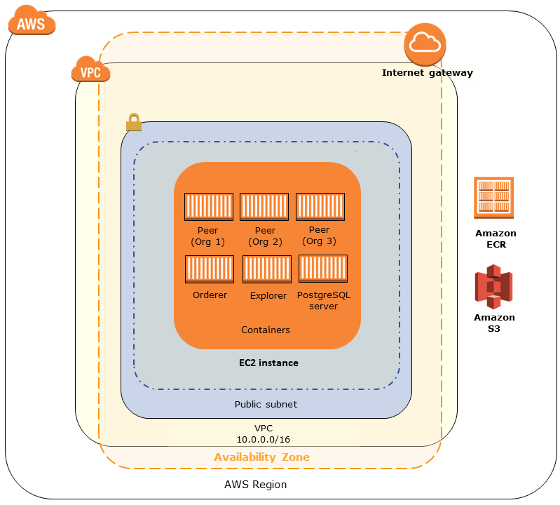

AWS Blockchain Templates was discontinued on April 30, 2019. No further updates to this
service or this supporting documentation will be made. For the best Managed Blockchain experience on AWS,
we recommend that you use [Amazon Managed Blockchain
(AMB)](https://aws.amazon.com/managed-blockchain/ "https://aws.amazon.com/managed-blockchain/"). To learn more about getting started with Amazon Managed Blockchain, see our
[workshop on Hyperledger Fabric](https://catalog.us-east-1.prod.workshops.aws/workshops/008da2cb-8454-42d0-877b-bc290bff7fcf/en-US "https://catalog.us-east-1.prod.workshops.aws/workshops/008da2cb-8454-42d0-877b-bc290bff7fcf/en-US"), or our [blog on deploying an Ethereum node](https://aws.amazon.com/blogs/database/deploy-an-ethereum-node-on-amazon-managed-blockchain/ "https://aws.amazon.com/blogs/database/deploy-an-ethereum-node-on-amazon-managed-blockchain/").
If you have questions about AMB or require further support, [contact Support](https://console.aws.amazon.com/support/home#/case/create?issueType=technical "https://console.aws.amazon.com/support/home#/case/create?issueType=technical") or your AWS account team.

# Using the AWS Blockchain Template for Hyperledger Fabric

Hyperledger Fabric is a blockchain framework that runs smart contracts called _chaincode_, which are written in Go. You can create a private network with Hyperledger Fabric, limiting the peers that can connect to and participate in the network. For more information about Hyperledger Fabric, see the [Hyperledger Fabric](https://hyperledger-fabric.readthedocs.io/en/release-1.1/ "https://hyperledger-fabric.readthedocs.io/en/release-1.1/") documentation. For more information about chaincode, see the [Chaincode for Developers](https://hyperledger-fabric.readthedocs.io/en/release-1.1/chaincode4ade.html "https://hyperledger-fabric.readthedocs.io/en/release-1.1/chaincode4ade.html") topic in the [Hyperledger Fabric](https://hyperledger-fabric.readthedocs.io/en/release-1.1/ "https://hyperledger-fabric.readthedocs.io/en/release-1.1/") documentation.

The AWS Blockchain Template for Hyperledger Fabric only supports a _docker-local_ container platform, meaning the Hyperledger Fabric containers are deployed on a single EC2 instance.

## Links to Launch

See [Getting Started with AWS Blockchain Templates](https://aws.amazon.com/blockchain/templates/getting-started/ "https://aws.amazon.com/blockchain/templates/getting-started/") for links to launch AWS CloudFormation in specific Regions using the Hyperledger Fabric templates.

## AWS Blockchain Template for Hyperledger Fabric Components

The AWS Blockchain Template for Hyperledger Fabric creates an EC2 instance with Docker, and launches a Hyperledger Fabric network using containers on that instance. The network includes one order service and three organizations, each with one peer service. The template also launches a Hyperledger Explorer container, which allows you to browse blockchain data. A PostgreSQL server container is launched to support Hyperledger Explorer.

The following diagram depicts a Hyperledger Fabric network created using the template:



## Prerequisites

Before you launch a Hyperledger Fabric network using template, make sure that the following
requirements are satisfied:

- The IAM principle (user or group) that you use must have permission to work with all related services.
- You must have access to a key pair that you can use to access EC2 instances (for example, using SSH). The key must exist in the same region as the instance.
- You must have an EC2 instance profile with a permissions policy attached that allows access to Amazon S3 and to Amazon Elastic Container Registry (Amazon ECR) to pull containers. For an example permissions policy, see [Example IAM Permissions for the EC2 Instance Profile](#blockchain-hyperledger-ec2profile "#blockchain-hyperledger-ec2profile").
- You must have a Amazon VPC network with a public subnet, or a private subnet with a NAT Gateway and Elastic IP address so that Amazon S3, AWS CloudFormation, and Amazon ECR can be accessed.
- You must have an EC2 security group with inbound rules that allow SSH traffic (port 22) from
  the IP addresses that need to connect to the instance using SSH, and the same for clients that
  need to connect to Hyperledger Explorer (port 8080).

### Example IAM Permissions for the EC2 Instance Profile

You specify an EC2 instance profile ARN as one of the parameters when you use the AWS Blockchain Template for Hyperledger Fabric. Use the following policy statement as a starting point for the permissions policy attached to that EC2 role and instance profile.

JSON

```
`{
 "Version":"2012-10-17",
 "Statement": [
 {
 "Effect": "Allow",
 "Action": [
 "ecr:GetAuthorizationToken",
 "ecr:BatchCheckLayerAvailability",
 "ecr:GetDownloadUrlForLayer",
 "ecr:GetRepositoryPolicy",
 "ecr:DescribeRepositories",
 "ecr:ListImages",
 "ecr:DescribeImages",
 "ecr:BatchGetImage",
 "s3:Get*",
 "s3:List*"
 ],
 "Resource": "*"
 }
 ]
}`

```

## Connecting to Hyperledger Fabric Resources

After the root stack that you create with the template shows **CREATE_COMPLETE**, you can connect to Hyperledger Fabric resources on the EC2 instance. If you specified a public subnet, you can connect to the EC2 instance as would any other EC2 instance. For more information, see [Connecting to Your Linux Instance Using SSH](../../../AWSEC2/latest/UserGuide/AccessingInstancesLinux.md "../../../AWSEC2/latest/UserGuide/AccessingInstancesLinux.md") in the _Amazon EC2 User Guide_.

If you specified a private subnet, you can set up and use a _bastion host_ to proxy connections to Hyperledger Fabric resources. For more information, see [Proxy Connections Using a Bastion Host](blockchain-templates-ethereum.md#ethereum-create-bastion-host "blockchain-templates-ethereum.md#ethereum-create-bastion-host") below.

###### Note

You may notice that the template allocates a public IP address to the EC2 instance hosting Hyperledger Fabric services; however, this IP address is not publicly accessible because routing policies in the private subnet you specify do not allow traffic between this IP address and public sources.

### Proxy Connections Using a Bastion Host

With some configurations, Hyperledger Fabric services may not be publicly available. In those cases, you can connect to Hyperledger Fabric resources through a _bastion host_. For more information about bastion hosts, see [Linux Bastion Host Architecture](../../../quickstart/latest/linux-bastion/architecture.md "../../../quickstart/latest/linux-bastion/architecture.md") in the _Linux Bastion Host Quick Start Guide_.

The bastion host is an EC2 instance. Make sure that the following requirements are met:

- The EC2 instance for the bastion host is within a public subnet with Auto-assign Public IP enabled and that has an internet gateway.
- The bastion host has the key pair that allows ssh connections.
- The bastion host is associated with a security group that allows inbound SSH traffic from the clients that connect.
- The security group assigned to the Hyperledger Fabric hosts (for example, the Application Load Balancer if ECS is the container platform, or the host EC2 instance if docker-local is the container platform) allows inbound traffic on all ports from sources within the VPC.

With a bastion host set up, ensure that the clients that connect use the bastion host as a proxy. The following example demonstrates setting up a proxy connection using Mac OS. Replace `BastionIP` with the IP address of the bastion host EC2 instance and `MySshKey.pem` with the key pair file that you copied to the bastion host.

On the command line, type the following:

```
ssh -i `mySshKey.pem`  ec2-user@`BastionIP` -D 9001
```

This sets up port forwarding for port 9001 on the local machine to the bastion host.

Next, configure your browser or system to use SOCKS proxy for `localhost:9001`. For example, using Mac OS, select **System Preferences**, **Network**, **Advanced**, select **SOCKS proxy**, and type **localhost:9001**.

Using FoxyProxy Standard with Chrome, select **More Tools**, **Extensions**. Under **FoxyProxy Standard**, select **Details**, **Extension options**, **Add New Proxy**. Select **Manual Proxy Configuration**. For **Host or IP Address** type **localhost** and for **Port** type **9001**. Select **SOCKS proxy?**, **Save**.

You should now be able to connect to the Hyperledger Fabric host addresses listed in the template output.
