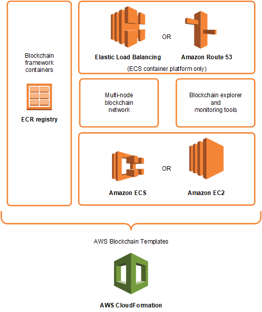

AWS Blockchain Templates was discontinued on April 30, 2019. No further updates to this
service or this supporting documentation will be made. For the best Managed Blockchain experience on AWS,
we recommend that you use [Amazon Managed Blockchain
(AMB)](https://aws.amazon.com/managed-blockchain/ "https://aws.amazon.com/managed-blockchain/"). To learn more about getting started with Amazon Managed Blockchain, see our
[workshop on Hyperledger Fabric](https://catalog.us-east-1.prod.workshops.aws/workshops/008da2cb-8454-42d0-877b-bc290bff7fcf/en-US "https://catalog.us-east-1.prod.workshops.aws/workshops/008da2cb-8454-42d0-877b-bc290bff7fcf/en-US"), or our [blog on deploying an Ethereum node](https://aws.amazon.com/blogs/database/deploy-an-ethereum-node-on-amazon-managed-blockchain/ "https://aws.amazon.com/blogs/database/deploy-an-ethereum-node-on-amazon-managed-blockchain/").
If you have questions about AMB or require further support, [contact Support](https://console.aws.amazon.com/support/home#/case/create?issueType=technical "https://console.aws.amazon.com/support/home#/case/create?issueType=technical") or your AWS account team.

# What Is AWS Blockchain Templates?

AWS Blockchain Templates helps you quickly create and deploy blockchain networks on AWS using different
blockchain frameworks. Blockchain is a decentralized database technology that maintains a
continually growing set of transactions and smart contracts hardened against tampering and
revision using cryptography.

A blockchain network is a peer-to-peer network that improves the efficiency and immutability of transactions for business processes like international payments, supply chain management, land registration, crowd funding, governance, financial transactions, and more. This allows people and organizations who may not know one another to trust and independently verify the transaction record.

You use AWS Blockchain Templates to configure and launch AWS CloudFormation stacks to create blockchain networks. The AWS
resources and services you use depend on the AWS Blockchain Template you choose and the options that you
specify. For information about available templates and their features, see [AWS Blockchain Templates and Features](blockchain-template-features.md "blockchain-template-features.md"). The fundamental components of a blockchain network on AWS created using AWS Blockchain Templates are shown in the following diagram.

## How to Get Started

The best place to start depends on your level of expertise with blockchain and AWS—particularly the services related to AWS Blockchain Templates.

### I'm proficient with AWS and blockchain

Start with the topic in [AWS Blockchain Templates and Features](blockchain-template-features.md "blockchain-template-features.md") about the framework you want to use. Use the links
to launch the AWS Blockchain Template and configure the blockchain network, or download
the templates to check them out on your own.

### I'm proficient with AWS and new to blockchain

Start with the [Getting Started with AWS Blockchain Templates](blockchain-templates-getting-started.md "blockchain-templates-getting-started.md") tutorial. This walks you through
creating an introductory Ethereum blockchain network with default settings. When you finish, see
[AWS Blockchain Templates and Features](blockchain-template-features.md "blockchain-template-features.md") for
an overview of blockchain frameworks and links to learn more about configuration choices and
features.

### I'm a beginner with AWS and proficient with blockchain

Start with [Setting Up AWS Blockchain Templates](blockchain-templates-setting-up.md "blockchain-templates-setting-up.md"). This helps you get set up with fundamentals on AWS, like an account and a user profile. Next, run through the [Getting Started with AWS Blockchain Templates](blockchain-templates-getting-started.md "blockchain-templates-getting-started.md") tutorial. This tutorial walks you through creating an introductory Ethereum blockchain network. Even if you won't ultimately use Ethereum, you get hands-on experience setting up related services. This experience is useful for all blockchain frameworks. Finally, see the topic in the [AWS Blockchain Templates and Features](blockchain-template-features.md "blockchain-template-features.md") section for your framework.

### I'm new to AWS and blockchain

Start with [Setting Up AWS Blockchain Templates](blockchain-templates-setting-up.md "blockchain-templates-setting-up.md"). This helps you get set up with fundamentals on AWS, like an account and a user profile. Then run through the [Getting Started with AWS Blockchain Templates](blockchain-templates-getting-started.md "blockchain-templates-getting-started.md") tutorial. This tutorial walks you through creating an introductory Ethereum blockchain network. Take the time to explore the links to learn more about AWS services and Ethereum.

## Related Services

Depending on the options you select, AWS Blockchain Templates can use the following AWS services to deploy blockchain:

- **Amazon EC2**—Provides compute capacity for your blockchain network. For more information, see the [Amazon EC2 User Guide](../../../AWSEC2/latest/UserGuide.md "../../../AWSEC2/latest/UserGuide.md").
- **Amazon ECS**—Orchestrates container deployment among EC2 instances in a cluster for your blockchain network, if you choose to use it. For more information, see the [Amazon Elastic Container Service Developer Guide](../../../AmazonECS/latest/developerguide.md "../../../AmazonECS/latest/developerguide.md").
- **Amazon VPC**—Provides network access for the Ethereum resources that you create. You can customize configuration for accessibility and security. For more information, see the [Amazon VPC Developer Guide](../../../AmazonVPC/latest/DeveloperGuide.md "../../../AmazonVPC/latest/DeveloperGuide.md").
- **Application Load Balancing**—Serves as a single point of contact for access to available user interfaces and internal service discovery when using Amazon ECS as a container platform. For more information, see [What is an Application Load Balancer?](../../../elasticloadbalancing/latest/application/introduction.md "../../../elasticloadbalancing/latest/application/introduction.md") in the _User Guide for Application Load Balancers._.
