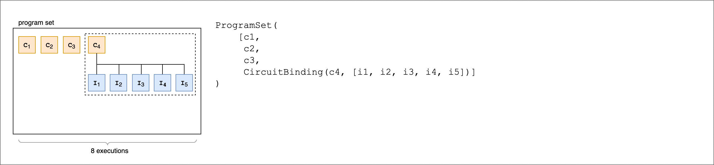
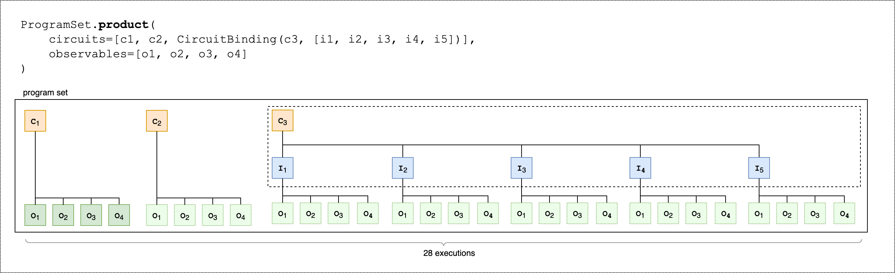
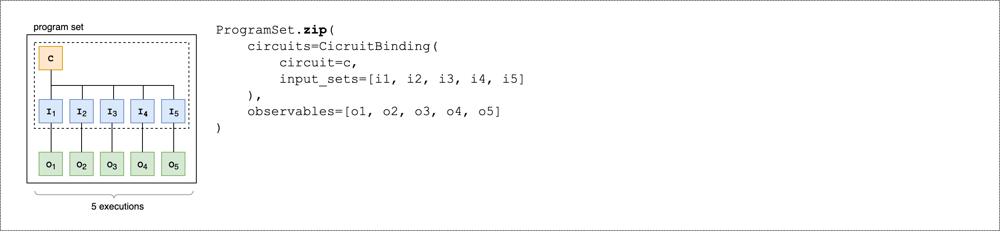
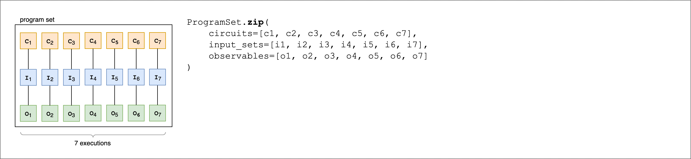

# Constructing circuits in the SDK

This section provides examples of defining a circuit, viewing available gates, extending
a circuit, and viewing gates that each device supports. It also contains instructions on
how to manually allocate qubits, instruct the compiler to run your circuits
exactly as defined, and build noisy circuits with a noise simulator.

You can also work at the pulse level in Braket for various gates with certain QPUs.
For more information, see [Pulse Control on
Amazon Braket](braket-pulse-control.md "braket-pulse-control.md").

###### In this section:

- [Gates and circuits](#braket-gates "#braket-gates")
- [Program sets](#braket-program-set "#braket-program-set")
- [Partial measurement](#braket-partial-measurement "#braket-partial-measurement")
- [Manual qubit allocation](#manual-qubit-allocation "#manual-qubit-allocation")
- [Verbatim compilation](#verbatim-compilation "#verbatim-compilation")
- [Noise simulation](#noise-simulation "#noise-simulation")

## Gates and circuits

Quantum gates and circuits are defined in the [`braket.circuits`](https://github.com/aws/amazon-braket-sdk-python/blob/main/src/braket/circuits/circuit.py "https://github.com/aws/amazon-braket-sdk-python/blob/main/src/braket/circuits/circuit.py") class of the Amazon Braket Python SDK. From the SDK, you can
instantiate a new circuit object by calling `Circuit()`.

**Example: Define a circuit**

The example starts by defining a sample circuit of four qubits
(labelled `q0`, `q1`, `q2`, and `q3`)
consisting of standard, single-qubit Hadamard gates and two-qubit CNOT gates. You can
visualize this circuit by calling the `print` function as the following
example shows.

```
# Import the circuit module
from braket.circuits import Circuit

# Define circuit with 4 qubits
my_circuit = Circuit().h(range(4)).cnot(control=0, target=2).cnot(control=1, target=3)
print(my_circuit)
```

```
T  : │  0  │     1     │
      ┌───┐
q0 : ─┤ H ├───●─────────
      └───┘   │
      ┌───┐   │
q1 : ─┤ H ├───┼─────●───
      └───┘   │     │
      ┌───┐ ┌─┴─┐   │
q2 : ─┤ H ├─┤ X ├───┼───
      └───┘ └───┘   │
      ┌───┐       ┌─┴─┐
q3 : ─┤ H ├───────┤ X ├─
      └───┘       └───┘
T  : │  0  │     1     │
```

**Example: Define a parameterized circuit**

In this example, we define a circuit with gates that depend on free parameters. We
can specify the values of these parameters to create a new circuit, or, when submitting
the circuit, to run as a quantum task on certain devices.

```
from braket.circuits import Circuit, FreeParameter

# Define a FreeParameter to represent the angle of a gate
alpha = FreeParameter("alpha")

# Define a circuit with three qubits
my_circuit = Circuit().h(range(3)).cnot(control=0, target=2).rx(0, alpha).rx(1, alpha)
print(my_circuit)
```

You can create a new, non-parameterized circuit from a parametrized one by supplying
either a single `float` (which is the value all free parameters will take) or
keyword arguments specifying each parameter's value to the circuit as follows.

```
my_fixed_circuit = my_circuit(1.2)
my_fixed_circuit = my_circuit(alpha=1.2)
print(my_fixed_circuit)
```

Note that `my_circuit` is unmodified, so you can use it to instantiate
many new circuits with fixed parameter values.

**Example: Modify gates in a circuit**

The following example defines a circuit with gates that use control and power
modifiers. You can use these modifications to create new gates, such as the controlled
`Ry` gate.

```
from braket.circuits import Circuit

# Create a bell circuit with a controlled x gate
my_circuit = Circuit().h(0).x(control=0, target=1)

# Add a multi-controlled Ry gate of angle .13
my_circuit.ry(angle=.13, target=2, control=(0, 1))

# Add a 1/5 root of X gate
my_circuit.x(0, power=1/5)

print(my_circuit)
```

Gate modifiers are supported only on the local simulator.

**Example: See all available gates**

The following example shows how to look at all the available gates in
Amazon Braket.

```
from braket.circuits import Gate
# Print all available gates in Amazon Braket
gate_set = [attr for attr in dir(Gate) if attr[0].isupper()]
print(gate_set)
```

The output from this code lists all of the gates.

```
['CCNot', 'CNot', 'CPhaseShift', 'CPhaseShift00', 'CPhaseShift01', 'CPhaseShift10', 'CSwap', 'CV', 'CY', 'CZ', 'ECR', 'GPhase', 'GPi', 'GPi2', 'H', 'I', 'ISwap', 'MS', 'PRx', 'PSwap', 'PhaseShift', 'PulseGate', 'Rx', 'Ry', 'Rz', 'S', 'Si', 'Swap', 'T', 'Ti', 'U', 'Unitary', 'V', 'Vi', 'X', 'XX', 'XY', 'Y', 'YY', 'Z', 'ZZ']
```

Any of these gates can be appended to a circuit by calling the method for that type
of circuit. For example, call `circ.h(0)`, to add a Hadamard gate to
the first qubit.

###### Note

Gates are appended in place, and the example that follows adds all of the gates
listed in the previous example to the same circuit.

```
circ = Circuit()
# toffoli gate with q0, q1 the control qubits and q2 the target.
circ.ccnot(0, 1, 2)
# cnot gate
circ.cnot(0, 1)
# controlled-phase gate that phases the |11> state, cphaseshift(phi) = diag((1,1,1,exp(1j*phi))), where phi=0.15 in the examples below
circ.cphaseshift(0, 1, 0.15)
# controlled-phase gate that phases the |00> state, cphaseshift00(phi) = diag([exp(1j*phi),1,1,1])
circ.cphaseshift00(0, 1, 0.15)
# controlled-phase gate that phases the |01> state, cphaseshift01(phi) = diag([1,exp(1j*phi),1,1])
circ.cphaseshift01(0, 1, 0.15)
# controlled-phase gate that phases the |10> state, cphaseshift10(phi) = diag([1,1,exp(1j*phi),1])
circ.cphaseshift10(0, 1, 0.15)
# controlled swap gate
circ.cswap(0, 1, 2)
# swap gate
circ.swap(0,1)
# phaseshift(phi)= diag([1,exp(1j*phi)])
circ.phaseshift(0,0.15)
# controlled Y gate
circ.cy(0, 1)
# controlled phase gate
circ.cz(0, 1)
# Echoed cross-resonance gate applied to q0, q1
circ = Circuit().ecr(0,1)
# X rotation with angle 0.15
circ.rx(0, 0.15)
# Y rotation with angle 0.15
circ.ry(0, 0.15)
# Z rotation with angle 0.15
circ.rz(0, 0.15)
# Hadamard gates applied to q0, q1, q2
circ.h(range(3))
# identity gates applied to q0, q1, q2
circ.i([0, 1, 2])
# iswap gate, iswap = [[1,0,0,0],[0,0,1j,0],[0,1j,0,0],[0,0,0,1]]
circ.iswap(0, 1)
# pswap gate, PSWAP(phi) = [[1,0,0,0],[0,0,exp(1j*phi),0],[0,exp(1j*phi),0,0],[0,0,0,1]]
circ.pswap(0, 1, 0.15)
# X gate applied to q1, q2
circ.x([1, 2])
# Y gate applied to q1, q2
circ.y([1, 2])
# Z gate applied to q1, q2
circ.z([1, 2])
# S gate applied to q0, q1, q2
circ.s([0, 1, 2])
# conjugate transpose of S gate applied to q0, q1
circ.si([0, 1])
# T gate applied to q0, q1
circ.t([0, 1])
# conjugate transpose of T gate applied to q0, q1
circ.ti([0, 1])
# square root of not gate applied to q0, q1, q2
circ.v([0, 1, 2])
# conjugate transpose of square root of not gate applied to q0, q1, q2
circ.vi([0, 1, 2])
# exp(-iXX theta/2)
circ.xx(0, 1, 0.15)
# exp(i(XX+YY) theta/4), where theta=0.15 in the examples below
circ.xy(0, 1, 0.15)
# exp(-iYY theta/2)
circ.yy(0, 1, 0.15)
# exp(-iZZ theta/2)
circ.zz(0, 1, 0.15)
# IonQ native gate GPi with angle 0.15 applied to q0
circ.gpi(0, 0.15)
# IonQ native gate GPi2 with angle 0.15 applied to q0
circ.gpi2(0, 0.15)
# IonQ native gate MS with angles 0.15, 0.15, 0.15 applied to q0, q1
circ.ms(0, 1, 0.15, 0.15, 0.15)

```

Apart from the pre-defined gate set, you also can apply self-defined unitary gates to
the circuit. These can be single-qubit gates (as shown in the following source code) or
multi-qubit gates applied to the qubits defined by the
`targets` parameter.

```
import numpy as np

# Apply a general unitary
my_unitary = np.array([[0, 1],[1, 0]])
circ.unitary(matrix=my_unitary, targets=[0])
```

**Example: Extend existing circuits**

You can extend existing circuits by adding instructions. An `Instruction`
is a quantum directive that describes the quantum task to perform on a quantum device.
`Instruction` operators include objects of type `Gate`
only.

```
# Import the Gate and Instruction modules
from braket.circuits import Gate, Instruction

# Add instructions directly.
circ = Circuit([Instruction(Gate.H(), 4), Instruction(Gate.CNot(), [4, 5])])

# Or with add_instruction/add functions
instr = Instruction(Gate.CNot(), [0, 1])
circ.add_instruction(instr)
circ.add(instr)

# Specify where the circuit is appended
circ.add_instruction(instr, target=[3, 4])
circ.add_instruction(instr, target_mapping={0: 3, 1: 4})

# Print the instructions
print(circ.instructions)
# If there are multiple instructions, you can print them in a for loop
for instr in circ.instructions:
     print(instr)

# Instructions can be copied
new_instr = instr.copy()
# Appoint the instruction to target
new_instr = instr.copy(target=[5, 6])
new_instr = instr.copy(target_mapping={0: 5, 1: 6})
```

**Example: View the gates that each device supports**

Simulators support all gates in the Braket SDK, but QPU devices support a smaller
subset. You can find the supported gates of a device in the device properties. The
following shows an example with an IonQ device:

```
# Import the device module
from braket.aws import AwsDevice

device = AwsDevice("arn:aws:braket:us-east-1::device/qpu/ionq/Aria-1")

# Get device name
device_name = device.name
# Show supportedQuantumOperations (supported gates for a device)
device_operations = device.properties.dict()['action']['braket.ir.openqasm.program']['supportedOperations']
print('Quantum Gates supported by {}:\n {}'.format(device_name, device_operations))
```

```
Quantum Gates supported by Aria 1:
 ['x', 'y', 'z', 'h', 's', 'si', 't', 'ti', 'v', 'vi', 'rx', 'ry', 'rz', 'cnot', 'swap', 'xx', 'yy', 'zz']
```

Supported gates may need to be compiled into native gates before they can run on
quantum hardware. When you submit a circuit, Amazon Braket performs
this compilation automatically.

**Example: Programmatically retrieve the fidelity of native gates
supported by a device**

You can view the fidelity information on the **Devices** page of the
Braket console. Sometimes it is helpful to access the same information
programmatically. The following code shows how to extract the two qubit
gate fidelity between two gates of a QPU.

```
# Import the device module
from braket.aws import AwsDevice

device = AwsDevice("arn:aws:braket:us-west-1::device/qpu/rigetti/Ankaa-3")

# Specify the qubits
a=10
b=11
edge_properties_entry = device.properties.standardized.twoQubitProperties['10-11'].twoQubitGateFidelity
gate_name = edge_properties_entry[0].gateName
fidelity = edge_properties_entry[0].fidelity
print(f"Fidelity of the {gate_name} gate between qubits {a} and {b}: {fidelity}")
```

## Program sets

Program sets efficiently run multiple quantum circuits in a single quantum task.
In that one task, you can submit up to 100 quantum circuits or a single parametric
circuit with up to 100 different parameter sets. This operation minimizes the time between subsequent
circuit executions and reduces quantum task processing overhead. Currently, program
sets are supported on the Amazon Braket Local Simulator and on
IQM and Rigetti devices.

**Defining a ProgramSet**

The following first code example demonstrates how to build a `ProgramSet`
using both parameterized circuits and circuits without parameters.

```
from braket.aws import AwsDevice
from braket.circuits import Circuit, FreeParameter
from braket.program_sets.circuit_binding import CircuitBinding
from braket.program_sets import ProgramSet

# Initialize the quantum device
device = AwsDevice("arn:aws:braket:eu-north-1::device/qpu/iqm/Garnet")

# Define circuits
circ1 = Circuit().h(0).cnot(0, 1)
circ2 = Circuit().rx(0, 0.785).ry(1, 0.393).cnot(1, 0)
circ3 = Circuit().t(0).t(1).cz(0, 1).s(0).cz(1, 2).s(1).s(2)
parameterize_circuit = Circuit().rx(0, FreeParameter("alpha")).cnot(0, 1).ry(1, FreeParameter("beta"))

# Create circuit bindings with different parameters
circuit_binding = CircuitBinding(
    circuit=parameterize_circuit,
    input_sets={
            'alpha': (0.10, 0.11, 0.22, 0.34, 0.45),
            'beta': (1.01, 1.01, 1.03, 1.04, 1.04),
    })

# Creating the program set
program_set_1 = ProgramSet([
    circ1,
    circ2,
    circ3,
    circuit_binding,
])
```

This program set contains four unique programs: `circ1`, `circ2`,
`circ3`, and `circuit_binding`. The `circuit_binding` program
runs with five different parameter bindings, creating five executables. The other three
parameter-free programs create one executable each. This results in eight total executables,
as shown in the following image.



The following second code example demonstrates how to use the `product()`
method to attach the same set of observables to each executable of the program set.

```
from braket.circuits.observables import I, X, Y, Z

observables = [Z(0) @ Z(1), X(0) @ X(1), Z(0) @ X(1), X(0) @ Z(1)]

program_set_2 = ProgramSet.product(
    circuits=[circ1, circ2, circuit_binding],
    observables=observables
)
```

For parameter-free programs, each observable is measured for each circuit. For parametric
programs, each observable is measured for each input set, as shown in the following image.



The following third code example demonstrates how to use the `zip()` method
to pair individual observables with specific parameter sets in the `ProgramSet`.

```
program_set_3 = ProgramSet.zip(
    circuits=circuit_binding,
    observables=observables + [Y(0) @ Y(1)]
)
```



Instead of `CircuitBinding()`, you can directly zip a list of observables
with a list of circuits and input sets.

```
program_set_4 = ProgramSet.zip(
    circuits=[circ1, circ2, circ3],
    input_sets=[{}, {}, {}],
    observables=observables[:3]
)
```



For more information and examples on program sets, see the
[Program set folder](https://github.com/amazon-braket/amazon-braket-examples/tree/main/examples/braket_features/program_sets "https://github.com/amazon-braket/amazon-braket-examples/tree/main/examples/braket_features/program_sets")
in the amazon-braket-examples Github.

**Inspect and run a program set on a device**

A program set's executable count equals its number of unique parameter-bound circuits.
Calculate the total number of circuit executables and shots using the following code example.

```
# Number of shots per executable
shots = 10
num_executables = program_set_1.total_executables

# Calculate total number of shots across all executables
total_num_shots = shots*num_executables
```

###### Note

With program sets, you pay a single per-task fee and a per-shot fee based on the total
number of shots across all circuits in a program set.

To run the program set, use the following code example.

```
# Run the program set
task = device.run(
   program_set_1, shots=total_num_shots,
)
```

When using Rigetti devices, your program set may remain in the `RUNNING`
state while tasks are partially finished and partially queued. For faster results, consider
submitting your program set as a [Hybrid Job](braket-jobs-first.md "braket-jobs-first.md").

**Analyzing results**

Run the following code to analyze and measure the results of the executables in a `ProgramSet`.

```
# Get the results from a program set
result = task.result()

# Get the first executbable
first_program = result[0]
first_executable = first_program[0]

# Inspect the results of the first executable
measurements_from_first_executable = first_executable.measurements
print(measurements_from_first_executable)
```

## Partial measurement

Instead of measuring all qubits in a quantum circuit, use partial measurement
to measure individual qubits or a subset of qubits.

###### Note

Additional features such as mid-circuit measurement and feed-forward operations
are available as Experimental Capabilities, see
[Access to dynamic circuits on IQM devices](braket-experimental-capabilities.md#braket-access-dynamic-circuits "braket-experimental-capabilities.md#braket-access-dynamic-circuits").

**Example: Measure a subset of qubits**

The following code example demonstrates partial measurement by measuring only qubit 0 in a Bell state circuit.

```
from braket.devices import LocalSimulator
from braket.circuits import Circuit

# Use the local state vector simulator
device = LocalSimulator()

# Define an example bell circuit and measure qubit 0
circuit = Circuit().h(0).cnot(0, 1).measure(0)

# Run the circuit
task = device.run(circuit, shots=10)

# Get the results
result = task.result()

# Print the circuit and measured qubits
print(circuit)
print()
print("Measured qubits: ", result.measured_qubits)
```

## Manual qubit allocation

When you run a quantum circuit on quantum computers from Rigetti, you
can optionally use manual qubit allocation to control which
qubits are used for your algorithm. The [Amazon Braket Console](https://console.aws.amazon.com/braket/home "https://console.aws.amazon.com/braket/home") and the
[Amazon Braket SDK](https://github.com/aws/amazon-braket-sdk-python "https://github.com/aws/amazon-braket-sdk-python")
help you to inspect the most recent calibration data of your selected quantum processing
unit (QPU) device, so you can select the best qubits for your
experiment.

Manual qubit allocation enables you to run circuits with greater
accuracy and to investigate individual qubit properties. Researchers and
advanced users optimize their circuit design based on the latest device calibration data
and can obtain more accurate results.

The following example demonstrates how to allocate qubits
explicitly.

```
# Import the device module
from braket.aws import AwsDevice

device = AwsDevice("arn:aws:braket:us-west-1::device/qpu/rigetti/Ankaa-3")
circ = Circuit().h(0).cnot(0, 7)  # Indices of actual qubits in the QPU

# Set up S3 bucket (where results are stored)
my_bucket = "amazon-braket-s3-demo-bucket" # The name of the bucket
my_prefix = "your-folder-name" # The name of the folder in the bucket
s3_location = (my_bucket, my_prefix)

my_task = device.run(circ, s3_location, shots=100, disable_qubit_rewiring=True)
```

For more information, see [the Amazon Braket examples on GitHub](https://github.com/aws/amazon-braket-examples "https://github.com/aws/amazon-braket-examples"), or more specifically, this notebook:
[Allocating Qubits on QPU Devices](https://github.com/aws/amazon-braket-examples/blob/main/examples/braket_features/Allocating_Qubits_on_QPU_Devices.ipynb "https://github.com/aws/amazon-braket-examples/blob/main/examples/braket_features/Allocating_Qubits_on_QPU_Devices.ipynb").

## Verbatim compilation

When you run a quantum circuit on gate-based quantum computers
you can direct the compiler to run your circuits exactly as defined without any
modifications. Using verbatim compilation, you can specify either that an entire circuit
be preserved precisely as specified or that only specific parts of it be preserved
(supported by Rigetti only). When developing algorithms for hardware
benchmarking or error mitigation protocols, you need have the option to exactly specify
the gates and circuit layouts that are running on the hardware. Verbatim compilation
gives you direct control over the compilation process by turning off certain
optimization steps, thereby ensuring that your circuits run exactly as designed.

Verbatim compilation is supported on the Rigetti,
IonQ, and IQM
devices and requires the use of native gates. When using verbatim compilation, it is
advisable to check the topology of the device to ensure that gates are called on
connected qubits and that the circuit uses the native gates supported on
the hardware. The following example shows how to programmatically access the list of
native gates supported by a device.

```
device.properties.paradigm.nativeGateSet
```

For Rigetti, qubit rewiring must be turned off by
setting `disableQubitRewiring=True` for use with verbatim compilation. If
`disableQubitRewiring=False` is set when using verbatim boxes in a
compilation, the quantum circuit fails validation and does not run.

If verbatim compilation is enabled for a circuit and run on a QPU that does not
support it, an error is generated indicating that an unsupported operation has caused
the task to fail. As more quantum hardware natively support compiler functions, this
feature will be expanded to include these devices. Devices that support verbatim
compilation include it as a supported operation when queried with the following
code.

```
from braket.aws import AwsDevice
from braket.device_schema.device_action_properties import DeviceActionType
device = AwsDevice("arn:aws:braket:us-west-1::device/qpu/rigetti/Ankaa-3")
device.properties.action[DeviceActionType.OPENQASM].supportedPragmas
```

There is no additional cost associated with using verbatim compilation. You continue
to be charged for quantum tasks executed on Braket QPU devices, notebook instances, and
on-demand simulators based on current rates as specified on the [Amazon Braket Pricing](https://aws.amazon.com/braket/pricing/ "https://aws.amazon.com/braket/pricing/") page. For
more information, see the [Verbatim compilation](https://github.com/aws/amazon-braket-examples/blob/main/examples/braket_features/Verbatim_Compilation.ipynb "https://github.com/aws/amazon-braket-examples/blob/main/examples/braket_features/Verbatim_Compilation.ipynb") example notebook.

###### Note

If you are using OpenQASM to write your circuits for the
IonQ device, and you wish to map your circuit directly to the
physical qubits, you need to use the `#pragma braket verbatim` as the
`disableQubitRewiring` flag is completely ignored by OpenQASM.

## Noise simulation

To instantiate the local noise simulator you can change the backend as
follows.

```
# Import the device module
from braket.aws import AwsDevice

device = LocalSimulator(backend="braket_dm")
```

You can build noisy circuits in two ways:

1. Build the noisy circuit from the bottom up.
2. Take an existing, noise-free circuit and inject noise throughout.

The following example shows the approaches using a basic circuit with depolarizing
noise and a custom Kraus channel.

```
import scipy.stats
import numpy as np

# Bottom up approach
# Apply depolarizing noise to qubit 0 with probability of 0.1
circ = Circuit().x(0).x(1).depolarizing(0, probability=0.1)

# Create an arbitrary 2-qubit Kraus channel
E0 = scipy.stats.unitary_group.rvs(4) * np.sqrt(0.8)
E1 = scipy.stats.unitary_group.rvs(4) * np.sqrt(0.2)
K = [E0, E1]

# Apply a two-qubit Kraus channel to qubits 0 and 2
circ = circ.kraus([0, 2], K)
```

```
from braket.circuits import Noise

# Inject noise approach
# Define phase damping noise
noise = Noise.PhaseDamping(gamma=0.1)
# The noise channel is applied to all the X gates in the circuit
circ = Circuit().x(0).y(1).cnot(0, 2).x(1).z(2)
circ_noise = circ.copy()
circ_noise.apply_gate_noise(noise, target_gates=Gate.X)
```

Running a circuit is the same user experience as before, as shown in the following
two examples.

**Example 1**

```
task = device.run(circ, shots=100)
```

Or

**Example 2**

```
task = device.run(circ_noise, shots=100)
```

For more examples, see [the Braket introductory noise simulator example](https://github.com/aws/amazon-braket-examples/blob/main/examples/braket_features/Simulating_Noise_On_Amazon_Braket.ipynb "https://github.com/aws/amazon-braket-examples/blob/main/examples/braket_features/Simulating_Noise_On_Amazon_Braket.ipynb")
