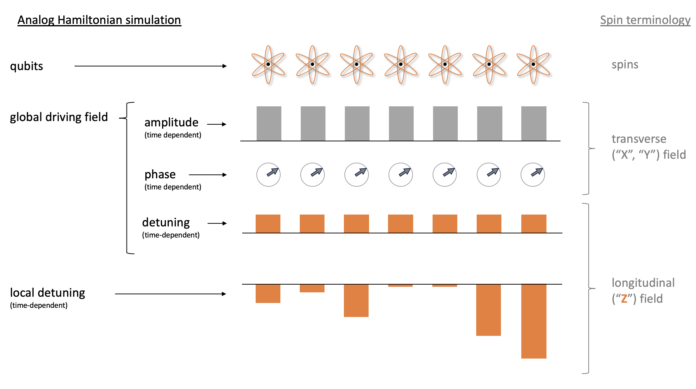
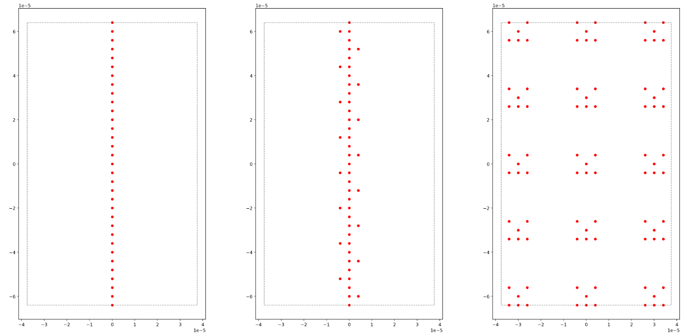
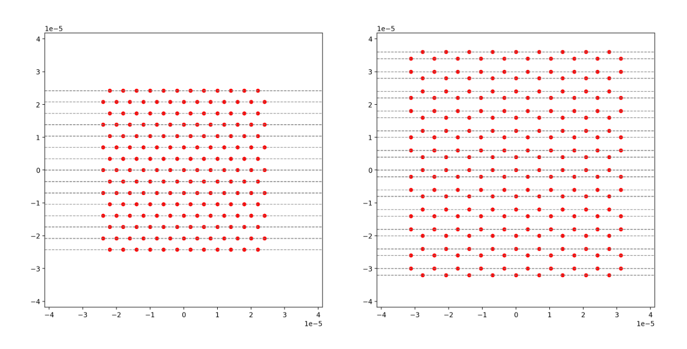
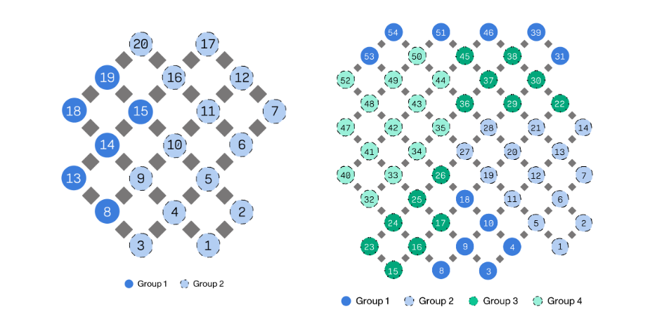

# Explore Experimental Capabilities

Experimental capabilities provide access to hardware with limited availability and emergent new software features.
These features may impact device performance beyond standard specifications.
You can automatically enable experimental software capabilities on a per-task basis through the Amazon Braket SDK.

To use experimental capabilities, specify the `experimental_capabilities` parameter when you create quantum tasks.
Set this parameter to `"ALL"` to enable all available experimental features for that task.
The following example shows how to enable experimental capabilities when you run a circuit on a device:

```
from braket.aws import AwsDevice

device = AwsDevice("arn:aws:braket:us-east-1::device/qpu/quera/Aquila")

task = device.run(
   circuit,
   shots=1000,
   experimental_capabilities="ALL"
)
```

###### Note

These features are experimental and may change without notice.
Device performance may differ from published specifications, and results may vary from standard operations.
You must explicitly enable experimental capabilities for each task. Tasks without this parameter will use only standard device capabilities.

###### In this section:

- [Access to local detuning on QuEra Aquila](#braket-access-local-detuning "#braket-access-local-detuning")
- [Access to tall geometries on QuEra Aquila](#braket-access-tall-geometries "#braket-access-tall-geometries")
- [Access to tight geometries on QuEra Aquila](#braket-access-tight-geometries "#braket-access-tight-geometries")
- [Dynamic circuits on IQM devices](#braket-access-dynamic-circuits "#braket-access-dynamic-circuits")

## Access to local detuning on QuEra Aquila

Local detuning (LD) is a new, time-dependent control field with a customizable spatial pattern.
The LD field affects qubits according to a customizable spatial pattern, realizing different
Hamiltonians for different qubits beyond what the uniform driving field and the Rydberg-Rydberg
interaction can create.

**Constraints:**

The spatial pattern of the local detuning field
is customizable for each AHS program, but it is constant over the course of a program. The time
series of the local detuning field must start and end at zero with all values being less than or
equal to zero. Additionally, the parameters of the local detuning field are limited by numerical
constraints, which can be viewed through the Braket SDK in the specific device properties section

- `aquila_device.properties.paradigm.rydberg.rydbergLocal`.

**Limitations:**

When running quantum programs that use the local
detuning field (even if its magnitude is set to constant zero in the Hamiltonian), the device
experiences faster decoherence than the T2 time listed in the performance section of Aquila's properties.
When unnecessary, it is best practice to omit the local detuning field from the Hamiltonian of the
AHS program.



**Examples:**

1. **Simulating the effect of non-uniform longitudinal magnetic field in spin systems**

While the amplitude and phase of the driving field have the same effect on the qubits as
the transverse magnetic field on spins, the sum of the driving field's detuning and the local
detuning produces the same effect on the qubits as the longitudinal field on spins. With the
spatial control over the local detuning field, more complex spin systems can be simulated. 2. **Preparing non-equilibrium initial states**

The example notebook
[Simulating lattice gauge theory with Rydberg atoms](https://github.com/amazon-braket/amazon-braket-examples/blob/main/examples/analog_hamiltonian_simulation/07_Simulating_Lattice_Gauge_Theory_with_Rydberg_Atoms.ipynb "https://github.com/amazon-braket/amazon-braket-examples/blob/main/examples/analog_hamiltonian_simulation/07_Simulating_Lattice_Gauge_Theory_with_Rydberg_Atoms.ipynb")
shows how to suppress the central atom of a 9-atom linear arrangement from being excited when
annealing the system towards the Z2 ordered phase. After the preparation step, the local
detuning field is ramped down, and the AHS program continues to simulate the time evolution of
the system starting from this particular non-equilibrium state. 3. **Solving weighted optimization problems**

The example notebook [Maximum weight independent set](https://github.com/amazon-braket/amazon-braket-examples/blob/main/examples/analog_hamiltonian_simulation/08_Maximum_Weight_Independent_Set.ipynb "https://github.com/amazon-braket/amazon-braket-examples/blob/main/examples/analog_hamiltonian_simulation/08_Maximum_Weight_Independent_Set.ipynb")
(MWIS) shows how to solve a MWIS problem on Aquila. The local detuning field is used to define
the weights on the nodes of the unit disk graph, whose edges are realized by the Rybderg-blockage
effect. Starting from the uniform ground state, and gradually ramping up the local detuning
field makes the system transition into the ground state of the MWIS Hamiltonian to find solutions
to the problem.

## Access to tall geometries on QuEra Aquila

The tall geometries feature allows you to specify geometries with increased height. With this
capability, the atom arrangements of your AHS programs can span an additional length in the y
direction beyond Aquila's regular capabilities.

**Constraints:**

The max height for tall geometries is 0.000128 m (128 um).

**Limitations:**

When this experimental capability is enabled for
your account, the capabilities shown on the device properties page and the `GetDevice`
call will continue to reflect the regular, lower limit on the height. When an AHS program uses atom
arrangements that go beyond the regular capabilities, the filling error is expected to increase.
You will find an elevated number of unexpected 0s in the `pre_sequence` part of the task
result, in turn, lowering the chance to get a perfectly initialized arrangement. This effect is
strongest in rows with many atoms.



**Examples:**

1. **Bigger 1d and quasi-1d arrangements**

Atom chains and ladder-like arrangements can be extended to higher atom numbers.
By orienting the long direction parallel to y allows for programming longer instances
of these models. 2. **More room for multiplexing the execution of tasks with small geometries**

The example notebook [Parallel quantum tasks on Aquila](https://github.com/amazon-braket/amazon-braket-examples/blob/main/examples/analog_hamiltonian_simulation/03_Parallel_tasks_on_Aquila.ipynb "https://github.com/amazon-braket/amazon-braket-examples/blob/main/examples/analog_hamiltonian_simulation/03_Parallel_tasks_on_Aquila.ipynb")
shows how to make the most out of the available area: by placing multiplexed copies
of the geometry in question in one atom arrangement. With the more available area, more
copies can be placed.

## Access to tight geometries on QuEra Aquila

The tight geometries feature allows you to specify geometries with shorter spacing between
neighboring rows. In an AHS program, atoms are arranged in rows, separated by a minimal vertical
spacing. The y coordinate of any two atom sites must be either zero (same row), or differ by
more than the minimal row spacing (different row). With the tight geometries capability, the
minimal row spacing is reduced, enabling the creation of tighter atom arrangements. While this
extension does not change the minimal Euclidean distance requirement between atoms, it allows
the creation of lattices where distant atoms occupy neighboring rows closer to each other, a
notable example is the triangle lattice.

**Constraints:**

The minimal row spacing for tight geometries is 0.000002 m (2 um).

**Limitations:**

When this experimental capability is enabled
for your account, the capabilities shown on the device properties page and the `GetDevice` call
will continue to reflect the regular, lower limit on the height. When an AHS program uses atom
arrangements that go beyond the regular capabilities, the filling error is expected to increase.
Customers will find an elevated number of unexpected 0s in the `pre_sequence` part of the task
result, in turn, lowering the chance to get a perfectly initialized arrangement. This effect
is strongest in rows with many atoms.



**Examples:**

1. **Non-rectangular lattices with small lattice constants**

Tighter row spacing allows the creation of lattices where the closest neighbor
to some atoms are in the diagonal direction. Notable examples are triangular,
hexagonal, and Kagome lattices and some quasi-crystals. 2. **Tunable family of lattices**

In AHS programs, interactions are tuned by adjusting the distance between
pairs of atoms. Tighter row spacing allow tuning the interactions of different
atom pairs relative to each other with more freedom, since the angles and
distances that define the atom structure are less limited by the minimal row
spacing constraint. A notable example is the family of Shastry-Sutherland
lattices with different bond lengths.

## Dynamic circuits on IQM devices

Dynamic circuits on IQM devices enable mid-circuit measurements (MCM)
and feed-forward operations. These features allow quantum researchers and developers to
implement advanced quantum algorithms with conditional logic and qubit reuse capabilities.
This experimental feature helps explore quantum algorithms with improved resource efficiency
and study quantum error mitigation and error correction schemes.

**Key instructions:**

- `measure_ff`: Implements measurement for feed-forward control,
  measuring a qubit and storing the result with a feedback key.
- `cc_prx`: Implements a classically-controlled rotation that applies only
  when the result associated with the given feedback key measures a |1⟩ state.

Amazon Braket supports dynamic circuits through OpenQASM, the Amazon Braket
SDK, and the Amazon Braket Qiskit Provider.

**Constraints:**

1. Feedback keys in the `measure_ff` instructions must be unique.
2. A `cc_prx` must happen after `measure_ff` with the same feedback key.
3. In a single circuit, the feed-forward on a qubit can only be controlled by one qubit,
   either by itself or by another qubit. In different circuits, you can have different pairs
   of control.
   1. For example, if qubit 1 is controlled by qubit 2, it cannot be controlled by qubit
      3 in the same circuit. There is no constraint on how many times the control is applied
      between qubit 1 and qubit 2. Qubit 2 can be controlled by qubit 3 (or qubit 1), unless
      an active reset was performed on qubit 2.

4. Control can only be applied to qubits within the same group. The qubit groups for the IQM Garnet and Emerald devices are in the following images.
5. Programs with these capabilities must be submitted as verbatim programs. To learn more about
   verbatim programs, see [Verbatim compilation with OpenQASM 3.0](braket-openqasm-verbatim-compilation.md "braket-openqasm-verbatim-compilation.md").

**Limitations:**

MCM can only be use for feed-forward control in a program. The MCM outcomes (0 or 1)
are not returned as part of a task result.



These images display the qubit groupings for both IQM devices. The Garnet
20-qubit device contains 2 groups of qubits, while the Emerald 54-qubit device contains 4
groups of qubits.

**Examples:**

1. **Qubit reuse through active reset**

MCM with conditional reset operations enable qubit reuse within a single circuit execution.
This reduces circuit depth requirements and improves quantum device resource utilization. 2. **Active bit flip protection**

Dynamic circuits detect bit flip errors and apply corrective operations based on measurement outcomes.
This implementation serves as a quantum error detection experiment. 3. **Teleportation experiments**

State teleportation transfers qubit states using local quantum operations and classical information
from MCMs. Gate teleportation implements gates between qubits without direct quantum operations. These
experiments demonstrate foundational subroutines in three key areas: quantum error correction, measurement-based
quantum computing, and quantum communication. 4. **Open quantum systems simulation**

Dynamic circuits model noise in quantum systems through data qubit and environment entanglement, and
environmental measurements. This approach uses specific qubits to represent data and environment elements.
A Noise channel can be designed by the gates and measurements applied on the environment.

For more information on using dynamic circuits, see additional examples in the
[Amazon Braket notebook repository](https://github.com/amazon-braket/amazon-braket-examples/tree/main/examples/experimental_capabilities/dynamic_circuits "https://github.com/amazon-braket/amazon-braket-examples/tree/main/examples/experimental_capabilities/dynamic_circuits").
