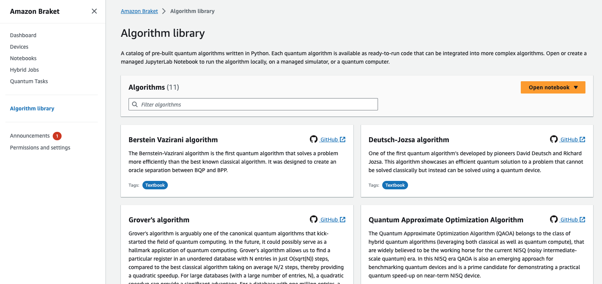

# Building your first quantum algorithms

The Amazon Braket algorithm library is a catalog of pre-built quantum algorithms written
in Python. Run these algorithms as they are, or use them as starting points for building more
complex algorithms. You can access the algorithm library from the Braket
console. For more information, see the [Braket Github algorithm library](https://github.com/aws-samples/amazon-braket-algorithm-library "https://github.com/aws-samples/amazon-braket-algorithm-library").

The Braket console provides a description of each available algorithm in the algorithm
library. Choose a GitHub link to see the details of each algorithm, or choose **Open notebook** to open or create a notebook that contains all of
the available algorithms. If you choose the notebook option, you can then find the Braket
algorithm library in the root folder of your notebook.
