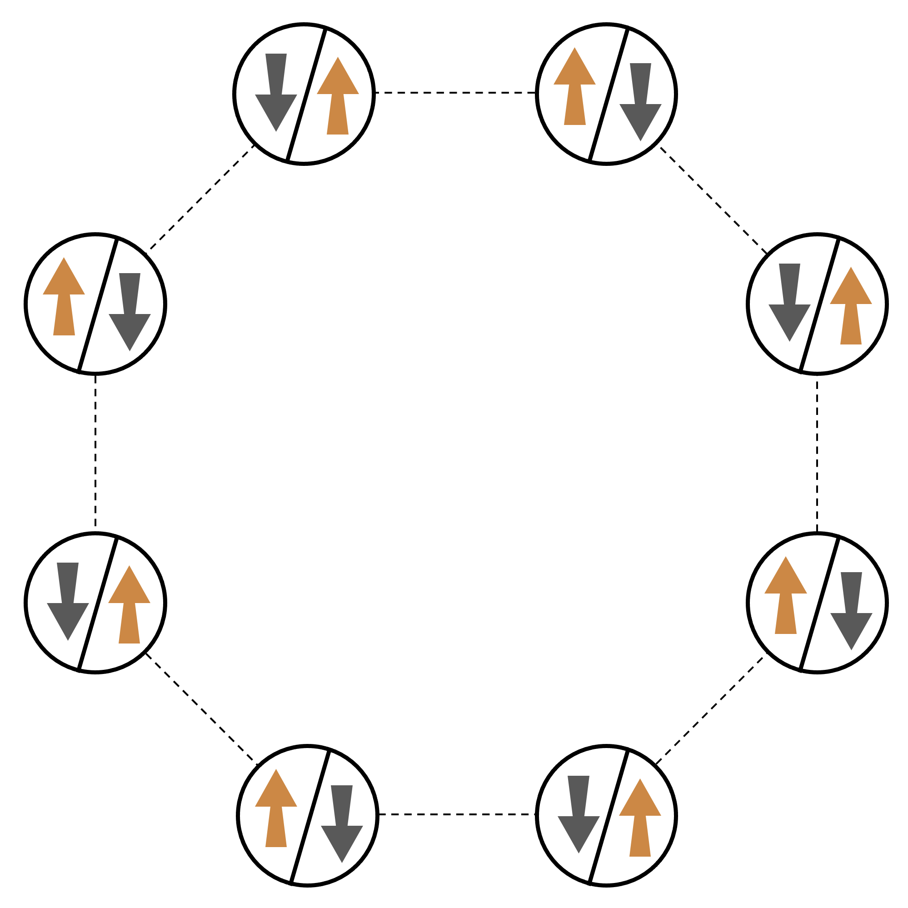
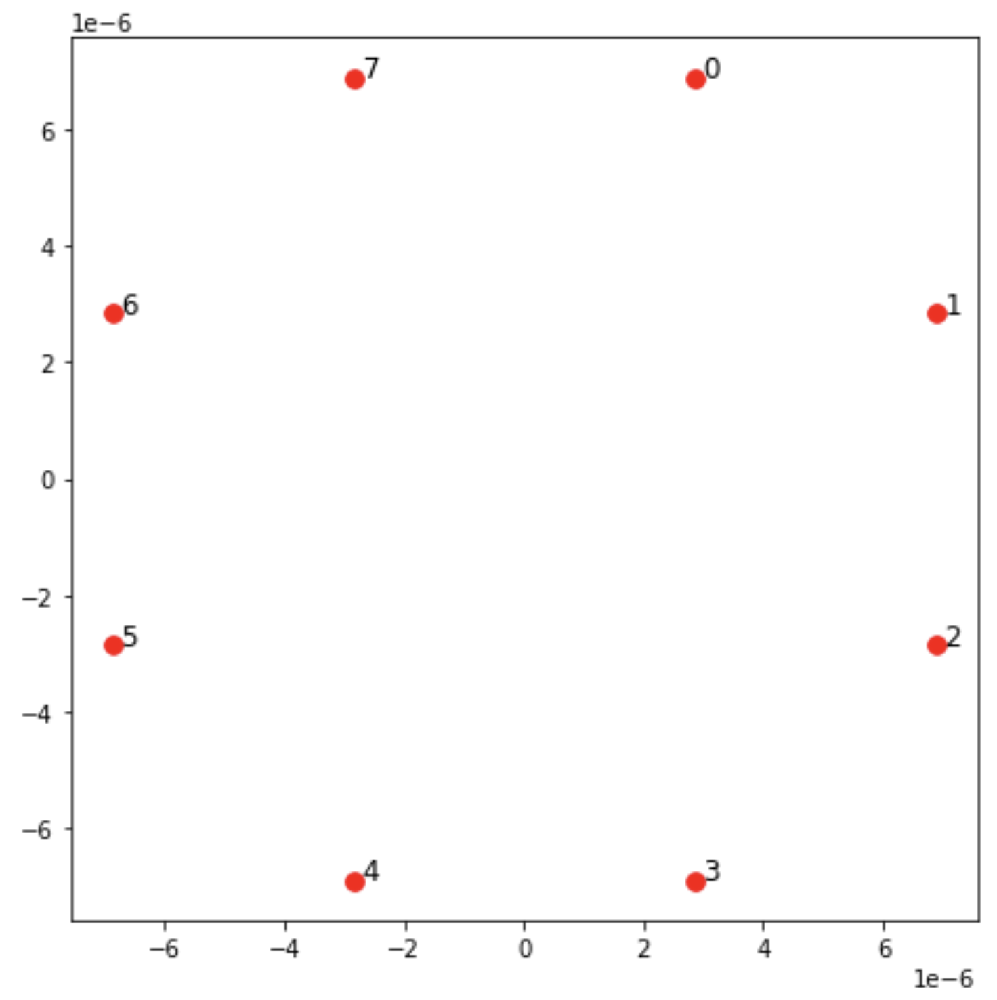
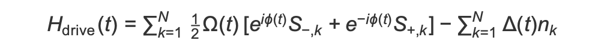
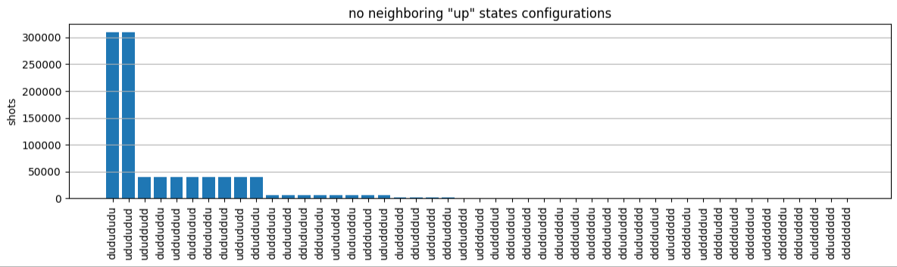
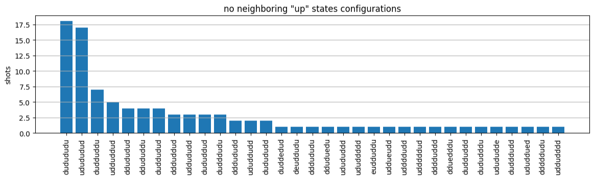
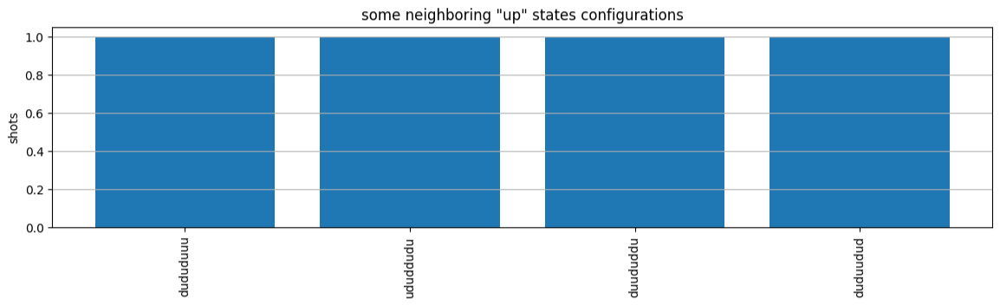

# Hello AHS: Run your first Analog Hamiltonian

Simulation

This section provides information on running your first Analog Hamiltonian Simulation.

###### In this section:

- [Interacting spin
  chain](#braket-get-started-interacting-spin-chain "#braket-get-started-interacting-spin-chain")
- [Arrangement](#braket-get-started-arrangement "#braket-get-started-arrangement")
- [Interaction](#braket-get-started-interaction "#braket-get-started-interaction")
- [Driving field](#braket-get-started-driving-field "#braket-get-started-driving-field")
- [AHS program](#braket-get-started-ahs-program "#braket-get-started-ahs-program")
- [Running on local
  simulator](#braket-get-started-running-local-simulator "#braket-get-started-running-local-simulator")
- [Analyzing simulator
  results](#braket-get-started-analyzing-simulator-results "#braket-get-started-analyzing-simulator-results")
- [Running on QuEra's Aquila
  QPU](#braket-get-started-running-aquila-qpu "#braket-get-started-running-aquila-qpu")
- [Analyzing QPU results](#braket-get-started-analyzing-qpu-results "#braket-get-started-analyzing-qpu-results")
- [Next steps](#braket-get-started-ahs-next "#braket-get-started-ahs-next")

## Interacting spin

chain

For a canonical example of a system of many interacting particles, let us consider a
ring of eight spins (each of which can be in “up” ∣↑⟩ and “down” ∣↓⟩ states). Albeit
small, this model system already exhibits a handful of interesting phenomena of
naturally occurring magnetic materials. In this example, we will show how to prepare a
so-called anti-ferromagnetic order, where consecutive spins point in opposite
directions.



## Arrangement

We will use one neutral atom to stand for each spin, and the “up” and “down” spin
states will be encoded in excited Rydberg state and ground state of the atoms,
respectively. First, we create the 2-d arrangement. We can program the above ring of
spins with the following code.

**Prerequisites**: You need to pip install the [Braket SDK](https://github.com/aws/amazon-braket-sdk-python#installing-the-amazon-braket-python-sdk "https://github.com/aws/amazon-braket-sdk-python#installing-the-amazon-braket-python-sdk"). (If you are using a Braket hosted notebook instance, this
SDK comes pre-installed with the notebooks.) To reproduce the plots, you also need to
separately install matplotlib with the shell command `pip install
 matplotlib`.

```
from braket.ahs.atom_arrangement import AtomArrangement
import numpy as np
import matplotlib.pyplot as plt  # Required for plotting

a = 5.7e-6  # Nearest-neighbor separation (in meters)

register = AtomArrangement()
register.add(np.array([0.5, 0.5 + 1/np.sqrt(2)]) * a)
register.add(np.array([0.5 + 1/np.sqrt(2), 0.5]) * a)
register.add(np.array([0.5 + 1/np.sqrt(2), - 0.5]) * a)
register.add(np.array([0.5, - 0.5 - 1/np.sqrt(2)]) * a)
register.add(np.array([-0.5, - 0.5 - 1/np.sqrt(2)]) * a)
register.add(np.array([-0.5 - 1/np.sqrt(2), - 0.5]) * a)
register.add(np.array([-0.5 - 1/np.sqrt(2), 0.5]) * a)
register.add(np.array([-0.5, 0.5 + 1/np.sqrt(2)]) * a)
```

which we can also plot with

```
fig, ax = plt.subplots(1, 1, figsize=(7, 7))
xs, ys = [register.coordinate_list(dim) for dim in (0, 1)]
ax.plot(xs, ys, 'r.', ms=15)

for idx, (x, y) in enumerate(zip(xs, ys)):
    ax.text(x, y, f" {idx}", fontsize=12)

plt.show()  # This will show the plot below in an ipython or jupyter session
```



## Interaction

To prepare the anti-ferromagnetic phase, we need to induce interactions between
neighboring spins. We use the [van der Waals
interaction](https://en.wikipedia.org/wiki/Van_der_Waals_force "https://en.wikipedia.org/wiki/Van_der_Waals_force") for this, which is natively implemented by neutral atom devices
(such as the Aquila device from QuEra). Using the
spin-representation, the Hamiltonian term for this interaction can be expressed as a sum
over all spin pairs (j,k).


Here, nj​=∣↑j​⟩⟨↑j​∣ is an operator
that takes the value of 1 only if spin j is in the “up” state, and 0 otherwise. The
strength is
Vj,k​=C6​/(dj,k​)6,
where C6​ is the fixed coefficient, and
dj,k​ is the Euclidean distance between spins j and k. The
immediate effect of this interaction term is that any state where both spin j and spin k
are “up” have elevated energy (by the amount Vj,k​). By carefully
designing the rest of the AHS program, this interaction will prevent neighboring spins
from both being in the “up” state, an effect commonly known as "Rydberg
blockade."

## Driving field

At the beginning of the AHS program, all spins (by default) start in their “down”
state, they are in a so-called ferromagnetic phase. Keeping an eye on our goal to
prepare the anti-ferromagnetic phase, we specify a time-dependent coherent driving field
that smoothly transitions the spins from this state to a many-body state where the “up”
states are preferred. The corresponding Hamiltonian can be written as



where Ω(t),ϕ(t),Δ(t) are the time-dependent, global amplitude (aka [Rabi frequency](https://en.wikipedia.org/wiki/Rabi_frequency "https://en.wikipedia.org/wiki/Rabi_frequency")), phase,
and detuning of the driving field affecting all spins uniformly. Here
S−,k​=∣↓k​⟩⟨↑k​∣and
S+,k​​=(S−,k​)†=∣↑k​⟩⟨↓k​∣
are the lowering and raising operators of spin k, respectively, and
nk​=∣↑k​⟩⟨↑k​∣
is the same operator as before. The Ω part of the driving field coherently couples the
“down” and the “up” states of all spins simultaneously, while the Δ part controls the
energy reward for “up” states.

To program a smooth transition from the ferromagnetic phase to the anti-ferromagnetic
phase, we specify the driving field with the following code.

```
from braket.timings.time_series import TimeSeries
from braket.ahs.driving_field import DrivingField

# Smooth transition from "down" to "up" state
time_max = 4e-6  # seconds
time_ramp = 1e-7  # seconds
omega_max = 6300000.0  # rad / sec
delta_start = -5 * omega_max
delta_end = 5 * omega_max

omega = TimeSeries()
omega.put(0.0, 0.0)
omega.put(time_ramp, omega_max)
omega.put(time_max - time_ramp, omega_max)
omega.put(time_max, 0.0)

delta = TimeSeries()
delta.put(0.0, delta_start)
delta.put(time_ramp, delta_start)
delta.put(time_max - time_ramp, delta_end)
delta.put(time_max, delta_end)

phi = TimeSeries().put(0.0, 0.0).put(time_max, 0.0)

drive = DrivingField(
   amplitude=omega,
   phase=phi,
   detuning=delta
)
```

We can visualize the time series of the driving field with the following
script.

```
fig, axes = plt.subplots(3, 1, figsize=(12, 7), sharex=True)

ax = axes[0]
time_series = drive.amplitude.time_series
ax.plot(time_series.times(), time_series.values(), '.-')
ax.grid()
ax.set_ylabel('Omega [rad/s]')

ax = axes[1]
time_series = drive.detuning.time_series
ax.plot(time_series.times(), time_series.values(), '.-')
ax.grid()
ax.set_ylabel('Delta [rad/s]')

ax = axes[2]
time_series = drive.phase.time_series
# Note: time series of phase is understood as a piecewise constant function
ax.step(time_series.times(), time_series.values(), '.-', where='post')
ax.set_ylabel('phi [rad]')
ax.grid()
ax.set_xlabel('time [s]')

plt.show()  # This will show the plot below in an ipython or jupyter session
```


## AHS program

The register, the driving field, (and the implicit van der Waals interactions) make
up the Analog Hamiltonian Simulation program `ahs_program`.

```
from braket.ahs.analog_hamiltonian_simulation import AnalogHamiltonianSimulation

ahs_program = AnalogHamiltonianSimulation(
   register=register,
   hamiltonian=drive
)
```

## Running on local

simulator

Since this example is small (less than 15 spins), before running it on an
AHS-compatible QPU, we can run it on the local AHS simulator which comes with the
Braket SDK. Since the local simulator is available for free with the Braket SDK,
this is best practice to ensure that our code can correctly execute.

Here, we can set the number of shots to a high value (say, 1 million) because the
local simulator tracks the time evolution of the quantum state and draws samples from
the final state; hence, increasing the number of shots, while increasing the total
runtime only marginally.

```
from braket.devices import LocalSimulator

device = LocalSimulator("braket_ahs")

result_simulator = device.run(
   ahs_program,
   shots=1_000_000
).result()  # Takes about 5 seconds
```

## Analyzing simulator

results

We can aggregate the shot results with the following function that infers the state
of each spin (which may be “d” for “down”, “u” for “up”, or “e” for empty site), and
counts how many times each configuration occurred across the shots.

```
from collections import Counter


def get_counts(result):
    """Aggregate state counts from AHS shot results

    A count of strings (of length = # of spins) are returned, where
    each character denotes the state of a spin (site):
      e: empty site
      u: up state spin
      d: down state spin

    Args:
      result (braket.tasks.analog_hamiltonian_simulation_quantum_task_result.AnalogHamiltonianSimulationQuantumTaskResult)

    Returns
       dict: number of times each state configuration is measured

    """
    state_counts = Counter()
    states = ['e', 'u', 'd']
    for shot in result.measurements:
        pre = shot.pre_sequence
        post = shot.post_sequence
        state_idx = np.array(pre) * (1 + np.array(post))
        state = "".join(map(lambda s_idx: states[s_idx], state_idx))
        state_counts.update((state,))
    return dict(state_counts)


counts_simulator = get_counts(result_simulator)  # Takes about 5 seconds
print(counts_simulator)
```

```
*[Output]*
{'dddddddd': 5, 'dddddddu': 12, 'ddddddud': 15, ...}
```

Here `counts` is a dictionary that counts the number of times each state
configuration is observed across the shots. We can also visualize them with the
following code.

```
from collections import Counter


def has_neighboring_up_states(state):
    if 'uu' in state:
        return True
    if state[0] == 'u' and state[-1] == 'u':
        return True
    return False


def number_of_up_states(state):
    return Counter(state)['u']


def plot_counts(counts):
    non_blockaded = []
    blockaded = []
    for state, count in counts.items():
        if not has_neighboring_up_states(state):
            collection = non_blockaded
        else:
            collection = blockaded
        collection.append((state, count, number_of_up_states(state)))

    blockaded.sort(key=lambda _: _[1], reverse=True)
    non_blockaded.sort(key=lambda _: _[1], reverse=True)

    for configurations, name in zip((non_blockaded,
                                     blockaded),
                                    ('no neighboring "up" states',
                                     'some neighboring "up" states')):
        plt.figure(figsize=(14, 3))
        plt.bar(range(len(configurations)), [item[1] for item in configurations])
        plt.xticks(range(len(configurations)))
        plt.gca().set_xticklabels([item[0] for item in configurations], rotation=90)
        plt.ylabel('shots')
        plt.grid(axis='y')
        plt.title(f'{name} configurations')
        plt.show()


plot_counts(counts_simulator)
```




From the plots, we can read the following observations the verify that we
successfully prepared the anti-ferromagnetic phase.

1. Generally, non-blockaded states (where no two neighboring spins are in the “up”
   state) are more common than states where at least one pair of neighboring spins
   are both in “up” states.
2. Generally, states with more "up" excitations are favored, unless the
   configuration is blockaded.
3. The most common states are indeed the perfect anti-ferromagnetic states
   `"dudududu"` and `"udududud"`.
4. The second most common states are the ones where there is only 3 “up”
   excitations with consecutive separations of 1, 2, 2. This shows that the van der
   Waals interaction has an affect (albeit much smaller) on next-nearest neighbors
   too.

## Running on QuEra's Aquila

QPU

**Prerequisites**: Apart from pip installing the Braket
[SDK](https://github.com/aws/amazon-braket-sdk-python#installing-the-amazon-braket-python-sdk "https://github.com/aws/amazon-braket-sdk-python#installing-the-amazon-braket-python-sdk"), if you are new to Amazon Braket, make sure that you have
completed the necessary [Get Started steps](braket-get-started.md "braket-get-started.md").

###### Note

If you are using a Braket hosted notebook instance, the Braket SDK comes
pre-installed with the instance.

With all dependencies installed, we can connect to the Aquila
QPU.

```
from braket.aws import AwsDevice

aquila_qpu = AwsDevice("arn:aws:braket:us-east-1::device/qpu/quera/Aquila")
```

To make our AHS program suitable for the QuEra machine, we need to
round all values to comply with the levels of precision allowed by the
Aquila QPU. (These requirements are governed by the device parameters
with “Resolution” in their name. We can see them by executing
`aquila_qpu.properties.dict()` in a notebook. For more details of
capabilities and requirements of Aquila, see the [Introduction to Aquila](https://github.com/aws/amazon-braket-examples/blob/main/examples/analog_hamiltonian_simulation/01_Introduction_to_Aquila.ipynb "https://github.com/aws/amazon-braket-examples/blob/main/examples/analog_hamiltonian_simulation/01_Introduction_to_Aquila.ipynb") notebook.) We can do this by calling the
`discretize` method.

```
discretized_ahs_program = ahs_program.discretize(aquila_qpu)
```

Now we can run the program (running only 100 shots for now) on the
Aquila QPU.

###### Note

Running this program on the Aquila processor will incur a cost. The
Amazon Braket SDK includes a [Cost Tracker](https://aws.amazon.com/blogs/quantum-computing/managing-the-cost-of-your-experiments-in-amazon-braket/ "https://aws.amazon.com/blogs/quantum-computing/managing-the-cost-of-your-experiments-in-amazon-braket/") that enables customers to set cost limits as well as track
their costs in near real-time.

```
task = aquila_qpu.run(discretized_ahs_program, shots=100)

metadata = task.metadata()
task_arn = metadata['quantumTaskArn']
task_status = metadata['status']

print(f"ARN: {task_arn}")
print(f"status: {task_status}")
```

```
*[Output]*
ARN: arn:aws:braket:us-east-1:123456789012:quantum-task/12345678-90ab-cdef-1234-567890abcdef
status: CREATED
```

Due to the large variance of how long a quantum task may take to run (depending on
availability windows and QPU utilization), it is a good idea to note down the quantum task ARN,
so we can check its status at a later time with the following code snippet.

```
# Optionally, in a new python session
from braket.aws import AwsQuantumTask

SAVED_TASK_ARN = "arn:aws:braket:us-east-1:123456789012:quantum-task/12345678-90ab-cdef-1234-567890abcdef"

task = AwsQuantumTask(arn=SAVED_TASK_ARN)
metadata = task.metadata()
task_arn = metadata['quantumTaskArn']
task_status = metadata['status']

print(f"ARN: {task_arn}")
print(f"status: {task_status}")
```

```
*[Output]*
ARN: arn:aws:braket:us-east-1:123456789012:quantum-task/12345678-90ab-cdef-1234-567890abcdef
status: COMPLETED
```

Once the status is COMPLETED (which can also be checked from the quantum tasks page of the
Amazon Braket [console](https://us-east-1.console.aws.amazon.com/braket/home?region=us-east-1#/tasks "https://us-east-1.console.aws.amazon.com/braket/home?region=us-east-1#/tasks")), we can query the results with:

```
result_aquila = task.result()
```

## Analyzing QPU results

Using the same `get_counts` functions as before, we can compute the
counts:

```
counts_aquila = get_counts(result_aquila)
   print(counts_aquila)
```

```
*[Output]*
{'dddududd': 2, 'dudududu': 18, 'ddududud': 4, ...}
```

and plot them with `plot_counts`:

```
plot_counts(counts_aquila)
```





Note that a small fraction of shots have empty sites (marked with “e”). This is due
to a 1—2% per atom preparation imperfections of the Aquila QPU. Apart
from this, the results match with the simulation within the expected statistical
fluctuation due to small number of shots.

## Next steps

Congratulations, you have now run your first AHS workload on Amazon Braket using the
local AHS simulator and the Aquila QPU.

To learn more about Rydberg physics, Analog Hamiltonian Simulation and the
Aquila device, refer to our [example notebooks](https://github.com/aws/amazon-braket-examples/tree/main/examples/analog_hamiltonian_simulation "https://github.com/aws/amazon-braket-examples/tree/main/examples/analog_hamiltonian_simulation").
