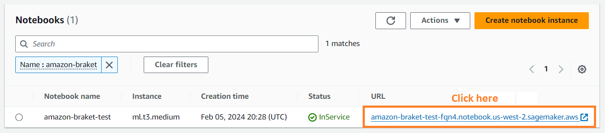
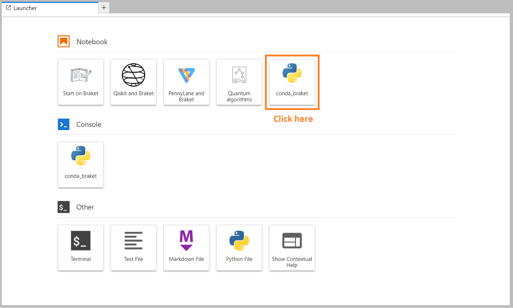

# Building your first circuit

After your notebook instance has launched, open the instance with a standard Jupyter
interface by choosing the notebook you just created.


Amazon Braket notebook instances are pre-installed with the Amazon Braket SDK and all its dependencies. Start by creating a new
notebook with `conda_braket` kernel.


You can start with a simple “Hello, world!” example. First, construct a circuit that
prepares a Bell state, and then run that circuit on different devices to obtain the
results.

Begin by importing the Begin by importing the Amazon Braket SDK modules and defining a simpleBRAKETlong; SDK modules and defining a basic
Bell State circuit.

```
import boto3
from braket.aws import AwsDevice
from braket.devices import LocalSimulator
from braket.circuits import Circuit

# Create the circuit
bell = Circuit().h(0).cnot(0, 1)
```

You can visualize the circuit with this command:

```
print(bell)
```

```
T  : │  0  │  1  │
      ┌───┐
q0 : ─┤ H ├───●───
      └───┘   │
            ┌─┴─┐
q1 : ───────┤ X ├─
            └───┘
T  : │  0  │  1  │
```

**Run your circuit on the local simulator**

Next, choose the quantum device on which to run the circuit. The
Amazon Braket SDK comes with a local simulator for rapid prototyping
and testing. We recommend using the local simulator for smaller circuits, which can be up
to 25 qubits (depending on your local hardware).

To instantiate the local simulator:

```
# Instantiate the local simulator
local_sim = LocalSimulator()
```

and run the circuit:

```
# Run the circuit
result = local_sim.run(bell, shots=1000).result()
counts = result.measurement_counts
print(counts)
```

You should see a result something like this:

```
Counter({'11': 503, '00': 497})
```

The specific Bell state you have prepared is an equal superposition of |00⟩ and
|11⟩, and an about equal (up to shot noise) distribution of
00 and 11 as measurement outcomes, as expected.

**Run your circuit on an on-demand simulator**

Amazon Braket also provides access to an on-demand, high-performance
simulator, SV1, for running larger circuits. SV1 is an
on-demand state-vector simulator that allows for simulation of quantum circuits of up to 34
qubits. You can find more information on SV1 in the [Supported Devices](braket-devices.md "braket-devices.md") section and in the AWS console. When
running quantum tasks on SV1 (and on TN1 or any QPU), the results of
your quantum task are stored in an S3 bucket in your account. If you do not specify a bucket, the
Braket SDK creates a default bucket `amazon-braket-{region}-{accountID}` for
you. To learn more, see [Managing access to
Amazon Braket](braket-manage-access.md "braket-manage-access.md") .

###### Note

Fill in your actual, existing bucket name where the following example shows
`amazon-braket-s3-demo-bucket` as your bucket name. Bucket names for Amazon Braket always begin with `amazon-braket-` followed
by other identifying characters you add. If you need information on how to set up an S3
bucket, see [Getting started with Amazon S3](../../../AmazonS3/latest/userguide/GetStartedWithS3.md "../../../AmazonS3/latest/userguide/GetStartedWithS3.md").

```
# Get the account ID
aws_account_id = boto3.client("sts").get_caller_identity()["Account"]

# The name of the bucket
my_bucket = "amazon-braket-s3-demo-bucket"

# The name of the folder in the bucket
my_prefix = "simulation-output"
s3_folder = (my_bucket, my_prefix)
```

To run a circuit on SV1, you must provide the location of the S3 bucket
you previously selected as a positional argument in the `.run()` call.

```
# Choose the cloud-based on-demand simulator to run your circuit
device = AwsDevice("arn:aws:braket:::device/quantum-simulator/amazon/sv1")

# Run the circuit
task = device.run(bell, s3_folder, shots=100)

# Display the results
print(task.result().measurement_counts)
```

The Amazon Braket console provides further information about your quantum task.
Navigate to the **Quantum Tasks** tab in the console and your quantum task
should be on the top of the list. Alternatively, you can search for your quantum task using the
unique quantum task ID or other criteria.

###### Note

After 90 days, Amazon Braket automatically removes all quantum task IDs and
other metadata associated with your quantum tasks. For more information, see [Data retention](security.md#braket-data-retention "security.md#braket-data-retention").

**Running on a QPU**

With Amazon Braket, you can run the previous quantum circuit example on a physical
quantum computer by just changing a single line of code. Amazon Braket provides access to
QPU devices from IonQ, IQM,
QuEra, and Rigetti. You can find
information about the different devices and availability windows in the [Supported Devices](braket-devices.md "braket-devices.md") section, and in the AWS console
under the **Devices** tab. The following example shows how
to instantiate an IQM device.

```
# Choose the IQM hardware to run your circuit
device = AwsDevice("arn:aws:braket:eu-north-1::device/qpu/iqm/Garnet")
```

Or choose an IonQ device with this code:

```
# Choose the Ionq device to run your circuit
device = AwsDevice("arn:aws:braket:us-east-1::device/qpu/ionq/Aria-1")
```

After selecting a device and before running your workload, you can query device queue depth with the following code to determine
the number of quantum tasks or hybrid jobs. Additionally, customers
can view device specific queue depths on the Devices page of the Amazon Braket Management Console.

```
# Print your queue depth
print(device.queue_depth().quantum_tasks)
# Returns the number of quantum tasks queued on the device
# {<QueueType.NORMAL: 'Normal'>: '0', <QueueType.PRIORITY: 'Priority'>: '0'}

print(device.queue_depth().jobs)
# Returns the number of hybrid jobs queued on the device
# '2'
```

When you run your task, the Amazon Braket SDK polls for a result (with a default
timeout of 5 days). You can change this default by modifying the
`poll_timeout_seconds` parameter in the the `.run()` command as
shown in the example that follows. Keep in mind that if your polling timeout is too short,
results may not be returned within the polling time, such as when a QPU is unavailable and
a local timeout error is returned. You can restart the polling by calling the
`task.result()` function.

```
# Define quantum task with 1 day polling timeout
task = device.run(bell, s3_folder, poll_timeout_seconds=24*60*60)
print(task.result().measurement_counts)
```

Additionally, after submitting your quantum task or hybrid job, you can call the
`queue_position()` function to check your queue position.

```
print(task.queue_position().queue_position)
# Return the number of quantum tasks queued ahead of you
# '2'
```
