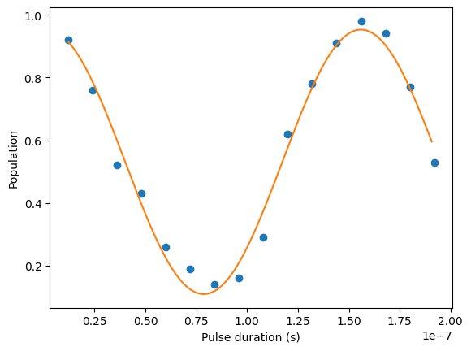

# Working with Hello Pulse

In this section, you will learn how to characterize and construct a single qubit gate
directly using pulse on a Rigetti device. Applying an electromagnetic field
to a qubit leads to Rabi oscillation, switching qubits between its 0 state and 1 state.
With calibrated length and phase of the pulse, the Rabi oscillation can calculate a single
qubit gates. Here, we will determine the optimal pulse length to measure a pi/2 pulse, an
elementary block used to build more complex pulse sequences.

First, to build a pulse sequence, import the `PulseSequence` class.

```
from braket.aws import AwsDevice
from braket.circuits import FreeParameter
from braket.devices import Devices
from braket.pulse import PulseSequence, GaussianWaveform

import numpy as np
```

Next, instantiate a new Braket device using the Amazon Resource Name (ARN)
of the QPU. The following code block uses Rigetti Ankaa-3.

```
device = AwsDevice(Devices.Rigetti.Ankaa3)
```

The following pulse sequence includes two components: Playing a waveform and measuring a
qubit. Pulse sequence can usually be applied to frames. With some exceptions such as barrier
and delay, which can be applied to qubits. Before constructing the pulse sequence you must
retrieve the available frames. The drive frame is used for applying the pulse for Rabi oscillation,
and the readout frame is for measuring the qubit state. This example, uses the frames of
qubit 25. For more information about frames, see
[Roles of frames and ports](braket-roles-frames-ports.md "braket-roles-frames-ports.md").

```
drive_frame = device.frames["Transmon_25_charge_tx"]
readout_frame = device.frames["Transmon_25_readout_rx"]
```

Now, create the waveform that will play in the drive frame. The goal is to characterize the
behavior of the qubits for different pulse lengths. You will play a waveform with different lengths
each time. Instead of instantiating a new waveform each time, use the Braket-supported `FreeParameter`
in pulse sequence. You are able to create the waveform and the pulse sequence once with a free parameters,
and then run the same pulse sequence with different input values.

```
waveform = GaussianWaveform(FreeParameter("length"), FreeParameter("length") * 0.25, 0.2, False)
```

Finally, put them together as a pulse sequence. In the pulse sequence, `play` plays the specified
waveform on the drive frame, and the `capture_v0` measures the state from the readout frame.

```
pulse_sequence = (
    PulseSequence()
    .play(drive_frame, waveform)
    .capture_v0(readout_frame)
)
```

Scan across a range of pulse length and submit them to the QPU. Before executing the pulse sequences on a QPU, bind the value of free parameters.

```
start_length = 12e-9
end_length = 2e-7
lengths = np.arange(start_length, end_length, 12e-9)
N_shots = 100

tasks = [
    device.run(pulse_sequence(length=length), shots=N_shots)
    for length in lengths
]

probability_of_zero = [
    task.result().measurement_counts['0']/N_shots
    for task in tasks
]
```

The statistics of the qubit measurement exhibits the oscillatory dynamics
of the qubit that oscillates between the 0 state and the 1 state. From the
measurement data, you can extract the Rabi frequency and fine tune the length
of the pulse to implement a particular 1-qubit gate. For example, from the
data in figure below, the periodicity is about 154 ns. So a pi/2 rotation
gate would correspond to the pulse sequence with length=38.5ns.



## Hello Pulse using OpenPulse

[OpenPulse](https://openqasm.com/language/openpulse.html "https://openqasm.com/language/openpulse.html") is a language
for specifying pulse-level control of a general quantum device and is part of the OpenQASM
3.0 specification. Amazon Braket supports OpenPulse for directly programming
pulses using the OpenQASM 3.0 representation.

Braket uses OpenPulse as the underlying intermediate representation
for expressing pulses in native instructions. OpenPulse supports the
addition of instruction calibrations in the form of `defcal` (short for “define
calibration”) declarations. With these declarations, you can specify an implementation of a
gate instruction within a lower-level control grammar.

You can view the OpenPulse program of a Braket `PulseSequence` using the following command.

```
print(pulse_sequence.to_ir())
```

You can also construct an OpenPulse program directly.

```
from braket.ir.openqasm import Program

openpulse_script = """
OPENQASM 3.0;
cal {
    bit[1] psb;
    waveform my_waveform = gaussian(12.0ns, 3.0ns, 0.2, false);
    play(Transmon_25_charge_tx, my_waveform);
    psb[0] = capture_v0(Transmon_25_readout_rx);
}
"""
```

Create a `Program` object with your script. Then, submit the program to a QPU.

```
from braket.aws import AwsDevice
from braket.devices import Devices
from braket.ir.openqasm import Program

program = Program(source=openpulse_script)

device = AwsDevice(Devices.Rigetti.Ankaa3)
task = device.run(program, shots=100)
```
