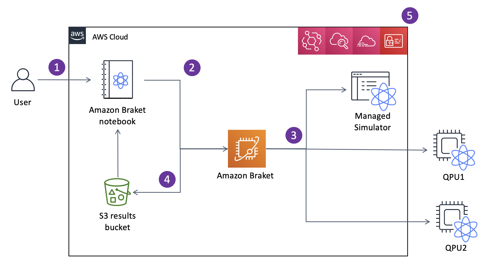

# How Amazon Braket works

###### Tip

**Learn the foundations of quantum computing with AWS!**
Enroll in the [Amazon Braket Digital Learning Plan](https://skillbuilder.aws/learning-plan/EH35DWGU3R/amazon-braket--knowledge-badge-readiness-path-includes-labs "https://skillbuilder.aws/learning-plan/EH35DWGU3R/amazon-braket--knowledge-badge-readiness-path-includes-labs")
and earn your own Digital badge after completing a series of learning courses and a digital assessment.

Amazon Braket provides on-demand access to quantum computing devices, including on-demand
circuit simulators and different types of QPUs. In Amazon Braket, the atomic request to a
device is a quantum task. For gate-based QC devices, this request includes the quantum circuit
(including the measurement instructions and number of shots) and other request metadata. For
Analog Hamiltonian Simulators, the quantum task contains the physical layout of the quantum register
and the time- and space-dependence of the manipulating fields.

Braket Direct is a program expanding how you can explore quantum computing on AWS, accelerating
research and innovation. You can reserve dedicated capacity on various quantum devices, engage directly
with quantum computing specialists, and have early access to next-generation capabilities, including the
latest trapped-ion device from IonQ, Forte.

In this section, we are going to learn about the high-level flow of running quantum tasks on Amazon Braket.

###### In this section:

- [Amazon Braket quantum task flow](#braket-data-flow "#braket-data-flow")
- [Third-party data processing](#braket-3rd-party-processing "#braket-3rd-party-processing")

## Amazon Braket quantum task flow

With Jupyter notebooks, you can conveniently define, submit, and monitor
your quantum tasks from the [Amazon Braket Console](https://us-west-1.console.aws.amazon.com/console/home?region=us-west-1# "https://us-west-1.console.aws.amazon.com/console/home?region=us-west-1#") or using the [Amazon Braket SDK](https://github.com/aws/amazon-braket-sdk-python "https://github.com/aws/amazon-braket-sdk-python"). You can
build your quantum circuits directly in the SDK. However, for Analog Hamiltonian
Simulators, you define the register layout and the controlling fields. After your quantum task is
defined, you can choose a device to run it on and submit it to the Amazon Braket API (2).
Depending on the device you chose, the quantum task is queued until the device becomes available
and the task is sent to the QPU or simulator for implementation (3). Amazon Braket gives you
access to different types of QPUs (IonQ, IQM, QuEra, Rigetti),
three on-demand simulators (SV1, DM1, TN1),
two local simulators, and one embedded simulator. To learn more, see [Amazon Braket supported devices](braket-devices.md "braket-devices.md").

After processing your quantum task, Amazon Braket returns the results to an
Amazon S3 bucket, where the data is stored in your AWS account (4). At the same time, the SDK
polls for the results in the background and loads them into the Jupyter notebook at quantum task
completion. You can also view and manage your quantum tasks on the **Quantum Tasks** page in the Amazon Braket console or by using the
`GetQuantumTask` operation of the Amazon Braket
API.

Amazon Braket is integrated with AWS Identity and Access Management (IAM), Amazon CloudWatch, AWS CloudTrail and
Amazon EventBridge for user access management, monitoring and logging as well as for event based
processing (5).

## Third-party data processing

Quantum tasks that are submitted to a QPU device are processed on quantum computers located in
facilities operated by third party providers. To learn more about security and third-party
processing in Amazon Braket, see [Security of Amazon Braket Hardware Providers](third-party-security.md "third-party-security.md").
