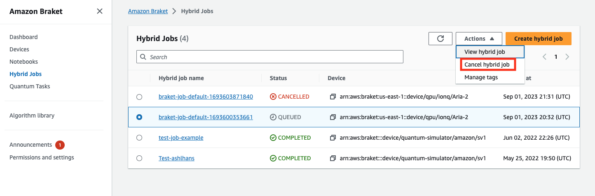
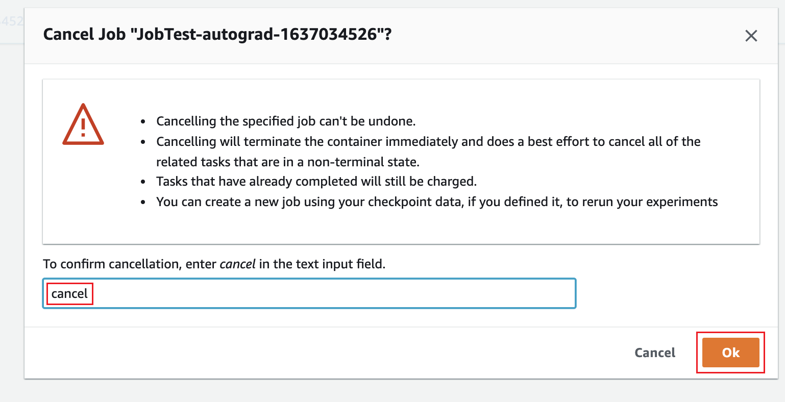

# Cancel a Hybrid Job

You may need to cancel a hybrid job in a non-terminal state. This can be done either in the
console or with code.

To cancel your hybrid job in the console, select the hybrid job to cancel from the **Hybrid Jobs** page and then select **Cancel
hybrid job** from the **Actions** dropdown menu.


To confirm the cancellation, enter _cancel_ into the input field when
prompted and then select **OK**.


To cancel your hybrid job using code from the Braket Python SDK, use the `job_arn`
to identify the hybrid job and then call the `cancel` command on it as shown in
following code.

```
job = AwsQuantumJob(arn=job_arn)
job.cancel()
```

The `cancel` command terminates the classical hybrid job container immediately and
does a best effort to cancel all of the related quantum tasks that are still in a non-terminal
state.
