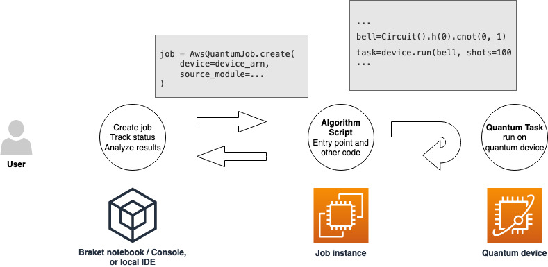
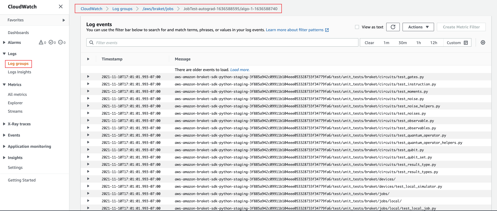
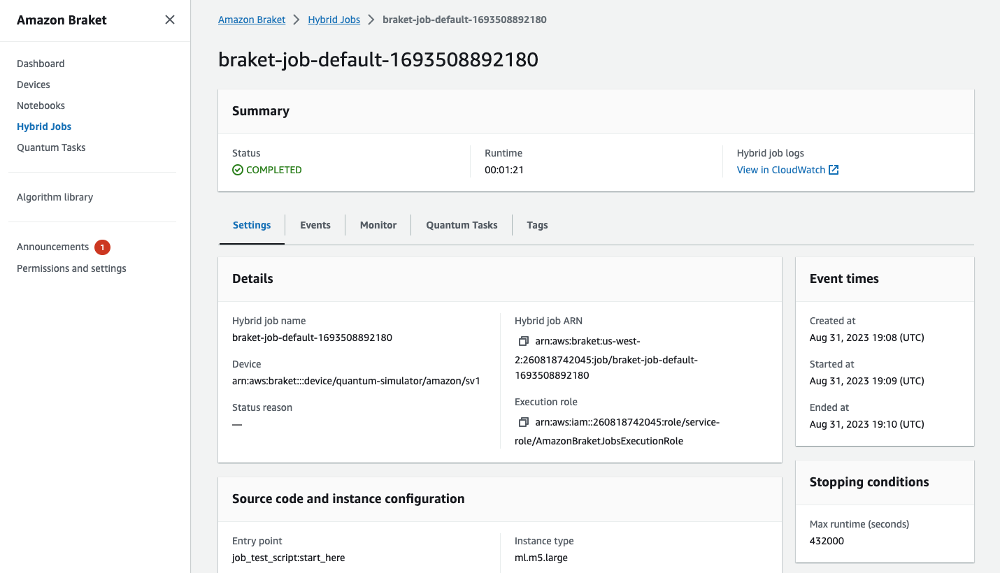

# Create a Hybrid Job

This section shows you how to create a Hybrid Job using a Python script. Alternatively,
to create a hybrid job from local Python code, such as your preferred integrated development
environment (IDE) or a Braket notebook, see [Run your local code as a hybrid job](braket-hybrid-job-decorator.md "braket-hybrid-job-decorator.md").

###### In this section:

- [Create and run](#braket-jobs-first-create "#braket-jobs-first-create")
- [Monitor your results](#braket-jobs-first-monitor-results "#braket-jobs-first-monitor-results")
- [Save your results](#braket-jobs-save-results "#braket-jobs-save-results")
- [Using checkpoints](#braket-jobs-checkpoints "#braket-jobs-checkpoints")
- [Run your local code as a hybrid job](braket-hybrid-job-decorator.md "braket-hybrid-job-decorator.md")
- [Using the API with Hybrid Jobs](braket-jobs-api.md "braket-jobs-api.md")
- [Create and debug a hybrid job with local mode](braket-jobs-local-mode.md "braket-jobs-local-mode.md")

## Create and run

Once you have a role with permissions to run a hybrid job, you are ready to proceed. The key
piece of your first Braket hybrid job is the _algorithm script_. It defines
the algorithm you want to run and contains the classical logic and quantum tasks that are
part of your algorithm. In addition to your algorithm script, you can provide other
dependency files. The algorithm script together with its dependencies is called the
_source module_. The _entry point_ defines the
first file or function to run in your source module when the hybrid job starts.



First, consider the following basic example of an algorithm script that creates five
bell states and prints the corresponding measurement results.

```
import os

from braket.aws import AwsDevice
from braket.circuits import Circuit


def start_here():

    print("Test job started!")

    # Use the device declared in the job script
    device = AwsDevice(os.environ["AMZN_BRAKET_DEVICE_ARN"])

    bell = Circuit().h(0).cnot(0, 1)
    for count in range(5):
        task = device.run(bell, shots=100)
        print(task.result().measurement_counts)

    print("Test job completed!")
```

Save this file with the name _algorithm_script.py_ in your current
working directory on your Braket notebook or local environment. The algorithm_script.py
file has `start_here()` as the planned entry point.

Next, create a Python file or Python notebook in the same directory as the
algorithm_script.py file. This script kicks off the hybrid job and handles any asynchronous
processing, such as printing the status or key outcomes that we are interested in. At a
minimum, this script needs to specify your hybrid job script and your primary device.

###### Note

For more information about how to create a Braket notebook or upload a file, such
as the _algorithm_script.py_ file, in the same directory as the
notebooks, see [Run your first circuit
using the Amazon Braket Python SDK](braket-get-started-run-circuit.md "braket-get-started-run-circuit.md")

For this basic first case, you target a simulator. Whichever type of quantum device you
target, a simulator or an actual quantum processing unit (QPU), the device you specify with
`device` in the following script is used to schedule the hybrid job and is available
to the algorithm scripts as the environment variable
`AMZN_BRAKET_DEVICE_ARN`.

###### Note

You can only use devices that are available in the AWS Region of your hybrid job. The
Amazon Braket SDK auto selects this AWS Region. For example, a hybrid job in us-east-1 can use
IonQ, SV1, DM1, and TN1
devices, but not Rigetti devices.

If you choose a quantum computer instead of a simulator, Braket schedules your hybrid jobs to
run all of their quantum tasks with priority access.

```
from braket.aws import AwsQuantumJob
from braket.devices import Devices

job = AwsQuantumJob.create(
    Devices.Amazon.SV1,
    source_module="algorithm_script.py",
    entry_point="algorithm_script:start_here",
    wait_until_complete=True
)
```

The parameter `wait_until_complete=True` sets a verbose mode so that your job
prints output from the actual job as it's running. You should see an output similar to the
following example.

```
Initializing Braket Job: arn:aws:braket:us-west-2:111122223333:job/braket-job-default-123456789012
Job queue position: 1
Job queue position: 1
Job queue position: 1
..............
.
.
.
Beginning Setup
Checking for Additional Requirements
Additional Requirements Check Finished
Running Code As Process
Test job started!
Counter({'00': 58, '11': 42})
Counter({'00': 55, '11': 45})
Counter({'11': 51, '00': 49})
Counter({'00': 56, '11': 44})
Counter({'11': 56, '00': 44})
Test job completed!
Code Run Finished
2025-09-24 23:13:40,962 sagemaker-training-toolkit INFO     Reporting training SUCCESS
```

###### Note

You can also use your custom-made module with the
[AwsQuantumJob.create](https://amazon-braket-sdk-python.readthedocs.io/en/latest/_apidoc/braket.aws.aws_quantum_job.html#braket.aws.aws_quantum_job.AwsQuantumJob.create "https://amazon-braket-sdk-python.readthedocs.io/en/latest/_apidoc/braket.aws.aws_quantum_job.html#braket.aws.aws_quantum_job.AwsQuantumJob.create")
method by passing its location (either the path to a local directory or file, or an S3 URI of a tar.gz file). For a working example, see
[Parallelize_training_for_QML.ipynb](https://github.com/amazon-braket/amazon-braket-examples/blob/main/examples/hybrid_jobs/5_Parallelize_training_for_QML/Parallelize_training_for_QML.ipynb "https://github.com/amazon-braket/amazon-braket-examples/blob/main/examples/hybrid_jobs/5_Parallelize_training_for_QML/Parallelize_training_for_QML.ipynb")
file in the hybrid jobs folder in the [Amazon Braket examples Github repo](https://github.com/amazon-braket/amazon-braket-examples/tree/main "https://github.com/amazon-braket/amazon-braket-examples/tree/main").

## Monitor your results

Alternatively, you can access the log output from Amazon CloudWatch. To do this, go to the
**Log groups** tab on the left menu of the job detail
page, select the log group `aws/braket/jobs`, and then choose the log stream
that contains the job name. In the example above,
this is `braket-job-default-1631915042705/algo-1-1631915190`.



You can also view the status of the hybrid job in the console by selecting the **Hybrid Jobs** page and then choose **Settings**.



Your hybrid job produces some artifacts in Amazon S3 while it runs. The default S3 bucket name is
`amazon-braket-<region>-<accountid>` and the content is in the
`jobs/<jobname>/<timestamp>` directory. You can configure the S3 locations where
these artifacts are stored by specifying a different `code_location` when the
hybrid job is created with the Braket Python SDK.

###### Note

This S3 bucket must be located in the same AWS Region as your job script.

The `jobs/<jobname>/<timestamp>` directory contains a subfolder with the output
from the entry point script in a `model.tar.gz` file. There is also a directory called
`script` that contains your algorithm script artifacts in a `source.tar.gz`
file. The results from your actual quantum tasks are in the directory named
`jobs/<jobname>/tasks`.

## Save your results

You can save the results generated by the algorithm script so that they are available
from the hybrid job object in the hybrid job script as well as from the output folder in Amazon S3 (in a
tar-zipped file named model.tar.gz).

The output must be saved in a file using a JavaScript Object
Notation (JSON) format. If the data can not be readily serialized to text, as in the case of a
numpy array, you could pass in an option to serialize using a pickled data format.
See the [braket.jobs.data_persistence module](https://amazon-braket-sdk-python.readthedocs.io/en/latest/_apidoc/braket.jobs.data_persistence.html#braket.jobs.data_persistence.save_job_result "https://amazon-braket-sdk-python.readthedocs.io/en/latest/_apidoc/braket.jobs.data_persistence.html#braket.jobs.data_persistence.save_job_result")
for more details.

To save the results of the hybrid jobs, add the following lines
commented with #ADD to the algorithm_script.py file.

```
import os

from braket.aws import AwsDevice
from braket.circuits import Circuit
from braket.jobs import save_job_result  # ADD


def start_here():

    print("Test job started!")

    device = AwsDevice(os.environ['AMZN_BRAKET_DEVICE_ARN'])

    results = []  # ADD

    bell = Circuit().h(0).cnot(0, 1)
    for count in range(5):
        task = device.run(bell, shots=100)
        print(task.result().measurement_counts)
        results.append(task.result().measurement_counts)  # ADD

        save_job_result({"measurement_counts": results})  # ADD

    print("Test job completed!")
```

You can then display the results of the job from your job script by appending the line
**`print(job.result())`** commented with #ADD.

```
import time
from braket.aws import AwsQuantumJob

job = AwsQuantumJob.create(
    source_module="algorithm_script.py",
    entry_point="algorithm_script:start_here",
    device="arn:aws:braket:::device/quantum-simulator/amazon/sv1",
)

print(job.arn)
while job.state() not in AwsQuantumJob.TERMINAL_STATES:
    print(job.state())
    time.sleep(10)

print(job.state())
print(job.result())   # ADD
```

In this example, we have removed `wait_until_complete=True` to suppress
verbose output. You can add it back in for debugging. When you run this hybrid job, it outputs the
identifier and the `job-arn`, followed by the state of the hybrid job every 10 seconds
until the hybrid job is `COMPLETED`, after which it shows you the results of the bell
circuit. See the following example.

```
arn:aws:braket:us-west-2:111122223333:job/braket-job-default-123456789012
INITIALIZED
RUNNING
RUNNING
RUNNING
RUNNING
RUNNING
RUNNING
RUNNING
RUNNING
RUNNING
RUNNING
...
RUNNING
RUNNING
COMPLETED
{'measurement_counts': [{'11': 53, '00': 47},..., {'00': 51, '11': 49}]}
```

## Using checkpoints

You can save intermediate iterations of your hybrid jobs using checkpoints. In the algorithm
script example from the previous section, you would add the following lines commented with
#ADD to create checkpoint files.

```
from braket.aws import AwsDevice
from braket.circuits import Circuit
from braket.jobs import save_job_checkpoint  # ADD
import os


def start_here():

    print("Test job starts!")

    device = AwsDevice(os.environ["AMZN_BRAKET_DEVICE_ARN"])

    # ADD the following code
    job_name = os.environ["AMZN_BRAKET_JOB_NAME"]
    save_job_checkpoint(checkpoint_data={"data": f"data for checkpoint from {job_name}"}, checkpoint_file_suffix="checkpoint-1")  # End of ADD

    bell = Circuit().h(0).cnot(0, 1)
    for count in range(5):
        task = device.run(bell, shots=100)
        print(task.result().measurement_counts)

    print("Test hybrid job completed!")
```

When you run the hybrid job, it creates the file
_<jobname>-checkpoint-1.json_ in your hybrid job artifacts in the
checkpoints directory with a default `/opt/jobs/checkpoints` path. The hybrid job
script remains unchanged unless you want to change this default path.

If you want to load a hybrid job from a checkpoint generated by a previous hybrid job, the algorithm
script uses `from braket.jobs import load_job_checkpoint`. The logic to load in
your algorithm script is as follows.

```
from braket.jobs import load_job_checkpoint

checkpoint_1 = load_job_checkpoint(
    "previous_job_name",
    checkpoint_file_suffix="checkpoint-1",
)
```

After loading this checkpoint, you can continue your logic based on the content loaded
to `checkpoint-1`.

###### Note

The _checkpoint_file_suffix_ must match the suffix previously
specified when creating the checkpoint.

Your orchestration script needs to specify the `job-arn` from the previous
hybrid job with the line commented with #ADD.

```
from braket.aws import AwsQuantumJob

job = AwsQuantumJob.create(
    source_module="source_dir",
    entry_point="source_dir.algorithm_script:start_here",
    device="arn:aws:braket:::device/quantum-simulator/amazon/sv1",
    copy_checkpoints_from_job="<previous-job-ARN>", #ADD
    )
```
