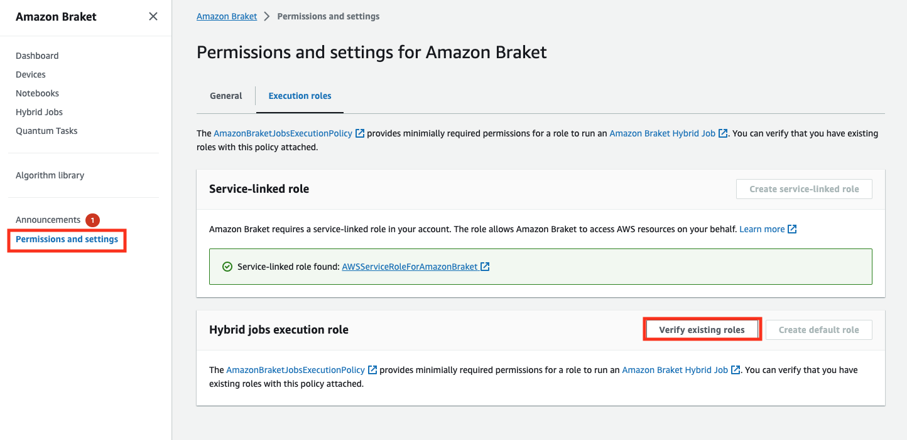
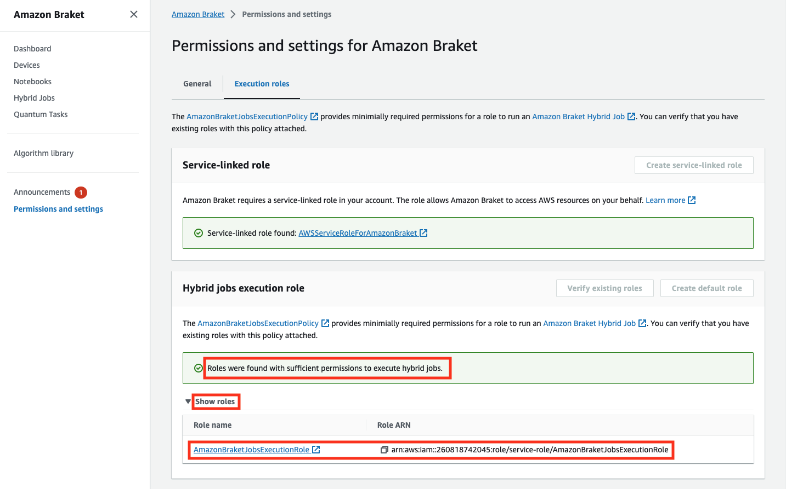
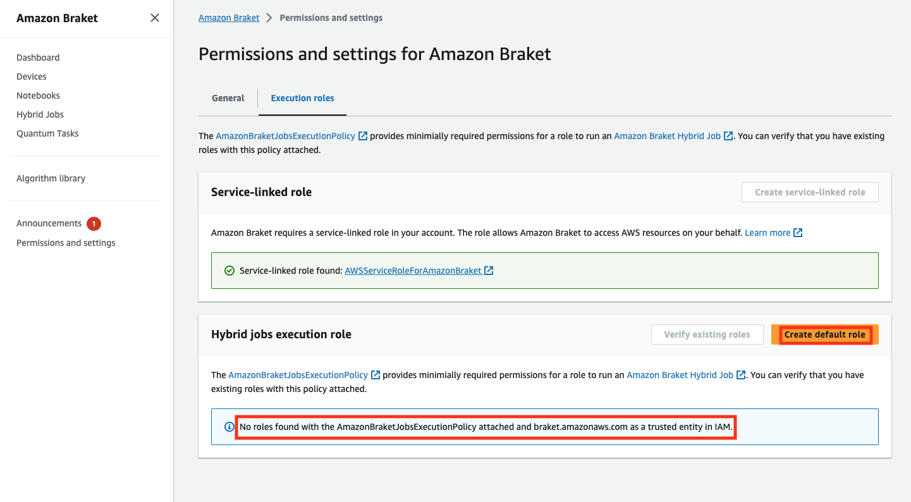
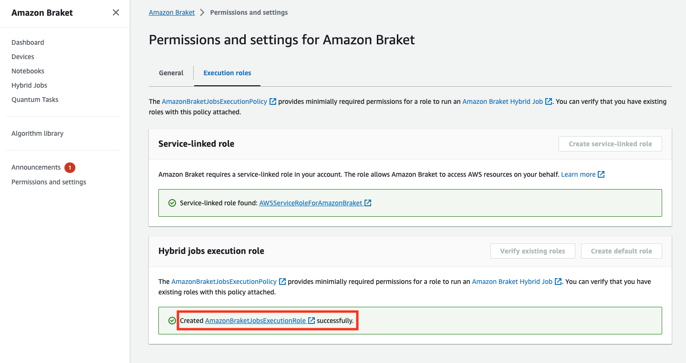
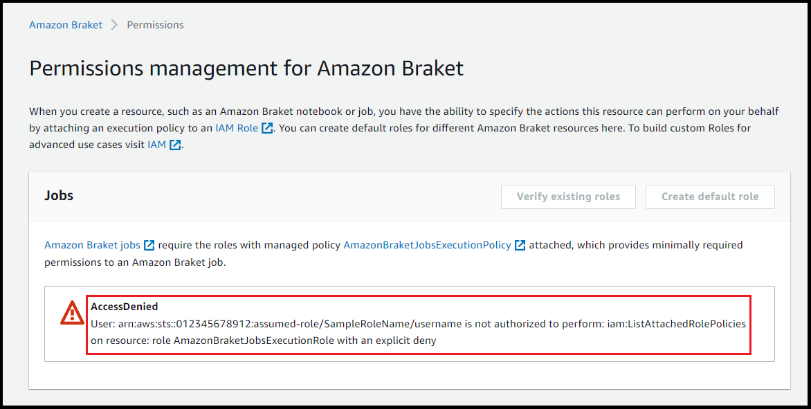

# Prerequisites

Before you run your first hybrid job, you must ensure that you have sufficient permissions to
proceed with this task. To determine that you have the correct permissions, select
**Permissions** from the menu on left side of the
Braket Console. The **Permissions management for
Amazon Braket** page helps you verify whether one of your
existing roles has permissions that are sufficient to run your hybrid job or guides you through
the creation of a default role that can be used to run your hybrid job if you do not already have
such a role.

To verify that you have roles with sufficient permissions to run a hybrid job, select the
**Verify existing role** button. If you do, you get a
message that the roles were found. To see the names of the roles and their role ARNs,
select the **Show roles** button.

If you do not have a role with sufficient permissions to run a hybrid job, you get a
message that no such role was found. Select the **Create default
role** button to obtain a role with sufficient permissions.

If the role was created successfully, you get a message confirming this.

If you do not have permissions to make this inquiry, you will be denied access. In this
case, contact your internal AWS administrator.

