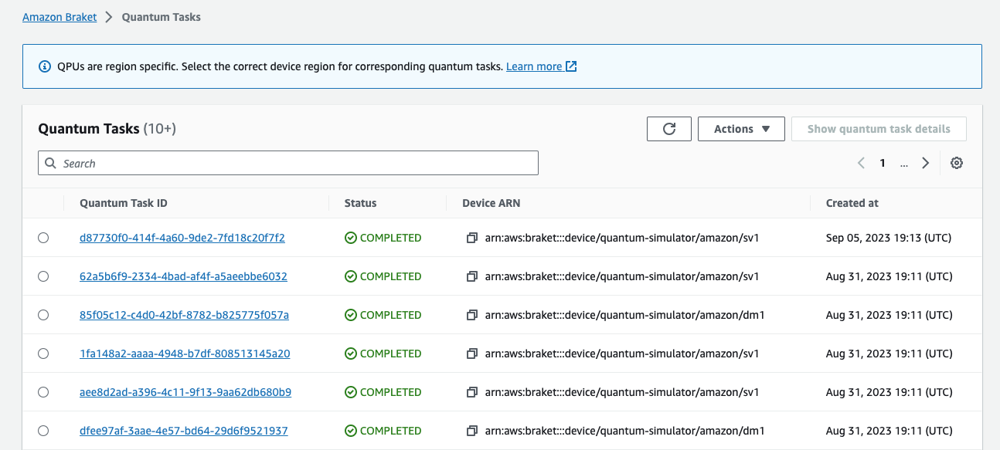
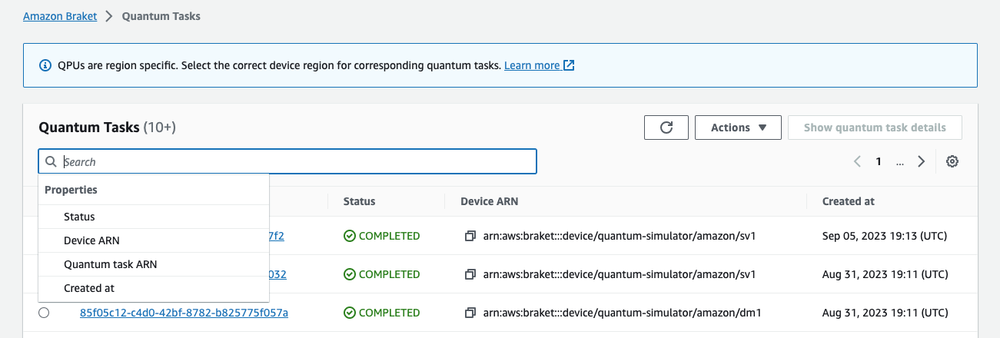
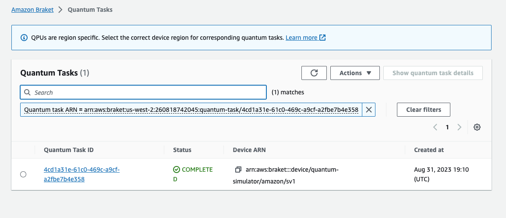
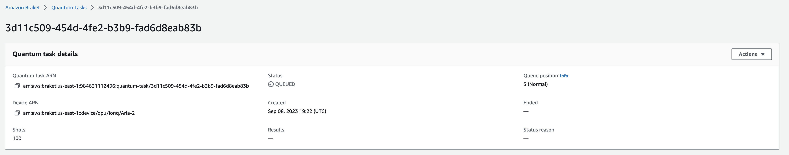

# Monitoring quantum tasks through the Amazon Braket console

Amazon Braket offers a convenient way of monitoring the quantum task through
the [Amazon Braket
console](https://console.aws.amazon.com/braket/home "https://console.aws.amazon.com/braket/home"). All submitted quantum tasks are listed in the **Quantum Tasks** field as shown in the following figure. This service is
_Region-specific_, which means that you can only view those quantum tasks
created in the specific AWS Region.

You can search for particular quantum tasks through the navigation bar. The search can be
based on Quantum Task ARN (ID), status, device, and creation time. The options appear
automatically when you select the navigation bar, as shown in the following
example.

The following image shows an example of searching for a quantum task based on its unique quantum task
ID, which can be obtained by calling `task.id`.

Additionally, seen in the figure below, the status of a quantum task can be monitored
while it is in a `QUEUED` state. Clicking on the quantum task ID shows the
details page. This page displays the dynamic queue position for your quantum task relative to
the device it will process on.

Quantum tasks submitted as part of a hybrid job will have priority when in queue.
Quantum tasks submitted outside of a hybrid job will have normal queuing priority.

Customers wishing to query the Braket SDK, can obtain their quantum task and hybrid
job queue positions programmatically. For more information see the
[When will my task run](braket-task-when.md "braket-task-when.md") page.
