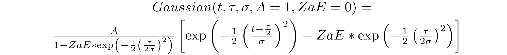
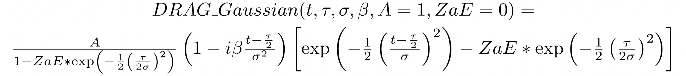
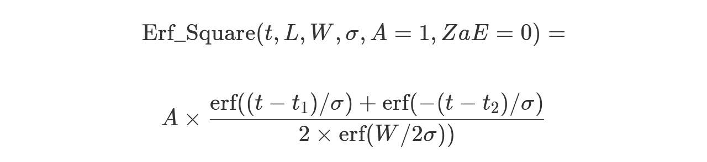

# Support for OpenQASM on different

Braket devices

For devices supporting OpenQASM 3.0, the `action` field supports a new
action through the `GetDevice` response, as shown in the following example
for the Rigetti and IonQ devices.

```
//OpenQASM as available with the Rigetti device capabilities
{
    "braketSchemaHeader": {
        "name": "braket.device_schema.rigetti.rigetti_device_capabilities",
        "version": "1"
    },
    "service": {...},
    "action": {
        "braket.ir.jaqcd.program": {...},
        **"braket.ir.openqasm.program": {**
            **"actionType": "braket.ir.openqasm.program",**
            "version": [
                "1"
            ],
            ….
        }
    }
}

//OpenQASM as available with the IonQ device capabilities
{
    "braketSchemaHeader": {
        "name": "braket.device_schema.ionq.ionq_device_capabilities",
        "version": "1"
    },
    "service": {...},
    "action": {
        "braket.ir.jaqcd.program": {...},
        **"braket.ir.openqasm.program"**: {
            **"actionType": "braket.ir.openqasm.program",**
            "version": [
                "1"
            ],
            ….
        }
    }
}
```

For devices that support pulse control, the `pulse` field is displayed in
the `GetDevice` response. The following example show this `pulse`
field for the Rigetti device.

```
// Rigetti
{
  "pulse": {
    "braketSchemaHeader": {
      "name": "braket.device_schema.pulse.pulse_device_action_properties",
      "version": "1"
    },
    "supportedQhpTemplateWaveforms": {
      "constant": {
        "functionName": "constant",
        "arguments": [
          {
            "name": "length",
            "type": "float",
            "optional": false
          },
          {
            "name": "iq",
            "type": "complex",
            "optional": false
          }
        ]
      },
      ...
    },
    "ports": {
      "q0_ff": {
        "portId": "q0_ff",
        "direction": "tx",
        "portType": "ff",
        "dt": 1e-9,
        "centerFrequencies": [
          375000000
        ]
      },
      ...
    },
    "supportedFunctions": {
      "shift_phase": {
        "functionName": "shift_phase",
        "arguments": [
          {
            "name": "frame",
            "type": "frame",
            "optional": false
          },
          {
            "name": "phase",
            "type": "float",
            "optional": false
          }
        ]
      },
     ...
    },
    "frames": {
      "q0_q1_cphase_frame": {
        "frameId": "q0_q1_cphase_frame",
        "portId": "q0_ff",
        "frequency": 462475694.24460185,
        "centerFrequency": 375000000,
        "phase": 0,
        "associatedGate": "cphase",
        "qubitMappings": [
          0,
          1
        ]
      },
      ...
    },
    "supportsLocalPulseElements": false,
    "supportsDynamicFrames": false,
    "supportsNonNativeGatesWithPulses": false,
    "validationParameters": {
      "MAX_SCALE": 4,
      "MAX_AMPLITUDE": 1,
      "PERMITTED_FREQUENCY_DIFFERENCE": 400000000
    }
  }
}
```

The preceding fields detail the following:

**Ports:**

Describes pre-made external (`extern`) device ports declared on the QPU in
addition to the associated properties of the given port. All ports listed in this
structure are pre-declared as valid identifiers within the `OpenQASM 3.0`
program submitted by the user. The additional properties for a port include:

- Port id (portId)
  - The port name declared as an identifier in OpenQASM 3.0.

- Direction (direction)
  - The direction of the port. Drive ports transmit pulses (direction “tx”),
    while measurement ports receive pulses (direction “rx”).

- Port type (portType)
  - The type of action for which this port is responsible (for example,
    drive, capture, or ff - fast-flux).

- Dt (dt)
  - The time in seconds that represents a single sample time step on the
    given port.

- Qubit mappings (qubitMappings)
  - The qubits associated with the given port.

- Center frequencies (centerFrequencies)
  - A list of the associated center frequencies for all pre-declared or
    user-defined frames on the port. For more information, refer to
    Frames.

- QHP Specific Properties (qhpSpecificProperties)
  - An optional map detailing existing properties about the port specific to
    the QHP.

**Frames:**

Describes pre-made external frames declared on the QPU as well as associated
properties about the frames. All frames listed in this structure are pre-declared as
valid identifiers within the `OpenQASM 3.0` program submitted by the user.
The additional properties for a frame include:

- Frame Id (frameId)
  - The frame name declared as an identifier in OpenQASM 3.0.

- Port Id (portId)
  - The associated hardware port for the frame.

- Frequency (frequency)
  - The default initial frequency of the frame.

- Center Frequency (centerFrequency)
  - The center of the frequency bandwidth for the frame. Typically, frames
    may only be adjusted to a certain bandwidth around the center frequency. As
    a result, frequency adjustments should stay within a given delta of the
    center frequency. You can find the bandwidth value in the validation
    parameters.

- Phase (phase)
  - The default initial phase of the frame.

- Associated Gate (associatedGate)
  - The gates associated with the given frame.

- Qubit Mappings (qubitMappings)
  - The qubits associated with the given frame.

- QHP Specific Properties (qhpSpecificProperties)
  - An optional map detailing existing properties about the frame specific to
    the QHP.

**SupportsDynamicFrames:**

Describes whether a frame can be declared in `cal` or
`defcal` blocks through the OpenPulse
`newframe` function. If this is false, only frames listed in the frame
structure may be used within the program.

**SupportedFunctions:**

Describes the OpenPulse functions that are supported for the device in
addition to the associated arguments, argument types, and return types for the given
functions. To see examples of using the OpenPulse functions, see the
[OpenPulse
specification](https://openqasm.com/language/openpulse.html "https://openqasm.com/language/openpulse.html"). At this time, Braket supports:

- shift_phase
  - Shifts the phase of a frame by a specified value

- set_phase
  - Sets the phase of frame to the specified value

- swap_phases
  - Swaps the phases between two frames.

- shift_frequency
  - Shifts the frequency of a frame by a specified value

- set_frequency
  - Sets the frequency of frame to the specified value

- play
  - Schedules a waveform

- capture_v0
  - Returns the value on a capture frame to a bit register

**SupportedQhpTemplateWaveforms:**

Describes the pre-built waveform functions available on the device and the associated
arguments and types. By default, Braket Pulse offers pre-built waveform routines on
all devices, which are:

**_Constant_**


`τ` is the length of the waveform and `iq` is a complex
number.

```
def constant(length, iq)
```

**_Gaussian_**



`τ` is the length of the waveform, `σ` is the width of the
Gaussian, and `A` is the amplitude. If setting `ZaE` to
`True`, the Gaussian is offset and rescaled such that it is equal to zero
at the start and end of the waveform, and reaches `A` at maximum.

```
def gaussian(length, sigma, amplitude=1, zero_at_edges=False)
```

**_DRAG Gaussian_**



`τ` is the length of the waveform, `σ` is the width of the
gaussian, `β` is a free parameter, and `A` is the amplitude. If
setting `ZaE` to `True`, the Derivative Removal by Adiabatic Gate
(DRAG) Gaussian is offset and rescaled such that it is equal to zero at the start and
end of the waveform, and the real part reaches `A` at maximum. For more
information about the DRAG waveform, see the paper [Simple Pulses for Elimination of
Leakage in Weakly Nonlinear Qubits](https://doi.org/10.1103/PhysRevLett.103.110501 "https://doi.org/10.1103/PhysRevLett.103.110501").

```
def drag_gaussian(length, sigma, beta, amplitude=1, zero_at_edges=False)
```

**_Erf Square_**


Where `L` is the length, `W` is the width of the waveform,
`σ` defines how fast the edges rise and fall, `t1​=(L−W)/2`
and `t22=(L+W)/2`, `A` is the amplitude.
If setting `ZaE` to `True`, the Gaussian is offset and rescaled such that it is
equal to zero at the start and end of the waveform, and reaches `A` at maximum.
The following equation is the rescaled version of the waveform.


Where `a=erf(W/2σ)`and `b=erf(-t1​/σ)/2+erf(t2​/σ)/2`.

```
def erf_square(length, width, sigma, amplitude=1, zero_at_edges=False)
```

**SupportsLocalPulseElements:**

Describes whether pulse elements, such as ports, frames, and waveforms may be
defined locally in `defcal` blocks. If the value is `false`,
elements must be defined in `cal` blocks.

**SupportsNonNativeGatesWithPulses:**

Describes whether we can or cannot use non-native gates in combination with pulse
programs. For example, you cannot use a non-native gate like an `H` gate in a
program without first defining the gate through `defcal` for the used qubit.
You can find the list of native gates `nativeGateSet` key under the device
capabilities.

**ValidationParameters:**

Describes pulse element validation boundaries, including:

- Maximum Scale / Maximum Amplitude values for waveforms (arbitrary and
  pre-built)
- Maximum frequency bandwidth from supplied center frequency in Hz
- Minimum pulse length/duration in seconds
- Maximum pulse length/duration in seconds

## Supported

Operations, Results and Result Types with OpenQASM

To find out which OpenQASM 3.0 features each device supports, you can refer to the
`braket.ir.openqasm.program` key in the `action` field on
the device capabilities output. For example, the following are the supported
operations and result types available for the Braket State Vector simulator
SV1.

```
...
  "action": {
    "braket.ir.jaqcd.program": {
      ...
    },
 **"braket.ir.openqasm.program": {**
      "version": [
        "1.0"
      ],
      "actionType": "braket.ir.openqasm.program",
      "supportedOperations": [
        "ccnot",
        "cnot",
        "cphaseshift",
        "cphaseshift00",
        "cphaseshift01",
        "cphaseshift10",
        "cswap",
        "cy",
        "cz",
        "h",
        "i",
        "iswap",
        "pswap",
        "phaseshift",
        "rx",
        "ry",
        "rz",
        "s",
        "si",
        "swap",
        "t",
        "ti",
        "v",
        "vi",
        "x",
        "xx",
        "xy",
        "y",
        "yy",
        "z",
        "zz"
      ],
      "supportedPragmas": [
        "braket_unitary_matrix"
      ],
      "forbiddenPragmas": [],
      "maximumQubitArrays": 1,
      "maximumClassicalArrays": 1,
      "forbiddenArrayOperations": [
        "concatenation",
        "negativeIndex",
        "range",
        "rangeWithStep",
        "slicing",
        "selection"
      ],
      "requiresAllQubitsMeasurement": true,
      "supportsPhysicalQubits": false,
      "requiresContiguousQubitIndices": true,
      "disabledQubitRewiringSupported": false,
      "supportedResultTypes": [
        {
          "name": "Sample",
          "observables": [
            "x",
            "y",
            "z",
            "h",
            "i",
            "hermitian"
          ],
          "minShots": 1,
          "maxShots": 100000
        },
        {
          "name": "Expectation",
          "observables": [
            "x",
            "y",
            "z",
            "h",
            "i",
            "hermitian"
          ],
          "minShots": 0,
          "maxShots": 100000
        },
        {
          "name": "Variance",
          "observables": [
            "x",
            "y",
            "z",
            "h",
            "i",
            "hermitian"
          ],
          "minShots": 0,
          "maxShots": 100000
        },
        {
          "name": "Probability",
          "minShots": 1,
          "maxShots": 100000
        },
        {
          "name": "Amplitude",
          "minShots": 0,
          "maxShots": 0
        }
        {
          "name": "AdjointGradient",
          "minShots": 0,
          "maxShots": 0
        }
      ]
    }
  },
...
```
