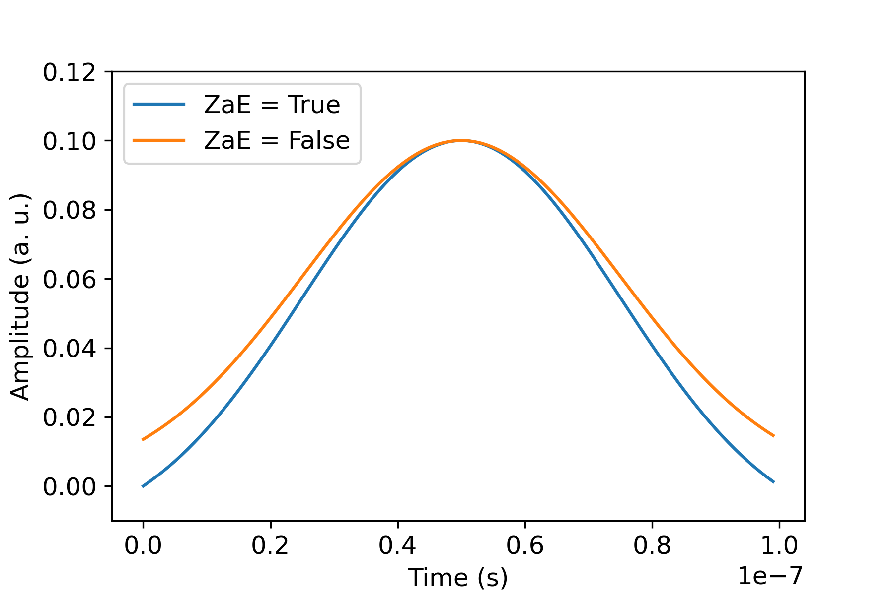

# Pulse control on Amazon Braket

Pulses are the analog signals that control the qubits in a quantum computer. With
certain devices on Amazon Braket, you can access the pulse control feature to submit
circuits using pulses. You can access pulse control through the Braket SDK, using
OpenQASM 3.0, or directly through the Braket APIs. First, introduce some key
concepts for pulse control in Braket.

###### In this section:

- [Frames](#braket-frame "#braket-frame")
- [Ports](#braket-port "#braket-port")
- [Waveforms](#braket-waveform "#braket-waveform")
- [Working with Hello Pulse](braket-hello-pulse.md "braket-hello-pulse.md")
- [Accessing native gates using pulses](braket-native-gate-pulse.md "braket-native-gate-pulse.md")

## Frames

A frame is a software abstraction that acts as both a clock within the quantum
program and a phase. The clock time is incremented on each usage and a stateful carrier
signal that is defined by a frequency. When transmitting signals to the qubit, a frame
determines the qubit's carrier frequency, phase offset, and the time at which the
waveform envelope is emitted. In Braket Pulse, constructing frames depends on the
device, frequency, and phase. Depending on the device, you can either choose a
predefined frame or instantiate new frames by providing a port.

```
from braket.aws import AwsDevice
from braket.pulse import Frame, Port

# Predefined frame from a device
device = AwsDevice("arn:aws:braket:us-west-1::device/qpu/rigetti/Ankaa-3")
drive_frame = device.frames["Transmon_5_charge_tx"]

# Create a custom frame
readout_frame = Frame(frame_id="r0_measure", port=Port("channel_0", dt=1e-9), frequency=5e9, phase=0)
```

## Ports

A port is a software abstraction representing any input/output hardware component
controlling qubits. It helps hardware vendors provide an interface with which users can
interact to manipulate and observe qubits. Ports are characterized by a single string
that represents the name of the connector. This string also exposes a minimum time
increment that specifies how finely we can define the waveforms.

```
from braket.pulse import Port

Port0 = Port("channel_0", dt=1e-9)
```

## Waveforms

A waveform is a time-dependent envelope that we can use to emit signals on an output
port or capture signals through an input port. You can specify your waveforms directly
either through a list of complex numbers or by using a waveform template to generate a
list from the hardware provider.

```
from braket.pulse import ArbitraryWaveform, ConstantWaveform
import numpy as np

cst_wfm = ConstantWaveform(length=1e-7, iq=0.1)
arb_wf = ArbitraryWaveform(amplitudes=np.linspace(0, 100))
```

Braket Pulse provides a standard library of waveforms, including a constant
waveform, a Gaussian waveform, and a Derivative Removal by Adiabatic Gate (DRAG)
waveform. You can retrieve the waveform data through the `sample` function to
draw the shape of the waveform as shown in the following example.

```
from braket.pulse import GaussianWaveform
import numpy as np
import matplotlib.pyplot as plt

zero_at_edge1 = GaussianWaveform(1e-7, 25e-9, 0.1, True)
# or zero_at_edge1 = GaussianWaveform(1e-7, 25e-9, 0.1)
zero_at_edge2 = GaussianWaveform(1e-7, 25e-9, 0.1, False)

times_1 = np.arange(0, zero_at_edge1.length, drive_frame.port.dt)
times_2 = np.arange(0, zero_at_edge2.length, drive_frame.port.dt)

plt.plot(times_1, zero_at_edge1.sample(drive_frame.port.dt))
plt.plot(times_2, zero_at_edge2.sample(drive_frame.port.dt))
```



The preceding image depicts the Gaussian waveforms created from
`GaussianWaveform`. We chose a pulse length of 100 ns, a width of 25 ns,
and an amplitude of 0.1 (arbitrary units). The waveforms are centered in the pulse
window. `GaussianWaveform` accepts a boolean argument
`zero_at_edges` (ZaE in the legend). When set to `True`, this
argument offsets the Gaussian waveform such that the points at t=0 and
t=`length` are at zero and rescales its amplitude such that the maximum
value corresponds to the `amplitude` argument.
