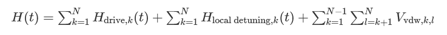

# Submit an analog program using QuEra Aquila

This page provides a comprehensive documentation about the capabilities of the
Aquila machine from QuEra. Details covered here are the
following:

1. The parameterized Hamiltonian simulated by Aquila
2. AHS program parameters
3. AHS result content
4. Aquila capabilities parameter

###### In this section:

- [Hamiltonian](#braket-quera-aquila-device-hamiltonian "#braket-quera-aquila-device-hamiltonian")
- [Braket AHS program schema](#braket-quera-ahs-program-schema "#braket-quera-ahs-program-schema")
- [Braket AHS task result
  schema](#braket-quera-ahs-task-result-schema "#braket-quera-ahs-task-result-schema")
- [QuEra device properties
  schema](#braket-quera-device-properties-schema "#braket-quera-device-properties-schema")

## Hamiltonian

The Aquila machine from QuEra simulates the following
(time-dependent) Hamiltonian natively:



###### Note

Access to local detuning is an
[Experimental capability](braket-experimental-capabilities.md "braket-experimental-capabilities.md")
and is available by request through Braket Direct.

where

- Hdrive,k​(t)=(
  1/2
  ​Ω(t)eiϕ(t)S−,k​ +
  1/2
  ​Ω(t)e−iϕ(t) S+,k​) +
  (−Δglobal​(t)nk​),
  - Ω(t) is the time-dependent, global driving amplitude (aka Rabi
    frequency), in units of (rad / s)
  - ϕ(t) is the time-dependent, global phase, measured in radians
  - S−,k​ and S+,k​ are the
    spin lowering and raising operators of atom k (in the basis
    |↓⟩=|g⟩, |↑⟩=|r⟩, they are
    S−​=|g⟩⟨r|,
    S+​=(S−​)†=|r⟩⟨g|)
  - Δglobal​(t) is the time-dependent, global
    detuning
  - nk ​is the projection operator on the Rydberg
    state of atom k (that is, n=|r⟩⟨r|)

- Hlocal detuning,k(t)=-Δlocal(t)hknk
  - Δlocal(t) is the time-dependent factor of the local frequency shift, in units of (rad / s)
  - hk is the site-dependent factor, a dimensionless number between 0.0 and 1.0

- Vvdw,k,l​=C6​/(dk,l​)6nk​nl​,
  - C6​ is the van der Waals coefficient, in units of
    (rad / s) \* (m)^6
  - dk,l ​is the Euclidean distance between atom k and
    l, measured in meters.

Users have control over the following parameters through the Braket AHS program
schema.

- 2-d atom arrangement (xk​ and yk​
  coordinates of each atom k, in units of um), which controls the pairwise atomic
  distances dk,l​ with k,l=1,2,…N
- Ω(t), the time-dependent, global Rabi frequency, in units of (rad / s)
- ϕ(t), the time-dependent, global phase, in units of (rad)
- Δglobal​(t), the time-dependent, global detuning, in
  units of (rad / s)
- Δlocal(t), the time-dependent (global) factor of the magnitude of local detuning, in units of (rad / s)
- hk, the (static) site-dependent factor of the magnitude of local detuning, a dimensionless number between 0.0 and 1.0

###### Note

The user cannot control which levels are involved (that is,
S−​,S+​, n operators are fixed) nor
the strength of the Rydberg-Rydberg interaction coefficient
(C6​).

## Braket AHS program schema

**braket.ir.ahs.program_v1.Program object**
(example)

###### Note

If the [local detuning](braket-experimental-capabilities.md#braket-access-local-detuning "braket-experimental-capabilities.md#braket-access-local-detuning")
feature is not enabled for your account, use `localDetuning=[]` in the following example.

```
Program(
    braketSchemaHeader=BraketSchemaHeader(
        name='braket.ir.ahs.program',
        version='1'
    ),
    setup=Setup(
        ahs_register=AtomArrangement(
            sites=[
                [Decimal('0'), Decimal('0')],
                [Decimal('0'), Decimal('4e-6')],
                [Decimal('4e-6'), Decimal('0')]
            ],
            filling=[1, 1, 1]
        )
    ),
    hamiltonian=Hamiltonian(
        drivingFields=[
            DrivingField(
                amplitude=PhysicalField(
                    time_series=TimeSeries(
                        values=[Decimal('0'), Decimal('15700000.0'), Decimal('15700000.0'), Decimal('0')],
                        times=[Decimal('0'), Decimal('0.000001'), Decimal('0.000002'), Decimal('0.000003')]
                    ),
                    pattern='uniform'
                ),
                phase=PhysicalField(
                    time_series=TimeSeries(
                        values=[Decimal('0'), Decimal('0')],
                        times=[Decimal('0'), Decimal('0.000003')]
                    ),
                    pattern='uniform'
                ),
                detuning=PhysicalField(
                    time_series=TimeSeries(
                        values=[Decimal('-54000000.0'), Decimal('54000000.0')],
                        times=[Decimal('0'), Decimal('0.000003')]
                    ),
                    pattern='uniform'
                )
            )
        ],
        localDetuning=[
            LocalDetuning(
                magnitude=PhysicalField(
                    times_series=TimeSeries(
                        values=[Decimal('0'), Decimal('25000000.0'), Decimal('25000000.0'), Decimal('0')],
                        times=[Decimal('0'), Decimal('0.000001'), Decimal('0.000002'), Decimal('0.000003')]
                    ),
                    pattern=Pattern([Decimal('0.8'), Decimal('1.0'), Decimal('0.9')])
                )
            )
        ]
    )
)
```

**JSON** (example)

###### Note

If the [local detuning](braket-experimental-capabilities.md#braket-access-local-detuning "braket-experimental-capabilities.md#braket-access-local-detuning")
feature is not enabled for your account, use `"localDetuning": []` in the following example.

```
{
    "braketSchemaHeader": {
        "name": "braket.ir.ahs.program",
        "version": "1"
    },
    "setup": {
        "ahs_register": {
            "sites": [
                [0E-7, 0E-7],
                [0E-7, 4E-6],
                [4E-6, 0E-7]
            ],
            "filling": [1, 1, 1]
        }
    },
    "hamiltonian": {
        "drivingFields": [
            {
                "amplitude": {
                    "time_series": {
                        "values": [0.0, 15700000.0, 15700000.0, 0.0],
                        "times": [0E-9, 0.000001000, 0.000002000, 0.000003000]
                    },
                    "pattern": "uniform"
                },
                "phase": {
                    "time_series": {
                        "values": [0E-7, 0E-7],
                        "times": [0E-9, 0.000003000]
                    },
                    "pattern": "uniform"
                },
                "detuning": {
                    "time_series": {
                        "values": [-54000000.0, 54000000.0],
                        "times": [0E-9, 0.000003000]
                    },
                    "pattern": "uniform"
                }
            }
        ],
        "localDetuning": [
            {
                "magnitude": {
                    "time_series": {
                        "values": [0.0, 25000000.0, 25000000.0, 0.0],
                        "times": [0E-9, 0.000001000, 0.000002000, 0.000003000]
                    },
                    "pattern": [0.8, 1.0, 0.9]
                }
            }
        ]
    }
}
```

| Main fields                                              | Program field       | type                                                                                                                 | description |
| -------------------------------------------------------- | ------------------- | -------------------------------------------------------------------------------------------------------------------- | ----------- |
| setup.ahs_register.sites                                 | List[List[Decimal]] | List of 2-d coordinates where the tweezers trap atoms                                                                |
| setup.ahs_register.filling                               | List[int]           | Marks atoms that occupy the trap sites with 1, and empty sites with<br>0                                             |
| hamiltonian.drivingFields[].amplitude.time_series.times  | List[Decimal]       | time points of driving amplitude, Omega(t)                                                                           |
| hamiltonian.drivingFields[].amplitude.time_series.values | List[Decimal]       | values of driving amplitude, Omega(t)                                                                                |
| hamiltonian.drivingFields[].amplitude.pattern            | str                 | spatial pattern of driving amplitude, Omega(t); must be<br>'uniform'                                                 |
| hamiltonian.drivingFields[].phase.time_series.times      | List[Decimal]       | time points of driving phase, phi(t)                                                                                 |
| hamiltonian.drivingFields[].phase.time_series.values     | List[Decimal]       | values of driving phase, phi(t)                                                                                      |
| hamiltonian.drivingFields[].phase.pattern                | str                 | spatial pattern of driving phase, phi(t); must be 'uniform'                                                          |
| hamiltonian.drivingFields[].detuning.time_series.times   | List[Decimal]       | time points of driving detuning, Delta_global(t)                                                                     |
| hamiltonian.drivingFields[].detuning.time_series.values  | List[Decimal]       | values of driving detuning, Delta_global(t)                                                                          |
| hamiltonian.drivingFields[].detuning.pattern             | str                 | spatial pattern of driving detuning, Delta_global(t); must be<br>'uniform'                                           |
| hamiltonian.localDetuning[].magnitude.time_series.times  | List[Decimal]       | time points of the time-dependent factor of the local detuning magnitude, Delta_local(t)                             |
| hamiltonian.localDetuning[].magnitude.time_series.values | List[Decimal]       | values of the time-dependent factor of the local detuning magnitude, Delta_local(t)                                  |
| hamiltonian.localDetuning[].magnitude.pattern            | List[Decimal]       | site-dependent factor of the local detuning magnitude, h_k (values corresponds to sites in setup.ahs_register.sites) |

| Metadata fields            | Program field | type                                                | description |
| -------------------------- | ------------- | --------------------------------------------------- | ----------- |
| braketSchemaHeader.name    | str           | name of the schema; must be 'braket.ir.ahs.program' |
| braketSchemaHeader.version | str           | version of the schema                               |

## Braket AHS task result

schema

**braket.tasks.analog_hamiltonian_simulation_quantum_task_result.AnalogHamiltonianSimulationQuantumTaskResult**
(example)

```
AnalogHamiltonianSimulationQuantumTaskResult(
    task_metadata=TaskMetadata(
        braketSchemaHeader=BraketSchemaHeader(
            name='braket.task_result.task_metadata',
            version='1'
        ),
        id='arn:aws:braket:us-east-1:123456789012:quantum-task/12345678-90ab-cdef-1234-567890abcdef',
        shots=2,
        deviceId='arn:aws:braket:us-east-1::device/qpu/quera/Aquila',
        deviceParameters=None,
        createdAt='2022-10-25T20:59:10.788Z',
        endedAt='2022-10-25T21:00:58.218Z',
        status='COMPLETED',
        failureReason=None
    ),
    measurements=[
        ShotResult(
            status=<AnalogHamiltonianSimulationShotStatus.SUCCESS: 'Success'>,

            pre_sequence=array([1, 1, 1, 1]),
            post_sequence=array([0, 1, 1, 1])
        ),

        ShotResult(
            status=<AnalogHamiltonianSimulationShotStatus.SUCCESS: 'Success'>,

            pre_sequence=array([1, 1, 0, 1]),
            post_sequence=array([1, 0, 0, 0])
        )
    ]
)
```

**JSON** (example)

```
{
    "braketSchemaHeader": {
        "name": "braket.task_result.analog_hamiltonian_simulation_task_result",
        "version": "1"
    },
    "taskMetadata": {
        "braketSchemaHeader": {
            "name": "braket.task_result.task_metadata",
            "version": "1"
        },
        "id": "arn:aws:braket:us-east-1:123456789012:quantum-task/12345678-90ab-cdef-1234-567890abcdef",
        "shots": 2,
        "deviceId": "arn:aws:braket:us-east-1::device/qpu/quera/Aquila",

        "createdAt": "2022-10-25T20:59:10.788Z",
        "endedAt": "2022-10-25T21:00:58.218Z",
        "status": "COMPLETED"

    },
    "measurements": [
        {
            "shotMetadata": {"shotStatus": "Success"},
            "shotResult": {
                "preSequence": [1, 1, 1, 1],
                "postSequence": [0, 1, 1, 1]
            }
        },
        {
            "shotMetadata": {"shotStatus": "Success"},
            "shotResult": {
                "preSequence": [1, 1, 0, 1],
                "postSequence": [1, 0, 0, 0]
            }
        }
    ],
    "additionalMetadata": {
        "action": {...}
        "queraMetadata": {
            "braketSchemaHeader": {
                "name": "braket.task_result.quera_metadata",
                "version": "1"
            },
            "numSuccessfulShots": 100
        }
    }
}
```

| Main fields                            | Task result field | type                                                                                                                                                                                                            | description |
| -------------------------------------- | ----------------- | --------------------------------------------------------------------------------------------------------------------------------------------------------------------------------------------------------------- | ----------- |
| measurements[].shotResult.preSequence  | List[int]         | Pre-sequence measurement bits (one for each atomic site) for each<br>shot: 0 if site is empty, 1 if site is filled, measured before the<br>sequences of pulses that run the quantum evolution                   |
| measurements[].shotResult.postSequence | List[int]         | Post-sequence measurement bits for each shot: 0 if atom is in Rydberg<br>state or site is empty, 1 if atom is in ground state, measured at the end<br>of the sequences of pulses that run the quantum evolution |

| Metadata fields                                                    | Task result field                | type                                                                                                                                                | description |
| ------------------------------------------------------------------ | -------------------------------- | --------------------------------------------------------------------------------------------------------------------------------------------------- | ----------- |
| braketSchemaHeader.name                                            | str                              | name of the schema; must be<br>'braket.task_result.analog_hamiltonian_simulation_task_result'                                                       |
| braketSchemaHeader.version                                         | str                              | version of the schema                                                                                                                               |
| taskMetadata.braketSchemaHeader.name                               | str                              | name of the schema; must be ‘braket.task_result.task_metadata'                                                                                      |
| taskMetadata.braketSchemaHeader.version                            | str                              | version of the schema                                                                                                                               |
| taskMetadata.id                                                    | str                              | The ID of the quantum task. For AWS quantum tasks, this is the quantum task ARN.                                                                    |
| taskMetadata.shots                                                 | int                              | The number of shots for the quantum task                                                                                                            |
| taskMetadata.shots.deviceId                                        | str                              | The ID of the device on which the quantum task ran. For AWS devices, this is<br>the device ARN.                                                     |
| taskMetadata.shots.createdAt                                       | str                              | The timestamp of creation; the format must be in ISO-8601/RFC3339<br>string format YYYY-MM-DDTHH:mm:ss.sssZ. Default is None.                       |
| taskMetadata.shots.endedAt                                         | str                              | The timestamp of when the quantum task ended; the format must be in<br>ISO-8601/RFC3339 string format YYYY-MM-DDTHH:mm:ss.sssZ. Default is<br>None. |
| taskMetadata.shots.status                                          | str                              | The status of the quantum task (CREATED, QUEUED, RUNNING, COMPLETED, FAILED).<br>Default is None.                                                   |
| taskMetadata.shots.failureReason                                   | str                              | The failure reason of the quantum task. Default is None.                                                                                            |
| additionalMetadata.action                                          | braket.ir.ahs.program_v1.Program | (See the [Braket AHS<br>program schema](#braket-quera-ahs-program-schema "#braket-quera-ahs-program-schema") section)                               |
| additionalMetadata.action.braketSchemaHeader.queraMetadata.name    | str                              | name of the schema; must be 'braket.task_result.quera_metadata'                                                                                     |
| additionalMetadata.action.braketSchemaHeader.queraMetadata.version | str                              | version of the schema                                                                                                                               |
| additionalMetadata.action.numSuccessfulShots                       | int                              | number of completely successful shots; must be equal to the requested<br>number of shots                                                            |
| measurements[].shotMetadata.shotStatus                             | int                              | The status of the shot, (Success, Partial success, Failure); must be<br>"Success"                                                                   |

## QuEra device properties

schema

**braket.device_schema.quera.quera_device_capabilities_v1.QueraDeviceCapabilities**
(example)

```
QueraDeviceCapabilities(
    service=DeviceServiceProperties(
        braketSchemaHeader=BraketSchemaHeader(
            name='braket.device_schema.device_service_properties',
            version='1'
            ),
            executionWindows=[
                DeviceExecutionWindow(
                    executionDay=<ExecutionDay.MONDAY: 'Monday'>,
                    windowStartHour=datetime.time(1, 0),
                    windowEndHour=datetime.time(23, 59, 59)
                ),
                DeviceExecutionWindow(
                    executionDay=<ExecutionDay.TUESDAY: 'Tuesday'>,
                    windowStartHour=datetime.time(0, 0),
                    windowEndHour=datetime.time(12, 0)
                ),
                DeviceExecutionWindow(
                    executionDay=<ExecutionDay.WEDNESDAY: 'Wednesday'>,
                    windowStartHour=datetime.time(0, 0),
                    windowEndHour=datetime.time(12, 0)
                ),
                DeviceExecutionWindow(
                    executionDay=<ExecutionDay.FRIDAY: 'Friday'>,
                    windowStartHour=datetime.time(0, 0),
                    windowEndHour=datetime.time(23, 59, 59)
                ),
                DeviceExecutionWindow(
                    executionDay=<ExecutionDay.SATURDAY: 'Saturday'>,
                    windowStartHour=datetime.time(0, 0),
                    windowEndHour=datetime.time(23, 59, 59)
                ),
                DeviceExecutionWindow(
                    executionDay=<ExecutionDay.SUNDAY: 'Sunday'>,
                    windowStartHour=datetime.time(0, 0),
                    windowEndHour=datetime.time(12, 0)
                )
            ],
            shotsRange=(1, 1000),
            deviceCost=DeviceCost(
                price=0.01,
                unit='shot'
            ),
            deviceDocumentation=
                DeviceDocumentation(
                    imageUrl='https://a.b.cdn.console.awsstatic.com/59534b58c709fc239521ef866db9ea3f1aba73ad3ebcf60c23914ad8c5c5c878/a6cfc6fca26cf1c2e1c6.png',
                    summary='Analog quantum processor based on neutral atom arrays',
                    externalDocumentationUrl='https://www.quera.com/aquila'
                ),
                deviceLocation='Boston, USA',
                updatedAt=datetime.datetime(2024, 1, 22, 12, 0, tzinfo=datetime.timezone.utc),
                getTaskPollIntervalMillis=None
    ),
    action={
        <DeviceActionType.AHS: 'braket.ir.ahs.program'>: DeviceActionProperties(
                version=['1'],
                actionType=<DeviceActionType.AHS: 'braket.ir.ahs.program'>
            )
    },
    deviceParameters={},
    braketSchemaHeader=BraketSchemaHeader(
        name='braket.device_schema.quera.quera_device_capabilities',
        version='1'
    ),
    paradigm=QueraAhsParadigmProperties(
        ...
        # See https://github.com/amazon-braket/amazon-braket-schemas-python/blob/main/src/braket/device_schema/quera/quera_ahs_paradigm_properties_v1.py
        ...
    )
)
```

**JSON** (example)

```
{
    "service": {
        "braketSchemaHeader": {
            "name": "braket.device_schema.device_service_properties",
            "version": "1"
        },
        "executionWindows": [
            {
                "executionDay": "Monday",
                "windowStartHour": "01:00:00",
                "windowEndHour": "23:59:59"
            },
            {
                "executionDay": "Tuesday",
                "windowStartHour": "00:00:00",
                "windowEndHour": "12:00:00"
            },
            {
                "executionDay": "Wednesday",
                "windowStartHour": "00:00:00",
                "windowEndHour": "12:00:00"
            },
            {
                "executionDay": "Friday",
                "windowStartHour": "00:00:00",
                "windowEndHour": "23:59:59"
            },
            {
                "executionDay": "Saturday",
                "windowStartHour": "00:00:00",
                "windowEndHour": "23:59:59"
            },
            {
                "executionDay": "Sunday",
                "windowStartHour": "00:00:00",
                "windowEndHour": "12:00:00"
            }
        ],
        "shotsRange": [
            1,
            1000
        ],
        "deviceCost": {
            "price": 0.01,
            "unit": "shot"
        },
        "deviceDocumentation": {
            "imageUrl": "https://a.b.cdn.console.awsstatic.com/59534b58c709fc239521ef866db9ea3f1aba73ad3ebcf60c23914ad8c5c5c878/a6cfc6fca26cf1c2e1c6.png",
            "summary": "Analog quantum processor based on neutral atom arrays",
            "externalDocumentationUrl": "https://www.quera.com/aquila"
        },
        "deviceLocation": "Boston, USA",
        "updatedAt": "2024-01-22T12:00:00+00:00"
    },
    "action": {
        "braket.ir.ahs.program": {
            "version": [
                "1"
            ],
            "actionType": "braket.ir.ahs.program"
        }
    },
    "deviceParameters": {},
    "braketSchemaHeader": {
        "name": "braket.device_schema.quera.quera_device_capabilities",
        "version": "1"
    },
    "paradigm": {
        ...
        # See Aquila device page > "Calibration" tab > "JSON" page
        ...
    }
}
```

| Service properties fields                         | Service properties field | type                                                                                                                                                         | description |
| ------------------------------------------------- | ------------------------ | ------------------------------------------------------------------------------------------------------------------------------------------------------------ | ----------- |
| service.executionWindows[].executionDay           | ExecutionDay             | Days of the execution window; must be 'Everyday', 'Weekdays',<br>'Weekend', 'Monday', 'Tuesday', 'Wednesday', Thursday', 'Friday',<br>'Saturday' or 'Sunday' |
| service.executionWindows[].windowStartHour        | datetime.time            | UTC 24-hour format of the time when the execution window starts                                                                                              |
| service.executionWindows[].windowEndHour          | datetime.time            | UTC 24-hour format of the time when the execution window ends                                                                                                |
| service.qpu_capabilities.service.shotsRange       | Tuple[int, int]          | Minimum and maximum number of shots for the device                                                                                                           |
| service.qpu_capabilities.service.deviceCost.price | float                    | Price of the device in terms of US dollars                                                                                                                   |
| service.qpu_capabilities.service.deviceCost.unit  | str                      | unit for charging the price, e.g: 'minute', 'hour', 'shot',<br>'task'                                                                                        |

| Metadata fields                                      | Metadata field | type                                                                            | description |
| ---------------------------------------------------- | -------------- | ------------------------------------------------------------------------------- | ----------- |
| action[].version                                     | str            | version of the AHS program schema                                               |
| action[].actionType                                  | ActionType     | AHS program schema name; must be 'braket.ir.ahs.program'                        |
| service.braketSchemaHeader.name                      | str            | name of the schema; must be<br>'braket.device_schema.device_service_properties' |
| service.braketSchemaHeader.version                   | str            | version of the schema                                                           |
| service.deviceDocumentation.imageUrl                 | str            | URL for the image of the device                                                 |
| service.deviceDocumentation.summary                  | str            | brief description on the device                                                 |
| service.deviceDocumentation.externalDocumentationUrl | str            | external documentation URL                                                      |
| service.deviceLocation                               | str            | geographic location fo the device                                               |
| service.updatedAt                                    | datetime       | time when the device properties were last updated                               |
