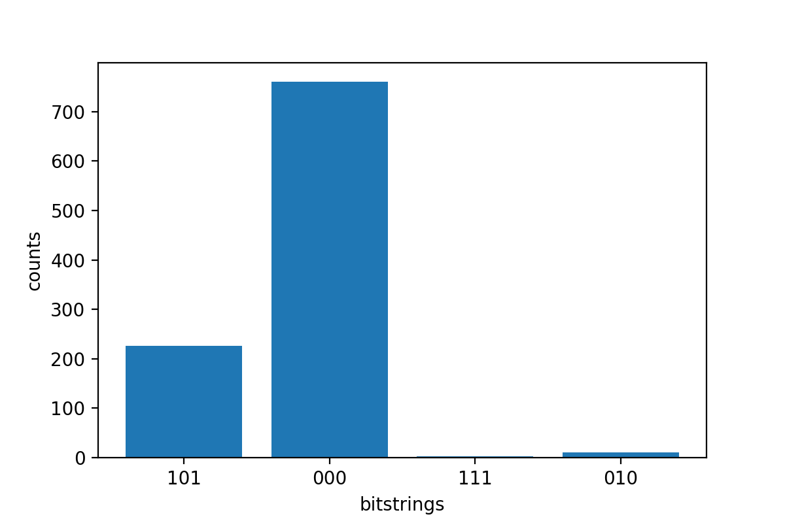

# Example quantum tasks on Amazon Braket

This section walks through the stages of running an example quantum task, from selecting the
device to viewing the result. As a best practice for Amazon Braket, we
recommend that you begin by running the circuit on a simulator, such as
SV1.

###### In this section:

- [Specify the device](#braket-example-specify-device "#braket-example-specify-device")
- [Submit an example quantum task](#braket-submit-example-task "#braket-submit-example-task")
- [Submit a parametrized task](#braket-submit-parametrized-task "#braket-submit-parametrized-task")
- [Specify shots](#braket-shots "#braket-shots")
- [Poll for results](#braket-polling-results "#braket-polling-results")
- [View the example results](#braket-example-results "#braket-example-results")

## Specify the device

First, select and specify the device for your quantum task. This example shows how to
choose the simulator, SV1.

```
from braket.aws import AwsDevice

# Choose the on-demand simulator to run the circuit
device = AwsDevice("arn:aws:braket:::device/quantum-simulator/amazon/sv1")
```

You can view some of the properties of this device as follows:

```
print(device.name)
for iter in device.properties.action['braket.ir.jaqcd.program']:
    print(iter)
```

```
SV1
('version', ['1.0', '1.1'])
('actionType', 'braket.ir.jaqcd.program')
('supportedOperations', ['ccnot', 'cnot', 'cphaseshift', 'cphaseshift00', 'cphaseshift01', 'cphaseshift10', 'cswap', 'cy', 'cz', 'ecr', 'h', 'i', 'iswap', 'pswap', 'phaseshift', 'rx', 'ry', 'rz', 's', 'si', 'swap', 't', 'ti', 'unitary', 'v', 'vi', 'x', 'xx', 'xy', 'y', 'yy', 'z', 'zz'])
('supportedResultTypes', [ResultType(name='Sample', observables=['x', 'y', 'z', 'h', 'i', 'hermitian'], minShots=1, maxShots=100000), ResultType(name='Expectation', observables=['x', 'y', 'z', 'h', 'i', 'hermitian'], minShots=0, maxShots=100000), ResultType(name='Variance', observables=['x', 'y', 'z', 'h', 'i', 'hermitian'], minShots=0, maxShots=100000), ResultType(name='Probability', observables=None, minShots=1, maxShots=100000), ResultType(name='Amplitude', observables=None, minShots=0, maxShots=0)])
('disabledQubitRewiringSupported', None)
```

## Submit an example quantum task

Submit an example quantum task to run on the on-demand simulator.

```
from braket.circuits import Circuit, Observable

# Create a circuit with a result type
circ = Circuit().rx(0, 1).ry(1, 0.2).cnot(0, 2).variance(observable=Observable.Z(), target=0)
# Add another result type
circ.probability(target=[0, 2])

# Set up S3 bucket (where results are stored)
my_bucket = "amazon-braket-s3-demo-bucket"  # The name of the bucket
my_prefix = "your-folder-name"  # The name of the folder in the bucket
s3_location = (my_bucket, my_prefix)

# Submit the quantum task to run
my_task = device.run(circ, s3_location, shots=1000, poll_timeout_seconds=100, poll_interval_seconds=10)
# The positional argument for the S3 bucket is optional if you want to specify a bucket other than the default

# Get results of the quantum task
result = my_task.result()
```

The `device.run()` command creates a quantum task through the
`CreateQuantumTask` API. After a short
initialization time, the quantum task is queued until capacity exists to run the quantum task on a
device. In this case, the device is SV1. After the device completes
the computation, Amazon Braket writes the results to the Amazon S3
location specified in the call. The positional argument `s3_location` is
required for all devices except the local simulator.

###### Note

The Braket quantum task action is limited to 3MB in size.

## Submit a parametrized task

Amazon Braket on-demand and local simulators and QPUs also support specifying
values of free parameters at task submission. You can do this by using the
`inputs` argument to `device.run()`, as shown in the
following example. The `inputs` must be a dictionary of string-float
pairs, where the keys are the parameter names.

Parametric compilation can improve the performance of executing parametric
circuits on certain QPUs. When submitting a parametric circuit as a quantum task to a
supported QPU, Braket will compile the circuit once, and cache the result. There is
no recompilation for subsequent parameter updates to the same circuit, resulting in
faster runtimes for tasks that use the same circuit. Braket automatically uses the
updated calibration data from the hardware provider when compiling your circuit to
ensure the highest quality results.

###### Note

Parametric compilation is supported on all superconducting, gate-based QPUs
from Rigetti Computing with the exception of pulse level programs.

```
from braket.circuits import Circuit, FreeParameter, Observable

# Create the free parameters
alpha = FreeParameter('alpha')
beta = FreeParameter('beta')

# Create a circuit with a result type
circ = Circuit().rx(0, alpha).ry(1, alpha).cnot(0, 2).xx(0, 2, beta)
circ.variance(observable=Observable.Z(), target=0)

# Add another result type
circ.probability(target=[0, 2])

# Submit the quantum task to run
my_task = device.run(circ, inputs={'alpha': 0.1, 'beta': 0.2}, shots=100)
```

## Specify shots

The shots argument refers to the number of desired measurement
shots. Simulators such as SV1 support two simulation
modes.

- For shots = 0, the simulator performs an exact simulation,
  returning the true values for all result types. (Not available on
  TN1.)
- For non-zero values of shots, the simulator samples from the
  output distribution to emulate the shot noise of real QPUs. QPU
  devices only allow shots > 0.

For information about the maximum number of shots per quantum task, refer to [Braket Quotas](braket-quotas.md "braket-quotas.md").

## Poll for results

When executing `my_task.result()`, the SDK begins polling for a result
with the parameters you define upon quantum task creation:

- `poll_timeout_seconds` is the number of seconds to poll the quantum task
  before it times out when running the quantum task on the on-demand simulator and or QPU
  devices. The default value is 432,000 seconds, which is 5 days.
- **Note:** For QPU devices such as
  Rigetti and IonQ, we recommend that you allow
  a few days. If your polling timeout is too short, results may not be returned
  within the polling time. For example, when a QPU is unavailable, a local
  timeout error is returned.
- `poll_interval_seconds` is the frequency with which the quantum task is
  polled. It specifies how often you call the Braket API to get
  the status when the quantum task is run on the on-demand simulator and on QPU devices.
  The default value is 1 second.

This asynchronous execution facilitates the interaction with QPU devices that are
not always available. For example, a device could be unavailable during a regular
maintenance window.

The returned result contains a range of metadata associated with the quantum task. You can
check the measurement result with the following commands:

```
print('Measurement results:\n', result.measurements)
print('Counts for collapsed states:\n', result.measurement_counts)
print('Probabilities for collapsed states:\n', result.measurement_probabilities)
```

```
Measurement results:
 [[1 0 1]
 [0 0 0]
 [0 0 0]
 ...
 [0 0 0]
 [0 0 0]
 [1 0 1]]
Counts for collapsed states:
 Counter({'000': 766, '101': 220, '010': 11, '111': 3})
Probabilities for collapsed states:
 {'101': 0.22, '000': 0.766, '010': 0.011, '111': 0.003}
```

## View the example results

Because you've also specified the `ResultType`, you can view the
returned results. The result types appear in the order in which they were added to
the circuit.

```
print('Result types include:\n', result.result_types)
print('Variance=', result.values[0])
print('Probability=', result.values[1])

# Plot the result and do some analysis
import matplotlib.pyplot as plt
plt.bar(result.measurement_counts.keys(), result.measurement_counts.values())
plt.xlabel('bitstrings')
plt.ylabel('counts')
```

```
Result types include:
 [ResultTypeValue(type=Variance(observable=['z'], targets=[0], type=<Type.variance: 'variance'>), value=0.693084), ResultTypeValue(type=Probability(targets=[0, 2], type=<Type.probability: 'probability'>), value=array([0.777, 0.   , 0.   , 0.223]))]
Variance= 0.693084
Probability= [0.777 0.    0.    0.223]
Text(0, 0.5, 'counts')
```


