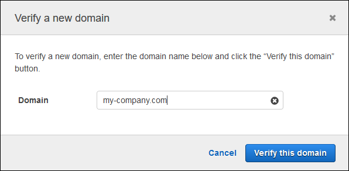

**End of support notice**: On February
20, 2026, AWS will end support for the Amazon Chime service. After February 20, 2026, you will
no longer be able to access the Amazon Chime console or Amazon Chime application resources. For more
information, visit the [blog post](https://aws.amazon.com/blogs/messaging-and-targeting/update-on-support-for-amazon-chime/ "https://aws.amazon.com/blogs/messaging-and-targeting/update-on-support-for-amazon-chime/"). **Note:** This does not impact the
availability of the [Amazon Chime SDK
service](https://aws.amazon.com/chime/chime-sdk/ "https://aws.amazon.com/chime/chime-sdk/").

# Claiming a domain

To create an Enterprise account and benefit from the greater control that it provides
over your account and users, you must claim at least one email domain.

###### To claim a domain

1. Open the Amazon Chime console at [https://chime.aws.amazon.com/](https://chime.aws.amazon.com "https://chime.aws.amazon.com").
2. On the **Accounts** page, select the name of the Team
   account.
3. In the navigation pane, choose **Identity**,
   **Domains**.
4. On the **Domains** page, choose **Claim a new
   domain**.
5. For **Domain**, type the domain that your organization uses
   for email addresses. Choose **Verify this domain**.

 6. Follow the directions on the screen to add a TXT record to the DNS server for
your domain. In general, the process involves signing in to your domain's
account, finding the DNS records for your domain, and adding a TXT record with
the name and value provided by Amazon Chime. For more information about updating the
DNS records for your domain, see the documentation for your DNS provider or
domain name registrar.

Amazon Chime checks for the existence of this record to verify that you own the
domain. After the domain is verified, its status changes from **Pending
verification** to **Verified**.

###### Note

Propagation of the DNS change and verification by Amazon Chime can take up to 24
hours. 7. If your organization uses additional domains or subdomains for email
addresses, repeat this procedure for each domain.
For more information about troubleshooting domain claims, see [Why isn't my domain claim request getting verified?](https://answers.chime.aws/questions/618/why-isnt-my-domain-claim-request-getting-verified.html "https://answers.chime.aws/questions/618/why-isnt-my-domain-claim-request-getting-verified.html").
