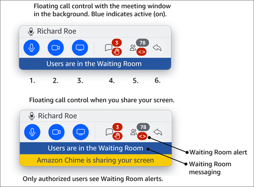

# Using the floating call control bar

When you join a meeting, a floating call control bar appears whenever you put the meeting
window in the background, such as when you share your screen. Whenever you navigate away from the meeting window, the bar enables you to
start and stop your microphone, web cam, and screenshare. The bar also provides a set of alerts, and it enables you to return to the meeting window quickly.
Remember the following:

- The bar appears by default, but you can turn it off. During the meeting, choose **File**, then **Settings**.
  Choose **Meetings**, then clear the **Show floating meeting control bar when in background** checkbox. This turns the bar off
  except for screen shares. The bar appears at all times while you share your screen.
- You can drag the bar to another location during a meeting, and Amazon Chime uses that location for subsequent meetings until you change it.
  This image shows the floating control bar. Numbers in the image text correspond to numbers in the text below.

In the image:

1. Mute and unmute your audio.
2. Start and stop your web cam.
3. Start and stop a screen share.
4. The **View meeting messages** icon returns you to the meeting window and opens the **Chat** pane. The icon
   includes an unread chat indicator and a count of the attendees who have their hands raised.
5. The **Open attendees panel** icon returns you to the meeting window and opens
   the **Attendees** panel. The icon includes the number of attendees present and
   an alert when the Waiting Room contains one or more anonymous users (**<>**).
6. The **Show main meeting window** icon returns you to the meeting window.

###### Note

Only authorized users can admit attendees from the Waiting Room. For more information about anonymous and authorized users, see
[Using the Waiting Room](waiting-room.md "waiting-room.md").
