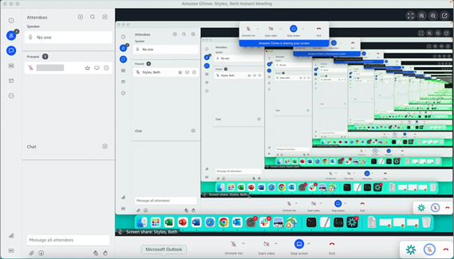

# Changing your media layout

You use the **Media layout** menu to change the layout of the video and
media tiles during an Amazon Chime meeting. You can open and close your video tile, and those of all
attendees, You can also toggle settings for when you share your screen, and show the active
speaker's video tile.

###### Important

Hiding your video tile doesn't turn off your camera. Other attendees can see your video
tile until you turn your camera off.

###### To change the media layout

1. On the left control bar, choose the **Media layout** icon

). 2. Choose a command from the **Media layout** menu:

    * Hide all available video – Hide all video tiles,
     including your own. This doesn't turn off screen share media tiles.
    * Hide my own video tile – Your video tile is
     hidden. This doesn't turn off your camera; other attendees can still see your video
     tile.
    * Sort active speaker into view – Ensures that the
     video tile for the active speaker is always visible. This setting is turned on by
     default.
    * Hide my own screen share view – Prevents the "infinite windows" effect. If you clear this setting, you and others see
     the effect when you select the meetings window while sharing your screen. Amazon Chime enables this setting by default.

    
